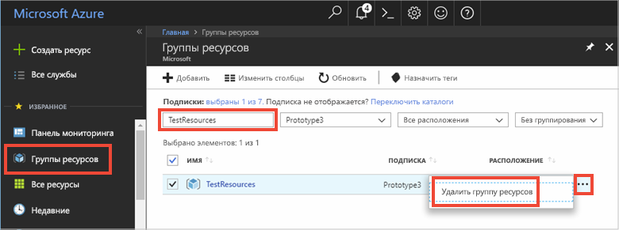

# <a name="quickstart-use-azure-cache-for-redis-with-python"></a>Краткое руководство. Использование кэша Redis для Azure с приложениями Python

Из этого краткого руководства вы узнаете, как реализовать кэш Azure для Redis в приложении Python для обеспечения доступа к защищенному выделенному кэшу, к которому может обращаться любое приложение в Azure.

## <a name="prerequisites"></a>Предварительные требования

- Подписка Azure — [создайте бесплатную учетную запись](https://azure.microsoft.com/free/).
- [Python версии 2 или 3](https://www.python.org/downloads/)

## <a name="create-an-azure-cache-for-redis-on-azure"></a>Создание экземпляра кэша Redis для Azure в Azure
[!INCLUDE [redis-cache-create](../../includes/redis-cache-create.md)]

[!INCLUDE [redis-cache-create](../../includes/redis-cache-access-keys.md)]

## <a name="install-redis-py"></a>Установка redis-py

[Redis-py](https://github.com/andymccurdy/redis-py) — это интерфейс Python для кэша Redis для Azure. Чтобы установить пакет redis-py, используйте средство *pip* для пакетов Python. 

В приведенном ниже примере с помощью *pip3* для Python3 в Windows 10 устанавливается пакет redis-py. При этом используется командная строка разработчика Visual Studio 2019 с повышенными правами администратора.

```python
    pip3 install redis
```


## <a name="read-and-write-to-the-cache"></a>Операции чтения и записи в кэше

Запустите Python и выполните тест с использованием кэша из командной строки. Замените `<Your Host Name>` и `<Your Access Key>` значениями для кэша Redis для Azure. 

```python
>>> import redis
>>> r = redis.StrictRedis(host='<Your Host Name>.redis.cache.windows.net',
        port=6380, db=0, password='<Your Access Key>', ssl=True)
>>> r.set('foo', 'bar')
True
>>> r.get('foo')
b'bar'
```

> [!IMPORTANT]
> Для Redis версии 3.0 или более поздней проверка сертификата SSL проводится принудительно. Параметр ssl_ca_certs следует явно задать при подключении к Redis. В случае RH Linux ssl_ca_certs можно найти в модуле сертификата /etc/pki/tls/certs/ca-bundle.crt.

## <a name="create-a-python-script"></a>Создание скрипта Python

Создайте новый текстовый файл скрипта с именем *PythonApplication1.py*.

Добавьте приведенный ниже скрипт в *PythonApplication1.py* и сохраните файл. С помощью этого скрипта тестируется доступ к кэшу. Замените `<Your Host Name>` и `<Your Access Key>` значениями для кэша Redis для Azure. 

```python
import redis

myHostname = "<Your Host Name>.redis.cache.windows.net"
myPassword = "<Your Access Key>"

r = redis.StrictRedis(host=myHostname, port=6380,
                      password=myPassword, ssl=True)

result = r.ping()
print("Ping returned : " + str(result))

result = r.set("Message", "Hello!, The cache is working with Python!")
print("SET Message returned : " + str(result))

result = r.get("Message")
print("GET Message returned : " + result.decode("utf-8"))

result = r.client_list()
print("CLIENT LIST returned : ")
for c in result:
    print("id : " + c['id'] + ", addr : " + c['addr'])
```

Выполните скрипт с помощью Python.


## <a name="clean-up-resources"></a>Очистка ресурсов

Если вы планируете перейти к другому руководству, для работы с ним можно использовать ресурсы, созданные в рамках этого руководства.

В противном случае, если вы закончите работу с примером приложения из краткого руководства, вы можете удалить ресурсы Azure, созданные в текущем руководстве, чтобы избежать ненужных расходов. 

> [!IMPORTANT]
> Удаление группы ресурсов — необратимая операция, и все соответствующие ресурсы удаляются окончательно. Будьте внимательны, чтобы случайно не удалить не ту группу ресурсов или не те ресурсы. Если ресурсы для размещения этого примера созданы в имеющейся группе ресурсов, содержащей ресурсы, которые следует сохранить, можно удалить каждый ресурс отдельно в соответствующих колонках вместо удаления группы ресурсов.
>

Войдите в портал [Azure](https://portal.azure.com) и выберите**Группы ресурсов**.

Введите имя группы ресурсов в текстовое поле **Фильтровать по имени…** . В инструкциях в этой статье использовалась группа ресурсов с именем *TestResources*. В своей группе ресурсов в списке результатов выберите **...** , а затем **Удалить группу ресурсов**.



Подтвердите операцию удаления группы ресурсов. Введите имя группы ресурсов, которую необходимо удалить, и нажмите **Удалить**.

Через некоторое время группа ресурсов и все ее ресурсы будут удалены.

## <a name="next-steps"></a>Дополнительная информация

> [!div class="nextstepaction"]
> [Создание простого веб-приложения ASP.NET, в котором используется кэш Redis для Azure](./cache-web-app-howto.md)

<!--Image references-->
[1]: ./media/cache-python-get-started/redis-cache-new-cache-menu.png
[2]: ./media/cache-python-get-started/redis-cache-cache-create.png
