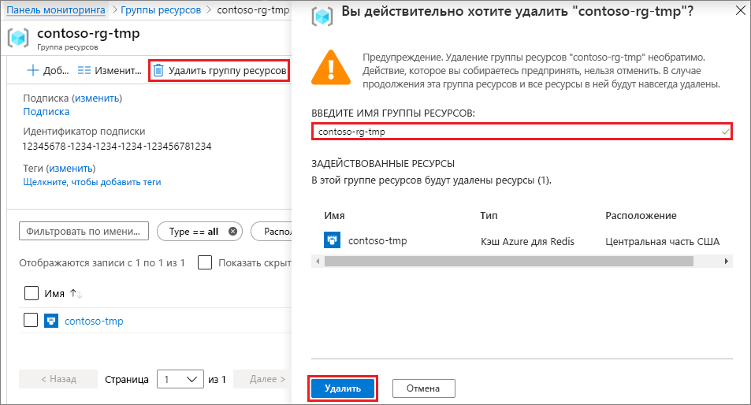

# <a name="quickstart-create-a-python-app-that-uses-azure-cache-for-redis"></a>Краткое руководство. Создание приложения Python, в котором используется кэш Azure для Redis

Из этой статьи вы узнаете, как реализовать кэш Azure для Redis в приложении Python для обеспечения доступа к защищенному выделенному кэшу, к которому может обращаться любое приложение в Azure.

## <a name="prerequisites"></a>Предварительные требования

- Подписка Azure — [создайте бесплатную учетную запись](https://azure.microsoft.com/free/).
- [Python версии 2 или 3](https://www.python.org/downloads/)

## <a name="create-an-azure-cache-for-redis-instance"></a>Создание экземпляра кэша Azure для Redis
[!INCLUDE [redis-cache-create](../../includes/redis-cache-create.md)]

[!INCLUDE [redis-cache-create](../../includes/redis-cache-access-keys.md)]

## <a name="install-redis-py"></a>Установка redis-py

[Redis-py](https://github.com/andymccurdy/redis-py) — это интерфейс Python для кэша Redis для Azure. Чтобы установить пакет *redis-py* с помощью командной строки, используйте инструмент *pip* для пакетов Python. 

В следующем примере используется *pip3* для Python 3 для установки *redis-py* в Windows 10 из командной строки с привилегиями администратора.


## <a name="read-and-write-to-the-cache"></a>Операции чтения и записи в кэше

Запустите Python из командной строки и проверьте кэш, используя следующий код. Замените `<Your Host Name>` и `<Your Access Key>` значениями для своего экземпляра Кэша Azure для Redis. Имя узла имеет вид *\<DNS-имя>.redis.cache.windows.net*.

```python
>>> import redis
>>> r = redis.StrictRedis(host='<Your Host Name>',
        port=6380, db=0, password='<Your Access Key>', ssl=True)
>>> r.set('foo', 'bar')
True
>>> r.get('foo')
b'bar'
```

> [!IMPORTANT]
> Для Кэш Azure для Redis версии 3.0 или более поздней версии проверка SSL-сертификата проводится принудительно. Параметр ssl_ca_certs следует явно задать при подключении к Кэшу Azure для Redis. В случае RedHat Linux ssl_ca_certs находится в модуле сертификата */etc/pki/tls/certs/ca-bundle.crt*.

## <a name="create-a-python-sample-app"></a>Создание примера приложения Python

Создайте текстовый файл, добавьте в него приведенный ниже сценарий и сохраните этот файл как *PythonApplication1.py*. Замените `<Your Host Name>` и `<Your Access Key>` значениями для своего экземпляра Кэша Azure для Redis. Имя узла имеет вид *\<DNS-имя>.redis.cache.windows.net*.

```python
import redis

myHostname = "<Your Host Name>"
myPassword = "<Your Access Key>"

r = redis.StrictRedis(host=myHostname, port=6380,
                      password=myPassword, ssl=True)

result = r.ping()
print("Ping returned : " + str(result))

result = r.set("Message", "Hello!, The cache is working with Python!")
print("SET Message returned : " + str(result))

result = r.get("Message")
print("GET Message returned : " + result.decode("utf-8"))

result = r.client_list()
print("CLIENT LIST returned : ")
for c in result:
    print("id : " + c['id'] + ", addr : " + c['addr'])
```

Запустите *PythonApplication1.py* с помощью Python. Вы должны увидеть результаты, как на снимке экрана ниже.


## <a name="clean-up-resources"></a>Очистка ресурсов

Если вы закончили работу с группой ресурсов и ресурсами Azure, созданными в рамках этого краткого руководства, вы можете удалить их, чтобы избежать ненужных расходов.

> [!IMPORTANT]
> Удаление группы ресурсов — необратимая операция, и все соответствующие ресурсы удаляются окончательно. Если вы создали экземпляр Кэша Azure для Redis в существующей группе ресурсов, которую вы хотите сохранить, можно удалить только кэш, выбрав **Удалить** на странице **Обзор** кэша. 

Чтобы удалить группу ресурсов и ее экземпляра Кэша Azure для Redis, выполните следующие действия.

1. На [портале Azure](https://portal.azure.com) найдите и выберите **Группы ресурсов**.
1. В текстовом поле **Фильтровать по имени** введите имя группы ресурсов, содержащей экземпляр кэша, а затем выберите его в результатах поиска. 
1. На странице группы ресурсов щелкните **Удалить группу ресурсов**.
1. Введите имя группы ресурсов, а затем щелкните **Удалить**.
   
   

## <a name="next-steps"></a>Дополнительная информация

> [!div class="nextstepaction"]
> [Создание простого веб-приложения ASP.NET, в котором используется кэш Redis для Azure](./cache-web-app-howto.md)

