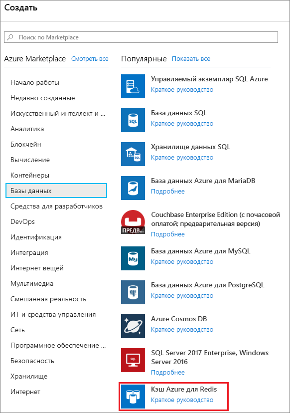
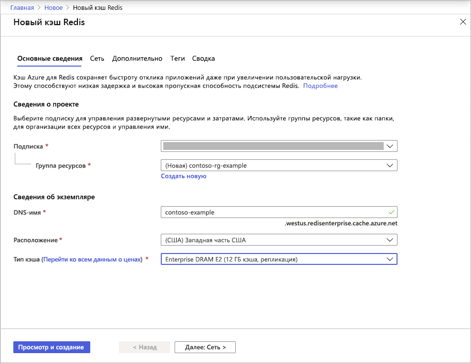
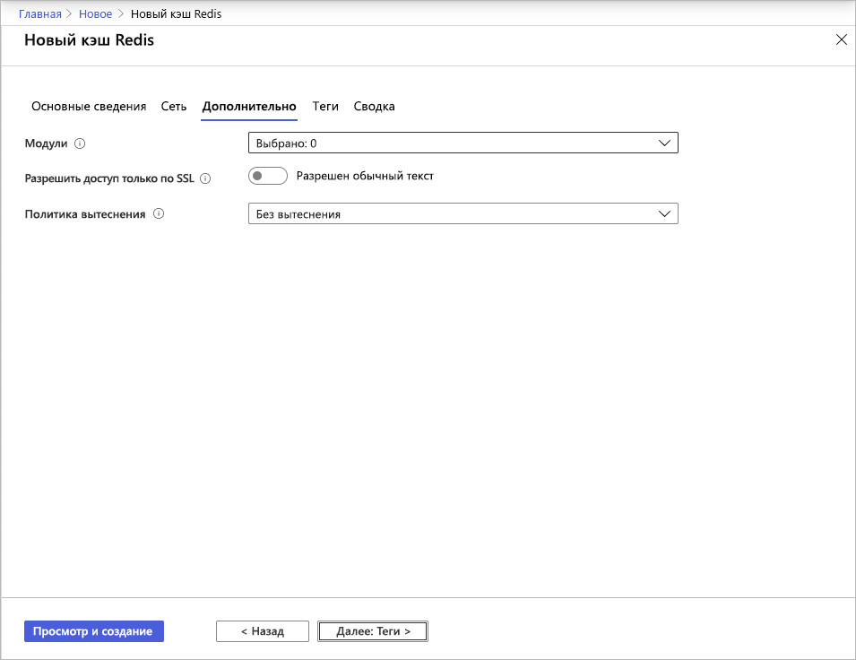
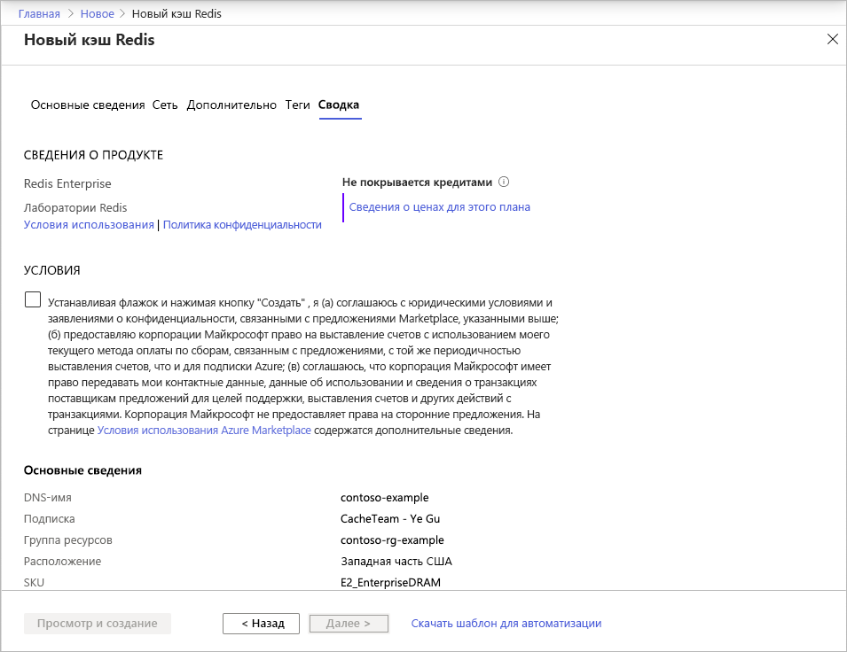

# Краткое руководство. Создание кэша уровня Enterprise (предварительная версия)

Кэш Azure для Redis уровня Enterprise предоставляет полностью интегрированные и управляемые экземпляры [Redis Enterprise](https://redislabs.com/redis-enterprise/) в Azure. Эти экземпляры в настоящее время доступны в предварительной версии. В этой версии реализованы два новых уровня.
* Enterprise использует для хранения данных энергозависимую память (DRAM) на виртуальной машине.
* Enterprise SSD использует для хранения данных как временную, так и энергонезависимую память (NVMe).

Участие в предварительной версии бесплатно. Зарегистрируйтесь через интерфейс **Свяжитесь со мной** в [Azure Marketplace](https://aka.ms/redispreviewsignup/), если это вас заинтересует. Мы можем принять очень ограниченное число участников, поэтому не гарантируем подтверждение на участие в предварительной версии всем желающим.

## Предварительные требования

Прежде всего для работы вам понадобится подписка Azure. Если ее нет, создайте [бесплатную учетную запись](https://azure.microsoft.com/free/).

## Создание кэша
1. Чтобы создать кэш, войдите на портал Azure по ссылке из приглашения к участию в предварительной версии и щелкните **Создать ресурс**.

   > [!IMPORTANT] 
   > Не оформляйте подписку на *Кэш Azure для Redis уровня Enterprise* напрямую в Marketplace.
   > Этот шаг будет автоматически выполнен в пользовательском интерфейсе портала Кэша Azure для Redis.
   >
   
1. На странице **Создание** выберите **Базы данных**, а затем **Кэш Azure для Redis**.
   
   
   
1. На странице **Новый кэш Redis** настройте параметры для нового кэша.
   
   | Параметр      | Рекомендуемое значение  | Описание |
   | ------------ |  ------- | -------------------------------------------------- |
   | **Подписка** | Раскройте список и выберите нужную подписку. | В этой подписке будет создан новый экземпляр кэша Redis для Azure. | 
   | **Группа ресурсов** | Раскройте список и выберите группу ресурсов или нажмите **Создать** и введите имя для новой группы ресурсов. | Имя группы ресурсов, в которой будут созданы кэш и другие ресурсы. Поместив все ресурсы приложения в одну группу ресурсов, вы сможете легко управлять ими и/или удалить их вместе. | 
   | **DNS-имя** | Введите глобально уникальное имя | Имя кэша должно быть строкой длиной от 1 до 63 символов и содержать только цифры, буквы и дефисы. Имя должно начинаться и заканчиваться цифрой или буквой и не может содержать более одного дефиса подряд. *Имя узла* для экземпляра кэша получит значение *\<DNS-имя>.<Azure region>.redisenterprise.cache.windows.net*. | 
   | **Расположение** | Откройте список и выберите расположение. | Уровни Enterprise доступны в регионах Западная часть США, Восточная часть США 2 и Западная Европа. |
   | **Уровень кэша** | Щелкните раскрывающийся список и выберите нужный уровень (*Enterprise DRAM* или *Enterprise SSD*) и размер. |  Уровень определяет размер, производительность кэша и доступные функции. |
   
    

1. По завершении выберите **Next: Сети** и пропустите этот этап.

   > [!NOTE] 
   > Поддержка приватного канала будет добавлена позже.
   >

1. По завершении выберите **Next: Дополнительно**.
   
   Вы можете сохранить значения по умолчанию или изменить их, как сочтете нужным. Если вы включите параметр **Allow access only via TLS** (Разрешить доступ только через TLS), для доступа к новому кэшу из приложения придется использовать TLS.

    

   > [!NOTE] 
   > Модули Redis на уровне Enterprise SSD пока не поддерживаются. Если вы намерены использовать модуль Redis, выберите кэш уровня Enterprise.
   >
   
1. По завершении выберите **Next: Теги** и пропустите этот этап.

1. По завершении выберите **Next: Сводка**.

    

1. Нажмите флажок в разделе **Условия**, проверьте параметры и нажмите **Просмотр и создание**.
   
   На создание кэша потребуется некоторое время. Вы можете отслеживать ход выполнения на странице **обзорных сведений** кэша Azure для Redis. Когда **Состояние** примет значение **Running** (Выполняется), кэш будет готов к использованию.

   > [!NOTE] 
   > Через некоторое время после создания кэша уровня Enterprise вы получите электронное письмо **Требуется действие** от Azure Marketplace для настройки *кэша Azure для Redis уровней Enterprise*. Это необязательное действие. Вы можете смело игнорировать это электронное письмо.
   >

## Дальнейшие действия

Из этого краткого руководства вы узнали, как создать экземпляр Кэша Azure для Redis уровня Enterprise.

> [!div class="nextstepaction"]
> [Создание веб-приложения ASP.NET, в котором используется кэш Azure для Redis](./cache-web-app-howto.md)

