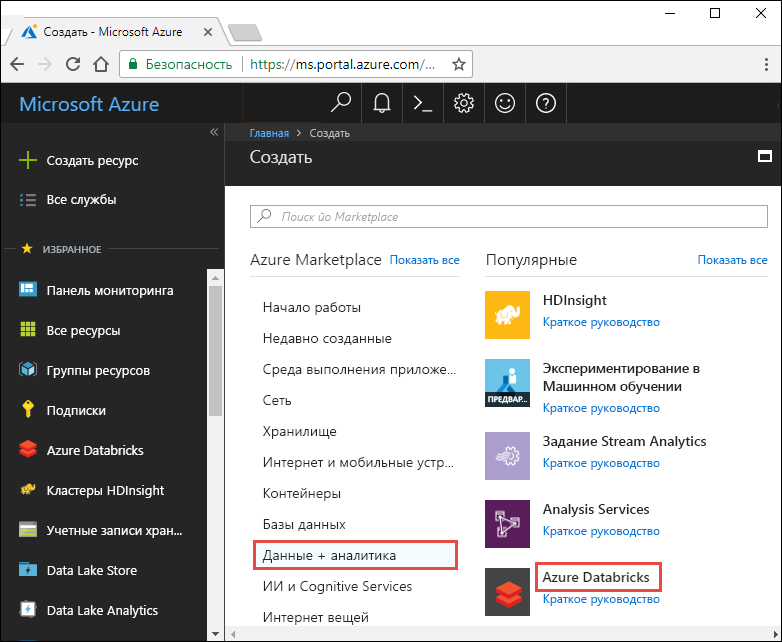
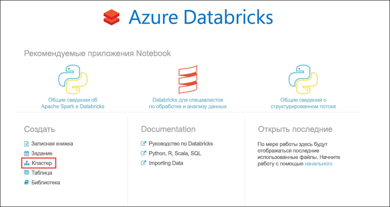
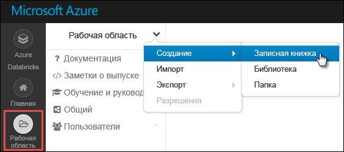
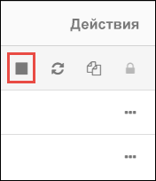

# <a name="tutorial-sentiment-analysis-on-streaming-data-using-azure-databricks"></a>Руководство по оценке тональности сообщений при потоковой передаче данных с использованием Azure Databricks

Из этого руководства вы узнаете, как выполнять анализ тональности при потоковой передаче данных практически в реальном времени с использованием Azure Databricks. Вам следует настроить прием данных с использованием Центров событий Azure. Затем вы получите сообщения из Центров событий в Databricks Azure с помощью соединителя Центров событий Spark. И наконец, вы выполните анализ тональности данных потоковой передачи с использованием API Cognitive Service.

Заканчивая работу с этим руководством, вы получите потоковые твиты из приложения Twitter с термином Azure и выполните анализ тональности в них.

На следующем рисунке показан поток в приложении.


В рамках этого руководства рассматриваются следующие задачи:

> [!div class="checklist"]
> * Создание рабочей области Azure Databricks
> * Создание кластера Spark в Azure Databricks.
> * Создание приложения Twitter для доступа к потоковым данных
> * Создание записных книжек в Azure Databricks.
> * Подключение библиотек к Центрам событий и API Twitter.
> * Создание учетной записи Cognitive Services и получение ключа доступа.
> * Отправка твитов в Центры событий.
> * Чтение твитов из Центров событий.
> * Анализ тональности твитов

Если у вас еще нет подписки Azure, [создайте бесплатную учетную запись Azure](https://azure.microsoft.com/free/?WT.mc_id=sparkeventhubs-docs-alehall), прежде чем начинать работу.

> [!Note]
> Инструкции из этого руководство нельзя выполнять с **бесплатной пробной версией подписки**.
> Если у вас есть бесплатная учетная запись, перейдите к профилю и измените подписку на подписку с **оплатой по мере использования**. Дополнительные сведения см. на странице [создания бесплатной учетной записи Azure](https://azure.microsoft.com/free/). Затем [удалите предельную сумму расходов](https://docs.microsoft.com/azure/billing/billing-spending-limit#remove-the-spending-limit-in-azure-portal) и [запросите увеличение квоты](https://docs.microsoft.com/azure/azure-supportability/resource-manager-core-quotas-request) на ЦП в своем регионе. При создании рабочей области Azure Databricks можно выбрать ценовую категорию **Пробная версия ("Премиум" — 14 дней бесплатно (DBU))** для предоставления рабочей области доступа к бесплатным DBU Azure Databricks уровня "Премиум" на 14 дней.

## <a name="prerequisites"></a>Предварительные требования

Прежде чем приступить к изучению этого руководства, убедитесь, что выполнены следующие требования.
- Пространство имен Центров событий Azure.
- В пространстве имен имеется концентратор событий.
- Имеется строка подключения для получения доступа к пространству имен Центров событий. Строка подключения должна иметь формат `Endpoint=sb://<namespace>.servicebus.windows.net/;SharedAccessKeyName=<key name>;SharedAccessKey=<key value>`.
- Имя политики общего доступа и ключ политики для Центров событий.

Соответствие этим требованиям можно проверить, выполнив шаги из статьи [Создание пространства имен Центров событий и концентратора событий с помощью портала Azure](../event-hubs/event-hubs-create.md).

## <a name="sign-in-to-the-azure-portal"></a>Вход на портал Azure

Войдите на [портале Azure](https://portal.azure.com/?WT.mc_id=sparkeventhubs-docs-alehall).

## <a name="create-an-azure-databricks-workspace"></a>Создание рабочей области Azure Databricks

В этом разделе вы создадите рабочую область Azure Databricks с помощью портала Azure.

1. На портале Azure выберите **Создать ресурс** > **Данные и аналитика** > **Azure Databricks**.

    

3. В разделе **службы Azure Databricks** укажите значения для создания рабочей области Databricks.

    .

    Укажите следующие значения.

    |Свойство  |ОПИСАНИЕ  |
    |---------|---------|
    |**Имя рабочей области**     | Укажите имя рабочей области Databricks.        |
    |**подписка**     | Выберите подписку Azure в раскрывающемся списке.        |
    |**группа ресурсов**     | Укажите, следует ли создать новую группу ресурсов или использовать имеющуюся. Группа ресурсов — это контейнер, содержащий связанные ресурсы для решения Azure. Дополнительные сведения см. в [обзоре группы ресурсов Azure](../azure-resource-manager/resource-group-overview.md). |
    |**Местоположение.**     | Выберите регион **Восточная часть США 2**. Другие доступные регионы см. в статье о [доступности служб Azure по регионам](https://azure.microsoft.com/regions/services/?WT.mc_id=sparkeventhubs-docs-alehall).        |
    |**Ценовая категория**     |  Вы можете выбрать уровень **Стандартный** или **Премиум**. Дополнительные сведения об этих ценовых категориях см. на [странице цен на Databricks](https://azure.microsoft.com/pricing/details/databricks/?WT.mc_id=sparkeventhubs-docs-alehall).       |

    Установите флажок **Закрепить на панели мониторинга** и щелкните **Создать**.

4. Создание учетной записи займет несколько минут. Во время создания учетной записи на портале с правой стороны отображается плитка **Submitting deployment for Azure Databricks** (Идет отправка развертывания для Databricks). Возможно, вам потребуется прокрутить панель мониторинга, чтобы увидеть эту плитку. В верхней части экрана также будет отображаться индикатор хода выполнения. Следить за выполнением можно с помощью любого из этих элементов.

    

## <a name="create-a-spark-cluster-in-databricks"></a>Создание кластера Spark в Databricks

1. На портале Azure перейдите к созданной рабочей области Databricks, а затем выберите **Launch Workspace** (Запуск рабочей области).

2. Вы будете перенаправлены на портал Azure Databricks. На портале выберите **Кластер**.

    

3. На странице **создания кластера** укажите значения для создания кластера.

    

    Для всех остальных параметров, кроме следующих, примите значения по умолчанию:

   * Введите имя кластера.
   * В рамках этой статьи создайте кластер со средой выполнения **5.2**.
   * Убедитесь, что установлен флажок **Terminate after \_\_ minutes of activity** (Завершить через \_\_ минут бездействия). Укажите длительность (в минутах) для завершения работы кластера, если тот не используется.

   Выберите рабочий кластер и размер узла драйвера, соответствующие своим техническим критериям и [бюджету](https://azure.microsoft.com/pricing/details/databricks/?WT.mc_id=sparkeventhubs-docs-alehall).

     Выберите **Create cluster** (Создать кластер). После запуска кластера можно вложить записные книжки в кластер и запустить задания Spark.

## <a name="create-a-twitter-application"></a>Создание приложения Twitter

Для получения потока твитов создайте приложение в Twitter. Следуйте инструкциям по созданию приложения Twitter и запишите значения, необходимые для выполнения заданий из этого руководства.

1. В веб-браузере перейдите на [Twitter For Developers](https://developer.twitter.com/en/apps) (Twitter для разработчиков) и выберите **Create an app** (Создать приложение). Может появиться сообщение о том, что требуется подать заявку на учетную запись разработчика Twitter. После того, как ваша заявка будет одобрена, вы должны увидеть подтверждающее сообщение электронной почты. Чтобы получить утверждения учетной записи разработчика, может потребоваться несколько дней.

    

2. На странице **Create an application** (Создание приложения) укажите сведения для нового приложения, а затем выберите **Create your Twitter application** (Создать приложение Twitter).

    

    

3. На странице приложения перейдите на вкладку **Keys and Tokens** (Ключи и маркеры) и скопируйте значения **ключа API потребителя** и **секретного ключа API потребителя**. Также выберите **Создать** в **маркере доступа и секрете маркера доступа**, чтобы сгенерировать маркеры доступа. Скопируйте значения **маркера доступа** и **секрета маркера доступа**.

    

Сохраните значения, полученные для приложения Twitter. Они понадобятся вам позже при работе с этим руководством.

## <a name="attach-libraries-to-spark-cluster"></a>Подключение библиотек к кластеру Spark

В этом руководстве для отправки твитов в Центры событий используются API-интерфейсы Twitter. Для чтения и записи данных в Центрах событий Azure используется [соединитель Центров событий Apache Spark](https://github.com/Azure/azure-event-hubs-spark?WT.mc_id=sparkeventhubs-docs-alehall). Чтобы использовать эти API-интерфейсы в рамках кластера, добавьте их в Azure Databricks в качестве библиотек и свяжите с кластером Spark. Ниже показано, как добавить библиотеку.

1. В рабочей области Azure Databricks выберите **Кластеры**, а затем — существующий кластер Spark. В меню кластера выберите **Библиотеки** и нажмите **Установить новую**.

   

   

2. На странице новой библиотеки для параметра **Источник** выберите **Maven**. В поле **Coordinate** (Координата) щелкните **Search Packages** (Поиск пакетов), который требуется добавить. Ниже указаны координаты Maven для библиотек, используемых в рамках этого руководства.

   * Соединитель Центров событий Spark — `com.microsoft.azure:azure-eventhubs-spark_2.11:2.3.10`
   * API Twitter — `org.twitter4j:twitter4j-core:4.0.7`

     

     

3. Щелкните **Установить**.

4. В меню кластера убедитесь, что обе библиотеки установлены и подключены правильно.

    

6. Повторите эти действия для пакета Twitter `twitter4j-core:4.0.7`.

## <a name="get-a-cognitive-services-access-key"></a>Получение ключа доступа Cognitive Services

В рамках этого учебника для анализа тональности потока твитов практически в реальном времени используются [API Анализа текста Azure Cognitive Services](../cognitive-services/text-analytics/overview.md). Прежде чем использовать API, необходимо создать учетную запись Azure Cognitive Services в Azure и получить ключ доступа к API Анализа текста.

1. Войдите на [портале Azure](https://portal.azure.com/?WT.mc_id=sparkeventhubs-docs-alehall).

2. Выберите действие **Создать ресурс**.

3. В Azure Marketplace выберите **Искусственный интеллект и Cognitive Services** > **API анализа текста**.

    

4. В диалоговом окне **Создать** введите следующие значения.

    

   - Введите имя учетной записи Cognitive Services.
   - Выберите подписку Azure, в рамках которой создается учетная запись.
   - Выберите расположение Azure.
   - Выберите ценовую категорию для службы. Дополнительные сведения о ценах на Cognitive Services см. на[странице расценок](https://azure.microsoft.com/pricing/details/cognitive-services/?WT.mc_id=sparkeventhubs-docs-alehall).
   - Укажите, следует ли создать новую группу ресурсов или использовать существующую.

     Нажмите кнопку **Создать**.

5. Создав учетную запись, выберите на вкладке **Обзор** раздел **Show access keys** (Показать ключи доступа).

    

    Кроме того, скопируйте часть URL-адреса конечной точки, как показано на снимке экрана. Этот URL-адрес понадобится для работы с руководством.

6. В разделе **Управление ключами** нажмите значок копирования возле выбранного ключа.

    

7. Сохраните значения URL-адреса конечной точки и ключа доступа, полученные на этом этапе. Они понадобятся в дальнейшем при работе с этим руководством.

## <a name="create-notebooks-in-databricks"></a>Создание записных книжек в Databricks

В этом разделе в рабочей области Databricks создается две записные книжки со следующими именами.

- **SendTweetsToEventHub** — записная книжка производителя, которая используется для получения твитов из приложения Twitter и для их потоковой передачи в Центры событий.
- **AnalyzeTweetsFromEventHub** — клиентская записная книжка объекта-получателя для чтения твитов из Центров событий и выполнения анализа тональности.

1. В левой области выберите **Рабочая область**. В раскрывающемся списке **Рабочая область** выберите **Создать**, а затем **Записная книжка**.

    

2. В диалоговом окне **Create Notebook** (Создание записной книжки) введите **SendTweetsToEventHub**, а затем выберите **Scala** в качестве языка и выберите созданный ранее кластер Spark.

    

    Нажмите кнопку **Создать**.

3. Повторите эти шаги для создания записной книжки **AnalyzeTweetsFromEventHub**.

## <a name="send-tweets-to-event-hubs"></a>Отправка твитов в Центры событий.

В записной книжке **SendTweetsToEventHub** вставьте приведенный ниже код и замените заполнители значениями вашего пространства имен Центров событий и созданного ранее приложения Twitter. Эта записная книжка выполняет потоковую передачу твитов с ключевым словом Azure в Центры событий в режиме реального времени.

> [!NOTE]
> API Twitter имеет определенные ограничения запроса и [квоты](https://developer.twitter.com/en/docs/basics/rate-limiting.html). Если вас не удовлетворяет ограничение стандартной частоты в API Twitter, вы можете создавать содержимое текста без использования API Twitter в этом примере. Для этого установите переменную **dataSource** `test`вместо`twitter` и заполните список **testSource** предпочтительными вводными данными теста.

```scala
    import scala.collection.JavaConverters._
    import com.microsoft.azure.eventhubs._
    import java.util.concurrent._
    import scala.collection.immutable._
    import scala.concurrent.Future
    import scala.concurrent.ExecutionContext.Implicits.global

    val namespaceName = "<EVENT HUBS NAMESPACE>"
    val eventHubName = "<EVENT HUB NAME>"
    val sasKeyName = "<POLICY NAME>"
    val sasKey = "<POLICY KEY>"
    val connStr = new ConnectionStringBuilder()
                .setNamespaceName(namespaceName)
                .setEventHubName(eventHubName)
                .setSasKeyName(sasKeyName)
                .setSasKey(sasKey)

    val pool = Executors.newScheduledThreadPool(1)
    val eventHubClient = EventHubClient.create(connStr.toString(), pool)

    def sleep(time: Long): Unit = Thread.sleep(time)

    def sendEvent(message: String, delay: Long) = {
      sleep(delay)
      val messageData = EventData.create(message.getBytes("UTF-8"))
      eventHubClient.get().send(messageData)
      System.out.println("Sent event: " + message + "\n")
    }

    // Add your own values to the list
    val testSource = List("Azure is the greatest!", "Azure isn't working :(", "Azure is okay.")

    // Specify 'test' if you prefer to not use Twitter API and loop through a list of values you define in `testSource`
    // Otherwise specify 'twitter'
    val dataSource = "test"

    if (dataSource == "twitter") {

      import twitter4j._
      import twitter4j.TwitterFactory
      import twitter4j.Twitter
      import twitter4j.conf.ConfigurationBuilder

      // Twitter configuration!
      // Replace values below with you

      val twitterConsumerKey = "<CONSUMER API KEY>"
      val twitterConsumerSecret = "<CONSUMER API SECRET>"
      val twitterOauthAccessToken = "<ACCESS TOKEN>"
      val twitterOauthTokenSecret = "<TOKEN SECRET>"

      val cb = new ConfigurationBuilder()
        cb.setDebugEnabled(true)
        .setOAuthConsumerKey(twitterConsumerKey)
        .setOAuthConsumerSecret(twitterConsumerSecret)
        .setOAuthAccessToken(twitterOauthAccessToken)
        .setOAuthAccessTokenSecret(twitterOauthTokenSecret)

      val twitterFactory = new TwitterFactory(cb.build())
      val twitter = twitterFactory.getInstance()

      // Getting tweets with keyword "Azure" and sending them to the Event Hub in realtime!
      val query = new Query(" #Azure ")
      query.setCount(100)
      query.lang("en")
      var finished = false
      while (!finished) {
        val result = twitter.search(query)
        val statuses = result.getTweets()
        var lowestStatusId = Long.MaxValue
        for (status <- statuses.asScala) {
          if(!status.isRetweet()){
            sendEvent(status.getText(), 5000)
          }
          lowestStatusId = Math.min(status.getId(), lowestStatusId)
        }
        query.setMaxId(lowestStatusId - 1)
      }

    } else if (dataSource == "test") {
      // Loop through the list of test input data
      while (true) {
        testSource.foreach {
          sendEvent(_,5000)
        }
      }

    } else {
      System.out.println("Unsupported Data Source. Set 'dataSource' to \"twitter\" or \"test\"")
    }

    // Closing connection to the Event Hub
    eventHubClient.get().close()
```

Чтобы запустить записную книжку, нажмите клавиши **SHIFT+ВВОД**. Вы увидите выходные данные, как в следующем фрагменте кода. Каждое событие в выходных данных — это твит, полученный в Центрах событий и содержащий слово "Azure".

    Sent event: @Microsoft and @Esri launch Geospatial AI on Azure https://t.co/VmLUCiPm6q via @geoworldmedia #geoai #azure #gis #ArtificialIntelligence

    Sent event: Public preview of Java on App Service, built-in support for Tomcat and OpenJDK
    https://t.co/7vs7cKtvah
    #cloudcomputing #Azure

    Sent event: 4 Killer #Azure Features for #Data #Performance https://t.co/kpIb7hFO2j by @RedPixie

    Sent event: Migrate your databases to a fully managed service with Azure SQL Database Managed Instance | #Azure | #Cloud https://t.co/sJHXN4trDk

    Sent event: Top 10 Tricks to #Save Money with #Azure Virtual Machines https://t.co/F2wshBXdoz #Cloud

    ...
    ...

## <a name="read-tweets-from-event-hubs"></a>Чтение твитов из Центров событий.

В записной книжке **AnalyzeTweetsFromEventHub** вставьте следующий код и замените заполнители значениями созданных ранее Центров событий Azure. Эта записная книжка считывает твиты, переданные ранее в Центры событий с помощью записной книжки **SendTweetsToEventHub**.

```scala

    import org.apache.spark.eventhubs._
    import com.microsoft.azure.eventhubs._

    // Build connection string with the above information
    val namespaceName = "<EVENT HUBS NAMESPACE>"
    val eventHubName = "<EVENT HUB NAME>"
    val sasKeyName = "<POLICY NAME>"
    val sasKey = "<POLICY KEY>"
    val connStr = new com.microsoft.azure.eventhubs.ConnectionStringBuilder()
                .setNamespaceName(namespaceName)
                .setEventHubName(eventHubName)
                .setSasKeyName(sasKeyName)
                .setSasKey(sasKey)

    val customEventhubParameters =
      EventHubsConf(connStr.toString())
      .setMaxEventsPerTrigger(5)

    val incomingStream = spark.readStream.format("eventhubs").options(customEventhubParameters.toMap).load()

    incomingStream.printSchema

    // Sending the incoming stream into the console.
    // Data comes in batches!
    incomingStream.writeStream.outputMode("append").format("console").option("truncate", false).start().awaitTermination()
```

Вы получите следующие выходные данные:


    root
     |-- body: binary (nullable = true)
     |-- offset: long (nullable = true)
     |-- seqNumber: long (nullable = true)
     |-- enqueuedTime: long (nullable = true)
     |-- publisher: string (nullable = true)
     |-- partitionKey: string (nullable = true)

    -------------------------------------------
    Batch: 0
    -------------------------------------------
    +------+------+--------------+---------------+---------+------------+
    |body  |offset|sequenceNumber|enqueuedTime   |publisher|partitionKey|
    +------+------+--------------+---------------+---------+------------+
    |[50 75 62 6C 69 63 20 70 72 65 76 69 65 77 20 6F 66 20 4A 61 76 61 20 6F 6E 20 41 70 70 20 53 65 72 76 69 63 65 2C 20 62 75 69 6C 74 2D 69 6E 20 73 75 70 70 6F 72 74 20 66 6F 72 20 54 6F 6D 63 61 74 20 61 6E 64 20 4F 70 65 6E 4A 44 4B 0A 68 74 74 70 73 3A 2F 2F 74 2E 63 6F 2F 37 76 73 37 63 4B 74 76 61 68 20 0A 23 63 6C 6F 75 64 63 6F 6D 70 75 74 69 6E 67 20 23 41 7A 75 72 65]                              |0     |0             |2018-03-09 05:49:08.86 |null     |null        |
    |[4D 69 67 72 61 74 65 20 79 6F 75 72 20 64 61 74 61 62 61 73 65 73 20 74 6F 20 61 20 66 75 6C 6C 79 20 6D 61 6E 61 67 65 64 20 73 65 72 76 69 63 65 20 77 69 74 68 20 41 7A 75 72 65 20 53 51 4C 20 44 61 74 61 62 61 73 65 20 4D 61 6E 61 67 65 64 20 49 6E 73 74 61 6E 63 65 20 7C 20 23 41 7A 75 72 65 20 7C 20 23 43 6C 6F 75 64 20 68 74 74 70 73 3A 2F 2F 74 2E 63 6F 2F 73 4A 48 58 4E 34 74 72 44 6B]            |168   |1             |2018-03-09 05:49:24.752|null     |null        |
    +------+------+--------------+---------------+---------+------------+

    -------------------------------------------
    Batch: 1
    -------------------------------------------
    ...
    ...

Так как выходные данные отображаются в двоичном режиме, используйте следующий фрагмент кода, чтобы преобразовать их в строку.

```scala
    import org.apache.spark.sql.types._
    import org.apache.spark.sql.functions._

    // Event Hub message format is JSON and contains "body" field
    // Body is binary, so we cast it to string to see the actual content of the message
    val messages =
      incomingStream
      .withColumn("Offset", $"offset".cast(LongType))
      .withColumn("Time (readable)", $"enqueuedTime".cast(TimestampType))
      .withColumn("Timestamp", $"enqueuedTime".cast(LongType))
      .withColumn("Body", $"body".cast(StringType))
      .select("Offset", "Time (readable)", "Timestamp", "Body")

    messages.printSchema

    messages.writeStream.outputMode("append").format("console").option("truncate", false).start().awaitTermination()
```

Выходные данные будут выглядеть, как следующий фрагмент кода:

    root
     |-- Offset: long (nullable = true)
     |-- Time (readable): timestamp (nullable = true)
     |-- Timestamp: long (nullable = true)
     |-- Body: string (nullable = true)

    -------------------------------------------
    Batch: 0
    -------------------------------------------
    +------+-----------------+----------+-------+
    |Offset|Time (readable)  |Timestamp |Body
    +------+-----------------+----------+-------+
    |0     |2018-03-09 05:49:08.86 |1520574548|Public preview of Java on App Service, built-in support for Tomcat and OpenJDK
    https://t.co/7vs7cKtvah
    #cloudcomputing #Azure          |
    |168   |2018-03-09 05:49:24.752|1520574564|Migrate your databases to a fully managed service with Azure SQL Database Managed Instance | #Azure | #Cloud https://t.co/sJHXN4trDk    |
    |0     |2018-03-09 05:49:02.936|1520574542|@Microsoft and @Esri launch Geospatial AI on Azure https://t.co/VmLUCiPm6q via @geoworldmedia #geoai #azure #gis #ArtificialIntelligence|
    |176   |2018-03-09 05:49:20.801|1520574560|4 Killer #Azure Features for #Data #Performance https://t.co/kpIb7hFO2j by @RedPixie                                                    |
    +------+-----------------+----------+-------+
    -------------------------------------------
    Batch: 1
    -------------------------------------------
    ...
    ...

Таким образом мы почти в реальном времени передаем потоком данные из Центров событий Azure в Azure Databricks, используя соединитель Центров событий для Apache Spark. Дополнительные сведения о том, как использовать соединитель Центров событий для Spark, см. в [документации соединителя](https://github.com/Azure/azure-event-hubs-spark/tree/master/docs?WT.mc_id=sparkeventhubs-docs-alehall).

## <a name="run-sentiment-analysis-on-tweets"></a>Анализ тональности твитов

В этом разделе выполняется анализ тональности твитов, полученных с помощью API приложения Twitter. В этом разделе добавляется фрагменты кода к той же записной книжке **AnalyzeTweetsFromEventHub**.

Начните с добавления новой ячейки кода в записной книжке и вставьте фрагмент кода, приведенный ниже. Этот фрагмент кода определяет типы данных для работы с API языка и тональности.

```scala
import java.io._
import java.net._
import java.util._

case class Language(documents: Array[LanguageDocuments], errors: Array[Any]) extends Serializable
case class LanguageDocuments(id: String, detectedLanguages: Array[DetectedLanguages]) extends Serializable
case class DetectedLanguages(name: String, iso6391Name: String, score: Double) extends Serializable

case class Sentiment(documents: Array[SentimentDocuments], errors: Array[Any]) extends Serializable
case class SentimentDocuments(id: String, score: Double) extends Serializable

case class RequestToTextApi(documents: Array[RequestToTextApiDocument]) extends Serializable
case class RequestToTextApiDocument(id: String, text: String, var language: String = "") extends Serializable
```

Добавьте новую ячейку кода и вставьте фрагмент кода, приведенный ниже. В этом фрагменте кода определяется объект, содержащий функции вызова API анализа текста для определение языка и выполнения анализа тональности. Убедитесь, что вы заменили заполнитель `<PROVIDE ACCESS KEY HERE>` на значение, полученное для вашей учетной записи Cognitive Services.

```scala
import javax.net.ssl.HttpsURLConnection
import com.google.gson.Gson
import com.google.gson.GsonBuilder
import com.google.gson.JsonObject
import com.google.gson.JsonParser
import scala.util.parsing.json._

object SentimentDetector extends Serializable {

    // Cognitive Services API connection settings
    val accessKey = "<PROVIDE ACCESS KEY HERE>"
    val host = "https://cognitive-docs.cognitiveservices.azure.com/"
    val languagesPath = "/text/analytics/v2.1/languages"
    val sentimentPath = "/text/analytics/v2.1/sentiment"
    val languagesUrl = new URL(host+languagesPath)
    val sentimenUrl = new URL(host+sentimentPath)
    val g = new Gson

    def getConnection(path: URL): HttpsURLConnection = {
        val connection = path.openConnection().asInstanceOf[HttpsURLConnection]
        connection.setRequestMethod("POST")
        connection.setRequestProperty("Content-Type", "text/json")
        connection.setRequestProperty("Ocp-Apim-Subscription-Key", accessKey)
        connection.setDoOutput(true)
        return connection
    }

    def prettify (json_text: String): String = {
        val parser = new JsonParser()
        val json = parser.parse(json_text).getAsJsonObject()
        val gson = new GsonBuilder().setPrettyPrinting().create()
        return gson.toJson(json)
    }

    // Handles the call to Cognitive Services API.
    def processUsingApi(request: RequestToTextApi, path: URL): String = {
        val requestToJson = g.toJson(request)
        val encoded_text = requestToJson.getBytes("UTF-8")
        val connection = getConnection(path)
        val wr = new DataOutputStream(connection.getOutputStream())
        wr.write(encoded_text, 0, encoded_text.length)
        wr.flush()
        wr.close()

        val response = new StringBuilder()
        val in = new BufferedReader(new InputStreamReader(connection.getInputStream()))
        var line = in.readLine()
        while (line != null) {
            response.append(line)
            line = in.readLine()
        }
        in.close()
        return response.toString()
    }

    // Calls the language API for specified documents.
    def getLanguage (inputDocs: RequestToTextApi): Option[Language] = {
        try {
            val response = processUsingApi(inputDocs, languagesUrl)
            // In case we need to log the json response somewhere
            val niceResponse = prettify(response)
            // Deserializing the JSON response from the API into Scala types
            val language = g.fromJson(niceResponse, classOf[Language])
            if (language.documents(0).detectedLanguages(0).iso6391Name == "(Unknown)")
                return None
            return Some(language)
        } catch {
            case e: Exception => return None
        }
    }

    // Calls the sentiment API for specified documents. Needs a language field to be set for each of them.
    def getSentiment (inputDocs: RequestToTextApi): Option[Sentiment] = {
        try {
            val response = processUsingApi(inputDocs, sentimenUrl)
            val niceResponse = prettify(response)
            // Deserializing the JSON response from the API into Scala types
            val sentiment = g.fromJson(niceResponse, classOf[Sentiment])
            return Some(sentiment)
        } catch {
            case e: Exception => return None
        }
    }
}
```

Добавьте еще одну ячейку, чтобы определить пользовательскую функцию Spark, которая определяет тональность.

```scala
// User Defined Function for processing content of messages to return their sentiment.
val toSentiment =
    udf((textContent: String) =>
        {
            val inputObject = new RequestToTextApi(Array(new RequestToTextApiDocument(textContent, textContent)))
            val detectedLanguage = SentimentDetector.getLanguage(inputObject)
            detectedLanguage match {
                case Some(language) =>
                    if(language.documents.size > 0) {
                        inputObject.documents(0).language = language.documents(0).detectedLanguages(0).iso6391Name
                        val sentimentDetected = SentimentDetector.getSentiment(inputObject)
                        sentimentDetected match {
                            case Some(sentiment) => {
                                if(sentiment.documents.size > 0) {
                                    sentiment.documents(0).score.toString()
                                }
                                else {
                                    "Error happened when getting sentiment: " + sentiment.errors(0).toString
                                }
                            }
                            case None => "Couldn't detect sentiment"
                        }
                    }
                    else {
                        "Error happened when getting language" + language.errors(0).toString
                    }
                case None => "Couldn't detect language"
            }
        }
    )
```

Добавьте последнюю ячейку кода, чтобы подготовить кадр данных с содержимым твита и тональностью, связанной с этим твитом.

```scala
// Prepare a dataframe with Content and Sentiment columns
val streamingDataFrame = incomingStream.selectExpr("cast (body as string) AS Content").withColumn("Sentiment", toSentiment($"Content"))

// Display the streaming data with the sentiment
streamingDataFrame.writeStream.outputMode("append").format("console").option("truncate", false).start().awaitTermination()
```

Вы должны увидеть выходные данные, подобные следующему фрагменту кода:

    -------------------------------------------
    Batch: 0
    -------------------------------------------
    +--------------------------------+------------------+
    |Content                         |Sentiment         |
    +--------------------------------+------------------+
    |Public preview of Java on App Service, built-in support for Tomcat and OpenJDK
    https://t.co/7vs7cKtvah   #cloudcomputing #Azure          |0.7761918306350708|
    |Migrate your databases to a fully managed service with Azure SQL Database Managed Instance | #Azure | #Cloud https://t.co/sJHXN4trDk    |0.8558163642883301|
    |@Microsoft and @Esri launch Geospatial AI on Azure https://t.co/VmLUCiPm6q via @geoworldmedia #geoai #azure #gis #ArtificialIntelligence|0.5               |
    |4 Killer #Azure Features for #Data #Performance https://t.co/kpIb7hFO2j by @RedPixie                                                    |0.5               |
    +--------------------------------+------------------+

Чем ближе значение в колонке**Тональность** к **1**, тем большее удовлетворение от работы в Azure. Чем ближе значение к **0**,тем больше проблем испытывают пользователи при работе с Microsoft Azure.

Вот и все! С помощью Azure Databricks вы успешно выполнили потоковую передачу данных в Центры событий Azure, использовали данные потока в соединителе Центров событий Azure и выполнили анализ тональности потоковых данных практически в реальном времени.

## <a name="clean-up-resources"></a>Очистка ресурсов

После выполнения заданий из этого руководства вы можете завершить работу кластера. Для этого в рабочей области Azure Databricks на левой панели выберите **Кластеры**. Для кластера, работу которого необходимо завершить, переместите указатель мыши на многоточие в столбце **Actions** (Действия) и выберите значок **Завершить**.



Если не завершить работу кластера вручную, она завершится автоматически, если во время создания кластера вы установили флажок **Terminate after \_\_ minutes of inactivity** (Завершать работу после \_\_ мин бездействия). В этом случае работа кластера должна завершиться автоматически, если кластер был неактивным в течение определенного времени.

## <a name="next-steps"></a>Дополнительная информация
В этом руководстве вы узнали, как с помощью Azure Databricks выполнить потоковую передачу данных в Центры событий Azure с последующим чтением данных потоковой передачи из Центров событий в реальном времени. Вы научились выполнять следующие задачи:
> [!div class="checklist"]
> * Создание рабочей области Azure Databricks
> * Создание кластера Spark в Azure Databricks.
> * Создание приложения Twitter для доступа к потоковым данных
> * Создание записных книжек в Azure Databricks.
> * Добавление и подключение библиотек для Центров событий и API Twitter.
> * Создание учетной записи Microsoft Cognitive Services и получение ключа доступа.
> * Отправка твитов в Центры событий.
> * Чтение твитов из Центров событий.
> * Анализ тональности твитов.

Перейдите к следующему руководству, чтобы ознакомиться с выполнением задач машинного обучения с помощью Azure Databricks.

> [!div class="nextstepaction"]
>[Decision Trees Examples](https://docs.azuredatabricks.net/applications/machine-learning/index.html) (Примеры деревьев принятия решений)
