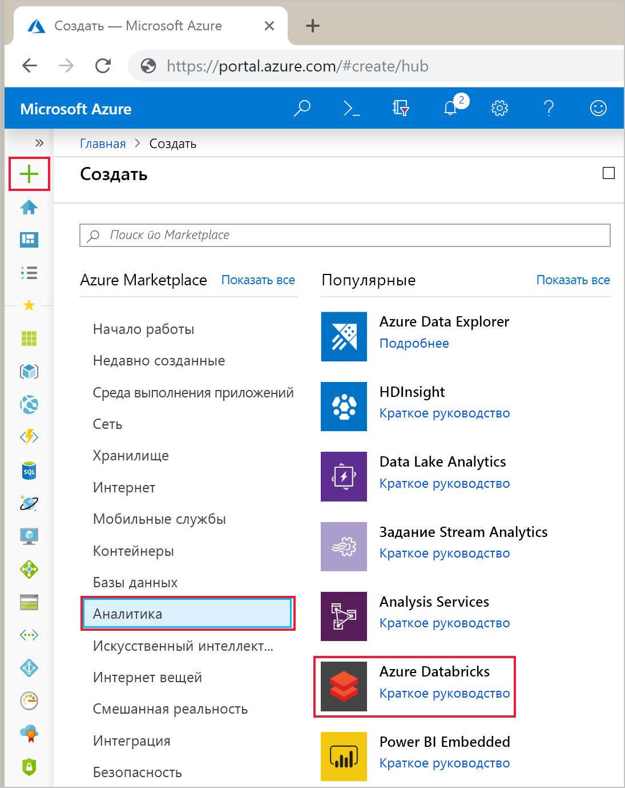
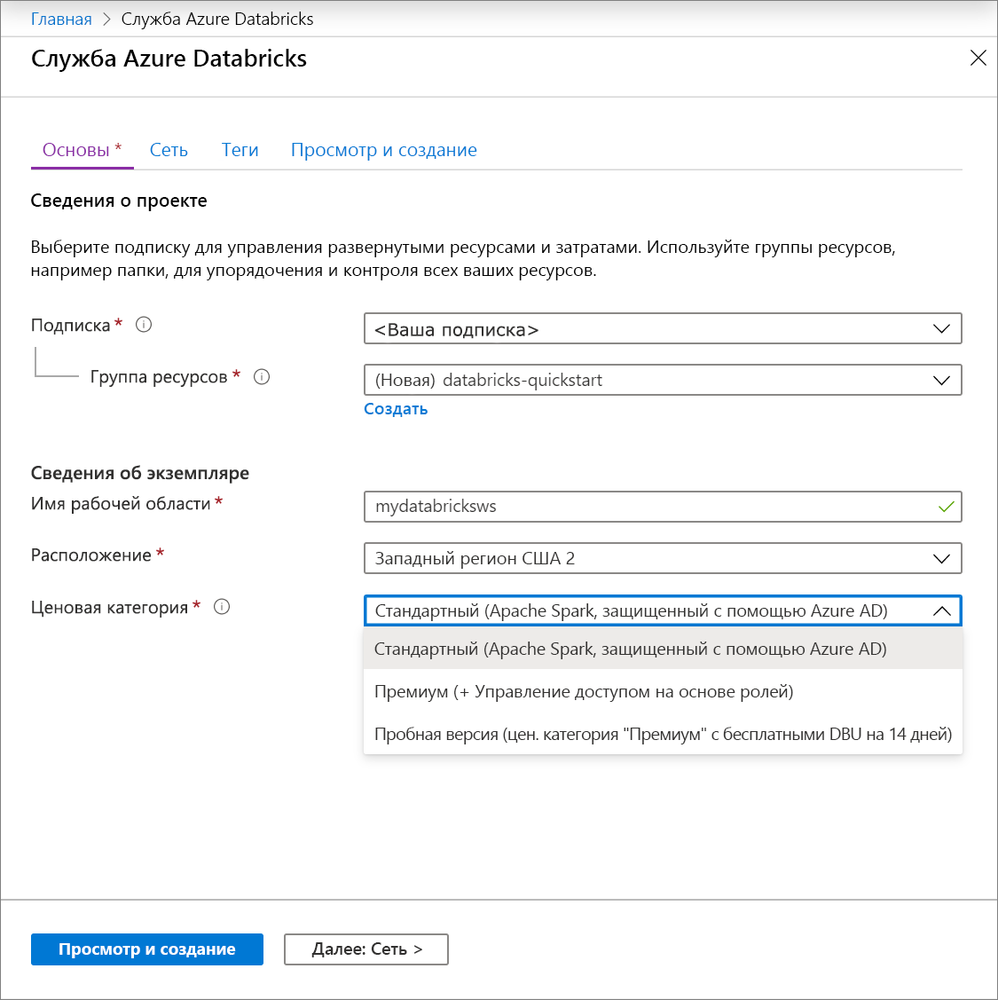
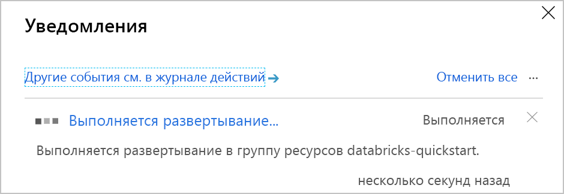
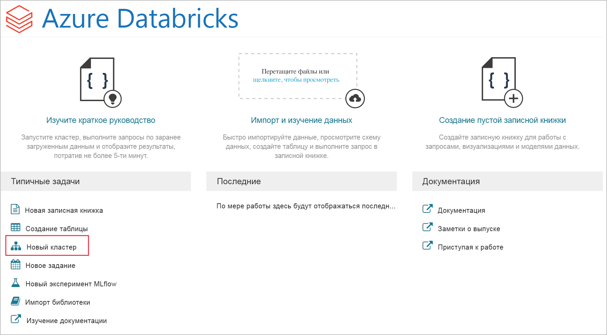
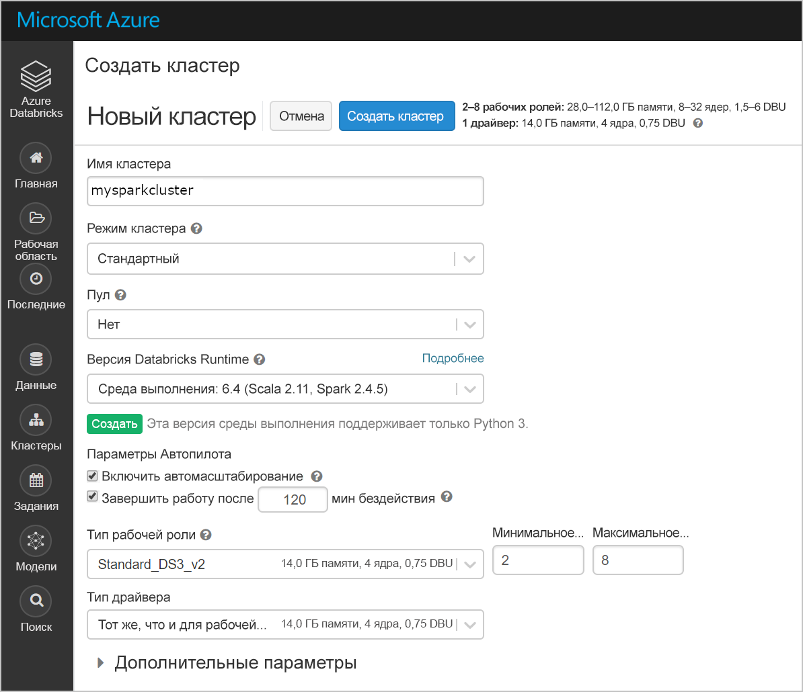
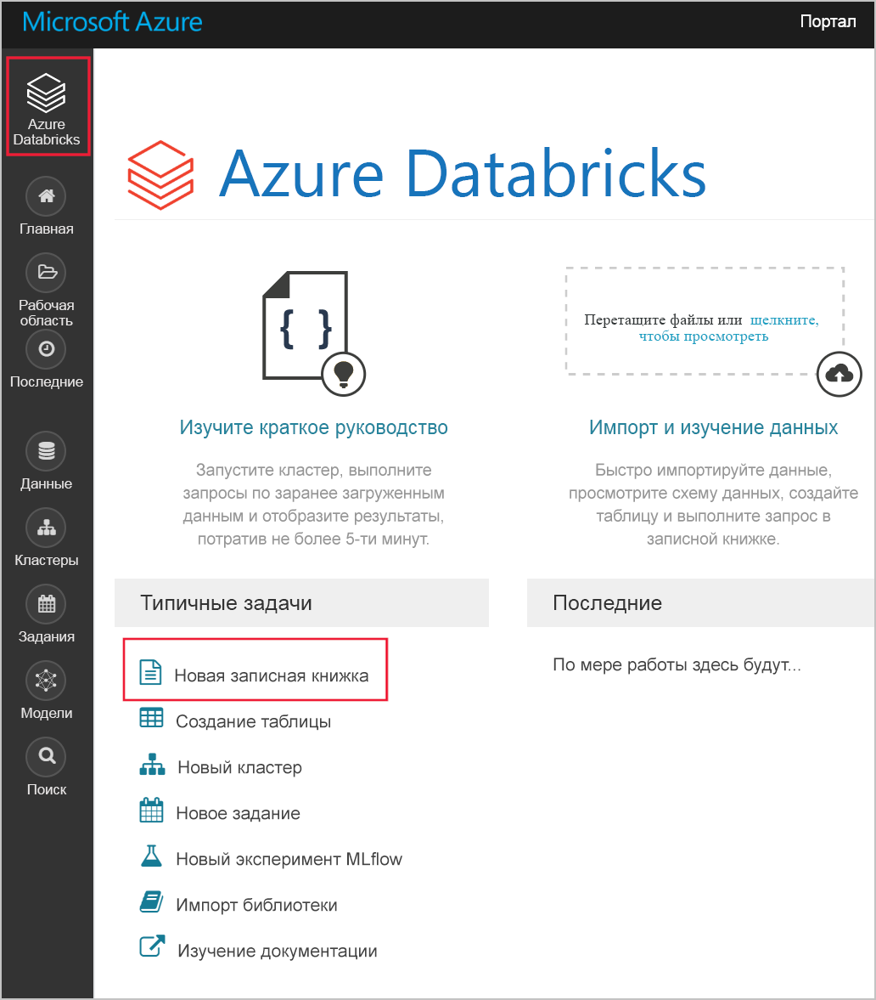
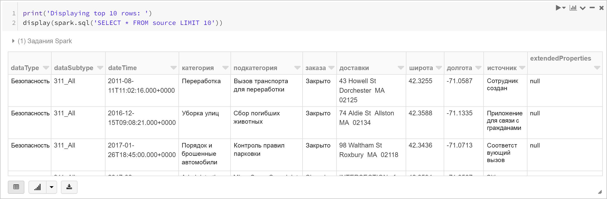
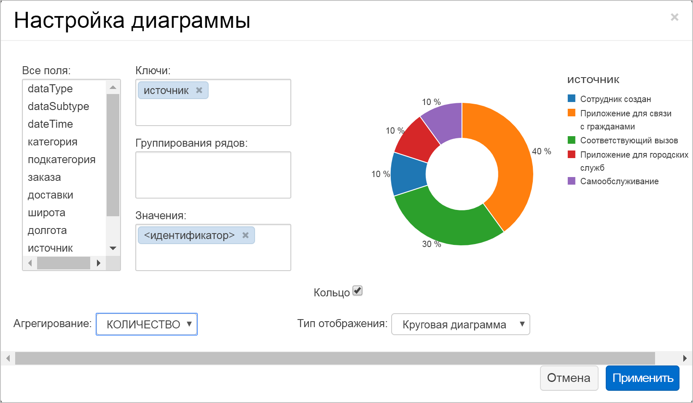
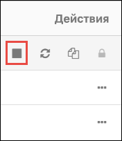

# <a name="quickstart-run-a-spark-job-on-azure-databricks-using-the-azure-portal"></a>Краткое руководство. Запуск задания Spark в Azure Databricks с помощью портала Azure

Это краткое руководство содержит сведения об использовании портала Azure для создания рабочей области Azure Databricks с кластером Apache Spark. Вы запустите задание в кластере и воспользуетесь пользовательскими диаграммами для получения отчетов в режиме реального времени на основе набора Boston Safety Data.

## <a name="prerequisites"></a>Предварительные требования

- Подписка Azure — [создайте бесплатную учетную запись](https://azure.microsoft.com/free/).

## <a name="sign-in-to-the-azure-portal"></a>Вход на портал Azure

Войдите на [портале Azure](https://portal.azure.com).

> [!Note]
> Инструкции из этого руководство нельзя выполнять с **бесплатной пробной версией подписки**.
> Если у вас есть бесплатная учетная запись, перейдите к профилю и измените подписку на подписку с **оплатой по мере использования**. Дополнительные сведения см. на странице [создания бесплатной учетной записи Azure](https://azure.microsoft.com/free/). Затем [удалите предельную сумму расходов](https://docs.microsoft.com/azure/billing/billing-spending-limit#why-you-might-want-to-remove-the-spending-limit) и [запросите увеличение квоты](https://docs.microsoft.com/azure/azure-supportability/resource-manager-core-quotas-request) на ЦП в своем регионе. При создании рабочей области Azure Databricks можно выбрать ценовую категорию **Пробная версия ("Премиум" — 14 дней бесплатно (DBU))** для предоставления рабочей области доступа к бесплатным DBU Azure Databricks уровня "Премиум" на 14 дней.

## <a name="create-an-azure-databricks-workspace"></a>Создание рабочей области Azure Databricks

В этом разделе вы создадите рабочую область Azure Databricks с помощью портала Azure.

1. На портале Azure выберите **Создать ресурс** > **Analytics** > **Azure Databricks**.

    

2. В разделе **службы Azure Databricks** укажите значения для создания рабочей области Databricks.

    .

    Укажите следующие значения.
    
    |Свойство  |ОПИСАНИЕ  |
    |---------|---------|
    |**Имя рабочей области**     | Укажите имя рабочей области Databricks.        |
    |**подписка**     | Выберите подписку Azure в раскрывающемся списке.        |
    |**группа ресурсов**     | Укажите, следует ли создать новую группу ресурсов или использовать имеющуюся. Группа ресурсов — это контейнер, содержащий связанные ресурсы для решения Azure. Дополнительные сведения см. в [обзоре группы ресурсов Azure](../azure-resource-manager/resource-group-overview.md). |
    |**Местоположение.**     | Выберите **Западная часть США 2**. Другие доступные регионы см. в статье о [доступности служб Azure по регионам](https://azure.microsoft.com/regions/services/).        |
    |**Ценовая категория**     |  Вы можете выбрать уровень **Стандартный** или **Премиум** или воспользоваться **бесплатной пробной версией**. Дополнительные сведения об этих ценовых категориях см. на [странице цен на Databricks](https://azure.microsoft.com/pricing/details/databricks/).       |
    |**Виртуальная сеть**     |  Осуществите развертывание рабочей области Azure Databricks в своей виртуальной сети. Дополнительные сведения см. в статье [Deploy Azure Databricks in your Azure Virtual Network (VNet Injection)](/azure/databricks/administration-guide/cloud-configurations/azure/vnet-inject) (Развертывание Azure Databricks в виртуальной сети Azure (внедрение виртуальной сети)).        |

    Нажмите кнопку **Создать**.

4. Создание рабочей области займет несколько минут. Во время создания рабочей области состояние развертывания можно просмотреть в области **Уведомления**.

    

## <a name="create-a-spark-cluster-in-databricks"></a>Создание кластера Spark в Databricks

> [!NOTE]
> Чтобы использовать бесплатную учетную запись для создания кластера Azure Databricks, перед созданием кластера перейдите в свой профиль и измените свою подписку на **оплату по мере использования**. Дополнительные сведения см. на странице [создания бесплатной учетной записи Azure](https://azure.microsoft.com/free/).

1. На портале Azure перейдите к созданной рабочей области Databricks, а затем выберите **Launch Workspace** (Запуск рабочей области).

2. Вы будете перенаправлены на портал Azure Databricks. На портале выберите **Создать кластер**.

    

3. На странице **создания кластера** укажите значения для создания кластера.

    

    Для всех остальных параметров, кроме следующих, примите значения по умолчанию:

   * Введите имя кластера.
   * В рамках этой статьи создайте кластер со средой выполнения **5.3**.
   * Убедитесь, что установлен флажок **Terminate after \_\_ minutes of activity** (Завершить через \_\_ минут бездействия). Укажите длительность (в минутах) для завершения работы кластера, если тот не используется.
    
     Выберите **Create cluster** (Создать кластер). После запуска кластера можно вложить записные книжки в кластер и запустить задания Spark.

Дополнительные сведения о создании кластеров см. в статье [о создании кластера Spark в Azure Databricks](https://docs.azuredatabricks.net/user-guide/clusters/create.html).

## <a name="run-a-spark-sql-job"></a>Выполнение задания Spark SQL

Выполните указанные ниже задачи, чтобы создать записную книжку в Databricks, настроить ее для считывания данных из платформы "Открытые наборы данных Azure", а затем запустить задание Spark SQL в данных.

1. В области слева выберите **Azure Databricks**. Со списка **Общие задачи** выберите **Новая записная книжка**.

    

2. В диалоговом окне **создания записной книжки** введите имя, выберите **Python** в качестве языка, а затем выберите созданный ранее кластер Spark.

    

    Нажмите кнопку **Создать**.

3. На этом этапе создайте кадр данных Spark с набором Boston Safety Data из платформы [Открытые наборы данных Azure](https://azure.microsoft.com/services/open-datasets/catalog/boston-safety-data/#AzureDatabricks), а затем с помощью SQL запросите данные.

   Приведенная ниже команда задает сведения о доступе к хранилищу Azure. Вставьте этот код PySpark в первую ячейку и нажмите клавиши **SHIFT+ВВОД**, чтобы выполнить его.

   ```python
   blob_account_name = "azureopendatastorage"
   blob_container_name = "citydatacontainer"
   blob_relative_path = "Safety/Release/city=Boston"
   blob_sas_token = r"?st=2019-02-26T02%3A34%3A32Z&se=2119-02-27T02%3A34%3A00Z&sp=rl&sv=2018-03-28&sr=c&sig=XlJVWA7fMXCSxCKqJm8psMOh0W4h7cSYO28coRqF2fs%3D"
   ```

   Приведенная ниже команда разрешает Spark удаленно считывать данные из хранилища BLOB-объектов. Вставьте этот код PySpark в следующую ячейку и нажмите клавиши **SHIFT+ВВОД**, чтобы выполнить его.

   ```python
   wasbs_path = 'wasbs://%s@%s.blob.core.windows.net/%s' % (blob_container_name, blob_account_name, blob_relative_path)
   spark.conf.set('fs.azure.sas.%s.%s.blob.core.windows.net' % (blob_container_name, blob_account_name), blob_sas_token)
   print('Remote blob path: ' + wasbs_path)
   ```

   Приведенная ниже команда создает кадр данных. Вставьте этот код PySpark в следующую ячейку и нажмите клавиши **SHIFT+ВВОД**, чтобы выполнить его.

   ```python
   df = spark.read.parquet(wasbs_path)
   print('Register the DataFrame as a SQL temporary view: source')
   df.createOrReplaceTempView('source')
   ```

4. Выполните инструкцию SQL для возвращения первых 10 строк из временного представления **source**. Вставьте этот код PySpark в следующую ячейку и нажмите клавиши **SHIFT+ВВОД**, чтобы выполнить его.

   ```python
   print('Displaying top 10 rows: ')
   display(spark.sql('SELECT * FROM source LIMIT 10'))
   ```

5. Отобразятся табличные данные, как показано на следующем снимке экрана (показаны только некоторые столбцы).

    

6. Теперь вы создадите визуальное представление этих данных, чтобы продемонстрировать сколько связанных с безопасностью событий зарегистрировано с помощью приложения Citizens Connect и City Worker по сравнению с другими источниками. В нижней части выходных табличных данных щелкните значок **линейчатой диаграммы**, а затем — **параметры построения**.

    

8. В разделе **настроек построения** перетащите значения, как показано на снимке экрана.

    

   * Для параметра **Ключи** задайте значение **source**.
   * Для параметра **Значения** задайте значение **<\id>** .
   * Для параметра **Агрегирование** задайте значение **COUNT**.
   * Для параметра **Тип отображения**  задайте значение **Круговая диаграмма**.

     Нажмите кнопку **Применить**.

## <a name="clean-up-resources"></a>Очистка ресурсов

Когда вы выполните задачи в статье, можно будет завершить работу кластера. Для этого в рабочей области Azure Databricks на панели слева выберите **Кластеры**. Для кластера, работу которого необходимо завершить, переместите указатель мыши на многоточие в столбце **Actions** (Действия) и выберите значок **Завершить**.



Если не завершить работу кластера вручную, она завершится автоматически, если во время создания кластера вы установили флажок **Terminate after \_\_ minutes of inactivity** (Завершать работу после \_\_ мин бездействия). В этом случае работа кластера автоматически завершается, если он был неактивным в течение определенного времени.

## <a name="next-steps"></a>Дополнительная информация

В этой статье вы создали кластер Spark в Azure Databricks и запустили задание Spark, используя данные платформы "Открытые наборы данных Azure". Вы также можете просмотреть [источники данных Spark](https://docs.azuredatabricks.net/spark/latest/data-sources/index.html), чтобы узнать, как импортировать данные из источников данных в Azure Databricks. Перейдите к следующей статье, чтобы узнать, как выполнять операции ETL (извлечения, преобразование и загрузка данных) с помощью Azure Databricks.

> [!div class="nextstepaction"]
>[Извлечение, преобразование и загрузка данных с помощью Azure Databricks](databricks-extract-load-sql-data-warehouse.md)
