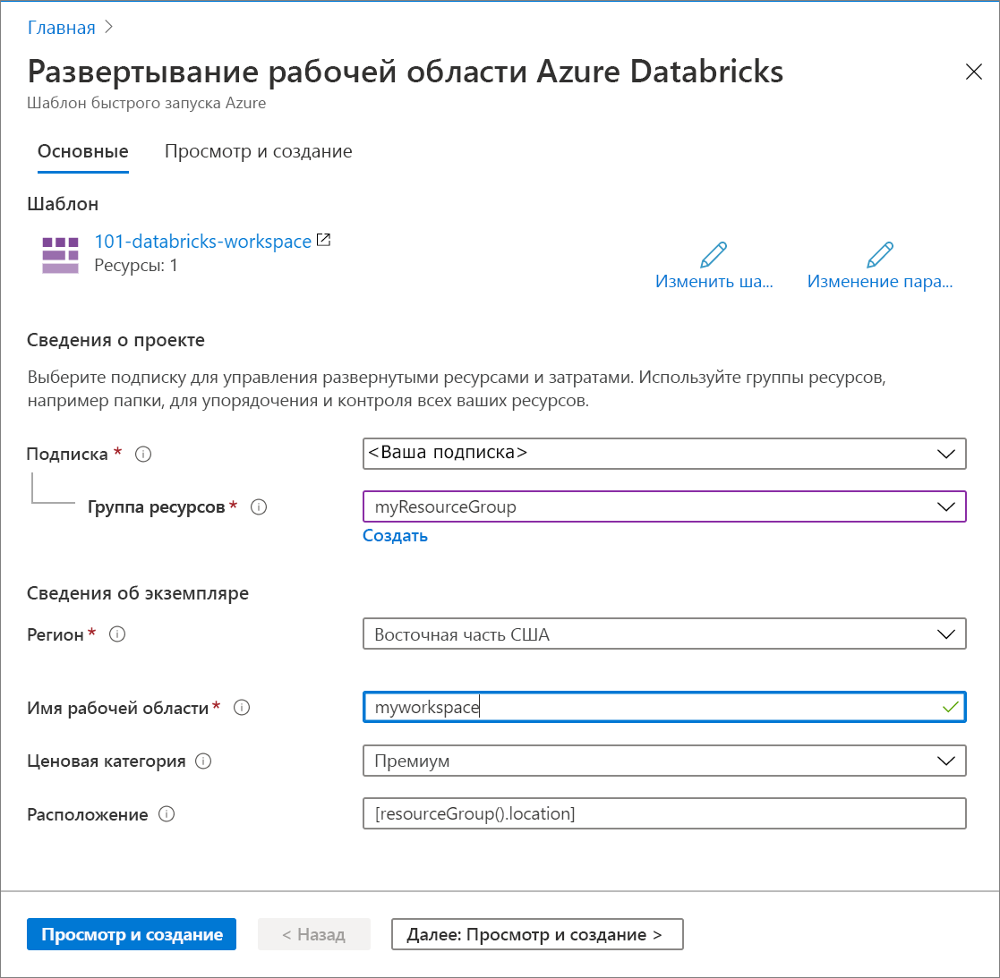

# <a name="quickstart-create-an-azure-databricks-workspace-by-using-the-azure-resource-manager-template"></a>Краткое руководство. Создание рабочей области Azure Databricks с помощью шаблона Azure Resource Manager

В этом кратком руководстве для создания рабочей области Azure Databricks используется шаблон Azure Resource Manager. После создания рабочей области необходимо проверить развертывание.

[!INCLUDE [About Azure Resource Manager](../../includes/resource-manager-quickstart-introduction.md)]

## <a name="prerequisites"></a>Предварительные требования

Для работы с этой статьей необходимо иметь:

* подписку Azure ([создайте бесплатную учетную запись](https://azure.microsoft.com/free/)).

## <a name="create-an-azure-databricks-workspace"></a>Создание рабочей области Azure Databricks

### <a name="review-the-template"></a>Изучение шаблона

Шаблон, используемый в этом кратком руководстве, взят из [шаблонов быстрого запуска Azure](https://github.com/Azure/azure-quickstart-templates/tree/master/101-databricks-workspace).

:::code language="json" source="~/quickstart-templates/101-databricks-workspace/azuredeploy.json" range="1-53":::

Ресурс Azure, определенный в шаблоне, — Microsoft.Databricks/workspaces. Создайте рабочую область Azure Databricks. 

## <a name="deploy-the-template"></a>Развертывание шаблона

В этом разделе вы создадите рабочую область Azure Databricks с помощью шаблона Azure Resource Manager.

1. Выберите следующее изображение, чтобы войти на портал Azure и открыть шаблон. Шаблон создает рабочую область Azure Databricks.

   [](https://portal.azure.com/#create/Microsoft.Template/uri/https%3A%2F%2Fraw.githubusercontent.com%2FAzure%2Fazure-quickstart-templates%2Fmaster%2F101-databricks-workspace%2Fazuredeploy.json)

2. Укажите необходимые значения, чтобы создать рабочую область Azure Databricks.

   

   Укажите следующие значения.

   |Свойство  |Описание  |
   |---------|---------|
   |**Подписка**     | Выберите подписку Azure в раскрывающемся списке.        |
   |**Группа ресурсов**     | Укажите, следует ли создать новую группу ресурсов или использовать имеющуюся. Группа ресурсов — это контейнер, содержащий связанные ресурсы для решения Azure. Дополнительные сведения см. в [обзоре группы ресурсов Azure](../azure-resource-manager/management/overview.md). |
   |**Расположение**     | Выберите регион **Восточная часть США 2**. Другие доступные регионы см. в статье о [доступности служб Azure по регионам](https://azure.microsoft.com/regions/services/).        |
   |**Имя рабочей области**     | Укажите имя рабочей области Databricks.        |
   |**Ценовая категория**     |  Вы можете выбрать уровень **Стандартный** или **Премиум**. Дополнительные сведения об этих ценовых категориях см. на [странице цен на Databricks](https://azure.microsoft.com/pricing/details/databricks/).       |

3. Выберите **Проверить и создать**, а затем — **Создать**.

4. Создание рабочей области займет несколько минут. Если при развертывании рабочей области произойдет сбой, она все равно будет создана, но в состоянии сбоя. Удалите такую рабочую область и создайте новую, чтобы устранить ошибки с развертыванием. При удалении рабочей области, для которой произошел сбой, также удаляются ее управляемую группу ресурсов и все успешно развернутые ресурсы.

## <a name="review-deployed-resources"></a>Просмотр развернутых ресурсов

Вы можете использовать портал Azure, чтобы проверить рабочую область Azure Databricks, а также следующие скрипты Azure CLI или Azure PowerShell, чтобы просмотреть ресурс:

### <a name="azure-cli"></a>Azure CLI

```azurecli-interactive
echo "Enter your Azure Databricks workspace name:" &&
read databricksWorkspaceName &&
echo "Enter the resource group where the Azure Databricks workspace exists:" &&
read resourcegroupName &&
az databricks workspace show -g $resourcegroupName -n $databricksWorkspaceName
```

### <a name="azure-powershell"></a>Azure PowerShell

```azurepowershell-interactive
$resourceGroupName = Read-Host -Prompt "Enter the resource group name where your Azure Databricks workspace exists"
(Get-AzResource -ResourceType "Microsoft.Databricks/workspaces" -ResourceGroupName $resourceGroupName).Name
 Write-Host "Press [ENTER] to continue..."
```

## <a name="clean-up-resources"></a>Очистка ресурсов

Если вы планируете продолжить работу с последующими учебниками, эти ресурсы можно пока сохранить. Удалите группу ресурсов, если она больше не нужна. Рабочая область Azure Databricks и связанные управляемые ресурсы будут также удалены. Чтобы удалить группу ресурсов с помощью Azure CLI или Azure PowerShell, выполните следующие действия.

### <a name="azure-cli"></a>Azure CLI

```azurecli-interactive
echo "Enter the Resource Group name:" &&
read resourceGroupName &&
az group delete --name $resourceGroupName &&
echo "Press [ENTER] to continue ..."
```

### <a name="azure-powershell"></a>Azure PowerShell

```azurepowershell-interactive
$resourceGroupName = Read-Host -Prompt "Enter the Resource Group name"
Remove-AzResourceGroup -Name $resourceGroupName
Write-Host "Press [ENTER] to continue..."
```

## <a name="next-steps"></a>Дальнейшие действия

В этом кратком руководстве вы создали рабочую область Azure Databricks с помощью шаблона Azure Resource Manager и проверили развертывание. Перейдите к следующей статье, чтобы узнать, как выполнять операции ETL (извлечения, преобразование и загрузка данных) с помощью Azure Databricks.

> [!div class="nextstepaction"]
> [Извлечение, преобразование и загрузка данных с помощью Azure Databricks](databricks-extract-load-sql-data-warehouse.md)
