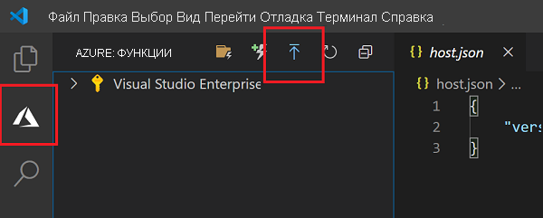
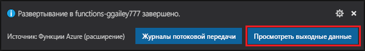

# Краткое руководство. Создание функции в Azure на TypeScript с помощью Visual Studio Code

[!INCLUDE [functions-language-selector-quickstart-vs-code](../../includes/functions-language-selector-quickstart-vs-code.md)]

Из этой статьи вы узнаете, как создать функцию TypeScript, которая отвечает на HTTP-запросы, используя Visual Studio Code. После тестирования кода в локальной среде его необходимо развернуть в бессерверной среде Функций Azure.

Выполнение этого краткого руководства предполагает небольшую дополнительную плату в несколько центов США в учетной записи Azure. 

Существует также версия этой статьи для [интерфейса командной строки](create-first-function-cli-typescript.md).

## Настройка среды

Перед началом работы убедитесь, что выполнены следующие предварительные требования.

+ Учетная запись Azure с активной подпиской. [Создайте учетную запись](https://azure.microsoft.com/free/?ref=microsoft.com&utm_source=microsoft.com&utm_medium=docs&utm_campaign=visualstudio) бесплатно.

+ [Node.js](https://nodejs.org/), активная версия LTS и версия Maintenance LTS (рекомендуется 10.14.1). Используйте команду `node --version`, чтобы проверить установленную версию.  

+ [Visual Studio Code](https://code.visualstudio.com/) на одной из [поддерживаемых платформ](https://code.visualstudio.com/docs/supporting/requirements#_platforms).

+ [Расширение "Функции Azure"](https://marketplace.visualstudio.com/items?itemName=ms-azuretools.vscode-azurefunctions) для Visual Studio Code.

## Создание локального проекта

В этом разделе вы используете Visual Studio Code, чтобы создать локальный проект Функций Azure на TypeScript. Далее в этой статье вы опубликуете код функции в Azure. 

1. Щелкните значок Azure на панели действий, а затем в области **Azure: Functions** (Azure: Функции) щелкните значок **Создать проект...** .

    

1. Выберите расположение для рабочей области проекта и нажмите кнопку **Выбрать**.

    > [!NOTE]
    > Рассматриваемые в этой статье шаги выполняются вне рабочей области. В этом случае не нужно указывать папку проекта, которая является частью рабочей области.

1. Введите следующие сведения по соответствующим запросам:

    + **Выберите язык для проекта приложения-функции**: Выберите `TypeScript`.

    + **Выберите шаблон для первой функции вашего проекта**. Выберите `HTTP trigger`.

    + **Укажите имя функции**. Введите `HttpExample`.

    + **Уровень авторизации**: выберите `Anonymous`, что позволит любому пользователю вызывать конечную точку функции. Дополнительные сведения об уровне авторизации см. в разделе [Authorization keys](functions-bindings-http-webhook-trigger.md#authorization-keys) (Ключи авторизации).

    + **Выберите, как вы хотели бы открыть свой проект**. Выберите `Add to workspace`.

1. Используя эти сведения, Visual Studio Code создает проект функций Azure с триггером HTTP. Файлы локального проекта можно просмотреть в Explorer. Дополнительные сведения см. в разделе [Generated project files](functions-develop-vs-code.md#generated-project-files) (Созданные файлы проекта). 

[!INCLUDE [functions-run-function-test-local-vs-code](../../includes/functions-run-function-test-local-vs-code.md)]

Убедившись, что функция выполняется правильно на локальном компьютере, опубликуйте проект в Azure с помощью Visual Studio Code.

[!INCLUDE [functions-sign-in-vs-code](../../includes/functions-sign-in-vs-code.md)]

## Публикация проекта в Azure

В этом разделе показано создание приложения-функции и сопутствующих ресурсов в подписке Azure и последующее развертывание кода.

> [!IMPORTANT]
> Публикация в существующее приложение-функцию перезаписывает содержимое этого приложения в Azure. 

1. Щелкните значок Azure на панели действий, а затем в области **Azure: Функции** выберите кнопку **Deploy to function app...** (Развертывание в приложение-функцию).

    

1. Введите следующие сведения по соответствующим запросам:

    + **Выбор папки**. Выберите папку из рабочей области или перейдите к папке, содержащей приложение-функцию. Этот элемент не отобразится, если вы уже открыли допустимое приложение-функцию.

    + **Выбрать подписку**. Выберите подписку, которую нужно использовать. Если у вас только одна подписка, вы не увидите этот параметр.

    + **Select Function App in Azure** (Выбор приложения-функции в Azure). Выберите `+ Create new Function App`. (Не выбирайте параметр `Advanced`, так как он не рассматривается в этой статье.)

    + **Enter a globally unique name for the function app** (Ввод глобально уникального имени для приложения-функции). Введите имя, допустимое в пути URL-адреса. Имя, которое вы вводите, проверяется, чтобы убедиться, что оно уникально в функциях Azure. 

    + **Select a runtime** (Выбор среды выполнения). Выберите версию Node.js, которая запускалась локально. Вы можете использовать команду `node --version`, чтобы проверить установленную версию.

    + **Select a location for new resources** (Выбор расположения для новых ресурсов).  Для повышения производительности выберите [регион](https://azure.microsoft.com/regions/) рядом с вами.

1. После завершения в вашей подписке создаются следующие ресурсы Azure с именами, производными от имени приложения-функции:

    + группу ресурсов — логический контейнер связанных ресурсов;
    + Стандартная учетная запись хранения Azure для сохранения состояния и других сведений о проектах.
    + План потребления, который определяет базовый узел для бессерверного приложения-функции; 
    + приложение-функцию — среду для выполнения кода функции. Приложение-функция позволяет группировать функции в логические единицы и упростить развертывание, масштабирование и совместное использование ресурсов, а также управление ими в рамках единого плана размещения.
    + Экземпляр Application Insights, подключенный к приложению-функции, который отслеживает использование бессерверной функции.

    После создания приложения-функции и применения пакета развертывания отобразится уведомление. 

1. Выберите **View Output** (Просмотреть выходные данные) в уведомлении, чтобы просмотреть результаты создания и развертывания ресурсов Azure. Если вы пропустили уведомление, щелкните значок колокольчика в правом нижнем углу, чтобы снова просмотреть его.

    

[!INCLUDE [functions-vs-code-run-remote](../../includes/functions-vs-code-run-remote.md)]

[!INCLUDE [functions-cleanup-resources-vs-code.md](../../includes/functions-cleanup-resources-vs-code.md)]

## Дальнейшие действия

С помощью Visual Studio Code вы создали приложение-функцию с простой функцией, активируемой HTTP-запросом. В следующей статье вы расширите эту функцию, добавив выходную привязку. Эта привязка записывает строку из HTTP-запроса в сообщение очереди Хранилища очередей Azure. 

> [!div class="nextstepaction"]
> [Подключение Функций Azure к службе хранилища Azure с помощью средств командной строки](functions-add-output-binding-storage-queue-vs-code.md?pivots=programming-language-typescript)

[Azure Functions Core Tools]: functions-run-local.md
[Azure Functions extension for Visual Studio Code]: https://marketplace.visualstudio.com/items?itemName=ms-azuretools.vscode-azurefunctions
