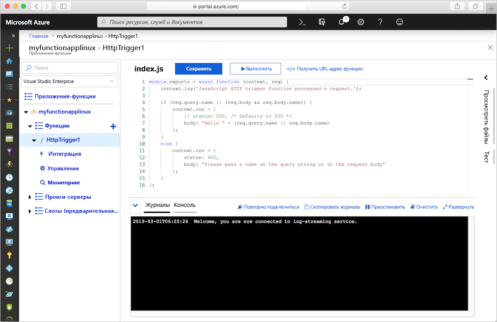
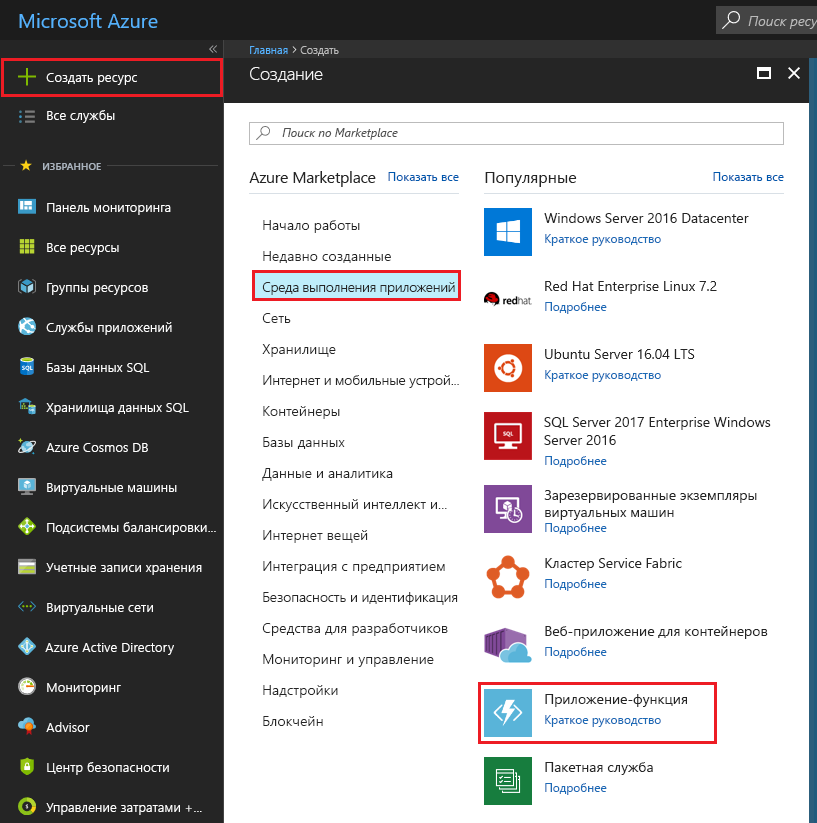
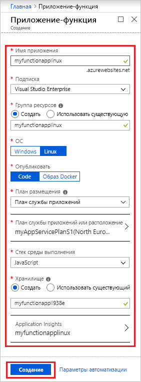
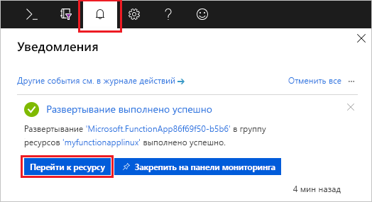
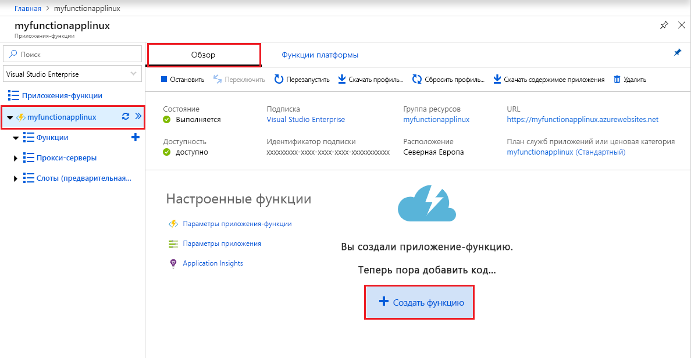
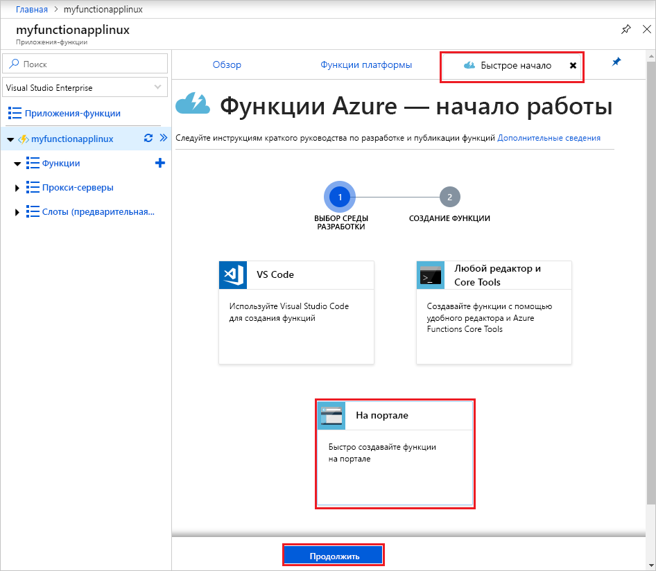
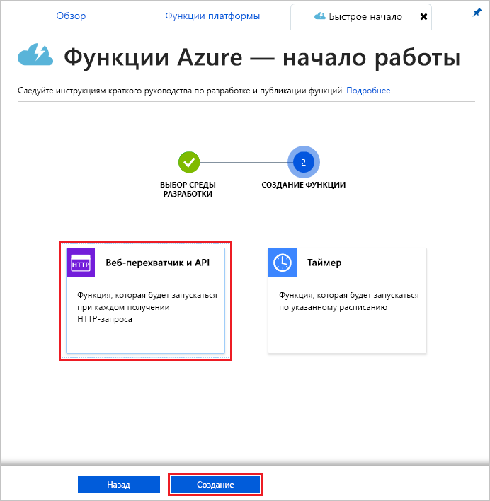
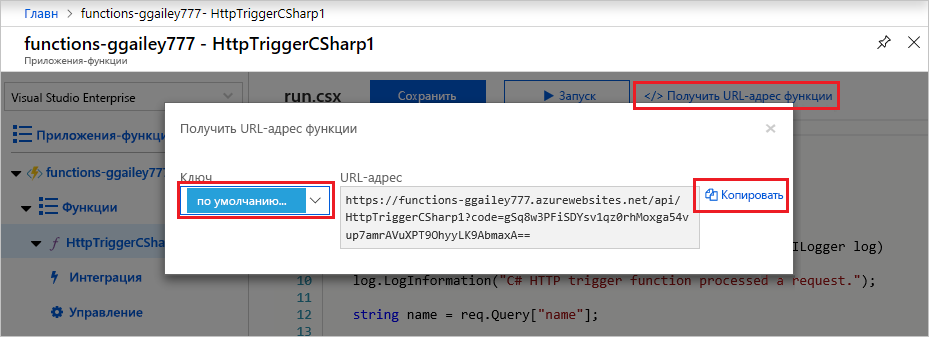
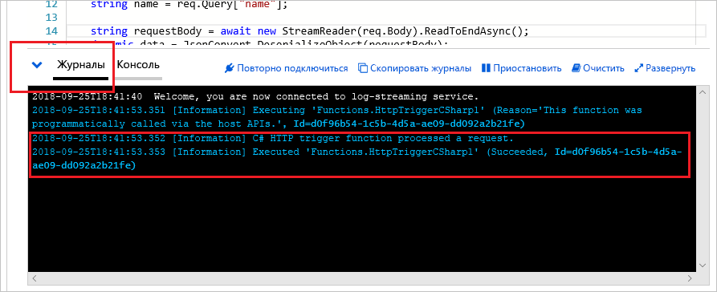

# Создание приложения-функции на платформе Linux в плане службы приложений Azure

Функции Azure позволяют размещать в Linux собственные функции в контейнере службы приложения Azure по умолчанию. В этой статье вы узнаете, как использовать [портал Azure](https://portal.azure.com) для создания приложения-функции, размещенного на Linux, которая выполняется в [плане службы приложений](functions-scale.md#app-service-plan). Также можно [использовать собственный настраиваемый контейнер](functions-create-function-linux-custom-image.md).

[!INCLUDE [quickstarts-free-trial-note](../../includes/quickstarts-free-trial-note.md)]

## Вход в Azure

Войдите на портал Azure по адресу <https://portal.azure.com> с помощью своей учетной записи Azure.

## Создание приложения-функции

Для выполнения функций в Linux вам понадобится приложение-функция, предоставляющее среду для выполнения кода функции. Это позволяет группировать функции в логические единицы и упростить развертывание и совместное использование ресурсов, а также управление ими. В этой статье вы создадите план службы приложения при создании приложения-функции.

1. Нажмите кнопку **Создать ресурс** в верхнем левом углу портала Azure, а затем выберите **Вычисления** > **Приложение-функция**.

    

2. Используйте настройки приложения-функции, указанные в таблице под рисунком.

    

    | Параметр      | Рекомендуемое значение  | ОПИСАНИЕ                                        |
    | ------------ |  ------- | -------------------------------------------------- |
    | **Имя приложения** | Глобально уникальное имя | Имя, которое идентифицирует ваше новое приложение-функцию. Допустимые символы: `a-z`, `0-9` и `-`.  | 
    | **Подписка** | Ваша подписка | Подписка, в которой создано приложение-функция. | 
    | **[Группа ресурсов](../azure-resource-manager/resource-group-overview.md)** |  myResourceGroup | Имя новой группы ресурсов, в которой создается приложение-функция. |
    | **ОС** | Linux | Приложение-функция выполняется на платформе Linux. |
    | **Опубликовать** | Код | Контейнер Linux используется по умолчанию для вашего **стека времени выполнения**. Необходимо указать только код проекта приложения-функции. Другой вариант — опубликовать пользовательский [Образ Docker](functions-create-function-linux-custom-image.md). |
    | **[План размещения](functions-scale.md)** | План службы приложений | План размещения, который определяет выделение ресурсов в приложении-функции. Если выполнение происходит в плане службы приложений, вы можете управлять [масштабированием приложения-функции](functions-scale.md).  |
    | **Расположение или план службы приложений** | Создать план | Выберите **Создать** и укажите имя **плана службы приложений**. Выберите **Расположение** в ближайшем к вам [регионе](https://azure.microsoft.com/regions/) или регионе, ближайшем к другим службам, к которым обращаются ваши функции. Выберите желаемую **[ценовую категорию](https://azure.microsoft.com/pricing/details/app-service/linux/)** .  Вы не можете запустить приложение-функцию Windows и Linux в одном плане службы приложений. |
    | **Стек среды выполнения** | Предпочитаемый язык | Выберите среду выполнения, которая поддерживает нужный функциональный язык программирования. Выберите **.NET** для функций C# и F#. Сейчас [Поддержка Python](functions-reference-python.md) находится в предварительной версии. |
    | **[Хранилище](../storage/common/storage-quickstart-create-account.md)** |  Глобально уникальное имя |  Создайте учетную запись хранения для использования приложением-функцией. Имя учетной записи хранения должно содержать от 3 до 24 символов и состоять только из цифр и строчных букв. Можно также использовать существующую учетную запись при условии, что она соответствует [требованиям учетной записи хранилища](functions-scale.md#storage-account-requirements). |
    | **[Application Insights](functions-monitoring.md)** | Включено | Application Insights отключено по умолчанию. Мы рекомендуем включить интеграцию Application Insights сейчас и выбрать интеграцию размещения возле расположения вашего плана обслуживания приложений. Чтобы сделать это позже, см. статью [Мониторинг функций Azure](functions-monitoring.md).  |

3. Выберите **Создать**, чтобы подготовить и развернуть приложение-функцию.

4. Выберите значок уведомления в правом верхнем углу портала. Вы должны увидеть сообщение **Развертывание выполнено**.

    

5. Выберите **Перейти к ресурсу** для просмотра нового приложения-функции.

Затем создайте функцию в новом приложении-функции. Даже в том случае, если ваше приложение-функция доступно,полная инициализация может занять несколько минут.

## Создание функции, активируемой HTTP

В этом разделе показано, как создать функцию в новом приложении-функции на портале.

> [!NOTE]
> Интерфейс разработки портала можно использовать для ознакомления с Функциями Azure. Для большинства сценариев рассмотрите возможность локальной разработки своих функций и публикации проекта в приложение-функцию с помощью [Visual Studio Code](functions-create-first-function-vs-code.md#create-an-azure-functions-project) или [Azure Functions Core Tools](functions-run-local.md#create-a-local-functions-project).  

1. В новом приложении-функции, выберите вкладку **Обзор**, а после полной загрузки выберите **+ Создать функцию**.

    

1. На вкладке **Быстрый старт** выберите **На портале** и нажмите **Продолжить**.

    

1. Выберите **Веб-перехватчик + API**, а затем нажмите **Создать**.

    

Будет создана функция на основе шаблона функции с активацией по HTTP для конкретного языка.

Теперь вы можете запустить новую функцию, отправив HTTP-запрос.

## Проверка функции

1. В новой функции щелкните **</> Get function URL** (Получить URL-адрес функции), выберите **default (Function key)** (По умолчанию (ключ функции)) и щелкните **Копировать**. 

    

2. Вставьте URL-адрес функции в адресную строку браузера. Добавьте значение строки запроса `&name=<yourname>` в конец этого URL-адреса и нажмите клавишу `Enter` на клавиатуре, чтобы выполнить этот запрос. В браузере должен отобразиться ответ, возращенный функцией.  

    Следующий пример демонстрирует ответ в браузере:

    

    URL-адрес запроса включает ключ, который по умолчанию необходим для доступа к функции по протоколу HTTP.

3. При выполнении функции сведения о трассировке записываются в журналы. Для просмотра выходных данных трассировки из предыдущего выполнения вернитесь к своей функции на портале и щелкните стрелку в нижней части экрана, чтобы развернуть раздел **Журналы**.

   

## Очистка ресурсов

[!INCLUDE [Clean-up resources](../../includes/functions-quickstart-cleanup.md)]

## Дополнительная информация

Вы создали приложение-функцию с простой функцией, активируемой HTTP.  

[!INCLUDE [Next steps note](../../includes/functions-quickstart-next-steps.md)]

Дополнительные сведения см. в статье [Привязки HTTP функций Azure](functions-bindings-http-webhook.md).
