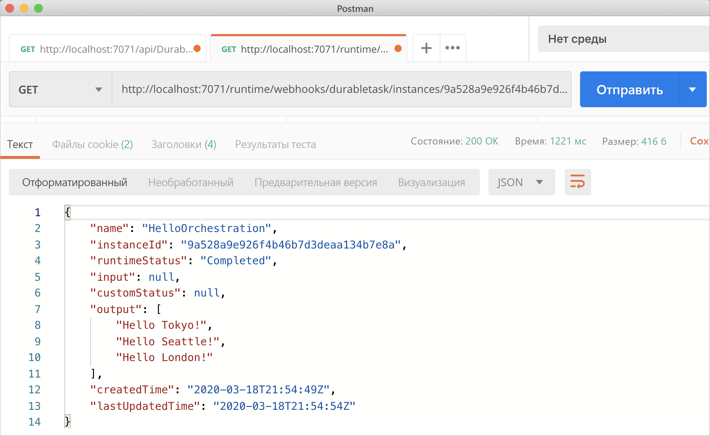
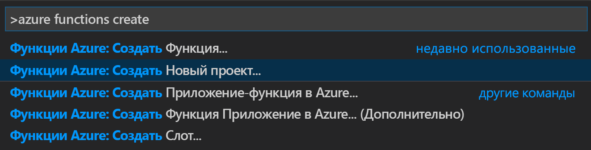
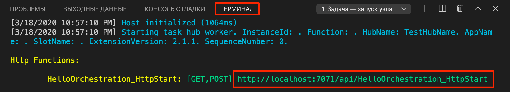
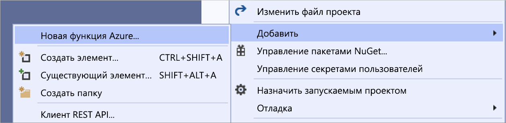

# <a name="create-your-first-durable-function-in-c"></a>Создание устойчивой функции в C\#

*Устойчивые функции* — это расширение [Функций Azure](../functions-overview.md), которое позволяет писать функции с отслеживанием состояния в беcсерверной среде. Расширение автоматически управляет состоянием, создает контрольные точки и перезагружается.

::: zone pivot="code-editor-vscode"

Из этой статьи вы узнаете, как с помощью Visual Studio Code создать и протестировать устойчивую функцию hello world в локальной среде.  Эта функция организовывает и объединяет в цепочку вызовы других функций. Затем вы опубликуете код функции в Azure. Эти инструменты доступны как часть [расширения Функций Azure](https://marketplace.visualstudio.com/items?itemName=ms-azuretools.vscode-azurefunctions) в VS Code.



## <a name="prerequisites"></a>Предварительные требования

Для работы с этим руководством сделайте следующее:

* Установите [Visual Studio Code](https://code.visualstudio.com/download).

* Установите следующие расширения VS Code:
    - [Функции Azure](https://marketplace.visualstudio.com/items?itemName=ms-azuretools.vscode-azurefunctions)
    - [C#](https://marketplace.visualstudio.com/items?itemName=ms-dotnettools.csharp)

* Убедитесь, что используется последняя версия [Azure Functions Core Tools](../functions-run-local.md).

* Для работы Устойчивых функций требуется учетная запись хранения Azure. Вам понадобится подписка Azure.

* Убедитесь, что установлен [пакет SDK для .NET Core](https://dotnet.microsoft.com/download) 3.1 или более поздней версии.

[!INCLUDE [quickstarts-free-trial-note](../../../includes/quickstarts-free-trial-note.md)]

## <a name="create-your-local-project"></a><a name="create-an-azure-functions-project"></a>Создание локального проекта 

В этом разделе вы используете Visual Studio Code. чтобы создать локальный проект Функций Azure. 

1. В Visual Studio Code нажмите клавишу F1 (или Ctrl/Cmd+Shift+P), чтобы открыть палитру команд. В палитре команд найдите и щелкните `Azure Functions: Create New Project...`.

    

1. Выберите расположение пустой папки для проекта и нажмите кнопку **Выбрать**.

1. Следуя инструкциям, введите следующие сведения:

    | prompt | Значение | Описание |
    | ------ | ----- | ----------- |
    | Select a language for your function app project (Выберите язык для проекта приложения-функции) | C# | Создание локального проекта "Функции C#". |
    | Выбор версии | Функции Azure версии 3 | Этот параметр отображается, только если вы еще не установили Core Tools. В этом случае Core Tools устанавливается при первом запуске приложения. |
    | Select a template for your project's first function (Выберите шаблон для первой функции вашего проекта) | Пропустить | |
    | Select how you would like to open your project (Выберите, как вы хотели бы открыть свой проект) | Открыть в текущем окне | Повторно открывает VS Code в выбранной папке. |

При необходимости Visual Studio Code устанавливает Azure Functions Core Tools. Кроме того, создается проект приложения-функции в папке. Проект будет содержать файлы конфигурации [host.json](../functions-host-json.md) и [local.settings.json](../functions-run-local.md#local-settings-file).

## <a name="add-functions-to-the-app"></a>Добавление функций в приложение

В следующих действиях используется шаблон для создания устойчивого кода функции в проекте.

1. В палитре команд найдите и щелкните `Azure Functions: Create Function...`.

1. Следуя инструкциям, введите следующие сведения:

    | prompt | Значение | Описание |
    | ------ | ----- | ----------- |
    | Выбор шаблона для функции | DurableFunctionsOrchestration | Создание оркестрации устойчивых функций |
    | Provide a function name (Укажите имя функции) | HelloOrchestration | Имя класса, в котором создаются функции |
    | Provide a namespace (Укажите пространство имен) | Company.Function | Пространство имен для созданного класса |

1. Когда VS Code предложит выбрать учетную запись хранения, щелкните **Выбрать учетную запись хранения**. Следуя инструкциям, укажите следующие сведения, чтобы создать новую учетную запись хранения в Azure.

    | prompt | Значение | Описание |
    | ------ | ----- | ----------- |
    | Выбор подписки | *имя вашей подписки* | Выбор подписки Azure |
    | Выбор учетной записи хранения | Создание новой учетной записи хранения |  |
    | Ввод имени новой учетной записи хранения | *уникальное имя* | Имя учетной записи хранения для создания |
    | Выбор группы ресурсов | *уникальное имя* | Имя создаваемой группы ресурсов |
    | Выберите расположение | *region* | Выбор ближайшего региона |

В проект добавляется класс, содержащий новые функции. VS Code также добавляет строку подключения учетной записи хранения в файл *local.settings.json* и ссылку на пакет NuGet [`Microsoft.Azure.WebJobs.Extensions.DurableTask`](https://www.nuget.org/packages/Microsoft.Azure.WebJobs.Extensions.DurableTask) в файл проекта *.csproj*.

Откройте новый файл *HelloOrchestration.cs*, чтобы просмотреть содержимое. Эта устойчивая функция является простым примером цепочки функции со следующими методами.  

| Метод | FunctionName | Описание |
| -----  | ------------ | ----------- |
| **`RunOrchestrator`** | `HelloOrchestration` | Управляет устойчивой оркестрацией. В этом случае оркестрация запускается, создает список и добавляет в него результат трех вызовов функций.  Список возвращается после завершения вызовов трех функций. |
| **`SayHello`** | `HelloOrchestration_Hello` | Функция возвращает hello. Это функция, которая содержит управляемую бизнес-логику. |
| **`HttpStart`** | `HelloOrchestration_HttpStart` | [Функция, активируемая HTTP-запросом](../functions-bindings-http-webhook.md), которая запускает пример оркестрации и возвращает ответ состояния проверки. |

Созданный проект функции и устойчивую функцию можно протестировать на локальном компьютере.

## <a name="test-the-function-locally"></a>Локальное тестирование функции

Основные инструменты службы "Функции Azure" позволяют запускать проекты функций Azure на локальном компьютере разработчика. Вам будет предложено установить эти инструменты при первом запуске функции из Visual Studio Code.

1. Чтобы протестировать созданную функцию, установите точку останова в коде функции действия `SayHello` и нажмите клавишу F5 для запуска проекта приложения-функции. Выходные данные основных инструментов отображаются на панели **Terminal** (Терминал).

    > [!NOTE]
    > См. сведения об отладке в руководстве по [диагностике Устойчивых функций](durable-functions-diagnostics.md#debugging).

1. На панели **Terminal** (Терминал) скопируйте URL-адрес конечной точки функции, активируемой HTTP-запросом.

    

1. Отправьте запрос HTTP POST к конечной точке URL-адреса, используя средства наподобие [Postman](https://www.getpostman.com/) или [cURL](https://curl.haxx.se/).

   Полученный ответ является начальным результатом функции HTTP, что сообщает об успешном начале работы устойчивой оркестрации. Он еще не конечный результат оркестрации. Ответ включает несколько полезных URL-адреса. Теперь запросите состояние оркестрации.

1. Скопируйте значение URL-адреса для `statusQueryGetUri`, вставьте его в адресную строку панели браузера и выполните запрос. Кроме того, вы можете воспользоваться Postman для выдачи запроса GET.

   Запрос будет запрашивать экземпляр оркестрации для состояния. Вам нужно получить итоговый ответ, который показывает, что экземпляр выполнен и содержит выходные данные или результаты устойчивой функции. Он выглядит следующим образом: 

    ```json
    {
        "name": "HelloOrchestration",
        "instanceId": "9a528a9e926f4b46b7d3deaa134b7e8a",
        "runtimeStatus": "Completed",
        "input": null,
        "customStatus": null,
        "output": [
            "Hello Tokyo!",
            "Hello Seattle!",
            "Hello London!"
        ],
        "createdTime": "2020-03-18T21:54:49Z",
        "lastUpdatedTime": "2020-03-18T21:54:54Z"
    }
    ```

1. В VS Code нажмите клавиши **Shift + F5**, чтобы остановить отладку.

Убедившись, что функция выполняется правильно на локальном компьютере, опубликуйте проект в Azure.

[!INCLUDE [functions-create-function-app-vs-code](../../../includes/functions-sign-in-vs-code.md)]

[!INCLUDE [functions-publish-project-vscode](../../../includes/functions-publish-project-vscode.md)]

## <a name="test-your-function-in-azure"></a>Тестирование функции в Azure

1. Скопируйте URL-адрес HTTP-триггера на панели **Output** (Выходные данные). URL-адрес для вызова функции, активируемой HTTP-запросом, должен быть указан в таком формате:

    `https://<functionappname>.azurewebsites.net/api/HelloOrchestration_HttpStart`

1. Вставьте этот URL-адрес HTTP-запроса в адресную строку браузера. При использовании опубликованного приложения ответ состояния должен быть таким же, как и ранее.

## <a name="next-steps"></a>Дальнейшие действия

Вы создали и опубликовали устойчивое приложение-функцию C# с помощью Visual Studio Code.

> [!div class="nextstepaction"]
> [Дополнительные сведения о распространенных шаблонах устойчивых функций](durable-functions-overview.md#application-patterns)

::: zone-end

::: zone pivot="code-editor-visualstudio"

Из этой статьи вы узнаете, как с помощью Visual Studio 2019 создать и протестировать устойчивую функцию hello world в локальной среде.  Эта функция организовывает и объединяет в цепочку вызовы других функций. Затем вы опубликуете код функции в Azure. Эти инструменты доступны как часть рабочей нагрузки Azure для разработки в Visual Studio 2019.


## <a name="prerequisites"></a>Предварительные требования

Для работы с этим руководством сделайте следующее:

* Установите [Visual Studio 2019](https://visualstudio.microsoft.com/vs/). Убедитесь, что рабочая нагрузка **Разработка для Azure** также установлена. Visual Studio 2017 также поддерживает разработку Устойчивых функций, но пользовательский интерфейс и выполняемые шаги при этом отличаются.

* Убедитесь, что [эмулятор службы хранилища Azure](../../storage/common/storage-use-emulator.md) установлен и запускается.

[!INCLUDE [quickstarts-free-trial-note](../../../includes/quickstarts-free-trial-note.md)]

## <a name="create-a-function-app-project"></a>Создание проекта приложения-функции

Шаблон Функций Azure создает проект, который затем можно опубликовать в приложении-функции в Azure. позволяющее группировать функции в логические единицы и упростить развертывание, масштабирование и совместное использование ресурсов, а также управление ими.

1. В Visual Studio в меню **Файл** выберите **Создать** > **Проект**.

1. В диалоговом окне **Создание проекта** выполните поиск `functions`, выберите шаблон **Функции Azure** и нажмите кнопку **Далее**. 

    

1. Введите **имя проекта** и нажмите кнопку **OK**. Имя проекта должно быть допустимым в качестве пространства имен C#, поэтому не используйте символы подчеркивания, дефисы и другие символы, не являющиеся буквенно-цифровыми.

1. В окне **Создание нового приложения Функций Azure** укажите параметр, приведенный в таблице после рисунка.

    

    | Параметр      | Рекомендуемое значение  | Описание                      |
    | ------------ |  ------- |----------------------------------------- |
    | **Версия** | Функции Azure 3.0 <br />(.NET Core) | Создание проекта функции, использующий среду выполнения Функций Azure версии 3.0, которая поддерживает .NET Core 3.1. Дополнительные сведения см. в статье [Выбор целевых версий среды выполнения Функций Azure](../functions-versions.md).   |
    | **Шаблон** | Empty | Создает пустое приложение-функцию. |
    | **Учетная запись хранения**  | Эмулятор хранения | Учетная запись хранения необходима для управления состоянием устойчивой функции. |

4. Нажмите кнопку **Создать**, чтобы создать проект пустой функции. Этот проект содержит файлы базовой конфигурации, необходимые для выполнения функций.

## <a name="add-functions-to-the-app"></a>Добавление функций в приложение

В следующих действиях используется шаблон для создания устойчивого кода функции в проекте.

1. Щелкните правой кнопкой мыши проект в Visual Studio и выберите **Добавить** > **Новая функция Azure**.

    

1. Убедитесь, что в меню добавления выбрано **Функция Azure**, введите имя своего файла C# и нажмите кнопку **Добавить**.

1. Выберите шаблон **Оркестрация Устойчивых функций** и нажмите кнопку **ОК**.

    

Новая устойчивая функция добавлена в приложение.  Откройте новый файл .cs, чтобы просмотреть содержимое. Эта устойчивая функция является простым примером цепочки функции со следующими методами.  

| Метод | FunctionName | Описание |
| -----  | ------------ | ----------- |
| **`RunOrchestrator`** | `<file-name>` | Управляет устойчивой оркестрацией. В этом случае оркестрация запускается, создает список и добавляет в него результат трех вызовов функций.  Список возвращается после завершения вызовов трех функций. |
| **`SayHello`** | `<file-name>_Hello` | Функция возвращает hello. Это функция, которая содержит управляемую бизнес-логику. |
| **`HttpStart`** | `<file-name>_HttpStart` | [Функция, активируемая HTTP-запросом](../functions-bindings-http-webhook.md), которая запускает пример оркестрации и возвращает ответ состояния проверки. |

Созданный проект функции и устойчивую функцию можно протестировать на локальном компьютере.

## <a name="test-the-function-locally"></a>Локальное тестирование функции

Основные инструменты службы "Функции Azure" позволяют запускать проекты функций Azure на локальном компьютере разработчика. Вам будет предложено установить эти инструменты при первом запуске функции из Visual Studio.

1. Чтобы проверить работу функции, нажмите клавишу F5. Если будет предложено, примите запрос от Visual Studio на скачивание и установку основных инструментов службы Функции Azure (CLI). Кроме того, вам может понадобиться включить исключение брандмауэра, чтобы инструменты могли обрабатывать HTTP-запросы.

2. Скопируйте URL-адрес функции из выходных данных среды выполнения функций Azure.

    

3. Вставьте URL-адрес HTTP-запроса в адресную строку браузера и выполните запрос. Ниже показан ответ в браузере на локальный запрос GET, возвращаемый функцией:

    

    Полученный ответ является начальным результатом функции HTTP, что сообщает об успешном начале работы устойчивой оркестрации.  Он еще не конечный результат оркестрации.  Ответ включает несколько полезных URL-адреса.  Теперь запросите состояние оркестрации.

4. Скопируйте значение URL-адреса для `statusQueryGetUri` и, вставив его в адресную строку панели браузера, выполните запрос.

    Запрос будет запрашивать экземпляр оркестрации для состояния. Необходимо получить возможный ответ, который выглядит следующим образом.  Этот результат показывает, что экземпляр выполнен и содержит выходные данные или результаты устойчивой функции.

    ```json
    {
        "instanceId": "d495cb0ac10d4e13b22729c37e335190",
        "runtimeStatus": "Completed",
        "input": null,
        "customStatus": null,
        "output": [
            "Hello Tokyo!",
            "Hello Seattle!",
            "Hello London!"
        ],
        "createdTime": "2019-11-02T07:07:40Z",
        "lastUpdatedTime": "2019-11-02T07:07:52Z"
    }
    ```

5. Нажмите клавиши **SHIFT+F5**, чтобы остановить отладку.

Убедитесь, что функция правильно работает на локальном компьютере. Затем опубликуйте проект в Azure.

## <a name="publish-the-project-to-azure"></a>Публикация проекта в Azure

Перед публикацией проекта убедитесь, что в вашей подписке Azure есть приложения-функция. Можно создать приложение-функцию непосредственно в Visual Studio.

[!INCLUDE [Publish the project to Azure](../../../includes/functions-vstools-publish.md)]

## <a name="test-your-function-in-azure"></a>Тестирование функции в Azure

1. Скопируйте базовый URL-адрес приложения-функции на странице профиля публикации. Замените часть `localhost:port` URL-адреса, который использовался при локальной проверке функции новым базовым URL-адресом.

    URL-адрес для вызова триггера HTTP устойчивой функции должен быть в следующем формате.

    `https://<APP_NAME>.azurewebsites.net/api/<FUNCTION_NAME>_HttpStart`

2. Вставьте этот URL-адрес HTTP-запроса в адресную строку браузера. При использовании опубликованного приложения ответ состояния должен быть таким же, как и ранее.

## <a name="next-steps"></a>Дальнейшие действия

Visual Studio использовалась для создания и публикации устойчивого приложения-функции C#.

> [!div class="nextstepaction"]
> [Дополнительные сведения о распространенных шаблонах устойчивых функций](durable-functions-overview.md#application-patterns)

::: zone-end
