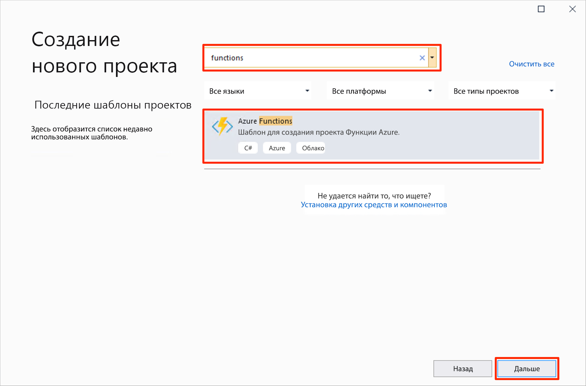
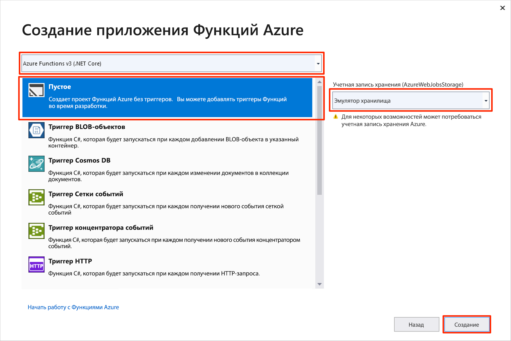
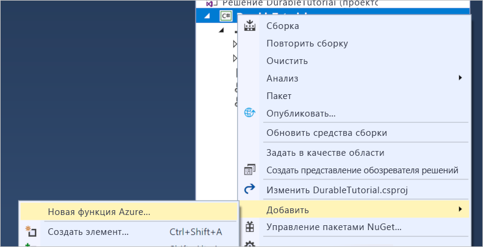
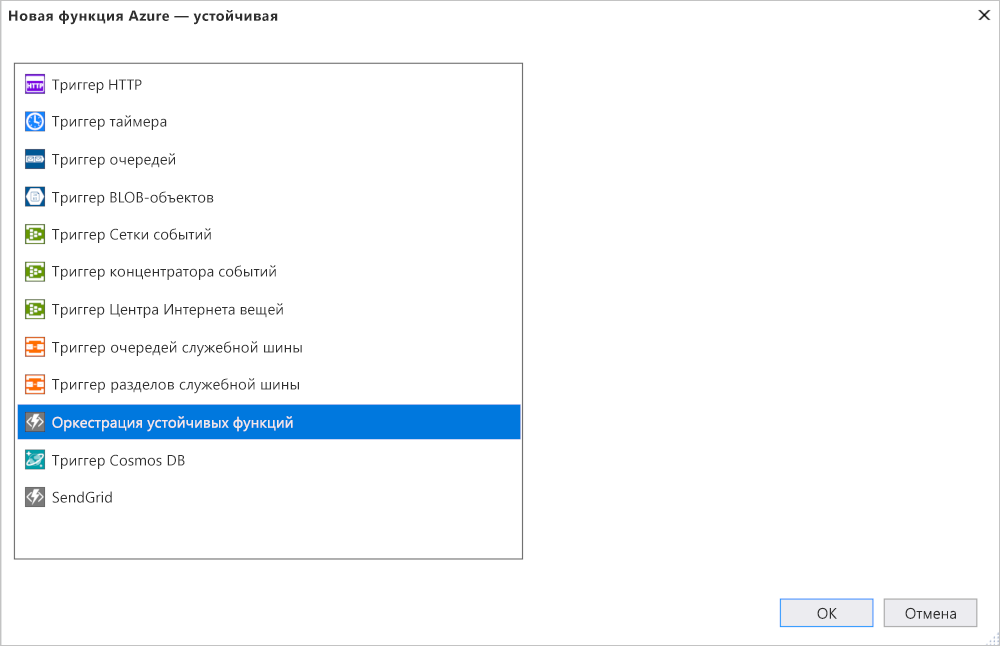

# <a name="create-your-first-durable-function-in-c"></a>Создание устойчивой функции в C\#

*Устойчивые функции* — это расширение [Функций Azure](../functions-overview.md), которое позволяет писать функции с отслеживанием состояния в беcсерверной среде. Расширение автоматически управляет состоянием, создает контрольные точки и перезагружается.

Изучив эту статью, вы научитесь использовать инструменты Visual Studio 2019 для решения "Функции Azure" и локально тестировать функцию hello world.  Эта функция организовывает и объединяет в цепочку вызовы других функций. Затем вы опубликуете код функции в Azure. Эти инструменты доступны как часть рабочей нагрузки Azure для разработки в Visual Studio 2019.


## <a name="prerequisites"></a>Предварительные требования

Для работы с этим руководством:

* Установите [Visual Studio 2019](https://azure.microsoft.com/downloads/). Убедитесь, что рабочая нагрузка **Разработка для Azure** также установлена.

* Убедитесь, что используются [новейшие средства Функций Azure](../functions-develop-vs.md#check-your-tools-version).

* Убедитесь, что [эмулятор службы хранилища Azure](../../storage/common/storage-use-emulator.md) установлен и запускается.

[!INCLUDE [quickstarts-free-trial-note](../../../includes/quickstarts-free-trial-note.md)]

## <a name="create-a-function-app-project"></a>Создание проекта приложения-функции

Шаблон Функций Azure создает проект, который затем можно опубликовать в приложении-функции в Azure. Приложение-функция позволяет группировать функции в логические единицы для развертывания и совместного использования ресурсов, а также управления ими.

1. В Visual Studio в меню **Файл** выберите **Создать** > **Проект**.

2. В диалоговом окне **Новый проект** выберите **Установленные**, разверните узел **Visual C#**  > **Облако**, выберите **Функции Azure**, укажите **имя** проекта и нажмите кнопку **ОК**. Имя приложения-функции должно быть допустимым в качестве пространства имен C#, поэтому не используйте символы подчеркивания, дефисы и другие символы, не являющиеся буквенно-цифровыми.

    

3. Используйте настройки, указанные в таблице под изображением.

    

    | Параметр      | Рекомендуемое значение  | ОПИСАНИЕ                      |
    | ------------ |  ------- |----------------------------------------- |
    | **Версия** | Функции Azure 2.x <br />(.NET Core) | Создает проект функции, использующий среду выполнения Функций Azure версии 2.x, которая поддерживает .NET Core. Функции Azure 1.x поддерживают .NET Framework. Дополнительные сведения см. в статье [Выбор целевых версий среды выполнения Функций Azure](../functions-versions.md).   |
    | **Шаблон** | Empty | Создает пустое приложение-функцию. |
    | **Учетная запись хранения**  | Эмулятор хранения | Учетная запись хранения необходима для управления состоянием устойчивой функции. |

4. Нажмите кнопку **ОК**, чтобы создать проект пустой функции. Этот проект содержит файлы базовой конфигурации, необходимые для выполнения функций.

## <a name="add-functions-to-the-app"></a>Добавление функций в приложение

В следующих действиях используется шаблон для создания устойчивого кода функции в проекте.

1. Щелкните правой кнопкой мыши проект в Visual Studio и выберите **Добавить** > **Новая функция Azure**.

    

2. Проверьте, выбирается ли **Функция Azure** из меню, и предоставьте файлу C# имя.  Нажмите кнопку **Добавить**.

3. Выберите шаблон **Оркестратор устойчивых функций — C#** и щелкните **ОК**.

      

Новая устойчивая функция добавлена в приложение.  Откройте новый файл .cs, чтобы просмотреть содержимое. Эта устойчивая функция является простым примером цепочки функции со следующими методами.  

| Метод | FunctionName | ОПИСАНИЕ |
| -----  | ------------ | ----------- |
| **`RunOrchestrator`** | `<file-name>` | Управляет устойчивой оркестрацией. В этом случае оркестрация запускается, создает список и добавляет в него результат трех вызовов функций.  Список возвращается после завершения вызовов трех функций. |
| **`SayHello`** | `<file-name>_Hello` | Функция возвращает hello. Это функция, которая организуется, содержит бизнес-логику. |
| **`HttpStart`** | `<file-name>_HttpStart` | [Функция, активируемая HTTP-запросом](../functions-bindings-http-webhook.md), которая запускает пример оркестрации и возвращает ответ состояния проверки. |

Созданный проект функции и устойчивую функцию можно протестировать на локальном компьютере.

## <a name="test-the-function-locally"></a>Локальное тестирование функции

Основные инструменты службы "Функции Azure" позволяют запускать проекты функций Azure на локальном компьютере разработчика. Вам будет предложено установить эти инструменты при первом запуске функции из Visual Studio.

1. Чтобы проверить работу функции, нажмите клавишу F5. Если будет предложено, примите запрос от Visual Studio на скачивание и установку основных инструментов службы Функции Azure (CLI). Кроме того, вам может понадобиться включить исключение брандмауэра, чтобы инструменты могли обрабатывать HTTP-запросы.

2. Скопируйте URL-адрес функции из выходных данных среды выполнения функций Azure.

    

3. Вставьте URL-адрес HTTP-запроса в адресную строку браузера и выполните запрос. Ниже показан ответ в браузере на локальный запрос GET, возвращаемый функцией:

    

    Полученный ответ является начальным результатом функции HTTP, что сообщает об успешном начале работы устойчивой оркестрации.  Он еще не конечный результат оркестрации.  Ответ включает несколько полезных URL-адреса.  Теперь запросите состояние оркестрации.

4. Скопируйте значение URL-адреса для `statusQueryGetUri` и, вставив его в адресную строку панели браузера, выполните запрос.

    Запрос будет запрашивать экземпляр оркестрации для состояния. Необходимо получить возможный ответ, который выглядит следующим образом.  Это показывает, что экземпляр выполнен и содержит выходные данные или результаты устойчивой функции.

    ```json
    {
        "instanceId": "d495cb0ac10d4e13b22729c37e335190",
        "runtimeStatus": "Completed",
        "input": null,
        "customStatus": null,
        "output": [
            "Hello Tokyo!",
            "Hello Seattle!",
            "Hello London!"
        ],
        "createdTime": "2018-11-08T07:07:40Z",
        "lastUpdatedTime": "2018-11-08T07:07:52Z"
    }
    ```

5. Нажмите клавиши **SHIFT+F5**, чтобы остановить отладку.

Убедитесь, что функция правильно работает на локальном компьютере. Затем опубликуйте проект в Azure.

## <a name="publish-the-project-to-azure"></a>Публикация проекта в Azure

Перед публикацией проекта убедитесь, что в вашей подписке Azure есть приложения-функция. Можно создать приложение-функцию непосредственно в Visual Studio.

[!INCLUDE [Publish the project to Azure](../../../includes/functions-vstools-publish.md)]

## <a name="test-your-function-in-azure"></a>Тестирование функции в Azure

1. Скопируйте базовый URL-адрес приложения-функции на странице профиля публикации. Замените часть `localhost:port` URL-адреса, который использовался при локальной проверке функции новым базовым URL-адресом.

    URL-адрес для вызова триггера HTTP устойчивой функции должен быть в следующем формате.

        http://<APP_NAME>.azurewebsites.net/api/<FUNCTION_NAME>_HttpStart

2. Вставьте этот URL-адрес HTTP-запроса в адресную строку браузера. При использовании опубликованного приложения ответ состояния должен быть таким же, как и ранее.

## <a name="next-steps"></a>Дополнительная информация

Visual Studio использовалась для создания и публикации устойчивого приложения-функции C#.

> [!div class="nextstepaction"]
> [Обзор устойчивых функций](durable-functions-concepts.md)
