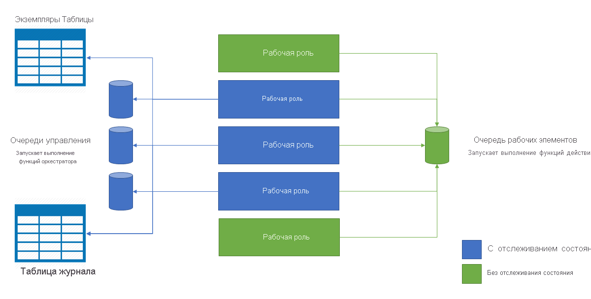

# <a name="performance-and-scale-in-durable-functions-azure-functions"></a>Производительность и масштабирование в устойчивых функциях (Функции Azure)

Чтобы оптимизировать производительность и масштабирование, важно понять уникальные характеристики масштабирования [устойчивых функций](durable-functions-overview.md).

Чтобы понять реакции на события масштабирования, необходимо изучить некоторые сведения о базовом поставщике службы хранилища Azure.

## <a name="history-table"></a>Таблица журнала

Таблица **журнала** — это таблица службы хранилища Azure, содержащая события журнала для всех экземпляров оркестрации внутри центра задач. Имя этой таблицы — указывается в формате журнала *TaskHubName*. При выполнении экземпляров в таблицу добавляются новые строки. Ключ раздела этой таблицы является производным от идентификатора экземпляра оркестрации. В большинстве случаев экземпляр идентификатора является случайным, что обеспечивает оптимальное распределение внутренних разделов в службе хранилища Azure.

Когда необходимо выполнить экземпляр оркестрации, в память загружаются нужные строки таблицы журнала. Затем эти *события журнала* воспроизводятся в коде функции оркестратора, чтобы вернуть их в предыдущее состояние из контрольной точки. Использование журнала выполнения для перестройки состояния, является путем, обусловленным [шаблоном источников событий](https://docs.microsoft.com/azure/architecture/patterns/event-sourcing).

## <a name="instances-table"></a>Экземпляры таблицы

Таблица **Instances** — это другая таблица службы хранилища Azure, которая содержит состояние всех объектов оркестрации и экземпляров сущностей в центре задач. При создании экземпляров в таблицу добавляются новые строки. Ключ секции этой таблицы — это идентификатор экземпляра оркестрации или ключ сущности, а ключ строки является фиксированной константой. Для каждого оркестрации или экземпляра сущности существует одна строка.

Эта таблица используется для удовлетворения запросов экземпляров из интерфейсов API `GetStatusAsync` (.NET) и `getStatus` (JavaScript), а также для [запроса состояния HTTP API](durable-functions-http-api.md#get-instance-status). В конечном итоге она поддерживается в соответствии с содержанием таблицы **Журнала**, упомянутой ранее. Использование отдельных таблиц хранилища Azure для эффективного удовлетворения операций запроса экземпляров, является путем, обусловленным [шаблоном CQRS](https://docs.microsoft.com/azure/architecture/patterns/cqrs).

## <a name="internal-queue-triggers"></a>Триггеры внутренней очереди

Функции оркестратора и действия активируются внутренними очередями в учетной записи хранения центра задач приложения-функции. Такое использование очередей обеспечивает надежные гарантии доставки сообщений, как минимум один раз. Существует два типа очередей в устойчивых функциях: очередь **управления** и **очередь рабочих элементов**.

### <a name="the-work-item-queue"></a>Очередь рабочих элементов

В устойчивых функциях на каждый центр задач приходится одна очередь рабочих элементов. Это основная очередь, и ее поведение аналогично любым другим очередям `queueTrigger` в Функциях Azure. Эта очередь используется для активации *функций действий* путем вывода только одного сообщения за один раз. Каждое из этих сообщений содержит входные данные функции действия и дополнительные метаданные, например, какую функцию выполнять. Когда приложение устойчивых функций масштабируется до нескольких виртуальных машин, все они конкурируют за получение работы из очереди рабочих элементов.

### <a name="control-queues"></a>Очередь управления

В устойчивых функциях на каждый центр задач имеется несколько *очередей управления*. *Очередь управления* является более сложной, чем очередь рабочих элементов. Очереди управления используются для активации Orchestrator с отслеживанием состояния и функций сущностей. Поскольку экземпляры Orchestrator и Entity Function являются одиночными экземплярами с отслеживанием состояния, невозможно использовать конкурирующие модели потребителей для распределения нагрузки между виртуальными машинами. Вместо этого сообщения Orchestrator и Entity распределяются по очередям управления. Дополнительные сведения об этом поведении можно найти в последующих разделах.

Очереди управления содержат различные типы сообщений жизненного цикла оркестрации. Примеры включают [сообщения об управлении оркестрацией](durable-functions-instance-management.md), сообщения *ответа* функции действия и сообщения таймера. За один опрос из очереди управления может быть удалено до 32 сообщений. Эти сообщения содержат полезные данные, а также метаданные, включая экземпляр оркестрации, для которого они предназначены. Если для одного и того же экземпляра оркестрации предназначены несколько сообщений удаленных из очереди, они будут обрабатываться как пакет.

### <a name="queue-polling"></a>Опрос очередей

Расширение устойчивых задач реализует случайный алгоритм экспоненциального отката, чтобы снизить воздействие опроса на очередь бездействия на стоимость транзакций хранилища. При обнаружении сообщения среда выполнения немедленно проверяет наличие другого сообщения. Если сообщение не найдено, оно ждет некоторого времени, прежде чем повторить попытку. После последующей неудачной попытки получить сообщение очереди время ожидания продолжит увеличиваться до достижения максимального времени ожидания, которое по умолчанию равно 30 секундам.

Максимальная задержка опроса настраивается с помощью свойства `maxQueuePollingInterval` в [файле host. JSON](../functions-host-json.md#durabletask). Установка для этого свойства более высокого значения может привести к увеличению задержек при обработке сообщения. Более высокие задержки будут ожидаться только после периодов бездействия. Установка этого свойства в более низком значении может привести к увеличению затрат на хранение данных из-за повышенных транзакций хранилища.

> [!NOTE]
> При выполнении в планах использования и Premium для функций Azure [контроллер масштабирования функций Azure](../functions-scale.md#how-the-consumption-and-premium-plans-work) будет опрашивать каждый элемент управления и очередь рабочих элементов каждые 10 секунд. Этот дополнительный опрос необходим для определения времени активации экземпляров приложения-функции и принятия решений о масштабировании. На момент написания статьи этот интервал 10 секунд является постоянным и не может быть настроен.

## <a name="storage-account-selection"></a>Выбор учетной записи хранения

Очереди, таблицы и BLOB-объекты, используемые Устойчивые функции, создаются в настроенной учетной записи хранения Azure. Используемую учетную запись можно указать с помощью параметра `durableTask/storageProvider/connectionStringName` (или `durableTask/azureStorageConnectionStringName` параметра в Устойчивые функции 1. x) в файле **Host. JSON** .

### <a name="durable-functions-2x"></a>Устойчивые функции 2. x

```json
{
  "extensions": {
    "durableTask": {
      "storageProvider": {
        "connectionStringName": "MyStorageAccountAppSetting"
      }
    }
  }
}
```

### <a name="durable-functions-1x"></a>Устойчивые функции 1. x

```json
{
  "extensions": {
    "durableTask": {
      "azureStorageConnectionStringName": "MyStorageAccountAppSetting"
    }
  }
}
```

Если значение не указано, учетная запись `AzureWebJobsStorage` используется по умолчанию. Однако, для рабочих нагрузок, требующих высокой производительности, рекомендуется настроить учетную запись хранения, кроме используемой по умолчанию. Устойчивые функции сильно полагаются на хранилище Azure и используют отдельную учетную запись хранения для изоляции использования хранилища устойчивых функций узлом функций Azure.

## <a name="orchestrator-scale-out"></a>Развертывание оркестратора

Функции действий не отслеживают состояние и автоматически масштабируются путем добавления виртуальных машин. Функции и сущности Orchestrator, с другой стороны, *секционированы* по одной или нескольким очередям управления. Число очередей управления определено в файле **host.json**. В следующем примере фрагмент кода Host. JSON задает свойство `durableTask/storageProvider/partitionCount` (или `durableTask/partitionCount` в Устойчивые функции 1. x) для `3`.

### <a name="durable-functions-2x"></a>Устойчивые функции 2. x

```json
{
  "extensions": {
    "durableTask": {
      "storageProvider": {
          "partitionCount": 3
      }
    }
  }
}
```

### <a name="durable-functions-1x"></a>Устойчивые функции 1. x

```json
{
  "extensions": {
    "durableTask": {
      "partitionCount": 3
    }
  }
}
```

Центр задач может быть настроен в диапазоне от 1 до 16 секций. Если значение не задано, по умолчанию количеству секций соответствует значение **4**.

При развертывании нескольких экземпляров узлов функции (обычно на разных виртуальных машинах) каждый экземпляр блокируется на одной из очередей управления. Эти блокировки реализуются внутренне как аренды хранилища BLOB-объектов и гарантируют, что экземпляр оркестрации или сущность выполняются только на одном экземпляре узла за раз. Если в центре задач настроено три очереди управления, то экземпляры оркестрации и сущности можно распределить по нескольким виртуальным машинам. Для повышения емкости выполнения функции действия можно добавить дополнительные виртуальные машины.

На схеме ниже показано взаимодействие узла Функций Azure с сущностями хранилища в развернутой среде.



Как показано на предыдущей схеме, все виртуальные машины могут конкурировать за сообщения в очереди рабочих элементов. Тем не менее получать сообщения из очередей управления могут только три виртуальные машины, и каждая из них блокирует одиночную очередь управления.

Экземпляры и сущности оркестрации распределяются по всем экземплярам очереди управления. Распределение выполняется путем хэширования идентификатора экземпляра оркестрации или имени сущности и пары ключей. Идентификаторы экземпляров оркестрации по умолчанию — это случайные идентификаторы GUID, гарантирующие, что экземпляры равномерно распределяются по всем очередям управления.

Как правило, функции оркестратора должны быть упрощенными, поэтому они не должны требовать больших вычислительных мощностей. Поэтому нет необходимости создавать большое количество разделов очереди управления, чтобы получить высокую пропускную способность для согласований. Большая часть работы должна выполняться в функциях действий без отслеживания состояния, которые можно масштабировать бесконечно.

## <a name="auto-scale"></a>Автомасштабирование

Как и во всех функциях Azure, выполняющихся в планах потребления и эластичных баз данных Premium, Устойчивые функции поддерживает автоматическое масштабирование через [контроллер масштабирования функций Azure](../functions-scale.md#runtime-scaling). Контроллер масштабирования занимается мониторингом задержки всех очередей, периодически выполняя команды _peek_. Основываясь на задержках просматриваемых сообщений, контроллер масштабирования будет решать, следует ли добавлять или удалять виртуальные машины.

Если контроллер масштабирования определит что задержка от сообщения очереди управления слишком большая, он будет увеличивать количество экземпляров виртуальных машин пока она не вернется до приемлемого уровня или достигнет максимального количества разделов очереди управления. Аналогичным образом контроллер масштабирования будет непрерывно добавлять экземпляры виртуальных машин в случае если задержки в очереди на рабочих элементах слишком большие, независимо от количества разделов.

> [!NOTE]
> Начиная с Устойчивые функции 2,0, приложения-функции можно настроить для запуска в конечных точках службы, защищенных с помощью виртуальной сети, в плане эластичных баз данных Premium. В этой конфигурации Устойчивые функции триггеры запускают запросы на масштабирование вместо контроллера масштабирования.

## <a name="thread-usage"></a>Использование потока

Функции оркестратора выполняются в одном потоке, чтобы убедится, что выполнение можно детерминировать на множество воспроизведений. Так как выполнение является однопоточным, очень важно, чтобы потоки функции оркестратора по любой причине не выполняли задачи, интенсивно использующие ЦП, операции ввода-вывода или блокировку. Все операции, которым может потребоваться ввод-вывод, блокировка или несколько потоков, должны выполняться с помощью функций действий.

Функции действий имеют такие же реакции на события, как и регулярные активируемые очередью функции. Они могут безопасно выполнять операции ввода-вывода, операции с интенсивным потреблением ЦП и использовать несколько потоков. Так как триггеры действия не отслеживают состояние, они могут свободно масштабироваться на неограниченное количество виртуальных машин.

Функции сущностей также выполняются в одном потоке, и операции обрабатываются один раз во время. Однако функции сущностей не имеют ограничений на тип кода, который может быть выполнен.

## <a name="concurrency-throttles"></a>Регулирование параллелизма

Функции Azure поддерживают параллельное выполнение нескольких функций в рамках одного экземпляра приложения. Параллельное выполнение помогает улучшить параллелизм и минимизировать число холодного запуска, с которым со времени столкнется стандартное приложение. Однако высокая степень параллелизма может исчерпать системные ресурсы виртуальной машины, такие как сетевые подключения или доступная память. В зависимости от потребностей приложения функции, может потребоваться отрегулировать параллелизм для каждого экземпляра, чтобы избежать возможности исчерпания памяти в ситуациях с высокой нагрузкой.

Ограничения параллелизма действий, Orchestrator и функции сущности можно настроить в файле **Host. JSON** . Соответствующие параметры `durableTask/maxConcurrentActivityFunctions` для функций действий и `durableTask/maxConcurrentOrchestratorFunctions` для функций Orchestrator и Entity.

### <a name="functions-20"></a>Функции 2,0

```json
{
  "extensions": {
    "durableTask": {
      "maxConcurrentActivityFunctions": 10,
      "maxConcurrentOrchestratorFunctions": 10
    }
  }
}
```

### <a name="functions-1x"></a>Функции 1.x

```json
{
  "durableTask": {
    "maxConcurrentActivityFunctions": 10,
    "maxConcurrentOrchestratorFunctions": 10
  }
}
```

В предыдущем примере не более 10 Orchestrator или функций сущностей и 10 функций действий могут выполняться одновременно на одной виртуальной машине. Если значение не указано, количество одновременных операций, а также выполнения функций Orchestrator или Entity может быть ограничено в 10 раз количество ядер на виртуальной машине.

> [!NOTE]
> Эти параметры полезны для управления памятью и использованием ЦП на одной виртуальной машине. Однако при масштабировании на нескольких виртуальных машинах каждая виртуальная машина имеет свой набор ограничений. Эти параметры нельзя использовать для управления параллелизмом на глобальном уровне.

## <a name="extended-sessions"></a>Расширенные сеансы

Расширенные сеансы — это параметр, который сохраняет согласованность и сущности в памяти даже после завершения обработки сообщений. Распространенным эффектом от включения расширенных сеансов является сокращение операций ввода-вывода с использованием учетной записи службы хранения Azure и повсеместное улучшение пропускной способности.

Вы можете включить расширенные сеансы, задав для параметра `durableTask/extendedSessionsEnabled` значение `true` в файле **Host. JSON** . Параметр `durableTask/extendedSessionIdleTimeoutInSeconds` может использоваться для управления длительностью бездействующего сеанса в памяти:

**Функции 2,0**
```json
{
  "extensions": {
    "durableTask": {
      "extendedSessionsEnabled": true,
      "extendedSessionIdleTimeoutInSeconds": 30
    }
  }
}
```

**Функции 1,0**
```json
{
  "durableTask": {
    "extendedSessionsEnabled": true,
    "extendedSessionIdleTimeoutInSeconds": 30
  }
}
```

Существует два возможных недостатка этого параметра, которые следует учитывать:

1. Это общее увеличение использования памяти приложением функции.
2. При наличии большого количества одновременных, кратковременных или непродолжительных выполнений функций Orchestrator или Entity функция может привести к общему снижению пропускной способности.

Например, если `durableTask/extendedSessionIdleTimeoutInSeconds` имеет значение 30 секунд, то кратковременная функция Orchestrator или функции объекта, которая выполняется менее 1 секунды, по-прежнему занимает 30 секунд. Он также учитывает `durableTask/maxConcurrentOrchestratorFunctions` квоты, упомянутые ранее, что может препятствовать запуску других функций Orchestrator или Entity.

Конкретные эффекты расширенных сеансов в Orchestrator и функциях сущностей описаны в следующих разделах.

### <a name="orchestrator-function-replay"></a>Повторение функции оркестратора

Как было упомянуто ранее, функции оркестратора воспроизводятся с помощью содержимого таблицы **Журнал**. По умолчанию код функции оркестратора воспроизводится каждый раз, когда пакет сообщений удаляется из очереди управления. Если расширенные сеансы включены, экземпляры функций Orchestrator удерживаются в памяти дольше, а новые сообщения могут обрабатываться без полного воспроизведения журнала.

Повышение производительности расширенных сеансов чаще всего наблюдается в следующих ситуациях:

* При одновременном выполнении ограниченного числа экземпляров оркестрации.
* Когда оркестрации имеет большое количество последовательных действий (например, сотни вызовов функций действий), которые выполняются быстро.
* При развертывании и разрешении большого количества действий, которые выполняются одновременно.
* Когда функции Orchestrator должны обрабатывать большие сообщения или выполнять обработку данных, интенсивно использующих ЦП.

Во всех остальных ситуациях обычно нет наблюдаемых улучшений производительности для функций Orchestrator.

> [!NOTE]
> Эти параметры следует использовать только после того, как функция оркестратора будет полностью разработана и протестирована. Интенсивное поведение воспроизведения по умолчанию может пригодиться при обнаружении нарушений [ограничений кода функции Orchestrator](durable-functions-code-constraints.md) во время разработки, поэтому по умолчанию отключено.

### <a name="entity-function-unloading"></a>Выгрузка функции сущности

Функции сущности обрабатывают до 20 операций в одном пакете. Как только сущность заканчивает обработку пакета операций, она сохраняет свое состояние и выгружает из памяти. Можно отложить выгрузку сущностей из памяти с помощью параметра Расширенные сеансы. Сущности продолжают сохранять свои изменения состояния, как и раньше, но остаются в памяти в течение заданного периода времени, чтобы сократить количество загрузок из службы хранилища Azure. Это сокращение нагрузки из службы хранилища Azure может повысить общую пропускную способность часто используемых сущностей.

## <a name="performance-targets"></a>Цели анализа производительности

Планируя использовать устойчивые функции в рабочем приложении, на раннем этапе планирования необходимо учесть требования к производительности. В этом разделе рассматриваются некоторое основные сценарии использования и ожидаемое максимальной число пропускной способности.

* **Выполнение последовательного действия**. В этом сценарии описывается функция оркестратора, которая по очереди выполняет ряд функций действия. Максимально похожим на этот сценарий является [цепочка функции](durable-functions-sequence.md).
* **Параллельное выполнение одного действия**. В этом сценарии описано действие оркестратора, которое выполняет множество функций действий параллельно, с помощью шаблона [развертывания, слияния](durable-functions-cloud-backup.md).
* **Параллельная обработка ответа**. Этот сценарий является второй половиной шаблона [развертывания, слияния](durable-functions-cloud-backup.md). Этот раздел посвящен производительность слияния. Важно отметить, что в отличие от развертывания, слияние создается единым экземпляром функции а затем может быть запущено на единой виртуальной машине.
* **Обработка внешних событий**. В этом сценарии представлено единый экземпляр функции оркестратора, который последовательно ожидает [внешних событий](durable-functions-external-events.md).
* **Обработка операций сущности**. Этот сценарий проверяет, насколько быстро [сущность с одним счетчиком](durable-functions-entities.md) может обработать постоянный поток операций.

> [!TIP]
> В отличие от развертывания, операции слияния могут размещаться только на одной виртуальной машине. Если ваше приложение использует шаблоны развертывания и слияния, и вы беспокоитесь через производительность развертывания, необходимо рассмотреть разделение действия функции развертывания на несколько [вложенных оркестраций](durable-functions-sub-orchestrations.md).

В следующей таблице показаны ожидаемые *максимальные* показателей пропускной способности для сценариев, описанных ранее. Термин "экземпляр" относиться к единому экземпляру функции оркестратора, запущенной на небольшом экземпляре виртуальной машины ([серии A1](../../virtual-machines/windows/sizes-previous-gen.md#a-series)) в службе приложений Azure. Во всех случаях предполагается, что [расширенные сеансы](#orchestrator-function-replay) включены. Фактические результаты могут варьировать, в зависимости от ЦП или ввода-вывода, выполняемых кодом функции.

| Сценарий | Максимальная пропускная способность |
|-|-|
| Выполнение последовательного действия | 5 действий на экземпляр в секунду |
| Параллельное выполнение одного действия (при развертывании) | 100 действий на экземпляр в секунду |
| Параллельная обработка ответа (при слиянии) | 150 ответов на экземпляр в секунду |
| Обработка внешних событий | 50 событий на экземпляр в секунду |
| Обработка операций сущности | 64 операций в секунду |

> [!NOTE]
> Эти номера являются текущими по сравнению с выпуском расширения устойчивых функций v1.4.0 (GA). Со временем эти числа могут изменятся (по мере роста функции и оптимизации).

Если вы не видите показателей пропускной способности, и ваш ЦП и использование памяти отображаются в работоспособном состоянии, проверьте, описаны ли эти случаи в разделе [рекомендации по устранению неполадок](../../storage/common/storage-monitoring-diagnosing-troubleshooting.md#troubleshooting-guidance). Расширение устойчивых функций может существенно увеличить нагрузку на учетную запись службы хранения Azure, что при достаточно высоких загрузках может привести к регулированию учетной записи.

## <a name="next-steps"></a>Дополнительная информация

> [!div class="nextstepaction"]
> [Сведения об аварийном восстановлении и географическом распределении](durable-functions-disaster-recovery-geo-distribution.md)
