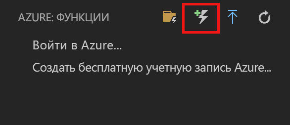
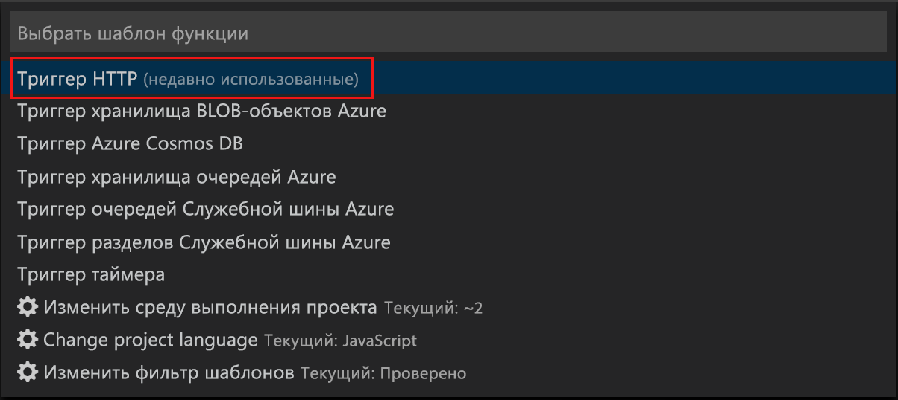
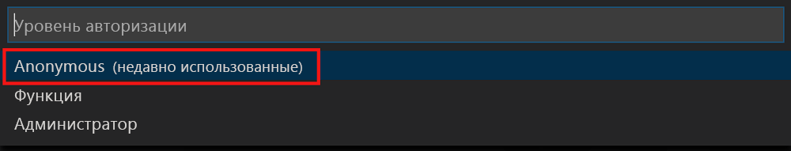
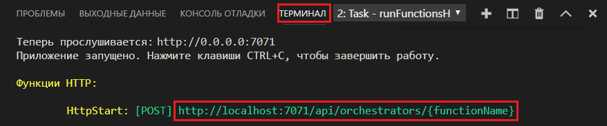

# <a name="create-your-first-durable-function-in-javascript"></a>Создание устойчивой функции с помощью JavaScript

*Устойчивые функции* — это расширение [Функций Azure](../functions-overview.md), которое позволяет писать функции с отслеживанием состояния в беcсерверной среде. Расширение автоматически управляет состоянием, создает контрольные точки и перезагружается.

В этой статье описано, как использовать расширение Функций Azure в Visual Studio Code, чтобы локально создать и тестировать устойчивую функцию hello world.  Эта функция будет организовывать и объединять в цепочку вызовы других функций. Затем вы опубликуете код функции в Azure.


## <a name="prerequisites"></a>Предварительные требования

Для работы с этим руководством:

* Установите [Visual Studio Code](https://code.visualstudio.com/download).

* Убедитесь, что используются [новейшие средства Функций Azure](../functions-develop-vs.md#check-your-tools-version).

* Убедитесь, что на компьютере с ОС Windows установлен и запущен [эмулятор службы хранилища Azure](../../storage/common/storage-use-emulator.md). На компьютере с ОС Mac или Linux необходимо использовать саму учетную запись хранения Azure.

* Убедитесь, что установлена версия [Node.js](https://nodejs.org/) 8.0 или более поздняя.

[!INCLUDE [quickstarts-free-trial-note](../../../includes/quickstarts-free-trial-note.md)]

[!INCLUDE [functions-install-vs-code-extension](../../../includes/functions-install-vs-code-extension.md)]

[!INCLUDE [functions-create-function-app-vs-code](../../../includes/functions-create-function-app-vs-code.md)]

## <a name="install-the-durable-functions-npm-package"></a>Установка пакета npm для расширения "Устойчивые функции"

1. Установите пакет npm `durable-functions`, выполнив команду `npm install durable-functions` в корневом каталоге приложения-функции.

## <a name="create-a-starter-function"></a>Создание функции запуска

Сначала создайте функцию, активируемую протоколом HTTP, которая запускает оркестрацию устойчивых функций.

1. Выберите **Azure: Functions** (Azure: Функции) и щелкните значок Create Function (Создать функцию).

    

2. Укажите папку со своим проектом приложения-функции и выберите шаблон функции **HTTP trigger** (Триггер HTTP).

    

3. Введите `HttpStart`, чтобы задать имя функции и нажмите клавишу ВВОД, после чего укажите способ проверки подлинности **Anonymous** (Анонимно).

    

    С помощью шаблона функции, активируемой HTTP-запросом, будет создана функция на выбранном вами языке.

4. Замените файл index.js поданным ниже кодом JavaScript.

    [!code-javascript[Main](~/samples-durable-functions/samples/javascript/HttpStart/index.js)]

5. Замените файл function.json поданным ниже кодом JSON.

    [!code-json[Main](~/samples-durable-functions/samples/javascript/HttpStart/function.json)]

Мы создали точку входа в нашу устойчивую функцию. Теперь добавим оркестратор.

## <a name="create-an-orchestrator-function"></a>Создание функции оркестратора

Теперь нужно создать еще одну функцию, которая будет работать в качестве оркестратора. Для удобства мы используем шаблон функции для триггеров HTTP. Код самой функции заменяется кодом оркестратора.

1. Повторите шаги из предыдущего раздела, чтобы создать вторую функцию с помощью шаблона триггера HTTP. Дайте этой функции имя `OrchestratorFunction`.

2. Откройте файл index.js новой функции и замените его содержимое следующим кодом.

    [!code-json[Main](~/samples-durable-functions/samples/javascript/E1_HelloSequence/index.js)]

3. Откройте файл function.json и замените его следующим кодом JSON.

    [!code-json[Main](~/samples-durable-functions/samples/javascript/E1_HelloSequence/function.json)]

Мы добавили оркестратор для координации функций действий. Теперь добавим функцию действия, на которое делается ссылка.

## <a name="create-an-activity-function"></a>Создание функции действия

1. Повторите шаги из предыдущих разделов, чтобы создать третью функцию с помощью шаблона триггера HTTP. Дайте этой функции имя `E1_SayHello`.

2. Откройте файл index.js новой функции и замените его содержимое следующим кодом.

    [!code-javascript[Main](~/samples-durable-functions/samples/javascript/E1_SayHello/index.js)]

3. Замените файл function.json поданным ниже кодом JSON.

    [!code-json[Main](~/samples-durable-functions/samples/csx/E1_SayHello/function.json)]

Теперь мы добавили все компоненты, необходимые для начала оркестрации и объединения в цепочку функций действий.

## <a name="test-the-function-locally"></a>Локальное тестирование функции

Основные инструменты службы "Функции Azure" позволяют запускать проекты функций Azure на локальном компьютере разработчика. Вам будет предложено установить эти инструменты при первом запуске функции из Visual Studio Code.  

1. На компьютере с ОС Windows запустите эмулятор службы хранилища Azure и убедитесь, что свойству **AzureWebJobsStorage** в local.settings.json присваивается значение `UseDevelopmentStorage=true`. 

    Если используется Storage Emulator 5.8, убедитесь, что для свойства **AzureWebJobsSecretStorageType** в файле local.settings.json задано значение `files`. На компьютере с ОС Mac или Linux свойству **AzureWebJobsStorage** необходимо задать значение строки подключения существующей учетной записи хранения Azure. Далее в этой статье описывается создание учетной записи хранения.

2. Чтобы протестировать созданную функцию, установите точку останова в коде функции и нажмите клавишу F5 для запуска проекта приложения-функции. Выходные данные основных инструментов отображаются на панели **Terminal** (Терминал). Если вы впервые используете устойчивые функции, расширение устойчивых функций установлено, и сборка может занять несколько секунд.

    > [!NOTE]
    > Для расширения "Устойчивые функции" в JavaScript требуется версия расширения **Microsoft.Azure.WebJobs.Extensions.DurableTask** **1.7.0** или более поздняя. Выполните следующую команду из корневой папки приложения-функции Azure, чтобы установить расширение "Устойчивые функции": `func extensions install -p Microsoft.Azure.WebJobs.Extensions.DurableTask -v 1.7.0`

3. На панели **Terminal** (Терминал) скопируйте URL-адрес конечной точки функции, активируемой HTTP-запросом.

    

4. Замените `{functionName}` на `OrchestratorFunction`.

5. Отправьте запрос HTTP POST к конечной точке URL-адреса, используя средства наподобие [Postman](https://www.getpostman.com/) или [cURL](https://curl.haxx.se/).

   Полученный ответ является начальным результатом функции HTTP, что сообщает об успешном начале работы устойчивой оркестрации. Он еще не конечный результат оркестрации. Ответ включает несколько полезных URL-адреса. Теперь запросите состояние оркестрации.

6. Скопируйте значение URL-адреса для `statusQueryGetUri`, вставьте его в адресную строку панели браузера и выполните запрос. Кроме того, вы можете воспользоваться Postman для выдачи запроса GET.

   Запрос будет запрашивать экземпляр оркестрации для состояния. Вам нужно получить итоговый ответ, который показывает, что экземпляр выполнен и содержит выходные данные или результаты устойчивой функции. Он выглядит следующим образом: 

    ```json
    {
        "instanceId": "d495cb0ac10d4e13b22729c37e335190",
        "runtimeStatus": "Completed",
        "input": null,
        "customStatus": null,
        "output": [
            "Hello Tokyo!",
            "Hello Seattle!",
            "Hello London!"
        ],
        "createdTime": "2018-11-08T07:07:40Z",
        "lastUpdatedTime": "2018-11-08T07:07:52Z"
    }
    ```

7. В VS Code нажмите клавиши **Shift + F5**, чтобы остановить отладку.

Убедившись, что функция выполняется правильно на локальном компьютере, опубликуйте проект в Azure.

[!INCLUDE [functions-create-function-app-vs-code](../../../includes/functions-sign-in-vs-code.md)]

[!INCLUDE [functions-publish-project-vscode](../../../includes/functions-publish-project-vscode.md)]

## <a name="test-your-function-in-azure"></a>Тестирование функции в Azure

1. Скопируйте URL-адрес HTTP-триггера на панели **Output** (Выходные данные). URL-адрес для вызова функции, активируемой HTTP-запросом, должен быть указан в таком формате:

        http://<functionappname>.azurewebsites.net/orchestrators/<functionname>

2. Вставьте этот URL-адрес HTTP-запроса в адресную строку браузера. При использовании опубликованного приложения ответ состояния должен быть таким же, как и ранее.

## <a name="next-steps"></a>Дополнительная информация

Вы создали и опубликовали приложение устойчивой функции JavaScript с помощью Visual Studio Code.

> [!div class="nextstepaction"]
> [Дополнительные сведения о распространенных шаблонах устойчивых функций](durable-functions-concepts.md)
