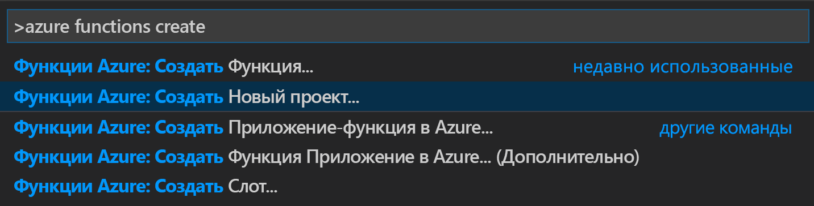
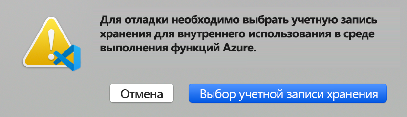
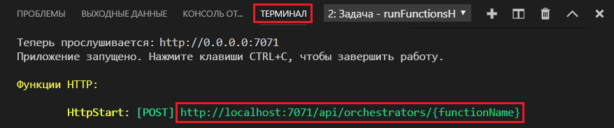

# <a name="create-your-first-durable-function-in-javascript"></a>Создание устойчивой функции с помощью JavaScript

*Устойчивые функции* — это расширение [Функций Azure](../functions-overview.md), которое позволяет писать функции с отслеживанием состояния в беcсерверной среде. Расширение автоматически управляет состоянием, создает контрольные точки и перезагружается.

[!INCLUDE [v1-note](../../../includes/functions-durable-v1-tutorial-note.md)]

В этой статье описано, как использовать расширение Функций Azure в Visual Studio Code, чтобы локально создать и тестировать устойчивую функцию hello world.  Эта функция будет организовывать и объединять в цепочку вызовы других функций. Затем вы опубликуете код функции в Azure.


## <a name="prerequisites"></a>Предварительные требования

Для работы с этим руководством сделайте следующее:

* Установите [Visual Studio Code](https://code.visualstudio.com/download).

* Установите расширение [Функции Azure](https://marketplace.visualstudio.com/items?itemName=ms-azuretools.vscode-azurefunctions) для VS Code.

* Убедитесь, что используется последняя версия [Azure Functions Core Tools](../functions-run-local.md).

* Для работы Устойчивых функций требуется учетная запись хранения Azure. Вам понадобится подписка Azure.

* Убедитесь, что установлена версия [Node.js](https://nodejs.org/) 10.x или 12.x.

[!INCLUDE [quickstarts-free-trial-note](../../../includes/quickstarts-free-trial-note.md)]

## <a name="create-your-local-project"></a><a name="create-an-azure-functions-project"></a>Создание локального проекта 

В этом разделе вы используете Visual Studio Code. чтобы создать локальный проект Функций Azure. 

1. В Visual Studio Code нажмите клавишу F1 (или CTRL/CMD+SHIFT+P), чтобы открыть палитру команд. В палитре команд найдите и щелкните `Azure Functions: Create New Project...`.

    

1. Выберите расположение пустой папки для проекта и нажмите кнопку **Выбрать**.

1. Следуя инструкциям, введите следующие сведения:

    | prompt | Значение | Описание |
    | ------ | ----- | ----------- |
    | Select a language for your function app project (Выберите язык для проекта приложения-функции) | JavaScript | Создание локального проекта службы "Функции" для Node.js |
    | Выбор версии | Функции Azure версии 3 | Этот параметр отображается, только если вы еще не установили Core Tools. В этом случае Core Tools устанавливается при первом запуске приложения. |
    | Select a template for your project's first function (Выберите шаблон для первой функции вашего проекта) | Пропустить | |
    | Select how you would like to open your project (Выберите, как вы хотели бы открыть свой проект) | Открыть в текущем окне | Повторно открывает VS Code в выбранной папке. |

При необходимости Visual Studio Code устанавливает Azure Functions Core Tools. Кроме того, создается проект приложения-функции в папке. Проект будет содержать файлы конфигурации [host.json](../functions-host-json.md) и [local.settings.json](../functions-run-local.md#local-settings-file).

В корневой папке также создается файл package.json.

### <a name="enable-azure-functions-v2-compatibility-mode"></a>Включение режима совместимости с Функциями Azure версии 2

Сейчас для Устойчивых функций JavaScript требуется включить режим совместимости с Функциями Azure версии 2.

1. Откройте файл *local.settings.json*, чтобы изменить параметры, используемые при локальном выполнении приложения.

1. Добавьте параметр с именем `FUNCTIONS_V2_COMPATIBILITY_MODE` и значением `true`.

    ```json
    {
        "IsEncrypted": false,
        "Values": {
            "AzureWebJobsStorage": "",
            "FUNCTIONS_WORKER_RUNTIME": "node",
            "FUNCTIONS_V2_COMPATIBILITY_MODE": "true"
        }
    }
    ```

## <a name="install-the-durable-functions-npm-package"></a>Установка пакета npm для расширения "Устойчивые функции"

Для работы с Устойчивыми функциями в приложении-функции Node.js используется библиотека с именем `durable-functions`.

1. Используйте меню *Представление* или сочетание клавиш CTRL+SHIFT+', чтобы открыть новый терминал в VS Code.

1. Установите пакет npm `durable-functions`, выполнив команду `npm install durable-functions` в корневом каталоге приложения-функции.

## <a name="creating-your-functions"></a>Создание функций

В самом простом приложении Устойчивых функций есть три функции:

* *функция оркестратора* — описывает рабочий процесс и координирует другие функции;
* *функция действия* — вызывается функцией оркестратора, выполняет работу и при необходимости возвращает значение;
* *функция клиента* — обычная функция Azure, которая запускает функцию оркестратора. В этом примере используется функция, активируемая по HTTP.

### <a name="orchestrator-function"></a>Функция оркестратора

Для создания кода устойчивой функции в проекте используется шаблон.

1. В палитре команд найдите и щелкните `Azure Functions: Create Function...`.

1. Следуя инструкциям, введите следующие сведения:

    | prompt | Значение | Описание |
    | ------ | ----- | ----------- |
    | Выбор шаблона для функции | Оркестратор Устойчивых функций | Создание оркестрации Устойчивых функций |
    | Provide a function name (Укажите имя функции) | HelloOrchestrator | Имя устойчивой функции |

Итак, вы добавили оркестратор для координации функций действия. Откройте файл *HelloOrchestrator/index.js* и изучите функцию оркестратора. Каждый вызов `context.df.callActivity` приводит к вызову функции действия с именем `Hello`.

Теперь нужно добавить функцию действия `Hello`, на которую ведет эта ссылка.

### <a name="activity-function"></a>Функция действия

1. В палитре команд найдите и щелкните `Azure Functions: Create Function...`.

1. Следуя инструкциям, введите следующие сведения:

    | prompt | Значение | Описание |
    | ------ | ----- | ----------- |
    | Выбор шаблона для функции | Действие Устойчивых функций | Создание функции действия |
    | Provide a function name (Укажите имя функции) | Привет | Имя функции действия |

Теперь вы добавили функцию действия `Hello`, которая вызывается оркестратором. Откройте файл *Hello/index.js* и убедитесь, что эта функция принимает имя в качестве входных данных и возвращает приветствие. Функция действия отвечает за все реальные действия, включая обращение к базе данных и выполнение вычислений.

Наконец, нужно добавить активируемую вызовом HTTP функцию, которая запускает оркестратор.

### <a name="client-function-http-starter"></a>Функция клиента (начальный объект HTTP)

1. В палитре команд найдите и щелкните `Azure Functions: Create Function...`.

1. Следуя инструкциям, введите следующие сведения:

    | prompt | Значение | Описание |
    | ------ | ----- | ----------- |
    | Выбор шаблона для функции | Начальный объект HTTP Устойчивых функций | Создание функции начального объекта HTTP |
    | Provide a function name (Укажите имя функции) | DurableFunctionsHttpStart | Имя функции действия |
    | Уровень авторизации | Анонимные | Для примера разрешите вызывать функцию без проверки подлинности. |

Итак, вы добавили активируемую вызовом HTTP функцию, которая запускает оркестратор. Откройте файл *DurableFunctionsHttpStart/index.js* и убедитесь, что эта функция запускает оркестрацию с помощью `client.startNew`. После этого она должна вызывать `client.createCheckStatusResponse`, чтобы вернуть ответ HTTP с URL-адресами, которые позволяют отслеживать новую оркестрацию и управлять ею.

Теперь у вас есть готовое приложение Устойчивых функций, которое можно выполнить локально и развернуть в Azure.

## <a name="test-the-function-locally"></a>Локальное тестирование функции

Основные инструменты службы "Функции Azure" позволяют запускать проекты функций Azure на локальном компьютере разработчика. Вам будет предложено установить эти инструменты при первом запуске функции из Visual Studio Code.

1. Чтобы протестировать созданную функцию, установите точку останова в коде функции действия `Hello` (файл *Hello/index.js*). Нажмите клавишу F5 или выберите действие `Debug: Start Debugging` на палитре команд, чтобы запустить проект приложения-функции. Выходные данные основных инструментов отображаются на панели **Terminal** (Терминал).

    > [!NOTE]
    > См. сведения об отладке в руководстве по [диагностике Устойчивых функций](durable-functions-diagnostics.md#debugging).

1. Для выполнения Устойчивых функций требуется учетная запись хранения Azure. Когда VS Code предложит выбрать учетную запись хранения, щелкните **Выбрать учетную запись хранения**.

    

1. Следуя инструкциям, укажите следующие сведения, чтобы создать новую учетную запись хранения в Azure.

    | prompt | Значение | Описание |
    | ------ | ----- | ----------- |
    | Выбор подписки | *имя вашей подписки* | Выбор подписки Azure |
    | Выбор учетной записи хранения | Создание новой учетной записи хранения |  |
    | Ввод имени новой учетной записи хранения | *уникальное имя* | Имя учетной записи хранения для создания |
    | Выбор группы ресурсов | *уникальное имя* | Имя создаваемой группы ресурсов |
    | Выберите расположение | *region* | Выбор ближайшего региона |

1. На панели **Terminal** (Терминал) скопируйте URL-адрес конечной точки функции, активируемой HTTP-запросом.

    

1. Отправьте запрос HTTP POST к конечной точке URL-адреса, используя средства наподобие [Postman](https://www.getpostman.com/) или [cURL](https://curl.haxx.se/). Последний сегмент замените именем функции оркестратора (`HelloOrchestrator` в нашем примере). URL-адрес должен выглядеть приблизительно так: `http://localhost:7071/api/orchestrators/HelloOrchestrator`.

   Полученный ответ является начальным результатом функции HTTP, который сообщает об успешном начале работы устойчивой оркестрации. Он еще не конечный результат оркестрации. Ответ включает несколько полезных URL-адреса. Теперь запросите состояние оркестрации.

1. Скопируйте значение URL-адреса для `statusQueryGetUri`, вставьте его в адресную строку панели браузера и выполните запрос. Кроме того, вы можете воспользоваться Postman для выдачи запроса GET.

   Запрос будет запрашивать экземпляр оркестрации для состояния. Вам нужно получить итоговый ответ, который показывает, что экземпляр выполнен и содержит выходные данные или результаты устойчивой функции. Он выглядит следующим образом: 

    ```json
    {
        "name": "HelloOrchestrator",
        "instanceId": "9a528a9e926f4b46b7d3deaa134b7e8a",
        "runtimeStatus": "Completed",
        "input": null,
        "customStatus": null,
        "output": [
            "Hello Tokyo!",
            "Hello Seattle!",
            "Hello London!"
        ],
        "createdTime": "2020-03-18T21:54:49Z",
        "lastUpdatedTime": "2020-03-18T21:54:54Z"
    }
    ```

1. В VS Code нажмите клавиши **Shift + F5**, чтобы остановить отладку.

Убедившись, что функция выполняется правильно на локальном компьютере, опубликуйте проект в Azure.

[!INCLUDE [functions-create-function-app-vs-code](../../../includes/functions-sign-in-vs-code.md)]

[!INCLUDE [functions-publish-project-vscode](../../../includes/functions-publish-project-vscode.md)]

### <a name="enable-azure-functions-v2-compatibility-mode"></a>Включение режима совместимости с Функциями Azure версии 2

Режим совместимости с Функциями Azure версии 2, который вы уже включили локально, должен поддерживаться и в приложении Azure.

1. На палитре команд найдите и выберите `Azure Functions: Edit Setting...`.

1. Следуя инструкциям, найдите приложение-функцию в подписке Azure.

1. Выберите `Create new App Setting...`.

1. Введите новый ключ параметра `FUNCTIONS_V2_COMPATIBILITY_MODE`.

1. Введите значение `true` для этого параметра.

## <a name="test-your-function-in-azure"></a>Тестирование функции в Azure

1. Скопируйте URL-адрес HTTP-триггера на панели **Output** (Выходные данные). URL-адрес для вызова функции, активируемой HTTP-запросом, должен быть указан в таком формате: `http://<functionappname>.azurewebsites.net/orchestrators/HelloOrchestrator`

2. Вставьте этот URL-адрес HTTP-запроса в адресную строку браузера. При использовании опубликованного приложения ответ состояния должен быть таким же, как и ранее.

## <a name="next-steps"></a>Дальнейшие действия

Вы создали и опубликовали приложение устойчивой функции JavaScript с помощью Visual Studio Code.

> [!div class="nextstepaction"]
> [Дополнительные сведения о распространенных шаблонах устойчивых функций](durable-functions-overview.md#application-patterns)