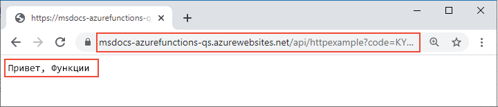

# <a name="connect-azure-functions-to-azure-storage-using-command-line-tools"></a>Подключение Функций Azure к службе хранилища Azure с помощью средств командной строки

Из этой статьи вы узнаете, как интегрировать очередь службы хранилища Azure с функцией и учетной записью хранения, созданными в [предыдущем кратком руководстве](functions-create-first-azure-function-azure-cli.md). Чтобы реализовать такую интеграцию, используется *выходная привязка*, которая записывает в сообщение очереди данные из HTTP-запроса. Выполнение шагов из этой статьи не влечет за собой никаких дополнительных затрат, помимо нескольких центов США, потраченных при выполнении предыдущего краткого руководства. Дополнительные сведения см. в статье [Основные понятия триггеров и привязок в Функциях Azure](functions-triggers-bindings.md).

## <a name="configure-your-local-environment"></a>Настройка локальной среды

Перед началом работы необходимо выполнить действия, описанные в статье [Краткое руководство. Создание функции в Azure, которая отвечает на HTTP-запросы](functions-create-first-azure-function-azure-cli.md). Если вы уже удалили ресурсы по окончании работы по этой статье, выполните шаги еще раз, чтобы повторно создать приложение-функцию и связанные ресурсы в Azure.

[!INCLUDE [functions-cli-get-storage-connection](../../includes/functions-cli-get-storage-connection.md)]

[!INCLUDE [functions-register-storage-binding-extension-csharp](../../includes/functions-register-storage-binding-extension-csharp.md)]

[!INCLUDE [functions-add-output-binding-cli](../../includes/functions-add-output-binding-cli.md)]

::: zone pivot="programming-language-csharp"  
[!INCLUDE [functions-add-storage-binding-csharp-library](../../includes/functions-add-storage-binding-csharp-library.md)]  
::: zone-end  
::: zone pivot="programming-language-java" 
[!INCLUDE [functions-add-output-binding-java-cli](../../includes/functions-add-output-binding-java-cli.md)]
::: zone-end   

Дополнительные сведения о привязках см. в статье [Azure Functions triggers and bindings](functions-triggers-bindings.md) (Основные понятия триггеров и привязок в Функциях Azure) и в разделе о [конфигурации выходных данных очереди](functions-bindings-storage-queue-output.md#configuration).

## <a name="add-code-to-use-the-output-binding"></a>Добавление кода для использования выходной привязки

Определив привязку очереди, можно обновлять функцию, чтобы она получала выходной параметр `msg` и записывала сообщения в очередь.

::: zone pivot="programming-language-python"     
[!INCLUDE [functions-add-output-binding-python](../../includes/functions-add-output-binding-python.md)]
::: zone-end  

::: zone pivot="programming-language-javascript"  
[!INCLUDE [functions-add-output-binding-js](../../includes/functions-add-output-binding-js.md)]
::: zone-end  

::: zone pivot="programming-language-typescript"  
[!INCLUDE [functions-add-output-binding-ts](../../includes/functions-add-output-binding-ts.md)]
::: zone-end  

::: zone pivot="programming-language-powershell"  
[!INCLUDE [functions-add-output-binding-powershell](../../includes/functions-add-output-binding-powershell.md)]  
::: zone-end

::: zone pivot="programming-language-csharp"  
[!INCLUDE [functions-add-storage-binding-csharp-library-code](../../includes/functions-add-storage-binding-csharp-library-code.md)]
::: zone-end 

::: zone pivot="programming-language-java"
[!INCLUDE [functions-add-output-binding-java-code](../../includes/functions-add-output-binding-java-code.md)]

[!INCLUDE [functions-add-output-binding-java-test-cli](../../includes/functions-add-output-binding-java-test-cli.md)]
::: zone-end

Обратите внимание, что *не* нужно писать код для проверки подлинности, получения ссылки на очередь или записи данных. Все эти задачи интеграции удобно осуществляются в среде выполнения Функций Azure и с использованием выходной привязки очереди.

[!INCLUDE [functions-run-function-test-local-cli](../../includes/functions-run-function-test-local-cli.md)]

[!INCLUDE [functions-extension-bundles-info](../../includes/functions-extension-bundles-info.md)]

## <a name="view-the-message-in-the-azure-storage-queue"></a>Просмотр сообщения в очереди службы хранилища Azure

[!INCLUDE [functions-add-output-binding-view-queue-cli](../../includes/functions-add-output-binding-view-queue-cli.md)]

## <a name="redeploy-the-project-to-azure"></a>Повторное развертывание проекта в Azure

Теперь, когда вы локально проверили, что функция записала сообщение в очередь службы хранилища Azure, вы можете повторно развернуть проект, чтобы обновить конечную точку, работающую в Azure.

::: zone pivot="programming-language-javascript,programming-language-typescript,programming-language-python,programming-language-powershell,programming-language-csharp" 
В папке *LocalFunctionsProj* используйте команду [`func azure functionapp publish`](functions-run-local.md#project-file-deployment), чтобы повторно развернуть проект, заменив `<APP_NAME>` именем приложения.

```
func azure functionapp publish <APP_NAME>
```
::: zone-end  

::: zone pivot="programming-language-java" 

В папке локального проекта выполните следующую команду Maven, чтобы повторно опубликовать проект:
```
mvn azure-functions:deploy
```
::: zone-end

## <a name="verify-in-azure"></a>Проверка в Azure

1. Как и в предыдущем кратком руководстве, используйте браузер или cURL для проверки повторно развернутой функции.

    # <a name="browser"></a>[Браузер](#tab/browser)
    
    Скопируйте полный URL-адрес вызова **Invoke URL**, показанный в выходных данных команды publish, в адресную строку браузера, добавив параметр запроса `&name=Functions`. В браузере должны отображаться выходные данные, аналогичные данным при локальном запуске функции.

    

    # <a name="curl"></a>[curl](#tab/curl)
    
    Запустите [`curl`](https://curl.haxx.se/), используя **Invoke URL** и добавив параметр `&name=Functions`. Результатом выполнения этой команды должен быть текст Hello Functions.
    
    

    --- 

1. Проверьте очередь службы хранилища еще раз, как описано в предыдущем разделе, чтобы убедиться, что в ней содержится новое сообщение, записанное в очередь.

## <a name="clean-up-resources"></a>Очистка ресурсов

После завершения работы используйте следующую команду, чтобы удалить группу ресурсов и все содержащиеся в ней ресурсы и избежать дополнительных затрат.

```azurecli
az group delete --name AzureFunctionsQuickstart-rg
```

## <a name="next-steps"></a>Дальнейшие действия

Вы обновили функцию, активируемую HTTP, которую теперь можно использовать для записи данных в очередь хранилища. Теперь вы можете узнать больше о разработке функций из командной строки с помощью Core Tools и Azure CLI:

+ [Работа с Azure Functions Core Tools](functions-run-local.md).  

::: zone pivot="programming-language-csharp"  
+ [Примеры полных проектов Функций на C#](/samples/browse/?products=azure-functions&languages=csharp).

+ [Справочник разработчика C# по функциям Azure](functions-dotnet-class-library.md)  
::: zone-end 
::: zone pivot="programming-language-javascript"  
+ [Примеры полных проектов Функций на JavaScript](/samples/browse/?products=azure-functions&languages=javascript).

+ [Руководство разработчика JavaScript для Функций Azure](functions-reference-node.md)  
::: zone-end  
::: zone pivot="programming-language-typescript"  
+ [Примеры полных проектов Функций на TypeScript](/samples/browse/?products=azure-functions&languages=typescript).

+ [Руководство разработчика TypeScript для Функций Azure](functions-reference-node.md#typescript).  
::: zone-end  
::: zone pivot="programming-language-python"  
+ [Примеры полных проектов Функций на Python](/samples/browse/?products=azure-functions&languages=python).

+ [Azure Functions Python Developer Guide](functions-reference-python.md) (Справочник по Функциям Azure для разработчика Python)  
::: zone-end  
::: zone pivot="programming-language-powershell"  
+ [Примеры полных проектов Функций в PowerShell](/samples/browse/?products=azure-functions&languages=azurepowershell).

+ [Руководство разработчика PowerShell для Функций Azure](functions-reference-powershell.md). 
::: zone-end
+ [Azure Functions triggers and bindings (Триггеры и привязки в Функциях Azure)](functions-triggers-bindings.md)

+ [Страница цен на Функции Azure](https://azure.microsoft.com/pricing/details/functions/)

+ [Оценка затрат на план потребления](functions-consumption-costs.md). 
