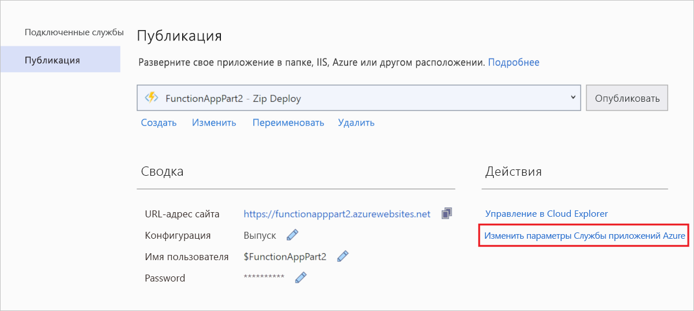

# <a name="connect-functions-to-azure-storage-using-visual-studio"></a>Подключение функций к службе хранилища Azure с помощью Visual Studio

[!INCLUDE [functions-add-storage-binding-intro](../../includes/functions-add-storage-binding-intro.md)]

В этой статье приведены сведения об использовании Visual Studio для подключения функции, которая была создана в рамках [предыдущей статьи], к службе хранилища Azure. Выходная привязка, которая была добавлена в эту функцию, записывает данные HTTP-запроса в сообщение очереди Хранилища очередей Azure. 

Большинство привязок требуют сохраненную строку подключения, которая будет использоваться Функциями Azure для доступа к привязанным службам. Чтобы упростить процесс, вам следует использовать учетную запись хранения, созданную в приложении-функции. Подключение к этой учетной записи уже хранится в параметрах приложения под названием `AzureWebJobsStorage`.  

## <a name="prerequisites"></a>Предварительные требования

Перед началом работы с этой статьей необходимо выполнить следующие действия: 

 - Выполните [первую часть краткого руководства по Visual Studio](./functions-create-first-function-vs-code.md). 

- Войдите в подписку Azure из Visual Studio.

## <a name="download-the-function-app-settings"></a>Загрузка параметров приложения-функции

В [предыдущей статье](functions-create-first-function-vs-code.md) вы создавали приложение-функцию и соответствующую учетную запись хранения в Azure. Строка подключения данной учетной записи надежно хранится в параметрах приложения в Azure. В этой статье вы напишете сообщения в очередь хранилища в пределах одной учетной записи. Чтобы подключить учетную запись хранения при локальном выполнении функции, необходимо загрузить параметры приложения в файл *local.settings.json*. 

1. Щелкните правой кнопкой мыши проект в **обозревателе решений** и выберите пункт **Опубликовать**. 

1. В разделе **Действия** выберите **Изменение параметров Службы приложений Azure**. 

    

1. В разделе **AzureWebJobsStorage** скопируйте строковое значение **Remote** в строку **Local**, а затем нажмите кнопку **ОК**. 

Привязка хранилища, которая использует для подключения параметр `AzureWebJobsStorage`, теперь может подключаться к Хранилищу очередей при локальном запуске.

## <a name="register-binding-extensions"></a>Регистрация расширений привязки

Так как вы используете выходную привязку Хранилища очередей, перед запуском проекта необходимо установить расширение привязок службы хранилища. За исключением триггеров HTTP и таймера, привязки реализованы в виде пакетов расширений. 

1. В меню **Инструменты** выберите **Диспетчер пакетов NuGet** > **Консоль диспетчера пакетов**. 

1. В консоли выполните команду [Install-Package](/nuget/tools/ps-ref-install-package) для установки расширения службы хранилища.

    ```Command
    Install-Package Microsoft.Azure.WebJobs.Extensions.Storage -Version 3.0.6
    ````

Теперь вы можете добавить выходную привязку службы хранилища к проекту.

## <a name="add-an-output-binding"></a>Добавление выходной привязки

[!INCLUDE [functions-add-storage-binding-csharp-library](../../includes/functions-add-storage-binding-csharp-library.md)]

## <a name="add-code-that-uses-the-output-binding"></a>Добавление кода, который использует выходную привязку

После определения привязки можно использовать `name` привязки для доступа к ней как к атрибуту в сигнатуре функции. После использования выходной привязки вам для проверки подлинности, получения ссылки на очередь или записи данных больше не потребуется код пакета SDK службы хранилища Azure. Вместо вас эти задачи будут выполнены выходной привязкой очереди и средой выполнения функции.

[!INCLUDE [functions-add-storage-binding-csharp-library-code](../../includes/functions-add-storage-binding-csharp-library-code.md)]

## <a name="run-the-function-locally"></a>Локальное выполнение функции

[!INCLUDE [functions-run-function-test-local-vs](../../includes/functions-run-function-test-local-vs.md)]

При первом использовании выходной привязки среда выполнения Функции создает в вашей учетной записи хранения новую очередь с именем `outqueue`. Чтобы убедиться, что очередь и сообщение в ней были созданы, вам нужно будет использовать Cloud Explorer.

## <a name="examine-the-output-queue"></a>Проверка выходной очереди

1. В меню **Представление** в Visual Studio выберите **Cloud Explorer**.

1. В **Cloud Explorer** разверните подписку Azure и **учетные записи хранения**, а затем разверните учетную запись хранения, используемую вашей функцией. Если вы не можете вспомнить имя учетной записи хранения, проверьте параметр строки подключения `AzureWebJobsStorage` в файле *local.settings.json*.  

1. Разверните узел **Очереди**, а затем дважды щелкните очередь с именем **outqueue**, чтобы просмотреть содержимое очереди в Visual Studio. 

   В ней содержится сообщение о том, что выходная привязка очереди создана при запуске функции, активируемой HTTP. Если вы вызывали функцию со значением по умолчанию `name` *Azure*, в сообщении очереди будет указано *Имя переданной функции: Azure*.

    

1. Запустите функцию еще раз, отправьте другой запрос, и в очереди появится новое сообщение.  

Теперь пора выполнить повторную публикацию обновленного приложения-функции в Azure.

## <a name="redeploy-and-verify-the-updated-app"></a>Повторное развертывание и проверка обновленного приложения

1. В **обозревателе решений** щелкните правой кнопкой мыши проект и выберите **Опубликовать**, а затем нажмите кнопку **Опубликовать**, чтобы повторно опубликовать проект в Azure.

1. По завершении развертывания вы можете снова использовать браузер для проверки повторно развернутой функции. Как и раньше, добавьте строку запроса `&name=<yourname>` к URL-адресу.

1. Еще раз [просмотрите сообщение в очереди хранилища](#examine-the-output-queue), чтобы убедиться, что выходная привязка снова создает новое сообщение в очереди.

## <a name="clean-up-resources"></a>Очистка ресурсов

[!INCLUDE [Clean-up resources](../../includes/functions-quickstart-cleanup.md)]

## <a name="next-steps"></a>Дополнительная информация

Вы обновили функцию, активируемую HTTP, которую теперь можно использовать для записи данных в очередь хранилища. Дополнительные сведения см. в статье [Разработка Функций Azure с помощью Visual Studio](functions-develop-vs.md).

Затем для мониторинга приложения-функции следует включить Application Insights.

> [!div class="nextstepaction"]
> [Включение интеграции с Application Insights](functions-monitoring.md#manually-connect-an-app-insights-resource)

[Azure Storage Explorer]: https://storageexplorer.com/
[предыдущей статьи]: functions-create-your-first-function-visual-studio.md
