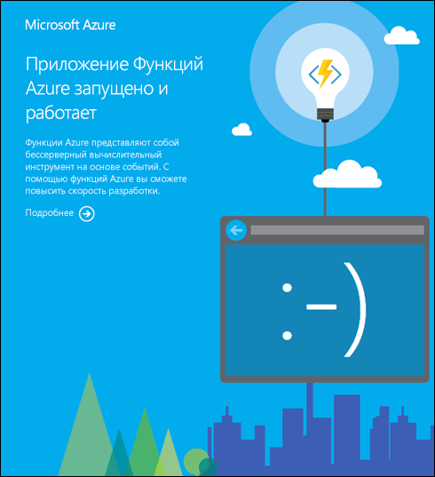

# Справочник по параметрам приложений для Функций Azure

Параметры приложения в приложении-функции содержат параметры глобальной конфигурации, влияющие на все функции данного приложения-функции. При локальном запуске эти параметры содержатся в [переменных среды](functions-run-local.md#local-settings-file). В этой статье перечислены параметры приложений, которые доступны в приложениях-функциях.

[!INCLUDE [Function app settings](../../includes/functions-app-settings.md)]

В файле [host.json](functions-host-json.md) и в файле [local.settings.json](functions-run-local.md#local-settings-file) содержатся другие параметры глобальной конфигурации.

## APPINSIGHTS_INSTRUMENTATIONKEY

Ключ инструментирования Application Insights, если используется Application Insights. Дополнительные сведения см. в статье [Мониторинг функций Azure](functions-monitoring.md).

|Ключ|Образец значения|
|---|------------|
|APPINSIGHTS_INSTRUMENTATIONKEY|5dbdd5e9-af77-484b-9032-64f83bb83bb|

## AzureWebJobsDashboard

Необязательная строка подключения учетной записи для хранения журналов и их отображения на вкладке **Монитор** на портале. Учетная запись хранения должна быть учетной записью общего назначения, поддерживающей большие двоичные объекты, очереди и таблицы. Ознакомьтесь с разделами [Учетная запись хранения](functions-infrastructure-as-code.md#storage-account) и [Требования к учетной записи хранения](functions-create-function-app-portal.md#storage-account-requirements).

|Ключ|Образец значения|
|---|------------|
|AzureWebJobsDashboard|DefaultEndpointsProtocol=https;AccountName=[name];AccountKey=[key]|

> [!TIP]
> Для достижения наилучшей производительности и взаимодействия вместо AzureWebJobsDashboard для мониторинга рекомендуется использовать APPINSIGHTS_INSTRUMENTATIONKEY и App Insights.

## AzureWebJobsDisableHomepage

`true` означает отключение целевой страницы по умолчанию, которая отображается для корневого URL-адреса приложения-функции. Значение по умолчанию — `false`.

|Ключ|Образец значения|
|---|------------|
|AzureWebJobsDisableHomepage|Да|

Если пропустить этот параметр приложения или задать для него значение `false`, то в ответ на URL-адрес `<functionappname>.azurewebsites.net` отобразится страница, аналогичная приведенной ниже.

## AzureWebJobsDotNetReleaseCompilation

`true` означает использование режима выпуска при компиляции кода .NET; `false` означает использование режима отладки. Значение по умолчанию — `true`.

|Ключ|Образец значения|
|---|------------|
|AzureWebJobsDotNetReleaseCompilation|Да|

## AzureWebJobsFeatureFlags

Разделенный запятыми список бета-функций, которые необходимо включить. Бета-функции, которые здесь отмечаются флагами, еще не готовы для рабочей среды, но их можно включить для использования в экспериментальных целях.

|Ключ|Образец значения|
|---|------------|
|AzureWebJobsFeatureFlags|feature1,feature2|

## AzureWebJobsScriptRoot

Путь к корневому каталогу, где расположены файл *host.json* и папки функции. В приложении-функции значение по умолчанию — `%HOME%\site\wwwroot`.

|Ключ|Образец значения|
|---|------------|
|AzureWebJobsScriptRoot|%HOME%\site\wwwroot|

## AzureWebJobsSecretStorageType

Указывает репозиторий или поставщик, используемый для хранения ключей. Сейчас поддерживаемыми репозиториями являются большой двоичный объект ("Blob") и локальная файловая система ("Files"). По умолчанию в версии 1 используется большой двоичный объект, а в версии 2 — файловая система. Обратите внимание на то, что в версии 1 в файловой системе будут работать только функции, выполняемые в рамках плана службы приложений.

|Ключ|Образец значения|
|---|------------|
|AzureWebJobsSecretStorageType|Файлы|

## AzureWebJobsStorage

Среда выполнения Функций Azure использует эту строку подключения учетной записи хранения для всех функций, кроме функций, активируемых протоколом HTTP. Учетная запись хранения должна быть учетной записью общего назначения, поддерживающей большие двоичные объекты, очереди и таблицы. Ознакомьтесь с разделами [Учетная запись хранения](functions-infrastructure-as-code.md#storage-account) и [Требования к учетной записи хранения](functions-create-function-app-portal.md#storage-account-requirements).

|Ключ|Образец значения|
|---|------------|
|AzureWebJobsStorage|DefaultEndpointsProtocol=https;AccountName=[name];AccountKey=[key]|

## AzureWebJobs_TypeScriptPath

Путь к компилятору, который используется для TypeScript. Позволяет при необходимости переопределить значение по умолчанию.

|Ключ|Образец значения|
|---|------------|
|AzureWebJobs_TypeScriptPath|%HOME%\typescript|

## FUNCTION\_APP\_EDIT\_MODE

Допустимые значения — "readwrite" и "readonly".

|Ключ|Образец значения|
|---|------------|
|FUNCTION\_APP\_EDIT\_MODE|readonly|

## FUNCTIONS\_EXTENSION\_VERSION

Версия среды выполнения Функций, которая используется в этом приложении-функции. Тильда с основным номером версии означает использование последней версии этого основного номера версии (например, "~2"). Когда доступны новые версии для того же основного номера версии, они устанавливаются в приложении-функции автоматически. Чтобы закрепить для приложения определенную версию, используйте полный номер версии (например, "2.0.12345"). Значение по умолчанию: "~2". Значение `~1` позволяет закрепить для приложения версию 1.x среды выполнения.

|Ключ|Образец значения|
|---|------------|
|FUNCTIONS\_EXTENSION\_VERSION|~2|

## FUNCTIONS\_WORKER\_RUNTIME

Среда выполнения языка рабочей роли для загрузки в приложении-функции.  Она будет соответствовать языку, используемому в приложении (например, "dotnet"). Функции на нескольких языках потребуется опубликовать в нескольких приложениях с соответствующим значением среды выполнения рабочей роли.  Допустимые значения: `dotnet` (C# или F#), `node` (JavaScript) и `java` (Java).

|Ключ|Образец значения|
|---|------------|
|FUNCTIONS\_WORKER\_RUNTIME|dotnet|

## WEBSITE_CONTENTAZUREFILECONNECTIONSTRING

Только для планов потребления. Строка подключения для учетной записи хранения, где хранятся код и конфигурация приложения-функции. Ознакомьтесь с разделом [Создание приложения-функции](functions-infrastructure-as-code.md#create-a-function-app).

|Ключ|Образец значения|
|---|------------|
|WEBSITE_CONTENTAZUREFILECONNECTIONSTRING|DefaultEndpointsProtocol=https;AccountName=[name];AccountKey=[key]|

## WEBSITE\_CONTENTSHARE

Только для планов потребления. Путь к файлам c кодом и конфигурацией приложения-функции. Используется с WEBSITE_CONTENTAZUREFILECONNECTIONSTRING. Значение по умолчанию — уникальная строка, которая начинается с имени приложения-функции. Ознакомьтесь с разделом [Создание приложения-функции](functions-infrastructure-as-code.md#create-a-function-app).

|Ключ|Образец значения|
|---|------------|
|WEBSITE_CONTENTSHARE|functionapp091999e2|

## WEBSITE\_MAX\_DYNAMIC\_APPLICATION\_SCALE\_OUT

Максимальное число экземпляров, до которого можно развернуть приложение-функцию. По умолчанию ограничение не установлено.

> [!NOTE]
> Этот параметр доступен в качестве предварительной версии функции. Надежная работа обеспечивается только при его значении не больше 5.

|Ключ|Образец значения|
|---|------------|
|WEBSITE\_MAX\_DYNAMIC\_APPLICATION\_SCALE\_OUT|5|

## WEBSITE\_NODE\_DEFAULT_VERSION

Значение по умолчанию — "8.11.1".

|Ключ|Образец значения|
|---|------------|
|WEBSITE\_NODE\_DEFAULT_VERSION|8.11.1|

## WEBSITE\_RUN\_FROM\_PACKAGE

Позволяет приложению-функции запуск из файла подключенного пакета.

|Ключ|Образец значения|
|---|------------|
|WEBSITE\_RUN\_FROM\_PACKAGE|1|

Допустимые значения: или URL-адрес, который разрешается в путь файла пакета развертывания, или `1`. Если задано значение `1`, пакет должен быть в папке `d:\home\data\SitePackages`. При использовании развертывания из ZIP-файла с этим параметром пакет автоматически передается в это расположение. В предварительной версии этот параметр называется `WEBSITE_RUN_FROM_ZIP`. Дополнительные сведения см. в статье [Запуск Функций Azure из файла пакета](run-functions-from-deployment-package.md).

## Дополнительная информация

[Узнайте, как обновлять параметры приложения](functions-how-to-use-azure-function-app-settings.md#manage-app-service-settings)

[Ознакомьтесь с глобальными параметрами в файле host.json](functions-host-json.md)

[См. другие параметры приложения для приложений Службы приложений Azure](https://github.com/projectkudu/kudu/wiki/Configurable-settings)
