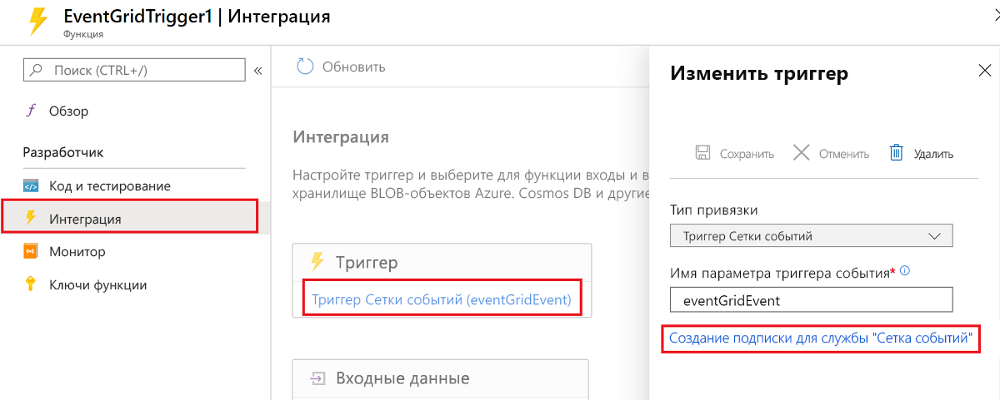
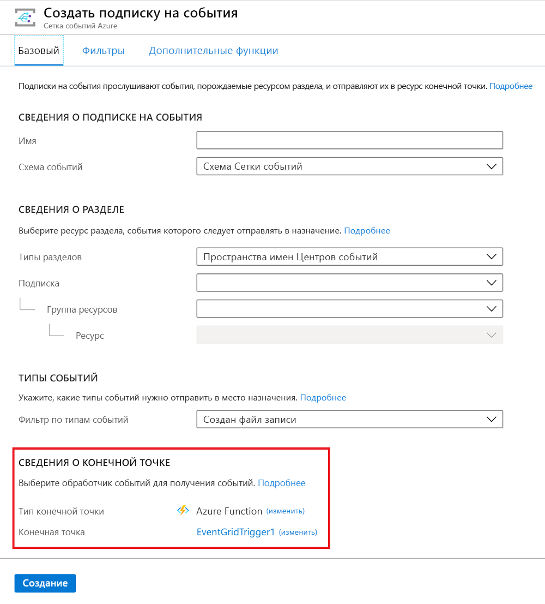

# <a name="event-grid-trigger-for-azure-functions"></a>Триггер службы "Сетка событий" для службы "Функции Azure"

В этом руководстве показано, как обрабатывать события службы [Сетка событий](../event-grid/overview.md) в службе "Функции Azure".

Служба "Сетка событий" — это служба Azure, которая отправляет HTTP-запросы для уведомления о событиях, которые происходят в *издателях*. Издатель — это служба или ресурс, в котором происходит событие. Например, учетная запись хранения больших двоичных объектов Azure является издателем, а [отправка или удаление большого двоичного объекта — это событие](../storage/blobs/storage-blob-event-overview.md). Некоторые [службы Azure имеют встроенную поддержку публикации событий в службу "Сетка событий"](../event-grid/overview.md#event-sources).

*Обработчики* событий получают и обрабатывают события. Служба "Функции Azure" является одной из нескольких [служб Azure, в которых есть встроенная поддержка обработки событий Сетки событий](../event-grid/overview.md#event-handlers). В этой статье вы узнаете, как использовать триггер службы "Сетка событий" для вызова функции при получении события из Сетки событий.

При желании можно использовать триггер HTTP для обработки событий службы "Сетка событий". Дополнительные сведения см. в разделе [Использование триггера HTTP в качестве триггера службы "Сетка событий"](#use-an-http-trigger-as-an-event-grid-trigger) этой статьи. Сейчас, если событие доставляется в [схему CloudEvents](../event-grid/cloudevents-schema.md), триггер службы "Сетка событий" нельзя использовать в приложении "Функции Azure". В этом случае необходимо использовать триггер HTTP.

[!INCLUDE [intro](../../includes/functions-bindings-intro.md)]

## <a name="packages---functions-2x-and-higher"></a>Packages — функции 2. x и более поздних версий

Триггер службы "Сетка событий" предоставляется в пакете NuGet [Microsoft.Azure.WebJobs.Extensions.EventGrid](https://www.nuget.org/packages/Microsoft.Azure.WebJobs.Extensions.EventGrid) версии 2.х. Исходный код для пакета находится в репозитории GitHub [azure-functions-eventgrid-extension](https://github.com/Azure/azure-functions-eventgrid-extension/tree/v2.x).

[!INCLUDE [functions-package-v2](../../includes/functions-package-v2.md)]

## <a name="packages---functions-1x"></a>Пакеты – Функции 1.x

Триггер службы "Сетка событий" предоставляется в пакете NuGet [Microsoft.Azure.WebJobs.Extensions.EventGrid](https://www.nuget.org/packages/Microsoft.Azure.WebJobs.Extensions.EventGrid) версии 1.х. Исходный код для пакета находится в репозитории GitHub [azure-functions-eventgrid-extension](https://github.com/Azure/azure-functions-eventgrid-extension/tree/master).

[!INCLUDE [functions-package](../../includes/functions-package.md)]

## <a name="example"></a>Пример

Просмотрите пример триггера Сетки событий для конкретного языка:

* C#
* [Сценарий C# (CSX)](#c-script-example)
* [Java](#trigger---java-examples)
* [JavaScript](#javascript-example)
* [Python](#python-example)

Пример триггера HTTP см. в разделе [Использование триггера HTTP в качестве триггера службы "Сетка событий"](#use-an-http-trigger-as-an-event-grid-trigger) в этой статье.

### <a name="c-2x-and-higher"></a>C#(2. x и выше)

В следующем примере показана [функция C#](functions-dotnet-class-library.md), которая выполняет привязку к `EventGridEvent`:

```cs
using Microsoft.Azure.EventGrid.Models;
using Microsoft.Azure.WebJobs;
using Microsoft.Azure.WebJobs.Extensions.EventGrid;
using Microsoft.Azure.WebJobs.Host;
using Microsoft.Extensions.Logging;

namespace Company.Function
{
    public static class EventGridTriggerCSharp
    {
        [FunctionName("EventGridTest")]
        public static void EventGridTest([EventGridTrigger]EventGridEvent eventGridEvent, ILogger log)
        {
            log.LogInformation(eventGridEvent.Data.ToString());
        }
    }
}
```

Ознакомьтесь с дополнительными сведениями о [пакетах](#attributes), [конфигурации](#configuration) и [использовании](#usage).

### <a name="c-version-1x"></a>C# (версия 1.x)

В следующем примере показана [функция C#](functions-dotnet-class-library.md) службы "Функции" 1.х, которая выполняет привязку к `JObject`.

```cs
using Microsoft.Azure.WebJobs;
using Microsoft.Azure.WebJobs.Extensions.EventGrid;
using Microsoft.Azure.WebJobs.Host;
using Newtonsoft.Json;
using Newtonsoft.Json.Linq;
using Microsoft.Extensions.Logging;

namespace Company.Function
{
    public static class EventGridTriggerCSharp
    {
        [FunctionName("EventGridTriggerCSharp")]
        public static void Run([EventGridTrigger]JObject eventGridEvent, ILogger log)
        {
            log.LogInformation(eventGridEvent.ToString(Formatting.Indented));
        }
    }
}
```

### <a name="c-script-example"></a>Пример сценария C#

В следующем примере показаны привязка триггера в файле *function.json* и [функция сценария C#](functions-reference-csharp.md), которая использует эту привязку.

Данные привязки в файле *function.json*:

```json
{
  "bindings": [
    {
      "type": "eventGridTrigger",
      "name": "eventGridEvent",
      "direction": "in"
    }
  ],
  "disabled": false
}
```

#### <a name="c-script-version-2x-and-higher"></a>C#Скрипт (версия 2. x и более поздние)

Ниже приведен пример, который привязывается к `EventGridEvent`:

```csharp
#r "Microsoft.Azure.EventGrid"
using Microsoft.Azure.EventGrid.Models;
using Microsoft.Extensions.Logging;

public static void Run(EventGridEvent eventGridEvent, ILogger log)
{
    log.LogInformation(eventGridEvent.Data.ToString());
}
```

Ознакомьтесь с дополнительными сведениями о [пакетах](#attributes), [конфигурации](#configuration) и [использовании](#usage).

#### <a name="c-script-version-1x"></a>Скрипт C# (версия 1.x)

Ниже приведен код сценария C# службы "Функции" 1.х, который выполняет привязку к `JObject`:

```cs
#r "Newtonsoft.Json"

using Newtonsoft.Json;
using Newtonsoft.Json.Linq;

public static void Run(JObject eventGridEvent, TraceWriter log)
{
    log.Info(eventGridEvent.ToString(Formatting.Indented));
}
```

### <a name="javascript-example"></a>Пример JavaScript

В следующем примере показана привязка триггера в файле *function.json* и [функция JavaScript](functions-reference-node.md), которая использует привязку.

Данные привязки в файле *function.json*:

```json
{
  "bindings": [
    {
      "type": "eventGridTrigger",
      "name": "eventGridEvent",
      "direction": "in"
    }
  ],
  "disabled": false
}
```

Ниже показан код JavaScript.

```javascript
module.exports = function (context, eventGridEvent) {
    context.log("JavaScript Event Grid function processed a request.");
    context.log("Subject: " + eventGridEvent.subject);
    context.log("Time: " + eventGridEvent.eventTime);
    context.log("Data: " + JSON.stringify(eventGridEvent.data));
    context.done();
};
```

### <a name="python-example"></a>Пример на Python

В следующем примере показаны привязка триггера в файле *function.json* и [функция Python](functions-reference-python.md), которая использует эту привязку.

Данные привязки в файле *function.json*:

```json
{
  "bindings": [
    {
      "type": "eventGridTrigger",
      "name": "event",
      "direction": "in"
    }
  ],
  "disabled": false,
  "scriptFile": "__init__.py"
}
```

Ниже приведен код Python.

```python
import logging
import azure.functions as func


def main(event: func.EventGridEvent):
    logging.info("Python Event Grid function processed a request.")
    logging.info("  Subject: %s", event.subject)
    logging.info("  Time: %s", event.event_time)
    logging.info("  Data: %s", event.get_json())
```

### <a name="trigger---java-examples"></a>Триггер — пример для Java

В этом разделе содержатся следующие примеры:

* [Триггер сетки событий, строковый параметр](#event-grid-trigger-string-parameter-java)
* [Триггер сетки событий, параметр POJO](#event-grid-trigger-pojo-parameter-java)

В следующих примерах показана привязка триггера в файле *function.json* и [функции Java](functions-reference-java.md), использующая привязку и печатающая событие; сначала событие принимается как ```String```, затем — как POJO.

```json
{
  "bindings": [
    {
      "type": "eventGridTrigger",
      "name": "eventGridEvent",
      "direction": "in"
    }
  ]
}
```

#### <a name="event-grid-trigger-string-parameter-java"></a>Триггер сетки событий, строковый параметр (Java)

```java
  @FunctionName("eventGridMonitorString")
  public void logEvent(
    @EventGridTrigger(
      name = "event"
    ) 
    String content, 
    final ExecutionContext context) {
      context.getLogger().info("Event content: " + content);      
  }
```

#### <a name="event-grid-trigger-pojo-parameter-java"></a>Триггер сетки событий, параметр POJO (Java)

В этом примере используется следующий POJO, представляющий свойства верхнего уровня события сетки событий.

```java
import java.util.Date;
import java.util.Map;

public class EventSchema {

  public String topic;
  public String subject;
  public String eventType;
  public Date eventTime;
  public String id;
  public String dataVersion;
  public String metadataVersion;
  public Map<String, Object> data;

}
```

По прибытии полезные данные JSON события десериализуются в ```EventSchema``` POJO для использования функцией. Это позволяет функции использовать свойства событий в объектно-ориентированном стиле.

```java
  @FunctionName("eventGridMonitor")
  public void logEvent(
    @EventGridTrigger(
      name = "event"
    ) 
    EventSchema event, 
    final ExecutionContext context) {
      context.getLogger().info("Event content: ");
      context.getLogger().info("Subject: " + event.subject);
      context.getLogger().info("Time: " + event.eventTime); // automatically converted to Date by the runtime
      context.getLogger().info("Id: " + event.id);
      context.getLogger().info("Data: " + event.data);
  }
```

В [библиотеке выполнения функций Java](/java/api/overview/azure/functions/runtime) используйте заметку `EventGridTrigger` для параметров, значение которых должно быть получено от EventGrid. Параметры с этими заметками запускают функцию, когда происходит событие.  Эта заметка может использоваться с собственными типами Java, объектами POJO или значениями, допускающими значения NULL, используя `Optional<T>`.

## <a name="attributes"></a>Атрибуты

В [библиотеках классов C#](functions-dotnet-class-library.md) используйте атрибут [EventGridTrigger](https://github.com/Azure/azure-functions-eventgrid-extension/blob/master/src/EventGridExtension/TriggerBinding/EventGridTriggerAttribute.cs).

Вот как выглядит атрибут `EventGridTrigger` в сигнатуре метода:

```csharp
[FunctionName("EventGridTest")]
public static void EventGridTest([EventGridTrigger] JObject eventGridEvent, ILogger log)
{
    ...
}
```

Полный пример см. в разделе "Пример C#".

## <a name="configuration"></a>Настройка

В следующей таблице описываются свойства конфигурации привязки, которые задаются в файле *function.json*. В атрибуте `EventGridTrigger` не задаются параметры или свойства конструкции.

|свойство function.json |Описание|
|---------|---------|
| **type** | Обязательное. Необходимо задать значение `eventGridTrigger`. |
| **direction** | Обязательное. Необходимо задать значение `in`. |
| **name** | Обязательное. Имя переменной, используемой в коде функции, для параметра, получающего данные события. |

## <a name="usage"></a>Использование

В функциях C# и F# в службе "Функции Azure" 1.х для триггера службы "Сетка событий" можно использовать следующие типы параметров:

* `JObject`
* `string`

Для C# функций F# и в функциях Azure 2. x и более поздних версий также можно использовать следующий тип параметра для триггера службы "Сетка событий":

* `Microsoft.Azure.EventGrid.Models.EventGridEvent` — определяет свойства для полей, которые являются общими для всех типов событий.

> [!NOTE]
> В службе "Функции" 1.х при попытке сделать привязку к `Microsoft.Azure.WebJobs.Extensions.EventGrid.EventGridEvent` в компиляторе появится сообщение о том, что это не рекомендуется, и совет использовать `Microsoft.Azure.EventGrid.Models.EventGridEvent`. Чтобы использовать более новый тип, ссылайтесь на пакет NuGet [Microsoft.Azure.EventGrid](https://www.nuget.org/packages/Microsoft.Azure.EventGrid) и полностью определите имя типа `EventGridEvent`, добавив префикс `Microsoft.Azure.EventGrid.Models`. Сведения о том, как ссылаться на пакеты NuGet в функции сценария C#, см. в разделе [об использовании пакетов NuGet](functions-reference-csharp.md#using-nuget-packages).

Для функций JavaScript параметр, названный по свойству `name` в файле *function.json*, имеет ссылку на объект события.

## <a name="event-schema"></a>Схема событий

Данные для события службы "Сетка событий" получаются в качестве объекта JSON в теле HTTP-запроса. JSON должен быть аналогичным приведенному ниже:

```json
[{
  "topic": "/subscriptions/{subscriptionid}/resourceGroups/eg0122/providers/Microsoft.Storage/storageAccounts/egblobstore",
  "subject": "/blobServices/default/containers/{containername}/blobs/blobname.jpg",
  "eventType": "Microsoft.Storage.BlobCreated",
  "eventTime": "2018-01-23T17:02:19.6069787Z",
  "id": "{guid}",
  "data": {
    "api": "PutBlockList",
    "clientRequestId": "{guid}",
    "requestId": "{guid}",
    "eTag": "0x8D562831044DDD0",
    "contentType": "application/octet-stream",
    "contentLength": 2248,
    "blobType": "BlockBlob",
    "url": "https://egblobstore.blob.core.windows.net/{containername}/blobname.jpg",
    "sequencer": "000000000000272D000000000003D60F",
    "storageDiagnostics": {
      "batchId": "{guid}"
    }
  },
  "dataVersion": "",
  "metadataVersion": "1"
}]
```

Показанный пример является массивом из одного элемента. Сетка событий всегда отправляет массив, который может содержать более одного события. Среда выполнения вызывает функцию один раз для каждого элемента массива.

Свойства верхнего уровня в данных JSON события одинаковы для всех типов событий, тогда как содержимое свойства `data` определено для каждого типа события. Пример показан для события хранилища BLOB-объектов.

Описания распространенных и связанных с событием свойств см. в разделе [Свойства события](../event-grid/event-schema.md#event-properties) в документации по службе "Сетка событий".

Тип `EventGridEvent` определяет только свойства верхнего уровня. Свойство `Data` имеет значение `JObject`.

## <a name="create-a-subscription"></a>Создание подписки

Чтобы начать получать HTTP-запросы Сетки событий, создайте подписку службы "Сетка событий", которая указывает URL-адрес конечной точки, вызывающей функцию.

### <a name="azure-portal"></a>портала Azure

Для функций, разрабатываемых на портале Azure с использованием триггера службы "Сетка событий", выберите **Добавить подписку сетки событий**.



Когда вы щелкните эту ссылку, откроется страница **создания подписки на событие** с автоматически заполненным URL-адресом конечной точки.



Дополнительные сведения о создании подписок с помощью портала Azure см. в разделе [Создание и перенаправление пользовательских событий с помощью портала Azure и службы "Сетка событий"](../event-grid/custom-event-quickstart-portal.md) документации по службе "Сетка событий".

### <a name="azure-cli"></a>Azure CLI

Чтобы создать подписку с помощью [Azure CLI](https://docs.microsoft.com/cli/azure/get-started-with-azure-cli?view=azure-cli-latest), используйте команду [az eventgrid event-subscription create](https://docs.microsoft.com/cli/azure/eventgrid/event-subscription?view=azure-cli-latest#az-eventgrid-event-subscription-create).

Для команды нужен URL-адрес конечной точки, который вызывает функцию. В следующем примере показан шаблон URL-адреса в зависимости от версии:

#### <a name="version-2x-and-higher-runtime"></a>Среда выполнения версии 2. x (и выше)

    https://{functionappname}.azurewebsites.net/runtime/webhooks/eventgrid?functionName={functionname}&code={systemkey}

#### <a name="version-1x-runtime"></a>Среда выполнения версии 1.x

    https://{functionappname}.azurewebsites.net/admin/extensions/EventGridExtensionConfig?functionName={functionname}&code={systemkey}

Системный ключ — это ключ авторизации, который необходимо включить в URL-адрес конечной точки для триггера службы "Сетка событий". В следующем разделе показано, как получить системный ключ.

Ниже приведен пример, который подписывается на учетную запись хранения больших двоичных объектов (с заполнителем для системного ключа):

#### <a name="version-2x-and-higher-runtime"></a>Среда выполнения версии 2. x (и выше)

```azurecli
az eventgrid resource event-subscription create -g myResourceGroup \
--provider-namespace Microsoft.Storage --resource-type storageAccounts \
--resource-name myblobstorage12345 --name myFuncSub  \
--included-event-types Microsoft.Storage.BlobCreated \
--subject-begins-with /blobServices/default/containers/images/blobs/ \
--endpoint https://mystoragetriggeredfunction.azurewebsites.net/runtime/webhooks/eventgrid?functionName=imageresizefunc&code=<key>
```

#### <a name="version-1x-runtime"></a>Среда выполнения версии 1.x

```azurecli
az eventgrid resource event-subscription create -g myResourceGroup \
--provider-namespace Microsoft.Storage --resource-type storageAccounts \
--resource-name myblobstorage12345 --name myFuncSub  \
--included-event-types Microsoft.Storage.BlobCreated \
--subject-begins-with /blobServices/default/containers/images/blobs/ \
--endpoint https://mystoragetriggeredfunction.azurewebsites.net/admin/extensions/EventGridExtensionConfig?functionName=imageresizefunc&code=<key>
```

Дополнительные сведения о создании подписки см. в разделе [Примеры использования хранилища больших двоичных объектов](../storage/blobs/storage-blob-event-quickstart.md#subscribe-to-your-storage-account) или других коротких руководствах по использованию службы "Сетка событий".

### <a name="get-the-system-key"></a>Получение системного ключа

Системный ключ можно получить с помощью следующего API-интерфейса (HTTP GET):

#### <a name="version-2x-and-higher-runtime"></a>Среда выполнения версии 2. x (и выше)

```
http://{functionappname}.azurewebsites.net/admin/host/systemkeys/eventgrid_extension?code={masterkey}
```

#### <a name="version-1x-runtime"></a>Среда выполнения версии 1.x

```
http://{functionappname}.azurewebsites.net/admin/host/systemkeys/eventgridextensionconfig_extension?code={masterkey}
```

Это API администратора, поэтому для него нужен [главный ключ](functions-bindings-http-webhook.md#authorization-keys) приложения-функции. Не путайте системный ключ (для вызова функции триггера службы "Сетка событий") с главным ключом (для выполнения административных задач в приложении-функции). Во время оформления подписки на раздел службы "Сетка событий" необходимо использовать системный ключ.

Ниже приведен пример ответа, который предоставляет системный ключ:

```
{
  "name": "eventgridextensionconfig_extension",
  "value": "{the system key for the function}",
  "links": [
    {
      "rel": "self",
      "href": "{the URL for the function, without the system key}"
    }
  ]
}
```

Можно получить главный ключ для приложения-функции на вкладке **Параметры приложения-функции** на портале.

> [!IMPORTANT]
> Главный ключ предоставляет административный доступ к приложению-функции. Не передавайте этот ключ третьим лицам и не распространяйте его в собственных клиентских приложениях.

Дополнительные сведения см. в разделе [Ключи авторизации](functions-bindings-http-webhook.md#authorization-keys) в справочнике по триггерам HTTP.

Кроме того, вы можете отправить HTTP-запрос PUT, чтобы самостоятельно указать значение ключа.

## <a name="local-testing-with-viewer-web-app"></a>Локальное тестирование с помощью веб-приложения средства просмотра

Чтобы протестировать триггер службы "Сетка событий" локально, необходимо отправить HTTP-запросы службы "Сетка событий", переданные из своего источника в облаке, на локальный компьютер. Для этого можно записать запросы в сети и вручную отправить их на локальный компьютер:

1. [Создайте веб-приложение средства просмотра](#create-a-viewer-web-app), которое собирает сообщения о событиях.
1. [Создайте подписку службы "Сетка событий"](#create-an-event-grid-subscription), которая отправляет события в приложение средства просмотра.
1. [Создайте запрос](#generate-a-request) и скопируйте текст запроса из приложения средства просмотра.
1. [Вручную вставьте запрос](#manually-post-the-request) в URL-адрес localhost функции триггера службы "Сетка событий".

Закончив тестирование, можно использовать ту же подписку для рабочей среды, обновив конечную точку. Используйте команду Azure CLI [az eventgrid event-subscription update](https://docs.microsoft.com/cli/azure/eventgrid/event-subscription?view=azure-cli-latest#az-eventgrid-event-subscription-update).

### <a name="create-a-viewer-web-app"></a>Создание веб-приложения средства просмотра

Чтобы упростить запись сообщений о событиях, разверните [готовое веб-приложение](https://github.com/Azure-Samples/azure-event-grid-viewer), которое отображает сообщения о событиях. Развернутое решение содержит план службы приложений, веб-приложение службы приложений и исходный код из GitHub.

Выберите **Развернуть в Azure**, чтобы развернуть решение в своей подписке. На портале Azure укажите значения остальных параметров.

<a href="https://portal.azure.com/#create/Microsoft.Template/uri/https%3A%2F%2Fraw.githubusercontent.com%2FAzure-Samples%2Fazure-event-grid-viewer%2Fmaster%2Fazuredeploy.json" target="_blank"></a>

Завершение развертывания может занять несколько минут. Когда развертывание успешно завершится, откройте веб-приложение и убедитесь, что оно работает. Откройте браузер и перейдите по адресу `https://<your-site-name>.azurewebsites.net`.

Вы увидите сайт без опубликованных событий.


### <a name="create-an-event-grid-subscription"></a>Создание подписки Сетки событий

Создайте подписку "Сетка событий" того типа, который требуется протестировать, и предоставьте URL-адрес из веб-приложения как конечную точку для уведомления о событиях. Конечная точка веб-приложения должна содержать суффикс `/api/updates/`. Таким образом, полный URL-адрес будет выглядеть следующим образом: `https://<your-site-name>.azurewebsites.net/api/updates`

Дополнительные сведения о создании подписок с помощью портала Azure см. в разделе [Создание пользовательского события с помощью портала Azure](../event-grid/custom-event-quickstart-portal.md) в документации по службе "Сетка событий".

### <a name="generate-a-request"></a>Создание запроса

Активируйте событие, которое будет создавать HTTP-трафик в конечную точку веб-приложения.  Например, если вы создали подписку хранилища BLOB-объектов, отправьте или удалите большой двоичный объект. Скопируйте текст запроса, когда запрос отобразится в веб-приложении.

Сначала будет получен запрос на подтверждение подписки. Игнорируйте такие запросы и скопируйте запрос события.


### <a name="manually-post-the-request"></a>Публикация запроса вручную

Запустите функцию службы "Сетка событий" локально.

Используйте такие средства, как [Postman](https://www.getpostman.com/) или [cURL](https://curl.haxx.se/docs/httpscripting.html), чтобы создать HTTP-запрос POST:

* Задайте заголовок `Content-Type: application/json`.
* Задайте заголовок `aeg-event-type: Notification`.
* Вставьте данные RequestBin в текст запроса.
* Опубликуйте по URL-адресу функции триггера сетки событий.
  * Для 2. x и более поздних версий используйте следующий шаблон:

    ```
    http://localhost:7071/runtime/webhooks/eventgrid?functionName={FUNCTION_NAME}
    ```

  * Для использования с 1. x:

    ```
    http://localhost:7071/admin/extensions/EventGridExtensionConfig?functionName={FUNCTION_NAME}
    ```

Для параметра `functionName` нужно указать имя, заданное в атрибуте `FunctionName`.

На следующих снимках экрана показаны заголовки и текст запроса в Postman:


Функция триггера службы "Сетка событий" выполняет и показывает журналы, похожие на приведенные ниже:


## <a name="local-testing-with-ngrok"></a>Локальное тестирование с помощью ngrok

Другим способом локально проверить триггер Сетки событий является автоматизация HTTP-подключения между Интернетом и компьютером разработчика. Это можно сделать с помощью такого средства, как [ngrok](https://ngrok.com/):

1. [Создайте конечную точку ngrok](#create-an-ngrok-endpoint).
1. [Запустите функцию триггера службы "Сетка событий"](#run-the-event-grid-trigger-function).
1. [Создайте подписку службы "Сетка событий"](#create-a-subscription), которая отправляет события в конечную точку ngrok.
1. [Активируйте событие](#trigger-an-event).

Закончив тестирование, можно использовать ту же подписку для рабочей среды, обновив конечную точку. Используйте команду Azure CLI [az eventgrid event-subscription update](https://docs.microsoft.com/cli/azure/eventgrid/event-subscription?view=azure-cli-latest#az-eventgrid-event-subscription-update).

### <a name="create-an-ngrok-endpoint"></a>Создание конечной точки ngrok

Скачайте *ngrok.exe* из [ngrok](https://ngrok.com/) и выполните следующую команду:

```
ngrok http -host-header=localhost 7071
```

Параметр -host-header необходим, так как среда выполнения функций ожидает запросов от localhost при выполнении на локальном узле. 7071 — номер порта по умолчанию, если среда выполнения запущена локально.

Команда создает выходные данные следующего вида:

```
Session Status                online
Version                       2.2.8
Region                        United States (us)
Web Interface                 http://127.0.0.1:4040
Forwarding                    http://263db807.ngrok.io -> localhost:7071
Forwarding                    https://263db807.ngrok.io -> localhost:7071

Connections                   ttl     opn     rt1     rt5     p50     p90
                              0       0       0.00    0.00    0.00    0.00
```

Для подписки службы "Сетка событий" используется URL-адрес `https://{subdomain}.ngrok.io`.

### <a name="run-the-event-grid-trigger-function"></a>Запуск функций триггера службы "Сетка событий"

Служба "Сетка событий" не обрабатывает URL-адрес ngrok особым образом, поэтому при создании подписки функция должна выполняться локально. В противном случае ответ проверки не отправляется и происходит сбой при создании подписки.

### <a name="create-a-subscription"></a>Создание подписки

Создайте подписку службы "Сетка событий" типа, который необходимо протестировать, и присвойте ее конечной точке ngrok.

Используйте этот шаблон конечной точки для функций 2. x и более поздних версий:

```
https://{SUBDOMAIN}.ngrok.io/runtime/webhooks/eventgrid?functionName={FUNCTION_NAME}
```

Для Функций версии 1.x используйте этот шаблон конечной точки:

```
https://{SUBDOMAIN}.ngrok.io/admin/extensions/EventGridExtensionConfig?functionName={FUNCTION_NAME}
```

Для параметра `{FUNCTION_NAME}` нужно указать имя, заданное в атрибуте `FunctionName`.

Ниже приведен пример с использованием Azure CLI:

```azurecli
az eventgrid event-subscription create --resource-id /subscriptions/aeb4b7cb-b7cb-b7cb-b7cb-b7cbb6607f30/resourceGroups/eg0122/providers/Microsoft.Storage/storageAccounts/egblobstor0122 --name egblobsub0126 --endpoint https://263db807.ngrok.io/runtime/webhooks/eventgrid?functionName=EventGridTrigger
```

Дополнительные сведения о создании подписки см. в разделе [Создание подписки](#create-a-subscription) ранее в этой статье.

### <a name="trigger-an-event"></a>Активация события

Активируйте событие, которое будет создавать HTTP-трафик в конечную точку ngrok.  Например, если вы создали подписку хранилища BLOB-объектов, отправьте или удалите большой двоичный объект.

Функция триггера службы "Сетка событий" выполняет и показывает журналы, похожие на приведенные ниже:


## <a name="use-an-http-trigger-as-an-event-grid-trigger"></a>Использование триггера HTTP в качестве триггера службы "Сетка событий"

События службы "Сетка событий" получаются в качестве HTTP-запросов, поэтому их можно обрабатывать с использованием триггера HTTP, а не триггера службы "Сетка событий". Одна из возможных причин — получение большего контроля над URL-адресом конечной точки, вызывающим функцию. Еще одна причина — необходимость получения событий в [схеме CloudEvents](../event-grid/cloudevents-schema.md). В настоящее время триггер службы "Сетка событий" не поддерживает схему CloudEvents. В примерах в этом разделе показаны решения для схемы "Сетка событий" и схемы CloudEvents.

При использовании триггера HTTP необходимо написать код действий, которые триггер службы "Сетка событий" выполняет автоматически:

* Отправляет запрос проверки в [запрос подтверждения подписки](../event-grid/security-authentication.md#webhook-event-delivery).
* Вызывает функцию один раз для каждого элемента массива событий, содержащихся в тексте запроса.

Дополнительные сведения об URL-адресе, используемом для вызова функции, выполняемой локально или в Azure, см. в [справочной документации по привязке триггера HTTP](functions-bindings-http-webhook.md).

### <a name="event-grid-schema"></a>Схема службы "Сетка событий"

Следующий пример кода C# для триггера HTTP имитирует поведение триггера службы "Сетка событий". Этот пример можно использовать для событий, доставленных в схеме "Сетка событий".

```csharp
[FunctionName("HttpTrigger")]
public static async Task<HttpResponseMessage> Run(
    [HttpTrigger(AuthorizationLevel.Anonymous, "post")]HttpRequestMessage req,
    ILogger log)
{
    log.LogInformation("C# HTTP trigger function processed a request.");

    var messages = await req.Content.ReadAsAsync<JArray>();

    // If the request is for subscription validation, send back the validation code.
    if (messages.Count > 0 && string.Equals((string)messages[0]["eventType"],
        "Microsoft.EventGrid.SubscriptionValidationEvent",
        System.StringComparison.OrdinalIgnoreCase))
    {
        log.LogInformation("Validate request received");
        return req.CreateResponse<object>(new
        {
            validationResponse = messages[0]["data"]["validationCode"]
        });
    }

    // The request is not for subscription validation, so it's for one or more events.
    foreach (JObject message in messages)
    {
        // Handle one event.
        EventGridEvent eventGridEvent = message.ToObject<EventGridEvent>();
        log.LogInformation($"Subject: {eventGridEvent.Subject}");
        log.LogInformation($"Time: {eventGridEvent.EventTime}");
        log.LogInformation($"Event data: {eventGridEvent.Data.ToString()}");
    }

    return req.CreateResponse(HttpStatusCode.OK);
}
```

Следующий пример кода JavaScript для триггера HTTP имитирует поведение триггера службы "Сетка событий". Этот пример можно использовать для событий, доставленных в схеме "Сетка событий".

```javascript
module.exports = function (context, req) {
    context.log('JavaScript HTTP trigger function processed a request.');

    var messages = req.body;
    // If the request is for subscription validation, send back the validation code.
    if (messages.length > 0 && messages[0].eventType == "Microsoft.EventGrid.SubscriptionValidationEvent") {
        context.log('Validate request received');
        var code = messages[0].data.validationCode;
        context.res = { status: 200, body: { "ValidationResponse": code } };
    }
    else {
        // The request is not for subscription validation, so it's for one or more events.
        // Event Grid schema delivers events in an array.
        for (var i = 0; i < messages.length; i++) {
            // Handle one event.
            var message = messages[i];
            context.log('Subject: ' + message.subject);
            context.log('Time: ' + message.eventTime);
            context.log('Data: ' + JSON.stringify(message.data));
        }
    }
    context.done();
};
```

Код обработки событий переходит в цикл через массив `messages`.

### <a name="cloudevents-schema"></a>Схема CloudEvents

Следующий пример кода C# для триггера HTTP имитирует поведение триггера службы "Сетка событий".  Этот пример можно использовать для событий, доставленных в схеме CloudEvents.

```csharp
[FunctionName("HttpTrigger")]
public static async Task<HttpResponseMessage> Run([HttpTrigger(AuthorizationLevel.Anonymous, "get", "post", Route = null)]HttpRequestMessage req, ILogger log)
{
    log.LogInformation("C# HTTP trigger function processed a request.");

    var requestmessage = await req.Content.ReadAsStringAsync();
    var message = JToken.Parse(requestmessage);

    if (message.Type == JTokenType.Array)
    {
        // If the request is for subscription validation, send back the validation code.
        if (string.Equals((string)message[0]["eventType"],
        "Microsoft.EventGrid.SubscriptionValidationEvent",
        System.StringComparison.OrdinalIgnoreCase))
        {
            log.LogInformation("Validate request received");
            return req.CreateResponse<object>(new
            {
                validationResponse = message[0]["data"]["validationCode"]
            });
        }
    }
    else
    {
        // The request is not for subscription validation, so it's for an event.
        // CloudEvents schema delivers one event at a time.
        log.LogInformation($"Source: {message["source"]}");
        log.LogInformation($"Time: {message["eventTime"]}");
        log.LogInformation($"Event data: {message["data"].ToString()}");
    }

    return req.CreateResponse(HttpStatusCode.OK);
}
```

Следующий пример кода JavaScript для триггера HTTP имитирует поведение триггера службы "Сетка событий". Этот пример можно использовать для событий, доставленных в схеме CloudEvents.

```javascript
module.exports = function (context, req) {
    context.log('JavaScript HTTP trigger function processed a request.');

    var message = req.body;
    // If the request is for subscription validation, send back the validation code.
    if (message.length > 0 && message[0].eventType == "Microsoft.EventGrid.SubscriptionValidationEvent") {
        context.log('Validate request received');
        var code = message[0].data.validationCode;
        context.res = { status: 200, body: { "ValidationResponse": code } };
    }
    else {
        // The request is not for subscription validation, so it's for an event.
        // CloudEvents schema delivers one event at a time.
        var event = JSON.parse(message);
        context.log('Source: ' + event.source);
        context.log('Time: ' + event.eventTime);
        context.log('Data: ' + JSON.stringify(event.data));
    }
    context.done();
};
```

## <a name="next-steps"></a>Дальнейшие действия

> [!div class="nextstepaction"]
> [Основные понятия триггеров и привязок в Функциях Azure](functions-triggers-bindings.md)

> [!div class="nextstepaction"]
> [Общие сведения о службе "Сетка событий Azure"](../event-grid/overview.md)
