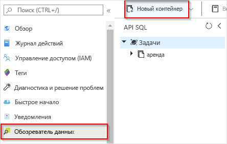
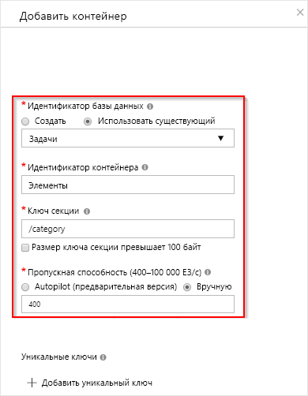

# <a name="create-a-function-triggered-by-azure-cosmos-db"></a>Создание функции, активируемой с помощью Azure Cosmos DB

Узнайте, как создать функцию, которая активируется при добавлении или изменении данных в Azure Cosmos DB. Дополнительные сведения о службе Azure Cosmos DB см. в статье [ Обработка данных бессерверных баз данных с помощью Azure Cosmos DB и Функций Azure](../cosmos-db/serverless-computing-database.md).

:::image type="content" source="./media/functions-create-cosmos-db-triggered-function/quickstart-completed.png" alt-text="Код Azure Cosmos DB":::

## <a name="prerequisites"></a>Предварительные требования

Для работы с этим руководством сделайте следующее:

+ Если у вас еще нет подписки Azure, [создайте бесплатную учетную запись](https://azure.microsoft.com/free/?WT.mc_id=A261C142F), прежде чем начинать работу.

> [!NOTE]
> [!INCLUDE [SQL API support only](../../includes/functions-cosmosdb-sqlapi-note.md)]

## <a name="sign-in-to-azure"></a>Вход в Azure

Войдите на [портал Azure](https://portal.azure.com/) с помощью своей учетной записи Azure.

## <a name="create-an-azure-cosmos-db-account"></a>создание учетной записи Azure Cosmos DB;

Перед созданием триггера необходимо получить учетную запись Azure Cosmos DB с API SQL.

[!INCLUDE [cosmos-db-create-dbaccount](../../includes/cosmos-db-create-dbaccount.md)]

## <a name="create-a-function-app-in-azure"></a>Создание приложения-функции в Azure

[!INCLUDE [Create function app Azure portal](../../includes/functions-create-function-app-portal.md)]

Затем создайте функцию в новом приложении-функции.

<a name="create-function"></a>

## <a name="create-azure-cosmos-db-trigger"></a>Создание триггера Azure Cosmos DB

1. В приложении-функции выберите **Функции** в меню слева, а затем в меню вверху выберите **Добавить**. 

1. На странице **Новая функция** введите `cosmos` в поле поиска, а затем выберите шаблон **Триггер Azure Cosmos DB**.

   :::image type="content" source="./media/functions-create-cosmos-db-triggered-function/function-choose-cosmos.png" alt-text="Страница &quot;Функции&quot; на портале Azure":::


1. Настройте новый триггер с параметрами, как показано в следующей таблице.

    | Параметр      | Рекомендуемое значение  | Описание                                |
    | ------------ | ---------------- | ------------------------------------------ |
    | **Новая функция** | Примите значение по умолчанию. | Имя функции. |
    | **Подключение к учетной записи Cosmos DB** | Примите новое имя по умолчанию. | Выберите **Создать** и **Учетная запись базы данных**, которую вы создали ранее, а затем щелкните **ОК**. Будет создан параметр приложения для подключения к учетной записи. Этот параметр используется в привязке для подключения к базе данных. |
    | **Имя базы данных** | Задания | Имя базы данных, которая включает отслеживаемую коллекцию. |
    | **Имя коллекции** | Items | Имя отслеживаемой коллекции. |
    | **Имя коллекции для аренды** | Аренда | Имя коллекции, в которой хранятся сведения об аренде. |
    | **Создать коллекцию аренды, если ее не существует** | Да | Проверяет существование коллекции аренды и автоматически создает ее при необходимости. |

    :::image type="content" source="./media/functions-create-cosmos-db-triggered-function/functions-cosmosdb-trigger-settings.png" alt-text="Создать функцию, активируемую с помощью Azure Cosmos DB":::

1. Выберите **Создать функцию**. 

    Azure создает функцию для триггера Cosmos DB.

1. Чтобы отобразить код функции на основе шаблона, выберите **Код + тестовый**.

    :::image type="content" source="./media/functions-create-cosmos-db-triggered-function/function-cosmosdb-template.png" alt-text="Шаблон функции Cosmos DB на C#":::

    Этот шаблон функции записывает в журналы количество документов и идентификатор первого документа.

Затем подключитесь к учетной записи Azure Cosmos DB и создайте контейнер `Items` в базе данных `Tasks`.

## <a name="create-the-items-container"></a>Создание контейнера элементов

1. Откройте второй экземпляр [портала Azure](https://portal.azure.com) на новой вкладке в браузере.

1. В левой части портала разверните панель значков, введите `cosmos` в поле поиска и выберите **Azure Cosmos DB**.

    

1. Выберите учетную запись Azure Cosmos DB, а затем выберите **обозреватель данных**. 

1. В разделе **API SQL** выберите базу данных **Задачи** и **Новый контейнер**.

    

1. На странице **Добавить контейнер** используйте параметры, перечисленные в таблице под изображением. 

    

    | Параметр|Рекомендуемое значение|Описание |
    | ---|---|--- |
    | **Идентификатор базы данных** | Задания |Имя новой базы данных. Должен соответствовать имени, заданному в привязке функции. |
    | **Идентификатор контейнера** | Items | Имя нового контейнера. Должен соответствовать имени, заданному в привязке функции.  |
    | **[Ключ секции](../cosmos-db/partitioning-overview.md)** | /category|Ключ секции, который равномерно распределяет данные в каждой секции. Для создания высокопроизводительного контейнера важно выбрать правильный ключ раздела. | 
    | **Пропускная способность** |400 ЕЗ| Используйте значение по умолчанию. Чтобы сократить задержку, позже вы можете увеличить масштаб пропускной способности. |    

1. Нажмите кнопку **ОК**, чтобы создать контейнер "Элементы". Процесс создания контейнера может занять некоторое время.

После создания контейнера, указанного в привязке функции, функцию можно протестировать, добавив в новый контейнер элементы.

## <a name="test-the-function"></a>Проверка функции

1. Разверните новый контейнер **Элементы** в Data Explorer, выберите **Элементы**, а затем — **Новый элемент**.

    :::image type="content" source="./media/functions-create-cosmos-db-triggered-function/create-item-in-container.png" alt-text="Создание элемента в контейнере &quot;Элементы&quot;":::

1. Замените содержимое нового элемента следующим содержимым, а затем выберите **Сохранить**.

    ```yaml
    {
        "id": "task1",
        "category": "general",
        "description": "some task"
    }
    ```

1. На портале переключитесь на первую вкладку браузера, содержащую функцию. Разверните журналы функций и убедитесь, что новый документ активировал функцию. На экране будет видно, что значение идентификатора документа `task1` записано в журналы. 

    

1. (Необязательно.) Перейдите обратно к документу, внесите изменения и нажмите кнопку **Изменить**. Затем вернитесь к журналам функций и убедитесь, что изменение также активировало функцию.

## <a name="clean-up-resources"></a>Очистка ресурсов

[!INCLUDE [Next steps note](../../includes/functions-quickstart-cleanup.md)]

## <a name="next-steps"></a>Дальнейшие действия

Вы создали функцию, которая запускается при добавлении или изменении документов в Azure Cosmos DB. Дополнительные сведения о триггерах Azure Cosmos DB см. в статье [Привязки Azure Cosmos DB для службы "Функции Azure"](functions-bindings-cosmosdb.md).

[!INCLUDE [Next steps note](../../includes/functions-quickstart-next-steps.md)]
