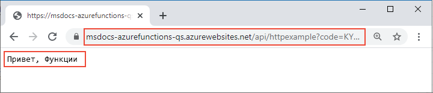

# <a name="quickstart-create-a-function-in-azure-that-responds-to-http-requests"></a>Краткое руководство. Создание функции в Azure, которая отвечает на HTTP-запросы

В этой статье используются средства командной строки для создания функции, которая отвечает на HTTP-запросы. После тестирования кода в локальной среде его необходимо развернуть в бессерверной среде Функций Azure. Выполнение этого краткого руководства предполагает небольшую дополнительную плату в несколько центов США в учетной записи Azure.

Существует также версия этой статьи для [Visual Studio Code](functions-create-first-function-vs-code.md).

## <a name="configure-your-local-environment"></a>Настройка локальной среды

Перед началом работы убедитесь, что у вас есть такие компоненты.

+ Учетная запись Azure с активной подпиской. [Создайте учетную запись](https://azure.microsoft.com/free/?ref=microsoft.com&utm_source=microsoft.com&utm_medium=docs&utm_campaign=visualstudio) бесплатно.

+ [Azure Functions Core Tools](./functions-run-local.md#v2) 2.7.1846 или версии, более поздней, чем 2.

+ Для его работы требуется [Azure CLI](/cli/azure/install-azure-cli) 2.0.76 или более поздней версии. 
::: zone pivot="programming-language-javascript,programming-language-typescript"
+ [Node.js](https://nodejs.org/), активная версия LTS и версия Maintenance LTS (рекомендуются версии 8.11.1 и 10.14.1).
::: zone-end

::: zone pivot="programming-language-python"
+ [Python 3.7](https://www.python.org/downloads/release/python-375/) или [Python 3.6](https://www.python.org/downloads/release/python-368/), поддерживаемый Функциями Azure. Python версии 3.8 и более поздних версий пока не поддерживается. 
::: zone-end
::: zone pivot="programming-language-powershell"
+ [PowerShell Core](/powershell/scripting/install/installing-powershell-core-on-windows)

+ [Пакет SDK для .NET Core 2.2 и более поздних версий](https://www.microsoft.com/net/download).
::: zone-end

### <a name="check-your-environment"></a>Проверка среды

+ В окне терминала или командном окне выполните `func --version`, чтобы убедиться, что используется Azure Functions Core Tools 2.7.1846 или версии, более поздней, чем 2.0.

+ Выполните команду `az --version`, чтобы проверить, является ли версия Azure CLI версией 2.0.76 или более поздней.

+ Выполните команду `az login`, чтобы войти в Azure и проверить активную подписку.

::: zone pivot="programming-language-javascript,programming-language-typescript"
+ Выполните команду `node --version`, чтобы убедиться, что вернется версия Node.js 8.x или 10.x.
::: zone-end
::: zone pivot="programming-language-python"
+ Выполните команду `python --version` (в ОС Linux и MacOS) или `py --version` (в ОС Windows), чтобы убедиться, что для Python возвращается версия 3.7.x или 3.6.x.

## <a name="create-venv"></a>Создание и активация виртуальной среды

В подходящей папке выполните следующие команды, чтобы создать и активировать виртуальную среду с именем `.venv`. Обязательно используйте Python 3.7 или 3.6, которые поддерживают Функции Azure.


# <a name="bash"></a>[bash](#tab/bash)

```bash
python -m venv .venv
```

```bash
source .venv/bin/activate
```

Если пакет venv не установлен Python для вашего дистрибутива Linux, выполните следующую команду:

```bash
sudo apt-get install python3-venv
```

# <a name="powershell"></a>[PowerShell](#tab/powershell)

```powershell
py -m venv .venv
```

```powershell
.venv\scripts\activate
```

# <a name="cmd"></a>[Cmd](#tab/cmd)

```cmd
py -m venv .venv
```

```cmd
.venv\scripts\activate
```

---

Все последующие команды будут выполняться в этой активированной виртуальной среде. (Чтобы выйти из виртуальной среды, выполните команду `deactivate`.)

::: zone-end

## <a name="create-a-local-function-project"></a>Создание локального проекта службы "Функции"

В Функциях Azure проект функций представляет собой контейнер для одной или нескольких отдельных функций, каждая из которых реагирует на конкретный триггер. Все функции в проекте совместно используют те же локальные конфигурации и конфигурации размещения. В этом разделе вы создадите проект функций, содержащий одну функцию.

1. В виртуальной среде выполните команду `func init`, чтобы создать проект функций в папке с именем *LocalFunctionProj* с указанной средой выполнения:

    ::: zone pivot="programming-language-python"
    ```
    func init LocalFunctionProj --python
    ```
    ::: zone-end
    ::: zone pivot="programming-language-csharp"
    ```
    func init LocalFunctionProj --dotnet
    ```
    ::: zone-end
    ::: zone pivot="programming-language-javascript"
    ```
    func init LocalFunctionProj --javascript
    ```
    ::: zone-end
    ::: zone pivot="programming-language-typescript"
    ```
    func init LocalFunctionProj --typescript
    ```
    ::: zone-end
    ::: zone pivot="programming-language-powershell"
    ```
    func init LocalFunctionProj --powershell
    ```
    ::: zone-end


    Эта папка содержит различные файлы проекта, в том числе файлы конфигурации [local.settings.json](functions-run-local.md#local-settings-file) и [host.json](functions-host-json.md). Файл *local.settings.json* может содержать секреты, скачанные из Azure, поэтому файл по умолчанию исключен из системы управления версиями в *GITIGNORE*-файле.

1. Перейдите в папку проекта:

    ```
    cd LocalFunctionProj
    ```
    
1. Добавьте функцию в проект с помощью следующей команды, где аргумент `--name` — уникальное имя функции, а аргумент `--template` указывает триггер функции. 

    ```
    func new --name HttpExample --template "HTTP trigger"
    ```

    ::: zone pivot="programming-language-csharp"
    Команда `func new` создает файл кода HttpExample.cs.
    ::: zone-end
    ::: zone pivot="programming-language-javascript,programming-language-typescript,programming-language-python,programming-language-powershell"
    Команда `func new` создает вложенную папку с именем функции. Эта папка содержит файл кода на выбранном для проекта языке и файл конфигурации *function.json*.
    ::: zone-end

### <a name="optional-examine-the-file-contents"></a>Проверка содержимого файла (дополнительно)

При необходимости можно сразу перейти к [локальному запуску функции](#run-the-function-locally) и просмотреть содержимое файла позже.

::: zone pivot="programming-language-csharp"
#### <a name="httpexamplecs"></a>HttpExample.cs

Файл *HttpExample.cs* содержит метод `Run`, получающий данные запроса в переменной `req` — это запрос [HttpRequest](/dotnet/api/microsoft.aspnetcore.http.httprequest), дополненный атрибутом **HttpTriggerAttribute**, который определяет поведение триггера. 

:::code language="csharp" source="~/functions-docs-csharp/http-trigger-template/HttpExample.cs":::

Возвращаемый объект — это [ActionResult](/dotnet/api/microsoft.aspnetcore.mvc.actionresult), который возвращает ответное сообщение в виде [OkObjectResult](/dotnet/api/microsoft.aspnetcore.mvc.okobjectresult) (200) или [BadRequestObjectResult](/dotnet/api/microsoft.aspnetcore.mvc.badrequestobjectresult) (400). Дополнительные сведения см. в статье [Триггеры и привязки HTTP в службе "Функции Azure"](/azure/azure-functions/functions-bindings-http-webhook?tabs=csharp).
::: zone-end

::: zone pivot="programming-language-python"
#### <a name="__init__py"></a>\_\_init\_\_.py

*\_\_init\_\_.py* содержит функцию Python `main()`, которая активируется в соответствии с конфигурацией в *function.json*.

:::code language="python" source="~/functions-quickstart-templates/Functions.Templates/Templates/HttpTrigger-Python/__init__.py":::

Для триггера HTTP функция получает данные запроса в переменной `req`, как определено в файле *function.json*. `req` — это экземпляр [класса azure.functions.HttpRequest](/python/api/azure-functions/azure.functions.httprequest). Возвращаемый объект, определенный как `$return` в файле *function.json*, — это экземпляр класса [azure.functions.HttpResponse](/python/api/azure-functions/azure.functions.httpresponse). Дополнительные сведения см. в статье [Триггеры и привязки HTTP в службе "Функции Azure"](/azure/azure-functions/functions-bindings-http-webhook?tabs=python).
::: zone-end

::: zone pivot="programming-language-javascript"
#### <a name="indexjs"></a>Файл index.js

Файл *index.js* экспортирует функцию, которая активируется в соответствии с конфигурацией в *function.json*.

:::code language="javascript" source="~/functions-quickstart-templates/Functions.Templates/Templates/HttpTrigger-JavaScript/index.js":::

Для триггера HTTP функция получает данные запроса в переменной `req`, как определено в файле *function.json*. Ответом является объект, определенный как `$return` в файле *function.json*. Дополнительные сведения см. в статье [Триггеры и привязки HTTP в службе "Функции Azure"](/azure/azure-functions/functions-bindings-http-webhook?tabs=javascript).
::: zone-end

::: zone pivot="programming-language-typescript"
#### <a name="indexts"></a>index.ts

Файл *index.ts* экспортирует функцию, которая активируется в соответствии с конфигурацией в *function.json*.

:::code language="typescript" source="~/functions-quickstart-templates/Functions.Templates/Templates/HttpTrigger-TypeScript/index.ts":::

Для триггера HTTP функция получает данные запроса в переменной `req` типа **HttpRequest**, как определено в файле *function.json*. Ответом является объект, определенный как `$return` в файле *function.json*. 
::: zone-end

::: zone pivot="programming-language-powershell"
#### <a name="runps1"></a>run.ps1

Файл *run.ps1* определяет скрипт функции, который активируется в соответствии с конфигурацией в *function.json*.

:::code language="powershell" source="~/functions-quickstart-templates/Functions.Templates/Templates/HttpTrigger-PowerShell/run.ps1":::

Для триггера HTTP функция получает данные запроса, переданные в параметр `$Request`, определенный в файле *function.json*. Возвращаемый объект, определенный как `Response` в файле *function.json*, передается в командлет `Push-OutputBinding` в качестве ответа. 
::: zone-end

::: zone pivot="programming-language-javascript,programming-language-typescript,programming-language-python,programming-language-powershell"
#### <a name="functionjson"></a>function.json

*function.json* — это файл конфигурации, который определяет входные и выходные данные для функции `bindings`, в том числе тип триггера. 
::: zone-end

::: zone pivot="programming-language-python"
При необходимости можно изменить `scriptFile`, чтобы вызывать другой файл Python.

:::code language="json" source="~/functions-quickstart-templates/Functions.Templates/Templates/HttpTrigger-Python/function.json":::
::: zone-end

::: zone pivot="programming-language-javascript,programming-language-typescript"
:::code language="json" source="~/functions-quickstart-templates/Functions.Templates/Templates/HttpTrigger-JavaScript/function.json":::
::: zone-end

::: zone pivot="programming-language-powershell"
:::code language="json" source="~/functions-quickstart-templates/Functions.Templates/Templates/HttpTrigger-PowerShell/function.json":::
::: zone-end

::: zone pivot="programming-language-javascript,programming-language-typescript,programming-language-python,programming-language-powershell"  
Для каждой привязки требуется направление, тип и уникальное имя. В HTTP-триггере есть входная привязка типа [`httpTrigger`](functions-bindings-http-webhook-trigger.md) и выходная привязка типа [`http`](functions-bindings-http-webhook-output.md).
::: zone-end  

[!INCLUDE [functions-run-function-test-local-cli](../../includes/functions-run-function-test-local-cli.md)]

## <a name="create-supporting-azure-resources-for-your-function"></a>Создание вспомогательных ресурсов Azure для функции

Прежде чем развернуть код функции в Azure, необходимо создать три ресурса:

- группу ресурсов — логический контейнер связанных ресурсов;
- учетную запись хранения — для сохранения состояния и других сведений о проектах;
- приложение-функцию — среду для выполнения кода функции. Оно сопоставляется с локальным проектом функций и позволяет группировать функции в логические единицы, чтобы упростить развертывание, масштабирование и совместное использование ресурсов, а также управление ими.

Для создания этих элементов используются команды интерфейса командной строки Azure. Каждая команда предоставляет выходные данные JSON после завершения.

1. Войдите в Azure с помощью команды [az login](/cli/azure/reference-index#az-login), если вы еще не сделали этого:

    ```azurecli
    az login
    ```
    
1. Создайте группу ресурсов с помощью команды [az group create](/cli/azure/group#az-group-create). В следующем примере создается группа ресурсов с именем `AzureFunctionsQuickstart-rg` в регионе `westeurope`. (Группу ресурсов и ресурсы целесообразно создавать в ближайшем к вам регионе. Для этого используйте команду `az account list-locations`.)

    ```azurecli
    az group create --name AzureFunctionsQuickstart-rg --location westeurope
    ```
    ::: zone pivot="programming-language-python"  
    > [!NOTE]
    > Вы не можете разместить приложения Windows и Linux в одной группе ресурсов. Если у вас есть группа ресурсов `AzureFunctionsQuickstart-rg` с приложением-функцией Windows или веб-приложением, необходимо использовать другую группу ресурсов.
    ::: zone-end  
    
1. В группе ресурсов создайте учетную запись хранения общего назначения и регион с помощью команды [az storage account create](/cli/azure/storage/account#az-storage-account-create). В следующем примере замените `<STORAGE_NAME>` подходящим глобально уникальным именем приложения. Имена должны содержать от трех до 24 символов и только в нижнем регистре. `Standard_LRS` указывает учетную запись общего назначения, которая [поддерживается Функциями](storage-considerations.md#storage-account-requirements).

    ```azurecli
    az storage account create --name <STORAGE_NAME> --location westeurope --resource-group AzureFunctionsQuickstart-rg --sku Standard_LRS
    ```
    
    В этом кратком руководстве с учетной записи хранения будет взиматься плата лишь в несколько центов США.
    
1. Создайте приложение-функцию с помощью команды [az functionapp create](/cli/azure/functionapp#az-functionapp-create). В примере ниже замените `<STORAGE_NAME>` именем учетной записи, использованной на предыдущем шаге, и замените `<APP_NAME>` на глобально уникальное имя, подходящее вам. `<APP_NAME>` также является доменом DNS по умолчанию для приложения-функции. 

    ::: zone pivot="programming-language-python"  
    Если вы используете Python 3.6, также измените `--runtime-version` на `3.6`.

    ```azurecli
    az functionapp create --resource-group AzureFunctionsQuickstart-rg --os-type Linux --consumption-plan-location westeurope --runtime python --runtime-version 3.7 --functions_version 2 --name <APP_NAME> --storage-account <STORAGE_NAME>
    ```
    ::: zone-end  

    ::: zone pivot="programming-language-javascript,programming-language-typescript"  
    Если вы используете Node.js 8, также измените `--runtime-version` на `8`.

    
    ```azurecli
    az functionapp create --resource-group AzureFunctionsQuickstart-rg --consumption-plan-location westeurope --runtime node --runtime-version 10 --functions_version 2 --name <APP_NAME> --storage-account <STORAGE_NAME>
    ```
    ::: zone-end  

    ::: zone pivot="programming-language-csharp"  
    ```azurecli
    az functionapp create --resource-group AzureFunctionsQuickstart-rg --consumption-plan-location westeurope --runtime dotnet --functions_version 2 --name <APP_NAME> --storage-account <STORAGE_NAME>
    ```
    ::: zone-end  
    
    ::: zone pivot="programming-language-powershell"  
    ```azurecli
    az functionapp create --resource-group AzureFunctionsQuickstart-rg --consumption-plan-location westeurope --runtime powershell --functions_version 2 --name <APP_NAME> --storage-account <STORAGE_NAME>
    ```
    ::: zone-end  

    Эта команда создает приложение-функцию, работающее в указанной языковой среде выполнения в рамках [плана использования Функций Azure](functions-scale.md#consumption-plan), который не предусматривает плату за объем, используемый здесь. Эта команда также подготавливает связанный экземпляр Application Insights Azure в той же группе ресурсов. Его можно использовать для мониторинга приложения-функции и просмотра журналов. Дополнительные сведения см. в разделе [Мониторинг функций Azure](functions-monitoring.md). Этот экземпляр не создает затраты, пока вы не активируете его.
    
## <a name="deploy-the-function-project-to-azure"></a>Развертывание проекта функций в Azure

::: zone pivot="programming-language-typescript"  
Прежде чем использовать Core Tools для развертывания проекта в Azure, создайте готовую к работе сборку файлов JavaScript из исходных файлов TypeScript.

Следующая команда подготавливает проект TypeScript к развертыванию:

```
npm run build:production 
```
::: zone-end  

Теперь, когда необходимые ресурсы готовы, вы можете развернуть проект локальных функций в приложении-функции в Azure с помощью команды [func azure functionapp publish](functions-run-local.md#project-file-deployment). В следующем примере замените `<APP_NAME>` на имя своего приложения.

```
func azure functionapp publish <APP_NAME>
```

Если отображается сообщение об ошибке Can't find app with name... (Не удалось найти приложение с именем...), подождите несколько секунд и повторите попытку. Возможно, в Azure не полностью инициализировано приложение после выполнения предыдущей команды `az functionapp create`.

Команда publish показывает результаты, аналогичные приведенным ниже (усечены для простоты):

<pre>
...

Getting site publishing info...
Creating archive for current directory...
Performing remote build for functions project.

...

Deployment successful.
Remote build succeeded!
Syncing triggers...
Functions in msdocs-azurefunctions-qs:
    HttpExample - [httpTrigger]
        Invoke url: https://msdocs-azurefunctions-qs.azurewebsites.net/api/httpexample?code=KYHrydo4GFe9y0000000qRgRJ8NdLFKpkakGJQfC3izYVidzzDN4gQ==
</pre>

## <a name="invoke-the-function-on-azure"></a>Вызов функции в Azure

Функция использует триггер HTTP, поэтому ее необходимо вызывать через HTTP-запрос по URL-адресу в браузере или с помощью такого средства, как cURL. Во всех экземплярах параметр URL-адреса `code` является уникальным [ключом функции](functions-bindings-http-webhook-trigger.md#authorization-keys), который разрешает вызов конечной точки функции.

# <a name="browser"></a>[Браузер](#tab/browser)

Скопируйте полный URL-адрес вызова **Invoke URL**, показанный в выходных данных команды publish, в адресную строку браузера, добавив параметр запроса `&name=Functions`. В браузере должны отображаться выходные данные, аналогичные данным при локальном запуске функции.




# <a name="curl"></a>[curl](#tab/curl)

Запустите [`curl`](https://curl.haxx.se/), используя **Invoke URL** и добавив параметр `&name=Functions`. Результатом выполнения этой команды должен быть текст Hello Functions.


---

> [!TIP]
> Чтобы просматривать журналы для опубликованного приложения-функции, которые ведутся практически в режиме реального времени, используйте [Live Metrics Stream для Application Insights](functions-monitoring.md#streaming-logs).

## <a name="clean-up-resources"></a>Очистка ресурсов

При переходе к следующему шагу, [Добавление выходной привязки очереди службы хранилища Azure](functions-add-output-binding-storage-queue-cli.md), вам потребуется сохранить все ресурсы, чтобы использовать их в будущем.

В противном случае используйте следующую команду, чтобы удалить группу ресурсов и все содержащиеся в ней ресурсы и избежать дополнительных расходов.

```azurecli
az group delete --name AzureFunctionsQuickstart-rg
```

## <a name="next-steps"></a>Дальнейшие действия

> [!div class="nextstepaction"]
> [Подключение Функций Azure к службе хранилища Azure с помощью средств командной строки](functions-add-output-binding-storage-queue-cli.md)
