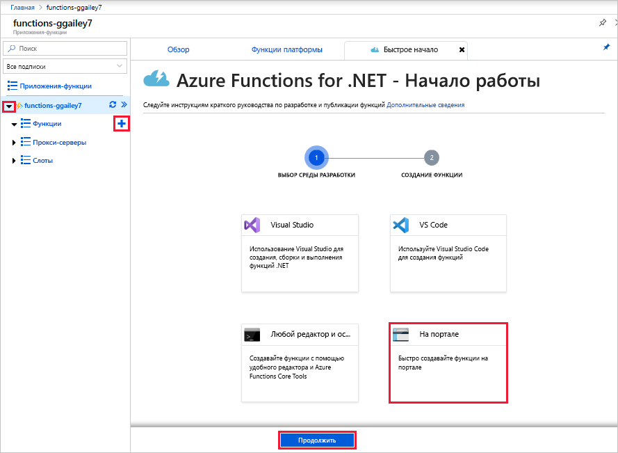
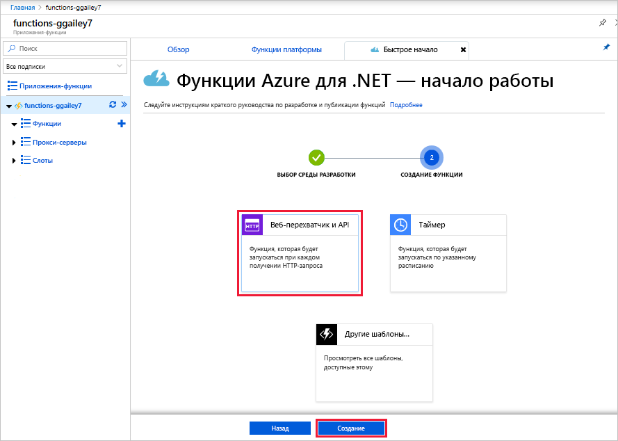
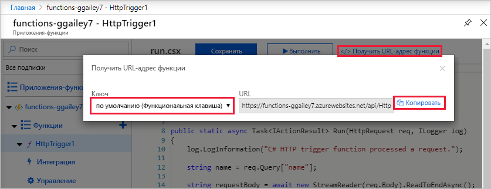
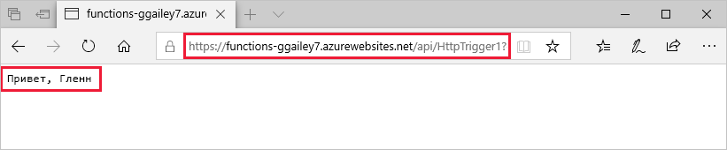
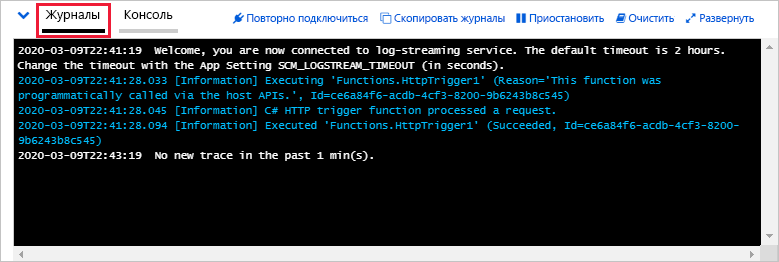

# Создание первой функции на портале Azure

Решение "Функции Azure" позволяет выполнять код в [бессерверной](https://azure.microsoft.com/solutions/serverless/) среде без необходимости создавать виртуальную машину или публиковать веб-приложение. В этой статье описано, как создать функцию Hello World на портале Azure с помощью Функций.

[!INCLUDE [quickstarts-free-trial-note](../../includes/quickstarts-free-trial-note.md)]

> [!NOTE]
> Разработчики C# могут [создать функцию в Visual Studio 2019](functions-create-your-first-function-visual-studio.md), а не на портале. 

## Вход в Azure

Войдите на портал Azure по адресу <https://portal.azure.com> с помощью своей учетной записи Azure.

## Создание приложения-функции

Для выполнения функций вам понадобится приложение-функция, позволяющее группировать функции в логические единицы и упростить развертывание и совместное использование ресурсов, а также управление ими. 

[!INCLUDE [Create function app Azure portal](../../includes/functions-create-function-app-portal.md)]

Затем создайте функцию в новом приложении-функции.

## Создание функции, активируемой HTTP

1. Раскройте свое приложение-функцию, а затем нажмите кнопку **+** рядом с **Функции**, выберите **На портале** и далее **Продолжить**.

    

1. Выберите **Веб-перехватчик + API**, а затем нажмите **Создать**.

    

Будет создана функция на основе шаблона функции с активацией по HTTP для конкретного языка.

Теперь вы можете запустить новую функцию, отправив HTTP-запрос.

## Проверка функции

1. В новой функции щелкните **</> Get function URL** (Получить URL-адрес функции), выберите **default (Function key)** (По умолчанию (ключ функции)) и щелкните **Копировать**. 

    

2. Вставьте URL-адрес функции в адресную строку браузера. Добавьте значение строки запроса `&name=<yourname>` в конец этого URL-адреса и нажмите клавишу `Enter` на клавиатуре, чтобы выполнить этот запрос. В браузере должен отобразиться ответ, возращенный функцией.  

    Следующий пример демонстрирует ответ в браузере:

    

    URL-адрес запроса включает ключ, который по умолчанию необходим для доступа к функции по протоколу HTTP.

3. При выполнении функции сведения о трассировке записываются в журналы. Для просмотра выходных данных трассировки из предыдущего выполнения вернитесь к своей функции на портале и щелкните стрелку в нижней части экрана, чтобы развернуть раздел **Журналы**.

   

## Очистка ресурсов

[!INCLUDE [Clean-up resources](../../includes/functions-quickstart-cleanup.md)]

## Дополнительная информация

Вы создали приложение-функцию с простой функцией, активируемой HTTP.  

[!INCLUDE [Next steps note](../../includes/functions-quickstart-next-steps.md)]

Дополнительные сведения см. в статье [Привязки HTTP функций Azure](functions-bindings-http-webhook.md).
