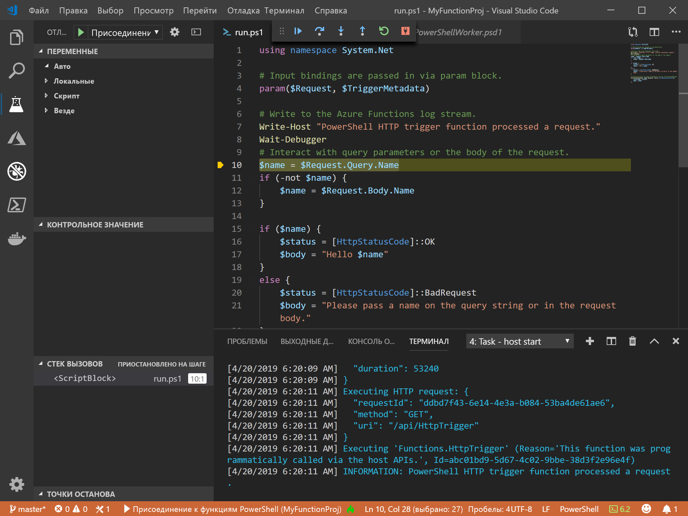
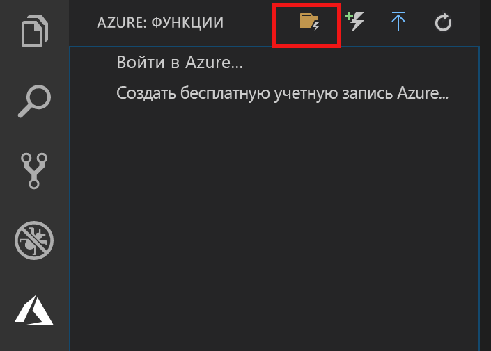
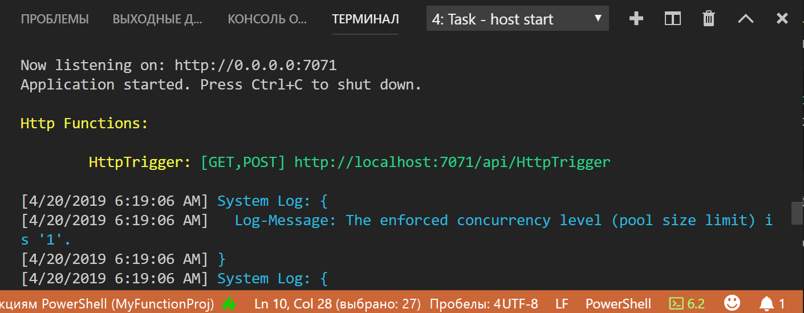

# <a name="create-your-first-powershell-function-in-azure-preview"></a>Создание первой функции PowerShell в Azure (предварительная версия)

[!INCLUDE [functions-powershell-preview-note](../../includes/functions-powershell-preview-note.md)]

В этом кратком руководстве содержатся инструкции по созданию первой [безсерверной](https://azure.com/serverless) функции PowerShell с помощью кода Visual Studio.



Вы используете раздел [Расширение "Функции Azure" для Visual Studio Code], чтобы создать функцию PowerShell локально, а затем развернуть ее в новом приложении-функции Azure. Расширение сейчас доступно в режиме предварительной версии. Дополнительные сведения см. в разделе [Расширение "Функции Azure" для Visual Studio Code].

> [!NOTE]  
> Поддержка PowerShell для [Расширения "Функции Azure"][расширение "функции azure" для visual studio code] в настоящее время отключена по умолчанию. Включение поддержки PowerShell является одним из шагов в этой статье.

Следующие шаги поддерживаются в операционных системах MacOS, Windows и Linux.

## <a name="prerequisites"></a>Предварительные требования

Для работы с этим кратким руководством сделайте следующее:

* Установите [PowerShell Core](/powershell/scripting/install/installing-powershell#powershell-core)

* Установите [Visual Studio Code](https://code.visualstudio.com/) на одной из [поддерживаемых платформ](https://code.visualstudio.com/docs/supporting/requirements#_platforms). 

* Установите [Расширение PowerShell для Visual Studio Code](https://marketplace.visualstudio.com/items?itemName=ms-vscode.PowerShell).

* Установите [.NET Core SDK 2.2+](https://www.microsoft.com/net/download) (требуется для основных инструментов Функций Azure и доступных на всех поддерживаемых платформах).

* Установите [Основные инструменты Функции Azure](functions-run-local.md#v2) версии 2.x.

* Вам также потребуется действующая подписка Azure.

[!INCLUDE [quickstarts-free-trial-note](../../includes/quickstarts-free-trial-note.md)]

[!INCLUDE [functions-install-vs-code-extension](../../includes/functions-install-vs-code-extension.md)] 

## <a name="create-a-function-app-project"></a>Создание проекта приложения-функции

С помощью шаблона проекта Функции Azure в Visual Studio Code можно создать проект и затем опубликовать его в виде приложения-функции в Azure. Приложение-функция позволяет группировать функции в логические единицы для развертывания и совместного использования ресурсов, а также управления ими. 

1. В Visual Studio Code выберите логотип Azure, чтобы отобразить область **Функций Azure**, а затем нажмите значок "Создать новый проект".

    

1. Выберите расположение для рабочей области проекта "Функции" и нажмите **Выбрать**.

    > [!NOTE]
    > Рассматриваемый в этой статье пример выполняется вне рабочей области. В этом случае не нужно указывать папку проекта, которая является частью рабочей области.

1. Выберите **Powershell (предварительная версия)** в качестве языка для проекта приложения-функций, а затем выберите  **Функции Azure версия 2**.

1. Выберите **Триггер HTTP** в качестве шаблона для первой функции, `HTTPTrigger` в качестве имени функции, а также выберите уровень авторизации **Функция**.

    > [!NOTE]
    > При вызове конечной точки функции в Azure уровень авторизации **Функция** требует значения [функциональной клавиши](functions-bindings-http-webhook.md#authorization-keys). Это усложняет вызов вашей функции для остальных пользователей.

1. Когда появится запрос, выберите **Add to workspace** (Добавить в рабочую область).

Visual Studio Code создает проект приложение-функция PowerShell в новой рабочей области. Этот проект содержит файлы конфигурации [host.json](functions-host-json.md) и [local.settings.json](functions-run-local.md#local-settings-file), которые применяются ко всем функциям в проекте. [Проект PowerShell](functions-reference-powershell.md#folder-structure) — аналогичен приложению-функции, работающему в Azure.

## <a name="run-the-function-locally"></a>Локальное выполнение функции

Основные инструменты Функций Azure интегрируются с Visual Studio Code, что дает возможность запускать и отлаживать проект Функций Azure локально.  

1. Чтобы отладить свою функцию, вставьте вызов командлета [`Wait-Debugger`] в код функции, прежде чем подключить отладчик, затем нажмите клавишу F5, чтобы запустить проект приложения-функции и подключить отладчик. Выходные данные основных инструментов отображаются на панели **Terminal** (Терминал).

1. На панели **Terminal** (Терминал) скопируйте URL-адрес конечной точки функции, активируемой HTTP-запросом.

    

1. Добавьте строку запроса `?name=<yourname>` к этому URL-адресу, а затем используйте `Invoke-RestMethod` для выполнения запроса, как показано ниже.

    ```powershell
    PS > Invoke-RestMethod -Method Get -Uri http://localhost:7071/api/HttpTrigger?name=PowerShell
    Hello PowerShell
    ```

    Вы также можете выполнить запрос GET в браузере.

    Когда вы вызываете конечную точку HttpTrigger, не передавая `name` в качестве параметра запроса или в теле, функция возвращает ошибку 500. Когда вы просматриваете код в run.ps1, вы поймете, что эта ошибка возникла намеренно.

1. Нажмите клавиши SHIFT+F5, чтобы остановить отладку.

Убедившись, что функция выполняется правильно на локальном компьютере, опубликуйте проект в Azure.

> [!NOTE]
> Не забудьте удалить все вызовы `Wait-Debugger` перед публикацией своих функций в Azure. 

> [!NOTE]
> При создании приложения-функции в Azure будет запрашиваться только его имя. Задайте значение true для azureFunctions.advancedCreation для возможности запрашивать все остальные значения.

[!INCLUDE [functions-publish-project-vscode](../../includes/functions-publish-project-vscode.md)]

## <a name="test"></a>Запуск функции в Azure

Чтобы убедиться, что опубликованная функция выполняется в Azure, выполните следующую команду PowerShell, заменив параметр `Uri` URL-адресом функции HTTPTrigger из предыдущего шага. Как прежде, добавьте строку запроса `&name=<yourname>` URL-адресу, как показано в следующем примере.

```powershell
PS > Invoke-WebRequest -Method Get -Uri "https://glengatest-vscode-powershell.azurewebsites.net/api/HttpTrigger?code=nrY05eZutfPqLo0som...&name=PowerShell"

StatusCode        : 200
StatusDescription : OK
Content           : Hello PowerShell
RawContent        : HTTP/1.1 200 OK
                    Content-Length: 16
                    Content-Type: text/plain; charset=utf-8
                    Date: Thu, 25 Apr 2019 16:01:22 GMT

                    Hello PowerShell
Forms             : {}
Headers           : {[Content-Length, 16], [Content-Type, text/plain; charset=utf-8], [Date, Thu, 25 Apr 2019 16:01:22 GMT]}
Images            : {}
InputFields       : {}
Links             : {}
ParsedHtml        : mshtml.HTMLDocumentClass
RawContentLength  : 16
```

## <a name="next-steps"></a>Дополнительная информация

Вы использовали Visual Studio Code для создания приложения-функции PowerShell с простой функцией, запускаемой по протоколу HTTP. Возможно, вы также захотите узнать подробнее об [отладке функции PowerShell локально](functions-debug-powershell-local.md), используя основные инструменты Функций Azure. Ознакомьтесь с [руководством разработчика PowerShell для Функций Azure](functions-reference-powershell.md).

> [!div class="nextstepaction"]
> [Включение интеграции с Application Insights](functions-monitoring.md#manually-connect-an-app-insights-resource)

[Azure portal]: https://portal.azure.com
[Azure Functions Core Tools]: functions-run-local.md
[Расширение "Функции Azure" для Visual Studio Code]: https://marketplace.visualstudio.com/items?itemName=ms-azuretools.vscode-azurefunctions
[`Wait-Debugger`]: /powershell/module/microsoft.powershell.utility/wait-debugger?view=powershell-6
