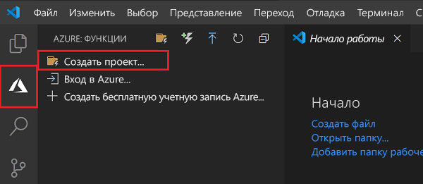
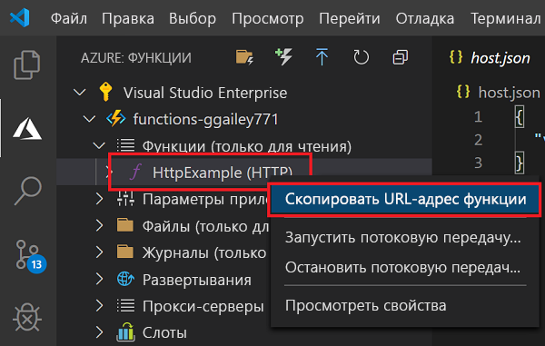

# Краткое руководство. Создание проекта Функций Azure в Visual Studio Code

В этой статье вы узнаете, как создать функцию, которая отвечает на HTTP-запросы, используя Visual Studio Code. После тестирования кода в локальной среде его необходимо развернуть в бессерверной среде Функций Azure. Выполнение этого краткого руководства предполагает небольшую дополнительную плату в несколько центов США в учетной записи Azure. 

Существует также версия этой статьи для [интерфейса командной строки](functions-create-first-azure-function-azure-cli.md).

## Настройка среды

Перед началом работы убедитесь, что выполнены следующие предварительные требования.

+ Учетная запись Azure с активной подпиской. [Создайте учетную запись](https://azure.microsoft.com/free/?ref=microsoft.com&utm_source=microsoft.com&utm_medium=docs&utm_campaign=visualstudio) бесплатно.

::: zone pivot="programming-language-csharp,programming-language-powershell,programming-language-python"  
+ [Node.js](https://nodejs.org/), необходимый Windows для npm. Только [Активная версия LTS и версия Maintenance LTS ](https://nodejs.org/about/releases/). Используйте команду `npm --version`, чтобы проверить установленную версию.
    Не требуется для локальной разработки на MacOS и Linux.   
::: zone-end  
::: zone pivot="programming-language-javascript,programming-language-typescript"  
+ [Node.js](https://nodejs.org/), активная версия LTS и версия Maintenance LTS (рекомендуется 10.14.1). Используйте команду `npm --version`, чтобы проверить установленную версию.
::: zone-end 
::: zone pivot="programming-language-python"
+ Функции Azure (x64) поддерживают версии [Python 3.8](https://www.python.org/downloads/release/python-381/), [Python 3.7](https://www.python.org/downloads/release/python-375/) и [Python 3.6](https://www.python.org/downloads/release/python-368/).
::: zone-end   
::: zone pivot="programming-language-powershell"
+ [PowerShell Core](/powershell/scripting/install/installing-powershell-core-on-windows)

+ [Пакет SDK для .NET Core 2.2 и более поздних версий](https://www.microsoft.com/net/download).  
::: zone-end  
+ [Visual Studio Code](https://code.visualstudio.com/) на одной из [поддерживаемых платформ](https://code.visualstudio.com/docs/supporting/requirements#_platforms).  
::: zone pivot="programming-language-csharp"  
+ [Расширение C#](https://marketplace.visualstudio.com/items?itemName=ms-dotnettools.csharp) для Visual Studio Code.  
::: zone-end  
::: zone pivot="programming-language-python"
+ [Расширение Python](https://marketplace.visualstudio.com/items?itemName=ms-python.python) для Visual Studio Code.  
::: zone-end  
::: zone pivot="programming-language-powershell"
+ [Расширение PowerShell для Visual Studio Code](https://marketplace.visualstudio.com/items?itemName=ms-vscode.PowerShell).  
::: zone-end  

+ [Расширение "Функции Azure"](https://marketplace.visualstudio.com/items?itemName=ms-azuretools.vscode-azurefunctions) для Visual Studio Code. 

## Создание локального проекта 

В этом разделе вы используете Visual Studio Code, чтобы создать локальный проект Функций Azure на выбранном языке. Далее в этой статье вы опубликуете код функции в Azure. 

1. Щелкните значок Azure на панели действий, а затем в области **Azure: Functions** (Azure: Функции) щелкните значок **Создать проект...** .

    

1. Выберите расположение для рабочей области проекта и нажмите кнопку **Выбрать**.

    > [!NOTE]
    > Рассматриваемые в этой статье шаги выполняются вне рабочей области. В этом случае не нужно указывать папку проекта, которая является частью рабочей области.

1. Введите следующие сведения по соответствующим запросам:

    ::: zone pivot="programming-language-csharp"
    + **Выберите язык для проекта приложения-функции**: Выберите `C#`.
    ::: zone-end
    ::: zone pivot="programming-language-javascript"
    + **Выберите язык для проекта приложения-функции**: Выберите `JavaScript`.
    ::: zone-end
    ::: zone pivot="programming-language-typescript"
    + **Выберите язык для проекта приложения-функции**: Выберите `TypeScript`.
    ::: zone-end
    ::: zone pivot="programming-language-powershell"
    + **Выберите язык для проекта приложения-функции**: Выберите `PowerShell`.
    ::: zone-end
    ::: zone pivot="programming-language-python"
    + **Выберите язык для проекта приложения-функции**: Выберите `Python`.

    + **Выберите псевдоним Python для создания виртуальной среды**. Выберите расположение интерпретатора Python. Если расположение не отображается, введите полный путь к двоичному файлу Python.  
    ::: zone-end

    + **Выберите шаблон для первой функции вашего проекта**. Выберите `HTTP trigger`.
    
    + **Укажите имя функции**. Введите `HttpExample`.
    
    ::: zone pivot="programming-language-csharp"
    + **Укажите пространство имен**. Введите `My.Functions`. 
    ::: zone-end

    + **Уровень авторизации**: выберите `Anonymous`, что позволит любому пользователю вызывать конечную точку функции. Дополнительные сведения об уровне авторизации см. в разделе [Authorization keys](functions-bindings-http-webhook-trigger.md#authorization-keys) (Ключи авторизации).

    + **Выберите, как вы хотели бы открыть свой проект**. Выберите `Add to workspace`.

1. Используя эти сведения, Visual Studio Code создает проект функций Azure с триггером HTTP. Файлы локального проекта можно просмотреть в Explorer. Дополнительные сведения см. в разделе [Generated project files](functions-develop-vs-code.md#generated-project-files) (Созданные файлы проекта). 

::: zone pivot="programming-language-csharp,programming-language-javascript,programming-language-python"

[!INCLUDE [functions-run-function-test-local-vs-code](../../includes/functions-run-function-test-local-vs-code.md)]

::: zone-end

::: zone pivot="programming-language-powershell"

[!INCLUDE [functions-run-function-test-local-vs-code-ps](../../includes/functions-run-function-test-local-vs-code-ps.md)]

::: zone-end

Убедившись, что функция выполняется правильно на локальном компьютере, опубликуйте проект в Azure с помощью Visual Studio Code. 

[!INCLUDE [functions-sign-in-vs-code](../../includes/functions-sign-in-vs-code.md)]

[!INCLUDE [functions-publish-project-vscode](../../includes/functions-publish-project-vscode.md)]

## Запуск функции в Azure

1. Вернитесь в область **Azure: Functions** (Azure: Функции) на панели слева и откройте новое приложение-функцию в своей подписке. Разверните **Функции**, щелкните правой кнопкой мыши (Windows) или щелкните при зажатой клавише Ctrl (MacOS) элемент **HttpExample**, а затем выберите команду **Copy function URL** (Копировать URL-адрес функции).

    

1. Вставьте этот URL-адрес для HTTP-запроса в адресную строку браузера, добавьте строку запроса `name` в качестве `?name=Functions` в конец этого URL-адреса, а затем выполните запрос. URL-адрес для вызова функции, активируемой HTTP-запросом, должен быть указан в таком формате:

        http://<functionappname>.azurewebsites.net/api/httpexample?name=Functions 
        
    В примере ниже показан ответ в браузере на удаленный запрос GET, возвращаемый функцией: 

    

## Очистка ресурсов

При переходе к следующему шагу, [Подключение функции к службе хранилища Azure с помощью Visual Studio Code](functions-add-output-binding-storage-queue-vs-code.md), вам потребуется сохранить все ресурсы, чтобы использовать их в будущем.

В противном случае выполните следующие действия, чтобы удалить приложение-функцию и связанные с ним ресурсы и избежать дополнительных расходов.

[!INCLUDE [functions-cleanup-resources-vs-code.md](../../includes/functions-cleanup-resources-vs-code.md)]

Дополнительные сведения о затратах на использование Функций см. в статье [Estimating Consumption plan costs](functions-consumption-costs.md) (Оценка затрат на план потребления).

## Дальнейшие действия

С помощью Visual Studio Code вы создали приложение-функцию с простой функцией, активируемой HTTP-запросом. В следующей статье вы расширите эту функцию, добавив выходную привязку. Эта привязка записывает строку из HTTP-запроса в сообщение очереди Хранилища очередей Azure. 

> [!div class="nextstepaction"]
> [Connect functions to Azure Storage using Visual Studio Code](functions-add-output-binding-storage-queue-vs-code.md) (Подключение функций к службе хранилища Azure с помощью Visual Studio Code)

[Azure Functions Core Tools]: functions-run-local.md
[Azure Functions extension for Visual Studio Code]: https://marketplace.visualstudio.com/items?itemName=ms-azuretools.vscode-azurefunctions
