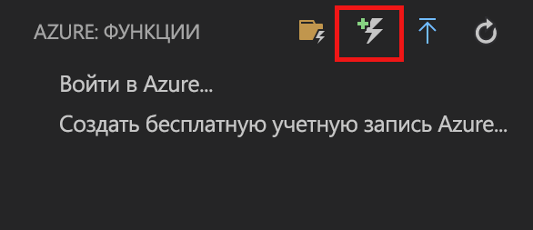
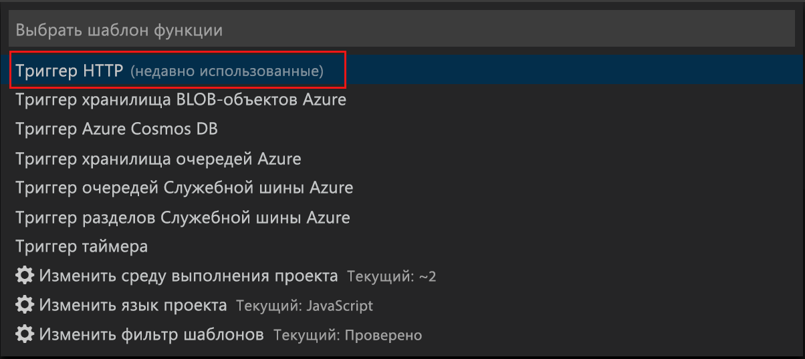
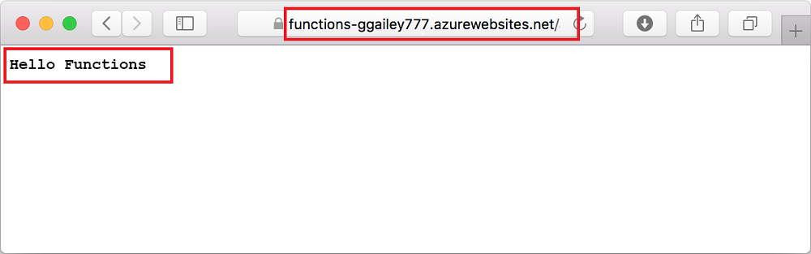

# Создание функции в Azure с помощью Visual Studio Code

Решение "Функции Azure" позволяет выполнять код в [бессерверной](https://azure.microsoft.com/solutions/serverless/) среде без необходимости создавать виртуальную машину или публиковать веб-приложение.

В этой статье описано, как с помощью [Расширение "Функции Azure" для Visual Studio Code] создать и проверить функцию Hello World на локальном компьютере с помощью Microsoft Visual Studio Code. Затем вы опубликуете код функции в Azure.

Сейчас это расширение поддерживает функции C#, JavaScript и Java. Описанные в этой статье шаги могут различаться в зависимости от выбранного языка для проекта Функции Azure. Расширение сейчас доступно в режиме предварительной версии. Дополнительные сведения см. в разделе [Расширение "Функции Azure" для Visual Studio Code].

## Предварительные требования

Для работы с этим кратким руководством сделайте следующее:

* Установите [Visual Studio Code](https://code.visualstudio.com/) на одной из [поддерживаемых платформ](https://code.visualstudio.com/docs/supporting/requirements#_platforms). В нашем в статье примере функция создавалась и тестировалась на устройстве под управлением macOS (High Sierra).

* Установите [основные инструменты расширения "Функции Azure"](functions-run-local.md#v2) версии 2.x, имеющей статус предварительной.

* Установите необходимые дополнительные средства для выбранного языка:

    | Язык | Добавочный номер |
    | -------- | --------- |
    | **C#** | [C# для Visual Studio Code](https://marketplace.visualstudio.com/items?itemName=ms-vscode.csharp); [Средства .NET Core CLI](https://docs.microsoft.com/dotnet/core/tools/?tabs=netcore2x)*   |
    | **Java** | [Отладчик для Java](https://marketplace.visualstudio.com/items?itemName=vscjava.vscode-java-debug) [Java 8](https://aka.ms/azure-jdks); [Maven 3+](https://maven.apache.org/) |
    | **JavaScript** | [Node 8.0+](https://nodejs.org/)  |

    \* Также требуется для основных инструментов.

[!INCLUDE [quickstarts-free-trial-note](../../includes/quickstarts-free-trial-note.md)]

[!INCLUDE [functions-install-vs-code-extension](../../includes/functions-install-vs-code-extension.md)]

[!INCLUDE [functions-create-function-app-vs-code](../../includes/functions-create-function-app-vs-code.md)]

## Создание функции, активируемой HTTP

1. В расширении "**Функции Azure**" щелкните значок Create Function (Создать функцию).

    

1. Укажите папку со своим проектом приложения-функции и выберите шаблон функции **HTTP trigger** (Триггер HTTP).

    

1. Введите `HTTPTrigger`, чтобы задать имя функции и нажмите клавишу ВВОД, после чего укажите способ проверки подлинности **Anonymous** (Анонимно).

    

    С помощью шаблона функции, активируемой HTTP-запросом, будет создана функция на выбранном вами языке.

    

К функции можно добавить входные и выходные привязки, изменив файл function.json. См. дополнительные сведения о [триггерах и привязках в Функциях Azure](functions-triggers-bindings.md).

Созданный проект функции и функцию, активируемую HTTP, можно протестировать на локальном компьютере.

## Локальное тестирование функции

Основные инструменты службы "Функции Azure" позволяют запускать проекты функций Azure на локальном компьютере разработчика. Вам будет предложено установить эти инструменты при первом запуске функции из Visual Studio Code.  

1. Чтобы протестировать созданную функцию, установите точку останова в коде функции и нажмите клавишу F5 для запуска проекта приложения-функции. Выходные данные основных инструментов отображаются на панели **Terminal** (Терминал).

1. На панели **Terminal** (Терминал) скопируйте URL-адрес конечной точки функции, активируемой HTTP-запросом.

    

1. Вставьте URL-адрес запроса в адресную строку браузера. Добавьте строку запроса `?name=<yourname>` в этот URL-адрес и выполните запрос. Выполнение функции приостановится при достижении точки останова.

    

1. При продолжении выполнения функции в браузере отобразится следующий ответ на запрос GET:

    

1. Нажмите клавиши SHIFT+F1, чтобы остановить отладку.

Убедившись, что функция выполняется правильно на локальном компьютере, опубликуйте проект в Azure.

[!INCLUDE [functions-sign-in-vs-code](../../includes/functions-sign-in-vs-code.md)]

[!INCLUDE [functions-publish-project-vscode](../../includes/functions-publish-project-vscode.md)]

## Тестирование функции в Azure

1. Скопируйте URL-адрес HTTP-триггера на панели **Output** (Выходные данные). Как и в предыдущем случае, добавьте строку запроса `?name=<yourname>` в конец этого URL-адреса и выполните запрос.

    URL-адрес для вызова функции, активируемой HTTP-запросом, должен быть указан в таком формате:

        http://<functionappname>.azurewebsites.net/api/<functionname>?name=<yourname> 

1. Вставьте этот URL-адрес HTTP-запроса в адресную строку браузера. Ниже показан ответ в браузере на удаленный запрос GET, возвращаемый функцией: 

    

## Дополнительная информация

С помощью Visual Studio Code вы создали приложение-функцию с простой функцией, активируемой HTTP-запросом. Дополнительные сведения о разработке функций на определенном языке см. в справочниках по языкам [JavaScript](functions-reference-node.md), [.NET](functions-dotnet-class-library.md) или [Java](functions-reference-java.md).

Далее можно узнать о локальном тестировании и отладке из терминала или командной строки основных инструментов "Функций Azure".

> [!div class="nextstepaction"]
> [Создание и тестирование кода на локальном компьютере](functions-run-local.md)

[Azure Functions Core Tools]: functions-run-local.md
[Расширение "Функции Azure" для Visual Studio Code]: https://marketplace.visualstudio.com/items?itemName=ms-azuretools.vscode-azurefunctions
