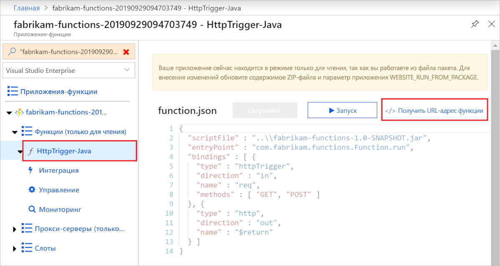

# <a name="quickstart-use-java-and-maven-to-create-and-publish-a-function-to-azure"></a>Краткое руководство. Создание и публикация функции в Azure с помощью Java и Maven

В этой статье описано, как создать и опубликовать функцию Java в службе "Функции Azure" с помощью средства командной строки Maven. После завершения этого руководства код функции будет выполняться в Azure в [бессерверном плане потребления](functions-scale.md#consumption-plan) с активацией по HTTP-запросу.

<!--
> [!NOTE] 
> You can also create a Kotlin-based Azure Functions project by using the azure-functions-kotlin-archetype instead. Visit the [GitHub repository](https://github.com/microsoft/azure-maven-archetypes/tree/develop/azure-functions-kotlin-archetype) for more information.
-->

## <a name="prerequisites"></a>Предварительные требования

Для разработки функций с помощью Java, должны быть установлены следующие компоненты:

- [Java Developer Kit (JDK)](https://aka.ms/azure-jdks) версии 8.
- [Apache Maven](https://maven.apache.org) 3.0 или более поздней версии.
- [Интерфейс командной строки Azure]
- [Azure Functions Core Tools](./functions-run-local.md#v2) 2.6.666 или более поздней версии.
- Подписка Azure.

[!INCLUDE [quickstarts-free-trial-note](../../includes/quickstarts-free-trial-note.md)]


> [!IMPORTANT]
> Переменной среде JAVA_HOME необходимо присвоить расположение установки JDK, чтобы завершить выполнение заданий этого краткого руководства.

## <a name="generate-a-new-functions-project"></a>Создание нового проекта функций

В пустой папке выполните следующую команду, чтобы создать проект функций из [архетипа Maven](https://maven.apache.org/guides/introduction/introduction-to-archetypes.html).

### <a name="linuxmacos"></a>Linux/macOS

```bash
mvn archetype:generate \
    -DarchetypeGroupId=com.microsoft.azure \
    -DarchetypeArtifactId=azure-functions-archetype 
```

> [!NOTE]
> Если не удается запустить команду, проверьте, какая версия `maven-archetype-plugin` используется. Так как команда выполняется в пустом каталоге без файла `.pom`, она может пытаться использовать более старую версию плагина из расположения `~/.m2/repository/org/apache/maven/plugins/maven-archetype-plugin`, если вы обновили Maven из предыдущей версии. В таком случае попробуйте удалить каталог `maven-archetype-plugin` и повторно выполнить команду.

### <a name="windows"></a>Windows

```powershell
mvn archetype:generate `
    "-DarchetypeGroupId=com.microsoft.azure" `
    "-DarchetypeArtifactId=azure-functions-archetype"
```

```cmd
mvn archetype:generate ^
    "-DarchetypeGroupId=com.microsoft.azure" ^
    "-DarchetypeArtifactId=azure-functions-archetype"
```

Maven запрашивает значения, которые позволят завершить создание проекта развертывания. Предоставьте следующие значения в ответ на соответствующие запросы:

| Значение | ОПИСАНИЕ |
| ----- | ----------- |
| **groupId** | Это значение уникально идентифицирует проект среди всех остальных. Оно должно соответствовать [правилам именования пакетов](https://docs.oracle.com/javase/specs/jls/se6/html/packages.html#7.7) для Java. В примерах, приведенных в этом кратком руководстве, используется `com.fabrikam.functions`. |
| **artifactId** | Это значение содержит имя JAR-файла, без номера версии. В примерах, приведенных в этом кратком руководстве, используется `fabrikam-functions`. |
| **version** | Выберите значение по умолчанию `1.0-SNAPSHOT`. |
| **package** | Это значение определяет пакет Java для создаваемого кода функции. Используйте значение по умолчанию. В примерах, приведенных в этом кратком руководстве, используется `com.fabrikam.functions`. |
| **appName** | Глобально уникальное имя для нового приложения-функции в Azure. Сохраните значение по умолчанию, которое составляется из значения _artifactId_ и случайного числа. Запишите это значение, так как оно потребуется позднее. |
| **appRegion** | Выберите ближайший [регион](https://azure.microsoft.com/regions/) или регион рядом с другими службами, к которому получают доступ ваши функции. Значение по умолчанию — `westus`. Чтобы получить список всех регионов, выполните такую команду [Интерфейс командной строки Azure]:<br/>`az account list-locations --query '[].{Name:name}' -o tsv` |
| **resourceGroup** | Имя для новой [группы ресурсов](../azure-resource-manager/resource-group-overview.md), в которой создается приложение-функция. Укажите значение `myResourceGroup`, которое используется в примерах, приведенных в этом кратком руководстве. Имя группы ресурсов должно быть уникальным в пределах подписки Azure.|

Введите `Y` или нажмите клавишу ВВОД для подтверждения.

Maven создаст файлы проекта в новой папке с именем _artifactId_, то есть `fabrikam-functions` в нашем примере. 

Откройте в текстовом редакторе новый файл Function.java из папки *src/main/java* и изучите созданный код. Этот код содержит [активируемую по HTTP-запросу](functions-bindings-http-webhook.md) функцию, которая возвращает текст запроса. 

## <a name="run-the-function-locally"></a>Локальное выполнение функции

Выполните следующую команду, которая назначает созданную папку проекта текущим каталогом, компилирует и запускает проект функции:

```console
cd fabrikam-function
mvn clean package 
mvn azure-functions:run
```

При локальном выполнении проекта вы увидите следующие выходные данные Azure Functions Core Tools:

```Output
...

Now listening on: http://0.0.0.0:7071
Application started. Press Ctrl+C to shut down.

Http Functions:

    HttpTrigger-Java: [GET,POST] http://localhost:7071/api/HttpTrigger-Java
...
```

Вызовите функцию из командной строки, запустив cURL в новом окне терминала:

```CMD
curl -w "\n" http://localhost:7071/api/HttpTrigger-Java --data AzureFunctions
```

```Output
Hello AzureFunctions!
```
[Ключ функции](functions-bindings-http-webhook.md#authorization-keys) при локальном выполнении не требуется. Используйте `Ctrl+C` в терминале, чтобы остановить код функции.

## <a name="deploy-the-function-to-azure"></a>Развертывание функции для Azure

Приложение-функция и связанные ресурсы создаются в Azure при первом развертывании приложения-функции. Перед развертыванием выполните команду [az login](/cli/azure/authenticate-azure-cli) в Azure CLI, чтобы войти в подписку Azure. 

```azurecli
az login
```

> [!TIP]
> Если ваша учетная запись имеет доступ к нескольким подпискам, задайте подписку по умолчанию для текущего сеанса с помощью команды [az account set](/cli/azure/account#az-account-set). 

Используйте следующую команду Maven, чтобы развернуть проект в виде нового приложения-функции. 

```azurecli
mvn azure-functions:deploy
```

Этот целевой объект Maven `azure-functions:deploy` создает в Azure такие ресурсы:

+ группа ресурсов; Ей присваивается имя, которое вы указали в параметре _resourceGroup_.
+ учетная запись хранения; Требуется для Функций Azure. Это имя создается случайным образом на основе требований к именованию учетных записей хранения.
+ План Службы приложений. Бессерверное размещение для приложения-функции в регионе, который указан в параметре _appRegion_. Это имя создается случайным образом.
+ Приложение-функция. Приложение-функция представляет собой минимальную единицу развертывания и выполнения для ваших функций. Ему присваивается имя из параметра _appName_, к которому добавляется случайное число. 

Развертывание также упаковывает файлы проекта и развертывает их в новом приложении-функции [из ZIP-файла](functions-deployment-technologies.md#zip-deploy) с включенным режимом выполнения из пакета.

После завершения развертывания вы увидите URL-адрес, который можно использовать для доступа к конечным точкам приложения-функции. Так как опубликованный нами триггер HTTP использует `authLevel = AuthorizationLevel.FUNCTION`, вам нужно получить ключ функции для вызова конечной точки функции по протоколу HTTP. Ключ функции проще всего получить на [портал Azure].

## <a name="get-the-http-trigger-url"></a>Получение URL-адреса триггера HTTP

<!--- We can updates this to remove portal dependency after the Maven archetype returns the full URLs with keys on publish (https://github.com/microsoft/azure-maven-plugins/issues/571). -->

Вы можете получить URL-адрес для активации функции (вместе с ключом функции) на портале Azure. 

1. Перейдите на [портал Azure], войдите в систему, введите _имя приложения-функции_ в поле **Поиск** в верхней части страницы и нажмите клавишу ВВОД.
 
1. В приложении-функции разверните **Функции (только для чтения)** , выберите созданную функцию и нажмите  **</> Получить URL-адрес функции** в правом верхнем углу. 

    

1. Выберите вариант **по умолчанию (функциональная клавиша)** и нажмите **Копировать**. 

Теперь скопированный URL-адрес можно использовать для доступа к функции.

## <a name="verify-the-function-in-azure"></a>Проверка функции в Azure

Чтобы проверить работу приложения-функции в Azure с помощью `cURL`, замените URL из приведенного ниже примера реальным URL-адресом, который вы скопировали с портала.

```azurecli
curl -w "\n" https://fabrikam-functions-20190929094703749.azurewebsites.net/api/HttpTrigger-Java?code=zYRohsTwBlZ68YF.... --data AzureFunctions
```

Это действие отправляет запрос POST в конечную точку функции с добавлением `AzureFunctions` в текст запроса. Вы увидите следующий ответ:

```Output
Hello AzureFunctions!
```

## <a name="next-steps"></a>Дополнительная информация

Итак, вы создали проект с функцией Java, активируемой по HTTP-запросу, запустили ее на своем локальном компьютере и развернули в Azure. Теперь расширьте свою функцию путем...

> [!div class="nextstepaction"]
> [Добавления выходной привязки очереди службы хранилища Azure](functions-add-output-binding-storage-queue-java.md)


[Интерфейс командной строки Azure]: /cli/azure
[портал Azure]: https://portal.azure.com