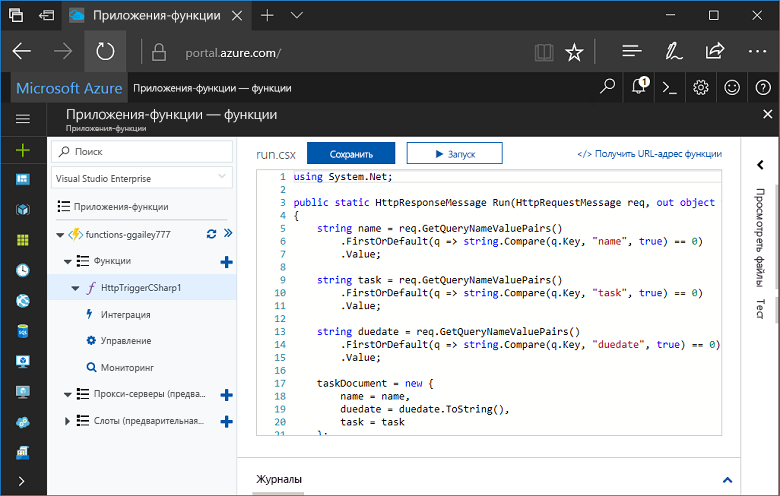
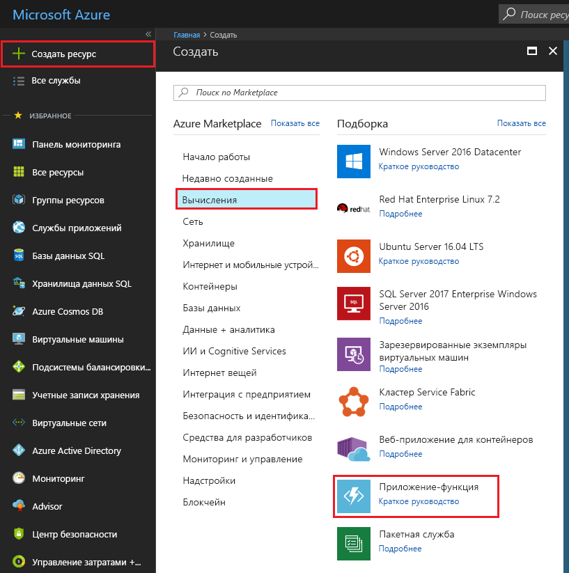
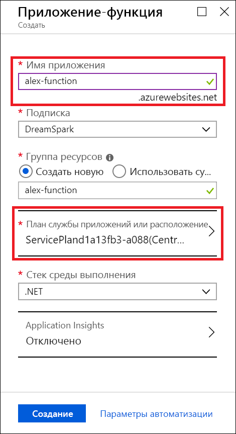
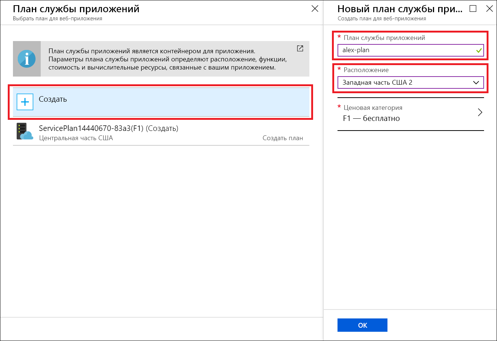
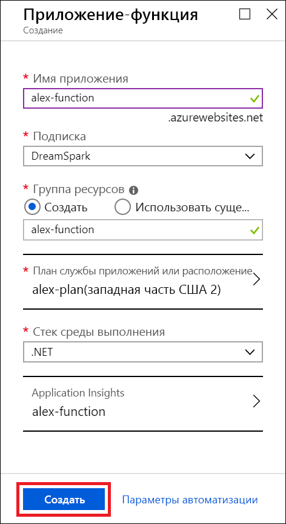
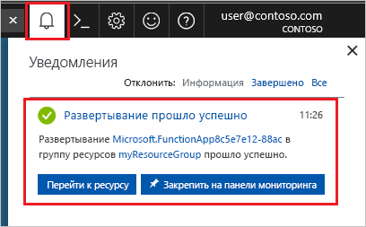
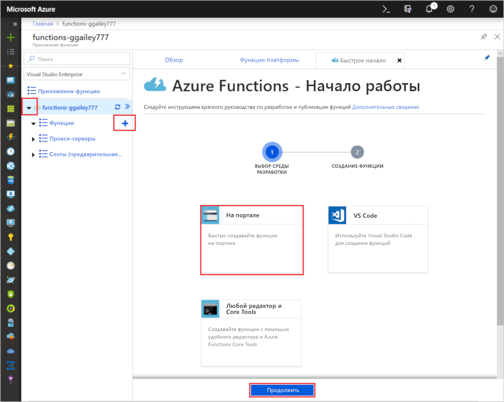
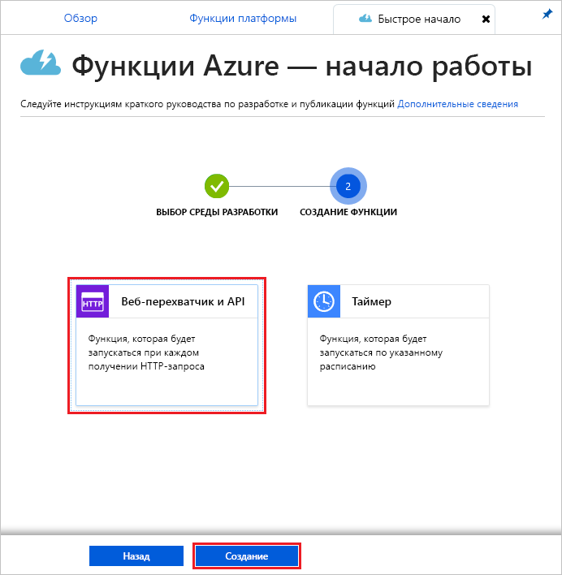
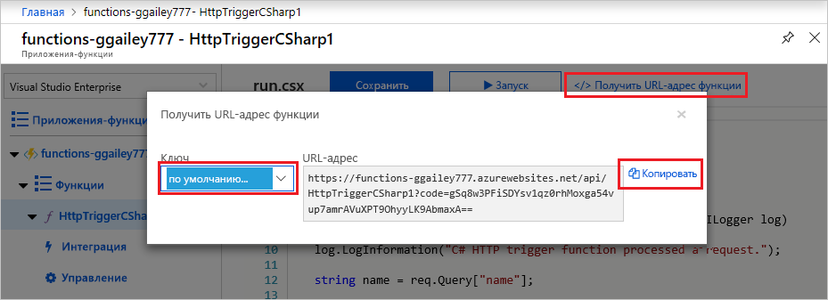
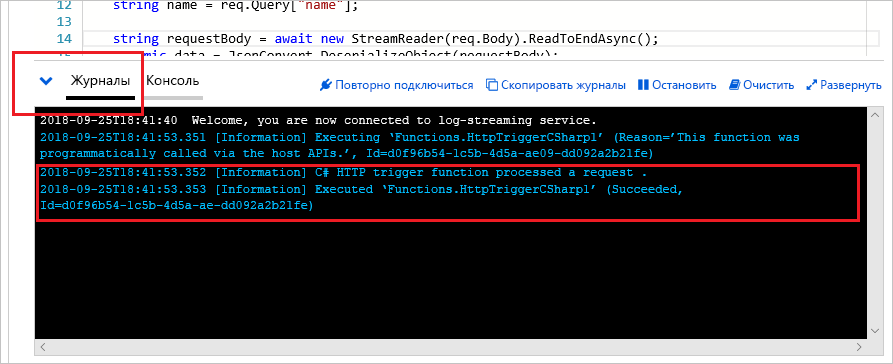

# Создание функции с помощью службы "Начальный набор Microsoft Azure для учащихся"

В этом руководстве мы создадим функцию HTTP Hello World в подписке на службу "Начальный набор Microsoft Azure для учащихся". Мы также рассмотрим доступные возможности в Функциях Azure для этого типа подписки.

*Начальный набор Microsoft Azure для учащихся* предоставляет бесплатный доступ к ресурсам для начала работы с продуктами Azure, которые необходимо разработать в облаке. [Узнайте больше об этом предложении здесь.](https://azure.microsoft.com/offers/ms-azr-0144p/)

Решение "Функции Azure" позволяет выполнять код в [бессерверной](https://azure.microsoft.com/solutions/serverless/) среде без необходимости создавать виртуальную машину или публиковать веб-приложение. [Дополнительные сведения о Функциях Azure см. здесь.](./functions-overview.md)

## Создание функции

 В этой статье вы узнаете, как с помощью Функций на портале Azure создать функцию Hello World, активируемую HTTP.

## Вход в Azure

Войдите на портал Azure по адресу <https://portal.azure.com> с помощью своей учетной записи Azure.

## Создание приложения-функции

Для выполнения функций вам понадобится приложение-функция, позволяющее группировать функции в логические единицы и упростить развертывание и совместное использование ресурсов, а также управление ими. 

1. Нажмите кнопку **Создать** в верхнем левом углу портала Azure, а затем выберите **Вычисления** > **Приложение-функция**.

    

2. Используйте настройки приложения-функции, указанные в таблице под рисунком.

    

    | Параметр      | Рекомендуемое значение  | ОПИСАНИЕ                                        |
    | ------------ |  ------- | -------------------------------------------------- |
    | **Имя приложения** | Глобально уникальное имя | Имя, которое идентифицирует ваше новое приложение-функцию. Допустимые символы: `a-z`, `0-9` и `-`.  | 
    | **Подписка** | Ваша подписка | Подписка, в которой создано приложение-функция. | 
    | **[Группа ресурсов](../azure-resource-manager/resource-group-overview.md)** |  myResourceGroup | Имя новой группы ресурсов, в которой создается приложение-функция. |
   | **[Расположение или план службы приложений](./functions-scale.md)** | Создать | План размещения, который управляет регионом, куда было развернуто приложение-функция, и плотностью ресурсов. Несколько приложений-функций, развернутых в одном плане, будут иметь один общий бесплатный экземпляр. Таковым является ограничение плана "Начальный набор Microsoft Azure для учащихся". Все варианты размещения [описаны здесь.](./functions-scale.md)|
    | **Стек среды выполнения** | Предпочитаемый язык | Выберите среду выполнения, которая поддерживает нужный функциональный язык программирования. Выберите **.NET** для функций C# и F#. |
    |**[Application Insights](./functions-monitoring.md)**| Включено | Служба Application Insights используется для хранения и анализа журналов приложения-функции. Если вы выберите расположение, поддерживаемое Application Insights, она включиться по умолчанию. Application Insights можно включить для любой функции вручную, выбрав соседний регион для развертывания Application Insights. Без Application Insights вы сможете только просматривать журналы потоковой передачи.

3. Чтобы выбрать другое расположение, выберите **Расположение или план службы приложений** выше

4. Выберите **Создать**, а затем присвойте уникальное имя вашему плану.

5. Выберите ближайшее к вам расположение. [См. полную карту регионов Azure здесь.](https://azure.microsoft.com/global-infrastructure/regions/) 

    

6. Выберите **Создать**, чтобы подготовить и развернуть приложение-функцию.

    

7. Выберите значок уведомления в правом верхнем углу портала. Вы должны увидеть сообщение **Развертывание выполнено**.

    

8. Выберите **Перейти к ресурсу** для просмотра нового приложения-функции.

Затем создайте функцию в новом приложении-функции.

## Создание функции, активируемой HTTP

1. Раскройте свое приложение-функцию, а затем нажмите кнопку **+** рядом с **Функции**, выберите **На портале** и далее **Продолжить**.

    

1. Выберите **Веб-перехватчик + API**, а затем нажмите **Создать**.

    

Будет создана функция на основе шаблона функции с активацией по HTTP для конкретного языка.

Теперь вы можете запустить новую функцию, отправив HTTP-запрос.

## Проверка функции

1. В новой функции щелкните **</> Get function URL** (Получить URL-адрес функции), выберите **default (Function key)** (По умолчанию (ключ функции)) и щелкните **Копировать**. 

    

2. Вставьте URL-адрес функции в адресную строку браузера. Добавьте значение строки запроса `&name=<yourname>` в конец этого URL-адреса и нажмите клавишу `Enter` на клавиатуре, чтобы выполнить этот запрос. В браузере должен отобразиться ответ, возращенный функцией.  

    Следующий пример демонстрирует ответ в браузере:

    

    URL-адрес запроса включает ключ, который по умолчанию необходим для доступа к функции по протоколу HTTP.

3. При выполнении функции сведения о трассировке записываются в журналы. Для просмотра выходных данных трассировки из предыдущего выполнения вернитесь к своей функции на портале и щелкните стрелку в нижней части экрана, чтобы развернуть раздел **Журналы**.

   

## Очистка ресурсов

[!INCLUDE [Clean-up resources](../../includes/functions-quickstart-cleanup.md)]

## Поддерживаемые функции в службе "Начальный набор Microsoft Azure для учащихся"

В службе "Начальный набор Microsoft Azure для учащихся" вы получите доступ к большинству функций среды выполнения Функций Azure, принимая во внимание несколько основных ограничений, перечисленных ниже.

* Триггер HTTP является единственным поддерживаемым типом триггера.
    * Поддерживаются все входные и выходные привязки! [Полный список см. здесь.](functions-triggers-bindings.md)
* Поддерживаемые языки: 
    * C# (.NET Core 2);
    * JavaScript, (Node.js 8 и 10);
    * F# (.NET Core 2).
    * [Поддерживаемые языки в планах высшего уровня см. здесь](supported-languages.md)
* Windows — единственная поддерживаемая операционная система.
* Масштаб будет ограничен [до одного бесплатного экземпляра уровня](https://azure.microsoft.com/pricing/details/app-service/windows/), выполняющегося ежедневно на протяжении не больше 60 минут. При получении HTTP-трафика вы сможете автоматически увеличить масштаб от 0 до 1 экземпляра без сервера, но не больше.
* Поддерживается только [среда выполнения версии 2.x](functions-versions.md).
* Для редактирования и публикации функций поддерживаются все средства разработки. В их состав входят: VS Code, Visual Studio, Azure CLI и портал Azure. Если вы хотите использовать что-то кроме портала, необходимо сначала создать приложение на портале, а затем выбрать это приложение в качестве цели развертывания в предпочитаемом средстве.

## Дополнительная информация

Вы создали приложение-функцию с простой функцией, активируемой HTTP! Теперь вы можете изучить локальные средства, дополнительные языки, мониторинг и интеграции.

 * [Создание первой функции с помощью Visual Studio](./functions-create-your-first-function-visual-studio.md)
 * [Создание функции в Azure с помощью Visual Studio Code](./functions-create-first-function-vs-code.md)
 * [Руководство разработчика JavaScript для Функций Azure](./functions-reference-node.md)
 * [Подключение к базе данных SQL Azure с помощью Функций Azure](./functions-scenario-database-table-cleanup.md)
 * [Дополнительные сведения о привязках HTTP в Функциях Azure см. здесь](./functions-bindings-http-webhook.md).
 * [Мониторинг Функций Azure](./functions-monitoring.md)
