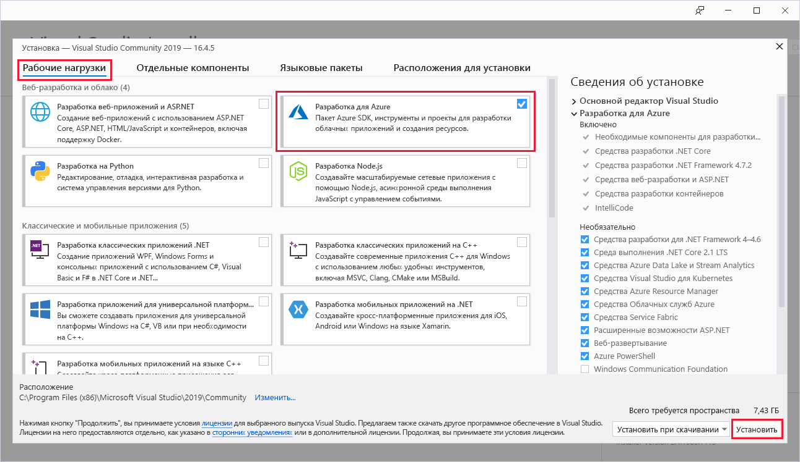
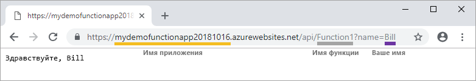

# Создание первой функции с помощью Visual Studio

Решение "Функции Azure" позволяет выполнять код в [бессерверной](https://azure.microsoft.com/solutions/serverless/) среде без необходимости создавать виртуальную машину или публиковать веб-приложение.

Изучив эту статью, вы научитесь с помощью Visual Studio 2019 локально создавать и тестировать функцию hello world, а затем публиковать ее в Azure. Это краткое руководство предназначено для Visual Studio 2019. При создании проекта "Функции Azure" с помощью Visual Studio 2017 необходимо сначала установить [новейшие инструменты Функций Azure](functions-develop-vs.md#check-your-tools-version).

## Предварительные требования

Для работы с этим учебником необходимо сначала установить [Visual Studio 2019](https://azure.microsoft.com/downloads/). Убедитесь, что рабочая нагрузка **Разработка для Azure** также установлена.

[!INCLUDE [quickstarts-free-trial-note](../../includes/quickstarts-free-trial-note.md)]

## Создание проекта приложения-функции

[!INCLUDE [Create a project using the Azure Functions template](../../includes/functions-vstools-create.md)]

Visual Studio создает проект и класс, содержащий стандартный код для типа функции триггера HTTP. Атрибут `FunctionName` метода задает имя функции. По умолчанию — `HttpTrigger`. Атрибут `HttpTrigger` указывает, что функция вызывается HTTP-запросом. Стандартный код отправляет HTTP-ответ, включающий в себя значение из текста или строки запроса.

Вы можете расширить возможности функции, используя входные и выходные привязки данных, применив для метода соответствующие атрибуты. Дополнительные сведения см. в разделе [Триггеры и привязки](functions-dotnet-class-library.md#triggers-and-bindings) в статье [Справочник разработчика C# по функциям Azure](functions-dotnet-class-library.md).

Созданный проект функции и функцию, активируемую HTTP, можно протестировать на локальном компьютере.

## Локальное выполнение функции

Visual Studio интегрируется с Azure Functions Core Tools, поэтому вы можете тестировать функции локально, используя полную среду выполнения Функций.  

[!INCLUDE [functions-run-function-test-local-vs](../../includes/functions-run-function-test-local-vs.md)]

Убедитесь, что функция правильно работает на локальном компьютере. Затем опубликуйте проект в Azure.

## Публикация проекта в Azure

Перед публикацией проекта убедитесь, что в вашей подписке Azure есть приложения-функция. Для первой публикации проекта в Visual Studio создается приложение-функция.

[!INCLUDE [Publish the project to Azure](../../includes/functions-vstools-publish.md)]

## Тестирование функции в Azure

1. Скопируйте базовый URL-адрес приложения-функции на странице профиля публикации. Замените часть `localhost:port` URL-адреса, который использовался при локальной проверке функции новым базовым URL-адресом. Как и ранее, добавьте строку запроса `?name=<YOUR_NAME>` в этот URL-адрес и выполните запрос.

    URL-адрес, вызывающий функцию, активирующую HTTP, должен быть в следующем формате:

        http://<APP_NAME>.azurewebsites.net/api/<FUNCTION_NAME>?name=<YOUR_NAME> 

2. Вставьте этот URL-адрес HTTP-запроса в адресную строку браузера. Ниже показан ответ в браузере на удаленный запрос GET, возвращаемый функцией:

    

## Дополнительная информация

С помощью Visual Studio вы создали и опубликовали в Azure приложение-функцию C# с простой функцией, активируемой HTTP. Дополнительные сведения о разработке функций, таких как библиотеки класса .NET, см. в статье [Справочник разработчика C# по функциям Azure](functions-dotnet-class-library.md).

> [!div class="nextstepaction"]
> [Connect functions to Azure Storage using Visual Studio Code](functions-add-output-binding-storage-queue-vs.md) (Подключение функций к службе хранилища Azure с помощью Visual Studio Code)
