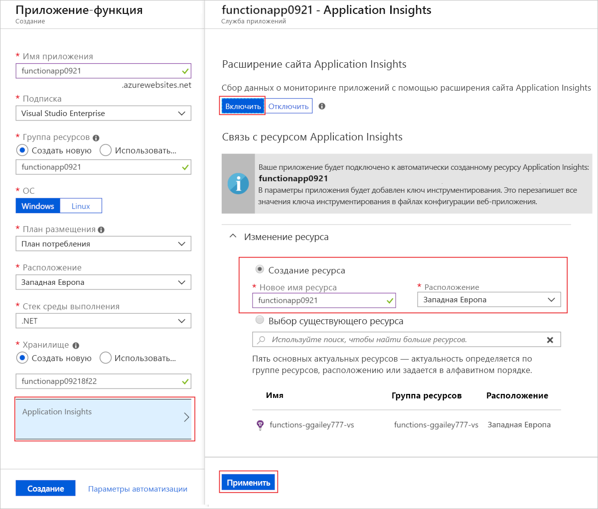
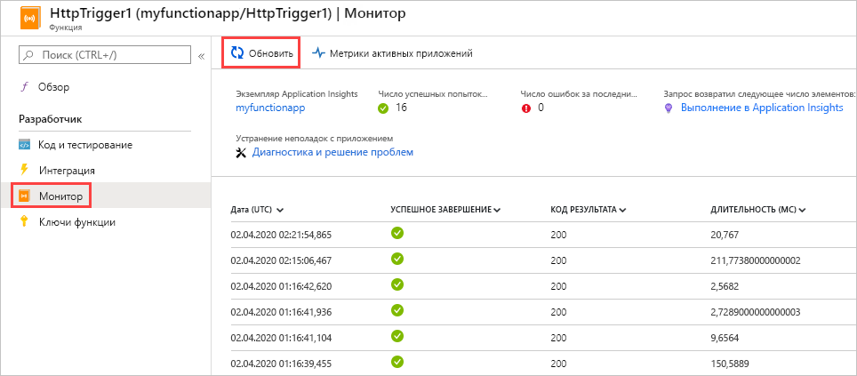
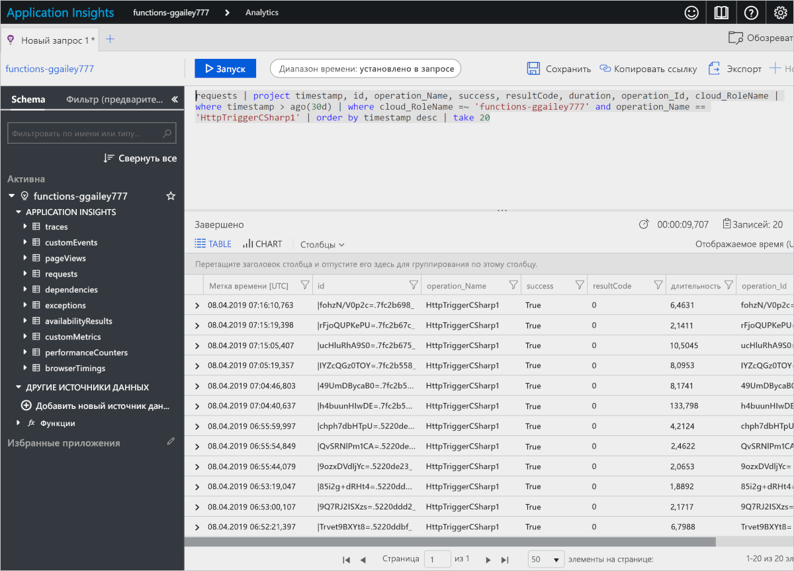
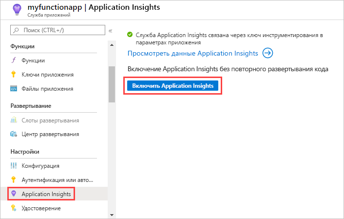
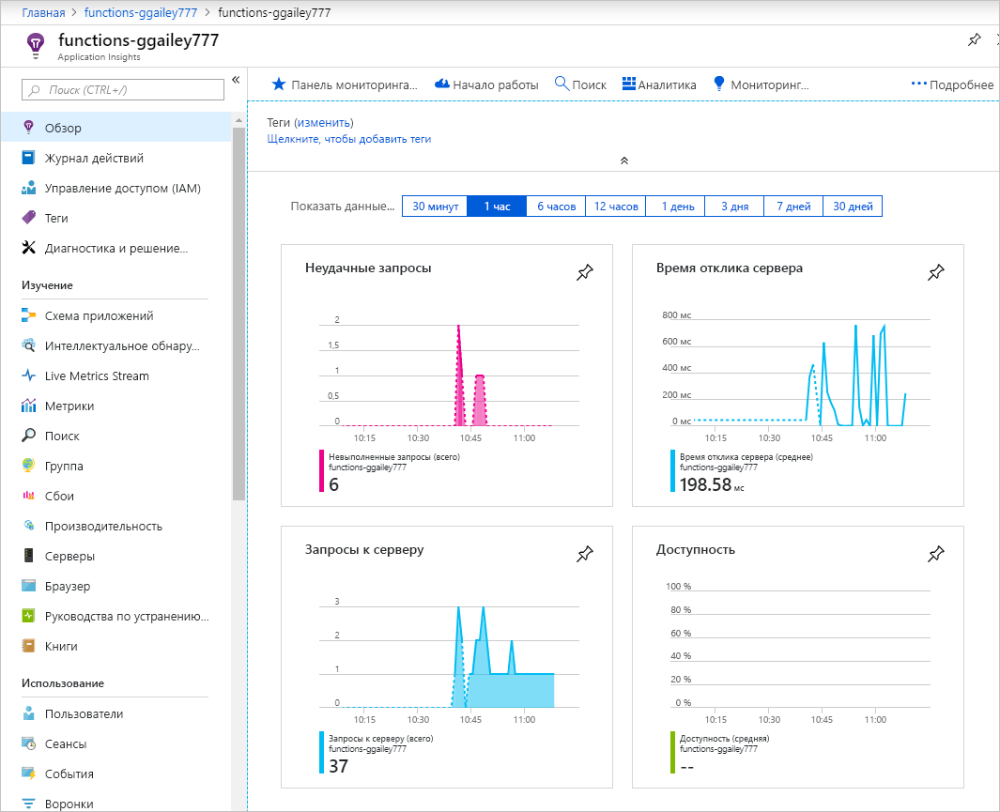
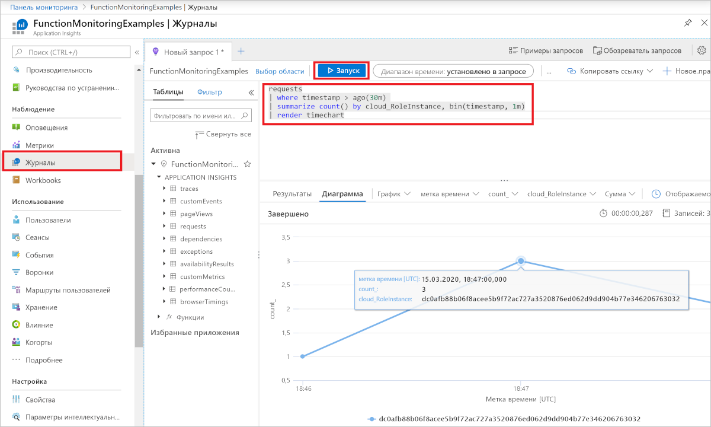
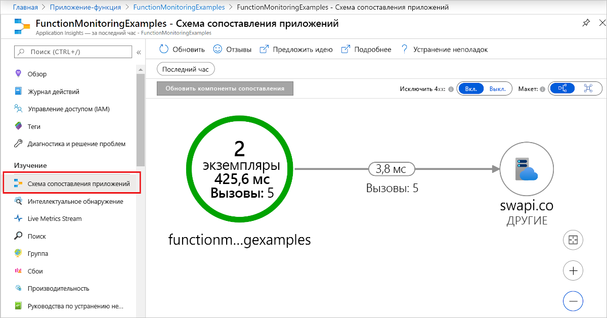
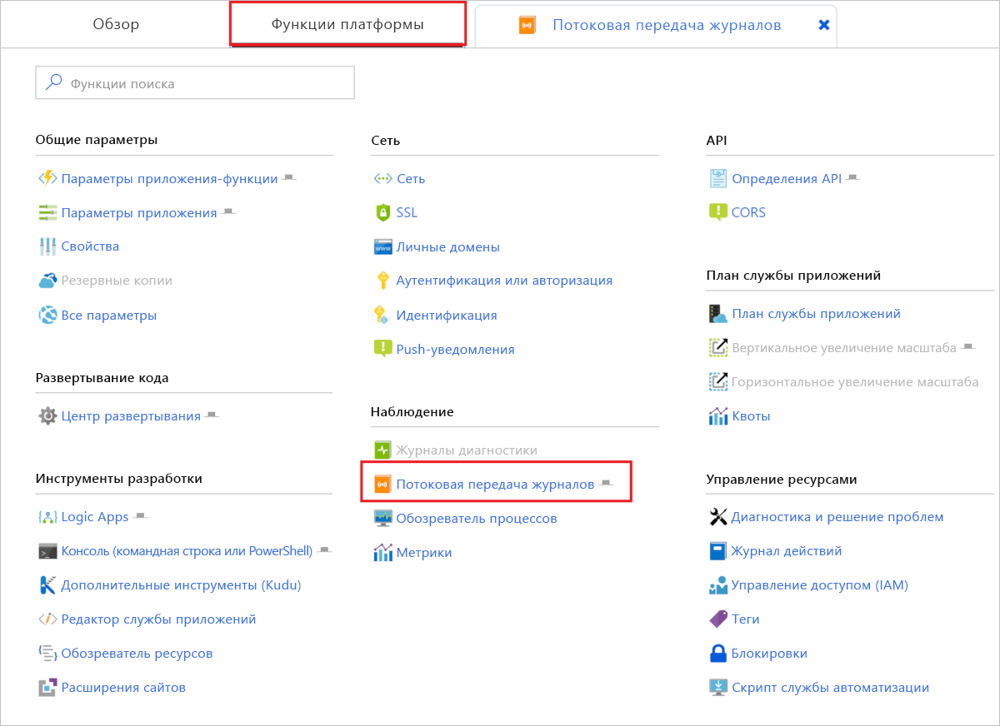
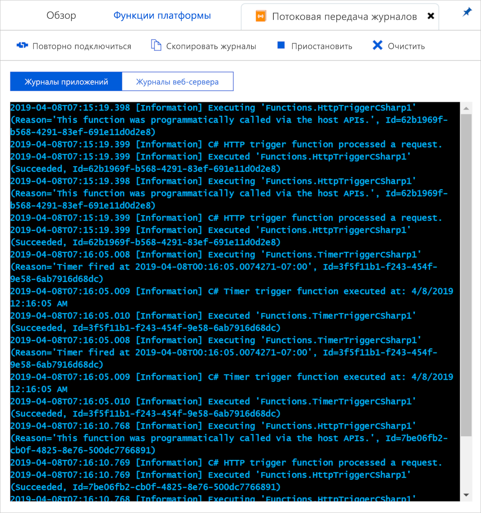

# <a name="monitor-azure-functions"></a>Мониторинг Функций Azure

[Функции Azure](functions-overview.md) предлагает встроенную интеграцию с [Azure Application Insights](../azure-monitor/app/app-insights-overview.md) для мониторинга функций. В этой статье показано, как настроить функции Azure, чтобы отправлять файлы системных журналов в Application Insights.

Мы рекомендуем использовать Application Insights, так как он собирает журнал, производительность и данные об ошибках. Он автоматически обнаруживает аномалии производительности и включает мощные аналитические средства, которые помогут вам диагностировать проблемы и сведения об использовании функций. Эта служба помогает постоянно улучшать производительность и удобство использования. Можно даже использовать Application Insights во время разработки проекта приложения локальной функции. Дополнительные сведения см. в разделе [что такое Application Insights?](../azure-monitor/app/app-insights-overview.md).

Как встроенный необходимого инструментирования Application Insights в функциях Azure, необходимо всего лишь инструментирования допустимый ключ для подключения приложения-функции для ресурса Application Insights.

## <a name="application-insights-pricing-and-limits"></a>Стоимость и ограничения Application Insights

Вы можете протестировать интеграцию Application Insights с приложением-функцией бесплатно. Нет ежедневное ограничение объема данных, которые могут обрабатываться бесплатно. Вы можете достигнуть предела во время тестирования. Azure отправляет уведомления на портале и по электронной почте при приближении к ежедневному ограничению. Если вы пропустите эти предупреждения и достигла предела, новые журналы не будет отображаться в запросах Application Insights. Следует учитывать ограничения, чтобы избежать ненужных устранять неполадки. Дополнительные сведения см. в статье [Управление ценами и объемом данных в Application Insights](../azure-monitor/app/pricing.md).

## <a name="enable-application-insights-integration"></a>Включение интеграции с Application Insights

Для отправки данных в Application Insights приложению-функции требуется ключ инструментирования для ресурса Application Insights. В параметре приложения должен быть ключ с именем **APPINSIGHTS_INSTRUMENTATIONKEY**.

### <a name="new-function-app-in-the-portal"></a>Новое приложение-функцию на портале

Когда вы [Создание приложения-функции на портале Azure](functions-create-first-azure-function.md), интеграция с Application Insights включена по умолчанию. Ресурс Application Insights имеет имя, совпадающее с именем приложения-функции, и создается на том же регионе или в ближайший регион.

Чтобы просмотреть ресурса Application Insights, выберите его, чтобы развернуть **Application Insights** окна. Вы можете изменить **новое имя ресурса** или выберите другой **расположение** в [географического региона Azure](https://azure.microsoft.com/global-infrastructure/geographies/) место для хранения данных.



При выборе **создать**, ресурс Application Insights создается с помощью приложения-функции, который имеет `APPINSIGHTS_INSTRUMENTATIONKEY` задать в параметрах приложения. Все, что будет готова к работе.

<a id="manually-connect-an-app-insights-resource"></a>
### <a name="add-to-an-existing-function-app"></a>Добавить в существующее приложение-функцию 

При создании приложения функцию с помощью [Azure CLI](functions-create-first-azure-function-azure-cli.md), [Visual Studio](functions-create-your-first-function-visual-studio.md), или [Visual Studio Code](functions-create-first-function-vs-code.md), необходимо создать ресурс Application Insights. Затем можно добавить ключ инструментирования из этого ресурса как параметр приложения в приложении-функции.

[!INCLUDE [functions-connect-new-app-insights.md](../../includes/functions-connect-new-app-insights.md)]

Ранние версии функции использовать встроенные функции мониторинга, который больше не рекомендуется. При включении интеграции Application Insights для такого приложения-функции, необходимо также [отключить встроенное ведение журнала](#disable-built-in-logging).  

## <a name="view-telemetry-in-monitor-tab"></a>Просмотр телеметрии на вкладке "Монитор"

С помощью [включена интеграция Application Insights](#enable-application-insights-integration), можно просмотреть данные телеметрии в **монитор** вкладки.

1. На странице приложения-функции выберите функцию, которая запущена хотя бы один раз после настройки Application Insights. Затем выберите **монитор** вкладки.

   

1. Выберите **обновить** периодически, пока не появится список вызовов функций.

   Может занять до пяти минут для списка, чтобы открывается, когда клиент телеметрии упаковывает данные для передачи на сервер. (Задержка не применяется к [Live Stream метрики](../azure-monitor/app/live-stream.md). Эта служба подключается к узлу решения "Функции" при загрузке страницы, поэтому журналы передаются напрямую на страницу.)

   

1. Чтобы просмотреть журналы для вызова определенной функции, выберите ссылку на столбец **Дата** для этого вызова.

   

   Выходные данные ведения журнала для этого вызова отображаются на новой странице.

   

Можно видеть, что обе страницы **запустить в Application Insights** ссылку, чтобы запрос аналитики Application Insights, который получает данные.


Отображается следующий запрос. Вы увидите, что список вызовов ограничено до последнего 30 дней. В списке отображается не более чем 20 строк (`where timestamp > ago(30d) | take 20`). Список сведений о вызовов — за последние 30 дней без ограничения.



Дополнительные сведения см. в разделе [Запросы к данным телеметрии](#query-telemetry-data) далее в этой статье.

## <a name="view-telemetry-in-application-insights"></a>Просмотр данных телеметрии в Application Insights

Чтобы открыть Application Insights из приложения-функции на портале Azure, перейдите к приложению-функции **Обзор** страницы. В разделе **настройки компонентов**выберите **Application Insights**.



Дополнительные сведения об использовании Application Insights см. в [документации по Application Insights](https://docs.microsoft.com/azure/application-insights/). В этом разделе представлено несколько примеров просмотра данных в Application Insights. Если вы уже знакомы с Application Insights, вы можете перейти непосредственно на [разделы о том, как настроить данные телеметрии,](#configure-categories-and-log-levels).



Следующие области Application Insights может быть полезно при оценке поведение, производительность и ошибок в функции:

| Tab | ОПИСАНИЕ |
| ---- | ----------- |
| **[сбои](../azure-monitor/app/asp-net-exceptions.md)** |  Создание диаграмм и оповещения на основе сбоев функции и исключений сервера. **Имя операции** обозначает имя функции. Сбои в зависимостях не отображаются, если не реализовать пользовательские данные телеметрии для зависимостей. |
| **[Производительность](../azure-monitor/app/performance-counters.md)** | Анализ проблем с производительностью. |
| **Серверы** | Просмотреть использование ресурсов и пропускной способности на каждом сервере. Эти данные можно использовать для отладки в тех случаях, когда функции создают чрезмерную нагрузку на базовые ресурсы. Серверы здесь называются **экземплярами облачных ролей**. |
| **[Метрики](../azure-monitor/app/metrics-explorer.md)** | Создание диаграмм и оповещения, которые основаны на метриках. Метрики включают количество вызовов функции времени выполнения и частота успешных выполнений. |
| **[Динамический поток метрик: мгновенные метрики для подробного отслеживания](../azure-monitor/app/live-stream.md)** | Просмотр данных метрик, так как оно создается в режиме реального времени. |

## <a name="query-telemetry-data"></a>Запросы к данным телеметрии

[Аналитика Application Insights](../azure-monitor/app/analytics.md) вы получаете доступ ко всем данным телеметрии в виде таблиц в базе данных. Функция аналитики поддерживает язык запросов для извлечения, обработки и визуализации данных.




В этом примере показано распределение запросов по рабочим ролям за последние 30 минут.

```
requests
| where timestamp > ago(30m) 
| summarize count() by cloud_RoleInstance, bin(timestamp, 1m)
| render timechart
```

Доступные таблицы отображаются в **схемы** вкладка в левой части. Данные, создаваемые при вызовах функций, вы найдете в следующих таблицах:

| Таблица | ОПИСАНИЕ |
| ----- | ----------- |
| **Трассировки** | Журналы, созданные средой выполнения и кодом функций. |
| **requests** | Один запрос для каждого вызова функции. |
| **exceptions** | Все исключения, возникшие при выполнении. |
| **customMetrics** | Число успешных и неудачных вызовов, Доля успешных попыток и длительность. |
| **customEvents** | События, отслеживаемые средой выполнения, например: HTTP-запросы, которые активируют функции; |
| **PerformanceCounters** | Сведения о производительности серверов, на которых выполняются функции на. |

Остальные таблицы предназначены для тестов доступности, а также телеметрии клиента и браузера. Вы можете реализовать пользовательскую телеметрию, чтобы добавлять в них данные.

В каждой таблице есть поле `customDimensions`, где хранится часть данных о конкретной функции.  Например, следующий запрос получает все трассировки с уровнем журнала `Error`.

```
traces 
| where customDimensions.LogLevel == "Error"
```

Среда выполнения предоставляет `customDimensions.LogLevel` и `customDimensions.Category` поля. Вы можете указать дополнительные поля в журналах, которые были написаны в коде функции. См. раздел [Структурированное ведение журнала](#structured-logging) далее в этой статье.

## <a name="configure-categories-and-log-levels"></a>Настройка категорий и уровней ведения журнала

Application Insights можно использовать без пользовательские настройки. Конфигурация по умолчанию можно привести большие объемы данных. Если вы используете подписку Azure для Visual Studio, объем данных Application Insights может достигнуть установленного верхнего предела. Далее в этой статье вы узнаете, как настроить и настроить данные, отправляемые функциями в Application Insights. Для приложения-функции, настроить ведение журналов в [host.json] файла.

### <a name="categories"></a>Категории

В средстве ведения журнала Функций Azure предусмотрена *категория* для каждого журнала. Категория указывает, какая часть кода среды выполнения или кода функции записывала данные в этот журнал. 

Среда выполнения функций создает журналы с помощью категории, которые начинаются с «Host». «Function started,» «функция выполняется» и журналы «функции завершения» относятся к категории «Host.Executor». 

Если журналы записываются в коде функции, ему присваивается категория «Функция».

### <a name="log-levels"></a>Уровни журнала

Средство ведения журнала функций Azure также включает *уровень ведения журнала* каждого журнала. Параметр [LogLevel](/dotnet/api/microsoft.extensions.logging.loglevel) (Уровень ведения журнала) является перечислением целочисленных значений, которые обозначают относительную важность.

|LogLevel    |Код|
|------------|---|
|Трассировка       | 0 |
|Отладка       | 1 |
|Информация | 2 |
|Предупреждение     | 3 |
|Ошибка       | 4. |
|критические ошибки.    | 5 |
|Нет        | 6 |

Уровень ведения журнала `None` описан в следующем разделе. 

### <a name="log-configuration-in-hostjson"></a>Конфигурация журналов в host.json

Файл [host.json] определяет, какой объем информации приложение-функция отправляет в журнал Application Insights. В каждой категории вы можете указать минимальный уровень ведения журнала для отправки данных. Существует два примера: первый пример ориентируется [среда выполнения функций версии 2.x](functions-versions.md#version-2x) (.NET Core), а во втором примере — для среды выполнения версии 1.x.

### <a name="version-2x"></a>Версия 2.x

В среде выполнения версии 2.x используется [иерархия фильтров для ведения журналов .NET Core](https://docs.microsoft.com/aspnet/core/fundamentals/logging/?view=aspnetcore-2.1#log-filtering). 

```json
{
  "logging": {
    "fileLoggingMode": "always",
    "logLevel": {
      "default": "Information",
      "Host.Results": "Error",
      "Function": "Error",
      "Host.Aggregator": "Trace"
    }
  }
}
```

### <a name="version-1x"></a>Версия 1.x

```json
{
  "logger": {
    "categoryFilter": {
      "defaultLevel": "Information",
      "categoryLevels": {
        "Host.Results": "Error",
        "Function": "Error",
        "Host.Aggregator": "Trace"
      }
    }
  }
}
```

В этом примере настраиваются следующие правила:

* Для журналов с категорией `Host.Results` или `Function`, только отправка `Error` уровень и более поздних версий в Application Insights. Данные журналов с уровнем `Warning` и ниже игнорируются.
* Все журналы с категорией `Host.Aggregator` отправляются в Application Insights. Уровень ведения журнала `Trace` — это то же, что в некоторых средствах ведения журналов именуется как `Verbose`. В файле [host.json] необходимо использовать `Trace`.
* Для всех остальных журналов в Application Insights отправляются данные с уровнем `Information` и выше.

Значение категории в [host.json] управляет ведением журнала для всех категорий, название которых начинается с аналогичного значения. `Host` в [host.json] ведения журнала для элементов управления `Host.General`, `Host.Executor`, `Host.Results`, и т. д.

Если [host.json] содержит несколько категорий с одинаковым началом строки, сопоставление начинается с более длинных строк. Предположим, что вы хотите регистрировать все данные среды выполнения, кроме `Host.Aggregator` ведения журнала `Error` уровень, но требуется `Host.Aggregator` ведения журнала `Information` уровень:

### <a name="version-2x"></a>Версия 2.x 

```json
{
  "logging": {
    "fileLoggingMode": "always",
    "logLevel": {
      "default": "Information",
      "Host": "Error",
      "Function": "Error",
      "Host.Aggregator": "Information"
    }
  }
}
```

### <a name="version-1x"></a>Версия 1.x 

```json
{
  "logger": {
    "categoryFilter": {
      "defaultLevel": "Information",
      "categoryLevels": {
        "Host": "Error",
        "Function": "Error",
        "Host.Aggregator": "Information"
      }
    }
  }
}
```

Чтобы не вести журналы для определенной категории, установите для нее уровень ведения журнала `None`. Журналы не записываются с этой категорией, и нет уровень ведения журнала не над ним.

В следующих разделах описаны основные категории журналов, создаваемых средой выполнения. 

### <a name="category-hostresults"></a>Категория Host.Results

Эти журналы отображаются в Application Insights как "запросы" (requests). Они содержат сведения об успешном выполнении или сбое функций.


Все эти журналы ведутся на `Information` уровень. При фильтрации по `Warning` или более поздней версии, вы не увидите никакие данные.

### <a name="category-hostaggregator"></a>Категория Host.Aggregator

Эти журналы содержат счетчики и средние значения по вызовам функций за [настраиваемый](#configure-the-aggregator) период времени. По умолчанию используется период 30 секунд или 1000 результатов в зависимости от того, что из этого наступит раньше. 

Журналы доступны в таблице **customMetrics** в Application Insights. Примеры: количество выполнений, Доля успешных попыток и длительность.


Все эти журналы ведутся на `Information` уровень. При фильтрации по `Warning` или более поздней версии, вы не увидите никакие данные.

### <a name="other-categories"></a>Другие категории

Все журналы для категорий, кроме перечисленных выше, доступны в таблице **трассировок** в Application Insights.


Все журналы с категориями, которые начинаются с `Host` записываются в среде выполнения функций. «Функция started» и «Function завершена» журналы имеют категорию `Host.Executor`. Для успешного выполнения эти журналы являются `Information` уровень. Исключения заносятся в `Error` уровень. Кроме того, среда выполнения создает журналы уровня `Warning`, например очередь сообщений, отправленных в очередь подозрительных сообщений.

Журналы, сохраняемые в коде функции имеют категорию `Function` и может быть любой уровень ведения журнала.

## <a name="configure-the-aggregator"></a>Настройка агрегатора

Как отмечалось в предыдущем разделе, среда выполнения собирает данные о выполнении функции за определенный период времени. По умолчанию используется период в 30 секунд или 1000 запусков в зависимости от того, что из этого наступит раньше. Этот параметр можно настроить в файле [host.json].  Ниже приведен пример:

```json
{
    "aggregator": {
      "batchSize": 1000,
      "flushTimeout": "00:00:30"
    }
}
```

## <a name="configure-sampling"></a>Настройка выборки

Application Insights есть [выборки](../azure-monitor/app/sampling.md) функция, которая позволят избежать создания слишком большого объема данных телеметрии на завершено выполнение во время пиковой нагрузки. Когда частота входящих выполнений превышает заданное пороговое значение, Application Insights начинает случайным образом игнорировать часть входящего выполнений. Значение по умолчанию для выполнений в секунду не более 20 (5 в версии 1.x). Вы можете настроить выборку в файле [host.json].  Ниже приведен пример:

### <a name="version-2x"></a>Версия 2.x 

```json
{
  "logging": {
    "applicationInsights": {
      "samplingSettings": {
        "isEnabled": true,
        "maxTelemetryItemsPerSecond" : 20
      }
    }
  }
}
```

### <a name="version-1x"></a>Версия 1.x 

```json
{
  "applicationInsights": {
    "sampling": {
      "isEnabled": true,
      "maxTelemetryItemsPerSecond" : 5
    }
  }
}
```

> [!NOTE]
> [Выборка](../azure-monitor/app/sampling.md) включена по умолчанию. Если вы будут отображаться данные, может потребоваться настроить параметры выборки для своего конкретного сценария мониторинга.

## <a name="write-logs-in-c-functions"></a>Запись журналов в функциях C#

В коде функции вы можете сохранять журналы, которые отображаются в виде трассировок в Application Insights.

### <a name="ilogger"></a>ILogger

Используйте параметр [ILogger](https://docs.microsoft.com/dotnet/api/microsoft.extensions.logging.ilogger) в функциях вместо параметра `TraceWriter`. Журналы, созданные с помощью `TraceWriter` перейдите в Application Insights, но `ILogger` позволяет сделать [структурированное ведение журнала](https://softwareengineering.stackexchange.com/questions/312197/benefits-of-structured-logging-vs-basic-logging).

Объект `ILogger` позволяет вызывать для создания журналов [методы расширения ILogger](https://docs.microsoft.com/dotnet/api/microsoft.extensions.logging.loggerextensions#methods) `Log<level>`. Следующий код записывает `Information` журналов с категорией «Функция».

```cs
public static async Task<HttpResponseMessage> Run(HttpRequestMessage req, ILogger logger)
{
    logger.LogInformation("Request for item with key={itemKey}.", id);
```

### <a name="structured-logging"></a>Структурированное ведение журнала

Использование параметров в сообщении журнала определяется порядком заполнителей, а не их именами. Предположим, что у вас есть следующий код:

```csharp
string partitionKey = "partitionKey";
string rowKey = "rowKey";
logger.LogInformation("partitionKey={partitionKey}, rowKey={rowKey}", partitionKey, rowKey);
```

Если вы примените эту же строку сообщения с обратным порядком параметров, в тексте сообщения значения окажутся на неправильных местах.

Такой метод обработки заполнителей позволяет выполнять структурированное ведение журналов. Application Insights сохраняет пары имя значение параметра и строку сообщения. Благодаря этому все аргументы сообщения становятся полями, по которым можно выполнять запросы.

Если вызов метода средства ведения журнала выглядит как в предыдущем примере, можно запросить поле `customDimensions.prop__rowKey`. `prop__` Добавляется префикс, чтобы не возникало конфликтов между полями, среда выполнения добавляет и код вашей функции добавляет.

Исходную строку сообщения можно получить, указав в запросе поле `customDimensions.prop__{OriginalFormat}`.  

Ниже приведен пример JSON-представления для данных `customDimensions`.

```json
{
  customDimensions: {
    "prop__{OriginalFormat}":"C# Queue trigger function processed: {message}",
    "Category":"Function",
    "LogLevel":"Information",
    "prop__message":"c9519cbf-b1e6-4b9b-bf24-cb7d10b1bb89"
  }
}
```

### <a name="custom-metrics-logging"></a>Ведение журнала пользовательских метрик

В функциях на языке C# вы можете использовать метод расширения `LogMetric` для `ILogger`, чтобы создать пользовательские метрики в Application Insights. Ниже приведен пример вызова метода.

```csharp
logger.LogMetric("TestMetric", 1234);
```

Этот код является альтернативой вызову `TrackMetric` с помощью Application Insights API для .NET.

## <a name="write-logs-in-javascript-functions"></a>Ведение журналов в функциях JavaScript

В функциях Node.js для ведения журналов следует использовать `context.log`. Структурированное ведение журнала не включено.

```
context.log('JavaScript HTTP trigger function processed a request.' + context.invocationId);
```

### <a name="custom-metrics-logging"></a>Ведение журнала пользовательских метрик

Если вы выполняете [версии 1.x](functions-versions.md#creating-1x-apps) среды выполнения функций, можно использовать функции Node.js `context.log.metric` метод, чтобы создать пользовательские метрики в Application Insights. Этот метод не поддерживается в версии 2.x. Ниже приведен пример вызова метода.

```javascript
context.log.metric("TestMetric", 1234);
```

Этот код является альтернативой вызову `trackMetric` с помощью пакета SDK Node.js для Application Insights.

## <a name="log-custom-telemetry-in-c-functions"></a>Пользовательские данные телеметрии войдите C# функции

Вы можете использовать пакет NuGet [Microsoft.ApplicationInsights](https://www.nuget.org/packages/Microsoft.ApplicationInsights/) для отправки пользовательских данных телеметрии в Application Insights. В следующем примере C# используется [настраиваемый API телеметрии](../azure-monitor/app/api-custom-events-metrics.md). Пример приведен для библиотеки классов .NET, но код Application Insights в скрипте C# будет точно таким же.

### <a name="version-2x"></a>Версия 2.x

Среда выполнения версии 2.x использует новые функции в Application Insights для выполнения автоматической корреляции данных телеметрии с текущей операцией. Нет необходимости вручную задать операцию `Id`, `ParentId`, или `Name` полей.

```cs
using System;
using System.Linq;
using System.Threading.Tasks;
using Microsoft.ApplicationInsights;
using Microsoft.ApplicationInsights.DataContracts;
using Microsoft.AspNetCore.Http;
using Microsoft.AspNetCore.Mvc;
using Microsoft.Azure.WebJobs;
using Microsoft.Azure.WebJobs.Extensions.Http;
using Microsoft.Extensions.Logging;

namespace functionapp0915
{
    public class HttpTrigger2
    {
        private readonly TelemetryClient telemetryClient;

        /// Using dependency injection will guarantee that you use the same configuration for telemetry collected automatically and manually.
        public HttpTrigger2(TelemetryConfiguration telemetryConfiguration)
        {
            this.telemetryClient = new TelemetryClient(telemetryConfiguration);
        }

        [FunctionName("HttpTrigger2")]
        public Task<IActionResult> Run(
            [HttpTrigger(AuthorizationLevel.Anonymous, "get", Route = null)]
            HttpRequest req, ExecutionContext context, ILogger log)
        {
            log.LogInformation("C# HTTP trigger function processed a request.");
            DateTime start = DateTime.UtcNow;

            // Parse query parameter
            string name = req.Query
                .FirstOrDefault(q => string.Compare(q.Key, "name", true) == 0)
                .Value;

            // Track an Event
            var evt = new EventTelemetry("Function called");
            evt.Context.User.Id = name;
            this.telemetryClient.TrackEvent(evt);

            // Track a Metric
            var metric = new MetricTelemetry("Test Metric", DateTime.Now.Millisecond);
            metric.Context.User.Id = name;
            this.telemetryClient.TrackMetric(metric);

            // Track a Dependency
            var dependency = new DependencyTelemetry
            {
                Name = "GET api/planets/1/",
                Target = "swapi.co",
                Data = "https://swapi.co/api/planets/1/",
                Timestamp = start,
                Duration = DateTime.UtcNow - start,
                Success = true
            };
            dependency.Context.User.Id = name;
            this.telemetryClient.TrackDependency(dependency);

            return Task.FromResult<IActionResult>(new OkResult());
        }
    }
}
```

### <a name="version-1x"></a>Версия 1.x

```cs
using System;
using System.Net;
using Microsoft.ApplicationInsights;
using Microsoft.ApplicationInsights.DataContracts;
using Microsoft.ApplicationInsights.Extensibility;
using Microsoft.Azure.WebJobs;
using System.Net.Http;
using System.Threading.Tasks;
using Microsoft.Azure.WebJobs.Extensions.Http;
using Microsoft.Extensions.Logging;
using System.Linq;

namespace functionapp0915
{
    public static class HttpTrigger2
    {
        private static string key = TelemetryConfiguration.Active.InstrumentationKey = 
            System.Environment.GetEnvironmentVariable(
                "APPINSIGHTS_INSTRUMENTATIONKEY", EnvironmentVariableTarget.Process);

        private static TelemetryClient telemetryClient = 
            new TelemetryClient() { InstrumentationKey = key };

        [FunctionName("HttpTrigger2")]
        public static async Task<HttpResponseMessage> Run(
            [HttpTrigger(AuthorizationLevel.Anonymous, "get", "post", Route = null)]
            HttpRequestMessage req, ExecutionContext context, ILogger log)
        {
            log.LogInformation("C# HTTP trigger function processed a request.");
            DateTime start = DateTime.UtcNow;

            // Parse query parameter
            string name = req.GetQueryNameValuePairs()
                .FirstOrDefault(q => string.Compare(q.Key, "name", true) == 0)
                .Value;

            // Get request body
            dynamic data = await req.Content.ReadAsAsync<object>();

            // Set name to query string or body data
            name = name ?? data?.name;
         
            // Track an Event
            var evt = new EventTelemetry("Function called");
            UpdateTelemetryContext(evt.Context, context, name);
            telemetryClient.TrackEvent(evt);
            
            // Track a Metric
            var metric = new MetricTelemetry("Test Metric", DateTime.Now.Millisecond);
            UpdateTelemetryContext(metric.Context, context, name);
            telemetryClient.TrackMetric(metric);
            
            // Track a Dependency
            var dependency = new DependencyTelemetry
                {
                    Name = "GET api/planets/1/",
                    Target = "swapi.co",
                    Data = "https://swapi.co/api/planets/1/",
                    Timestamp = start,
                    Duration = DateTime.UtcNow - start,
                    Success = true
                };
            UpdateTelemetryContext(dependency.Context, context, name);
            telemetryClient.TrackDependency(dependency);
        }
        
        // Correlate all telemetry with the current Function invocation
        private static void UpdateTelemetryContext(TelemetryContext context, ExecutionContext functionContext, string userName)
        {
            context.Operation.Id = functionContext.InvocationId.ToString();
            context.Operation.ParentId = functionContext.InvocationId.ToString();
            context.Operation.Name = functionContext.FunctionName;
            context.User.Id = userName;
        }
    }    
}
```

Не вызывайте `TrackRequest` или `StartOperation<RequestTelemetry>` так, как вы увидите повторные запросы для вызова функции.  Среда выполнения Функций Azure автоматически отслеживает запросы.

Не указывайте `telemetryClient.Context.Operation.Id`. Этот глобальный параметр вызывает неправильное корреляции, при одновременном выполнении многих функций. Вместо этого создайте экземпляр телеметрии (`DependencyTelemetry`, `EventTelemetry`) и измените его свойство `Context`. Затем передайте экземпляр телеметрии в соответствующий метод `Track` в `TelemetryClient` (`TrackDependency()`, `TrackEvent()`). Этот метод гарантирует, что данные телеметрии имеет правильный корреляции для текущего вызова функции.

## <a name="log-custom-telemetry-in-javascript-functions"></a>Журнал пользовательские данные телеметрии в функциях JavaScript

[Пакет SDK Node.js для Application Insights](https://www.npmjs.com/package/applicationinsights) сейчас доступен в бета-версии. Ниже приведен пример кода, который отправляет пользовательские данные телеметрии в Application Insights.

```javascript
const appInsights = require("applicationinsights");
appInsights.setup();
const client = appInsights.defaultClient;

module.exports = function (context, req) {
    context.log('JavaScript HTTP trigger function processed a request.');

    client.trackEvent({name: "my custom event", tagOverrides:{"ai.operation.id": context.invocationId}, properties: {customProperty2: "custom property value"}});
    client.trackException({exception: new Error("handled exceptions can be logged with this method"), tagOverrides:{"ai.operation.id": context.invocationId}});
    client.trackMetric({name: "custom metric", value: 3, tagOverrides:{"ai.operation.id": context.invocationId}});
    client.trackTrace({message: "trace message", tagOverrides:{"ai.operation.id": context.invocationId}});
    client.trackDependency({target:"http://dbname", name:"select customers proc", data:"SELECT * FROM Customers", duration:231, resultCode:0, success: true, dependencyTypeName: "ZSQL", tagOverrides:{"ai.operation.id": context.invocationId}});
    client.trackRequest({name:"GET /customers", url:"http://myserver/customers", duration:309, resultCode:200, success:true, tagOverrides:{"ai.operation.id": context.invocationId}});

    context.done();
};
```

`tagOverrides` Наборов параметров `operation_Id` для ИД вызова функции. Этот параметр позволяет сопоставлять все автоматически создаваемые и пользовательские данные телеметрии с конкретным вызовом функции.

## <a name="dependencies"></a>Зависимости

Функции v2 автоматически собирает зависимости для запросов HTTP, служебной шины и SQL.

Можно написать пользовательский код, чтобы показать зависимости. Примеры см. в образце кода в [ C# раздел пользовательской телеметрии](#log-custom-telemetry-in-c-functions). Пример кода приводит к *схема сопоставления приложений* в Application Insights, который выглядит, как ниже:



## <a name="report-issues"></a>Сообщение о проблемах

Чтобы сообщить о проблеме с интеграцией Функций Azure с Application Insights, внести предложение или отправить запрос, [создайте обращение в GitHub](https://github.com/Azure/Azure-Functions/issues/new).

## <a name="streaming-logs"></a>Журналы потоковой передачи

При разработке приложения удобно видеть сведения о ведении журнала практически в режиме реального времени. Вы можете просмотреть поток журналов, создаваемых функций на портале Azure или в сеансе командной строки на локальном компьютере.

Это эквивалентно выходных данных отображается при отладке функций во время [локальной разработки](functions-develop-local.md). Дополнительные сведения см. в разделе [Практическое руководство. Потоковая передача журналов](../app-service/troubleshoot-diagnostic-logs.md#streamlogs).

> [!NOTE]
> Журналы потоковой передачи поддерживает только один экземпляр узла функций. Когда функция масштабируется до нескольких экземпляров, данных от других экземпляров не отображаются в потоке журнала. [Live Stream метрики](../azure-monitor/app/live-stream.md) в Application Insights поддерживается несколько экземпляров. А также в режиме реального времени, потоковую аналитику также основаны на [данные выборки](#configure-sampling).

### <a name="portal"></a>Microsoft Azure

Чтобы просмотреть журналы потоковой передачи на портале, выберите **функции платформы** вкладку в приложении-функции. Затем в разделе **мониторинг**, выберите **потоковая передача журналов**.



Это связывает приложения в журнал, служба потоковой передачи и журналы приложений отображаются в окне. Можно переключаться между **журналы приложений** и **журналы веб-сервера**.  



### <a name="azure-cli"></a>Инфраструктура CLI Azure

Вы можете включить журналы потоковой передачи с помощью [Azure CLI](/cli/azure/install-azure-cli). Используйте следующие команды, чтобы войти, выбрать подписку и включить потоковую передачу файлов журнала:

```azurecli
az login
az account list
az account set --subscription <subscriptionNameOrId>
az webapp log tail --resource-group <RESOURCE_GROUP_NAME> --name <FUNCTION_APP_NAME>
```

### <a name="azure-powershell"></a>Azure PowerShell

Вы можете включить журналы потоковой передачи с помощью [Azure PowerShell](/powershell/azure/overview). Для PowerShell используйте следующие команды, чтобы добавить учетную запись Azure, выберите подписку и включить потоковую передачу файлов журнала:

```powershell
Add-AzAccount
Get-AzSubscription
Get-AzSubscription -SubscriptionName "<subscription name>" | Select-AzSubscription
Get-AzWebSiteLog -Name <FUNCTION_APP_NAME> -Tail
```

## <a name="disable-built-in-logging"></a>Отключение встроенного ведения журнала

При включении Application Insights, отключение встроенного ведения журнала, которое использует службу хранилища Azure. Встроенное ведение журнала полезно для тестирования с легкими рабочими нагрузками, но не предназначена для использования в рабочей среде с высокой нагрузкой. Для мониторинга рабочей среды рекомендуется Application Insights. Если встроенное ведение журнала используется в рабочей среде, записи журнала могут быть неполными из-за регулирования службы хранилища Azure.

Чтобы отключить встроенное ведение журнала, удалите параметр приложения `AzureWebJobsDashboard`. Дополнительные сведения о том, как удалять параметры приложения на портале Azure, см. в разделе **Параметры приложения** статьи [Управление приложением-функцией на портале Azure](functions-how-to-use-azure-function-app-settings.md#settings). Прежде чем удалить параметр приложения, убедитесь, что нет существующих функций в одном приложении-функции используется параметр для триггеров хранилища Azure или привязок.

## <a name="next-steps"></a>Дальнейшие действия

Для получения дополнительных сведений см. следующие ресурсы:

* [Application Insights](/azure/application-insights/)
* [Общие сведения о ведении журналов в ASP.NET Core](/aspnet/core/fundamentals/logging/)

[Host.JSON]: functions-host-json.md
