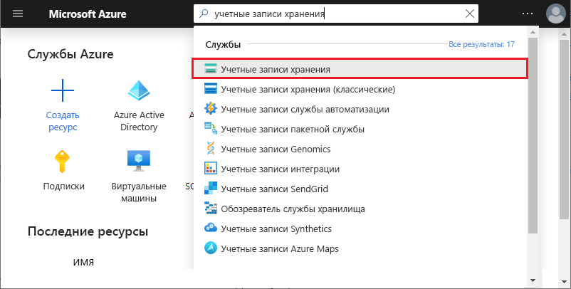

# <a name="work-with-azure-functions-core-tools"></a>Запуск основных инструментов службы "Функции Azure"

Средства Azure Functions Core Tools позволяют разрабатывать и тестировать функции на локальном компьютере из командной строки или в терминале. Локальные функции можно подключать к действующим службам Azure, а отладку функций можно выполнять на локальном компьютере с помощью полной среды выполнения службы "Функции Azure". Также есть возможность развернуть приложение-функцию в подписке Azure.

[!INCLUDE [Don't mix development environments](../../includes/functions-mixed-dev-environments.md)]

Разработка функций на локальном компьютере и их публикация в Azure с помощью основных средств выполняет следующие основные действия:

> [!div class="checklist"]
> * [Установите основные средства и зависимости.](#v2)
> * [Создайте проект приложения-функции на основе шаблона, зависящего от языка.](#create-a-local-functions-project)
> * [Регистрация расширений триггера и привязки.](#register-extensions)
> * [Определение хранилища и других подключений.](#local-settings-file)
> * [Создание функции из триггера и шаблона, зависящего от языка.](#create-func)
> * [Запустите функцию локально.](#start)
> * [Опубликуйте проект в Azure.](#publish)

## <a name="core-tools-versions"></a>Версии Core Tools

Существует три версии Azure Functions Core Tools. Используемая версия зависит от вашей локальной среды разработки, [выбора языка](supported-languages.md)и требуемого уровня поддержки:

+ [**Версия 3. x/2. x**](#v2): поддерживает [версию 3. x или 2. x среды выполнения функций Azure](functions-versions.md). Эти версии поддерживают [Windows](?tabs=windows#v2), [macOS](?tabs=macos#v2)и [Linux](?tabs=linux#v2) и используют диспетчеры пакетов для конкретных платформ или NPM для установки.

+ **Версия 1. x**: поддерживает версию 1. x среды выполнения функций Azure. Эта версия поддерживается только на компьютерах с ОС Windows и устанавливается из [пакета npm](https://www.npmjs.com/package/azure-functions-core-tools).

На заданном компьютере можно установить только одну версию основных средств. Если не указано иное, примеры в этой статье относятся к версии 3. x.

## <a name="prerequisites"></a>Предварительные требования

Azure Functions Core Tools в настоящее время зависит от Azure CLI для проверки подлинности в учетной записи Azure. Это означает, что необходимо [установить Azure CLI локально](/cli/azure/install-azure-cli) , чтобы иметь возможность [публиковать в Azure](#publish) из Azure functions Core Tools. 

## <a name="install-the-azure-functions-core-tools"></a>Установка основных инструментов Функций Azure

[Основные инструменты службы "Функции Azure"] являются локальной версией среды выполнения "Функции Azure", которую можно запускать на локальном компьютере для разработки. Она также предоставляет команды для создания функций, подключения к Azure и развертывания проектов функций.

### <a name="version-3x-and-2x"></a><a name="v2"></a>Версии 3. x и 2. x

Версия 3. x/2. x инструментов использует среду выполнения функций Azure, созданную на основе .NET Core. Эта версия поддерживается на всех платформах .NET Core, включая [Windows](?tabs=windows#v2), [macOS](?tabs=macos#v2)и [Linux](?tabs=linux#v2). 

> [!IMPORTANT]
> Вы можете обойти требование для установки пакет SDK для .NET Core с помощью [пакетов расширений].

# <a name="windows"></a>[Windows](#tab/windows)

Следующие действия используют установщик Windows (MSI) для установки основных средств v3. x. Дополнительные сведения о других установщиках на основе пакетов, необходимых для установки основных средств версии 2. x, см. в [файле readme по основным инструментам](https://github.com/Azure/azure-functions-core-tools/blob/master/README.md#windows).

1. Скачайте и запустите установщик основных средств на основе вашей версии Windows:

    - [v3. x — Windows 64-bit](https://go.microsoft.com/fwlink/?linkid=2135274) (рекомендуется. Для [отладки Visual Studio Code](functions-develop-vs-code.md#debugging-functions-locally) требуется 64-разр.)
    - [v3. x — Windows 32-bit](https://go.microsoft.com/fwlink/?linkid=2135275)

1. Если вы не планируете использовать [пакеты расширений](functions-bindings-register.md#extension-bundles), установите [пакет SDK для .NET Core 3. x для Windows](https://dotnet.microsoft.com/download).

# <a name="macos"></a>[macOS](#tab/macos)

На следующих шагах Homebrew используется для установки основных инструментов на компьютерах macOS.

1. Установите [Homebrew](https://brew.sh/), если вы этого не сделали ранее.

1. Установите пакет основных инструментов:

    ##### <a name="v3x-recommended"></a>v3. x (рекомендуется)

    ```bash
    brew tap azure/functions
    brew install azure-functions-core-tools@3
    # if upgrading on a machine that has 2.x installed
    brew link --overwrite azure-functions-core-tools@3
    ```
    
    ##### <a name="v2x"></a>Версия 2.x

    ```bash
    brew tap azure/functions
    brew install azure-functions-core-tools@2
    ```
    
1. Если вы не планируете использовать [пакеты расширений](functions-bindings-register.md#extension-bundles), установите [пакет SDK для .NET Core 3. x для macOS](https://dotnet.microsoft.com/download).

# <a name="linux"></a>[Linux](#tab/linux)

На следующих шагах [APT](https://wiki.debian.org/Apt) используется для установки основных инструментов на дистрибутив Linux Ubuntu/Debian. Чтобы выполнить установку на другие дистрибутивы Linux, ознакомьтесь с [файлом сведений об основных инструментах](https://github.com/Azure/azure-functions-core-tools/blob/master/README.md#linux).

1. Установите ключ GPG репозитория пакетов Майкрософт, чтобы проверить целостность пакета:

    ```bash
    curl https://packages.microsoft.com/keys/microsoft.asc | gpg --dearmor > microsoft.gpg
    sudo mv microsoft.gpg /etc/apt/trusted.gpg.d/microsoft.gpg
    ```

1. Настройте список источников APT перед обновлением APT.

    ##### <a name="ubuntu"></a>Ubuntu

    ```bash
    sudo sh -c 'echo "deb [arch=amd64] https://packages.microsoft.com/repos/microsoft-ubuntu-$(lsb_release -cs)-prod $(lsb_release -cs) main" > /etc/apt/sources.list.d/dotnetdev.list'
    ```

    ##### <a name="debian"></a>Debian

    ```bash
    sudo sh -c 'echo "deb [arch=amd64] https://packages.microsoft.com/debian/$(lsb_release -rs | cut -d'.' -f 1)/prod $(lsb_release -cs) main" > /etc/apt/sources.list.d/dotnetdev.list'
    ```

1. Проверьте `/etc/apt/sources.list.d/dotnetdev.list` файл на наличие одной из следующих строк версии Linux:

    | Дистрибутив Linux | Версия |
    | --------------- | ----------- |
    | Debian 10 | `buster`  |
    | Debian 9  | `stretch` |
    | Ubuntu 20.04    | `focal`     |
    | Ubuntu 19.04    | `disco`     |
    | Ubuntu 18.10    | `cosmic`    |
    | Ubuntu 18.04    | `bionic`    |
    | Ubuntu 17.04    | `zesty`     |
    | Ubuntu 16.04/Linux Mint 18    | `xenial`  |

1. Запустите обновление источника APT:

    ```bash
    sudo apt-get update
    ```

1. Установите пакет основных инструментов:

    ##### <a name="v3x-recommended"></a>v3. x (рекомендуется)
    ```bash
    sudo apt-get update
    sudo apt-get install azure-functions-core-tools-3
    ```
    
    ##### <a name="v2x"></a>Версия 2.x
    ```bash
    sudo apt-get update
    sudo apt-get install azure-functions-core-tools-2
    ```

1. Если вы не планируете использовать [пакеты расширений](functions-bindings-register.md#extension-bundles), установите [пакет SDK для .NET Core 3. x для Linux](https://dotnet.microsoft.com/download).

---

## <a name="create-a-local-functions-project"></a>Создание локального проекта службы "Функции"

Каталог проекта функций содержит файлы [host.json](functions-host-json.md) и [local.settings.json](#local-settings-file), а также вложенные папки, которые содержат код для отдельных функций. Этот каталог является эквивалентом приложения-функции в Azure. Дополнительные сведения о структуре папок службы "Функции Azure" см. в [Руководстве для разработчиков по Функциям Azure](functions-reference.md#folder-structure).

Версия 3. x/2. x требует выбрать язык по умолчанию для проекта при его инициализации. В версии 3. x/2. x все добавленные функции используют шаблоны языка по умолчанию. В версии 1.x пользователю необходимо указывать язык при каждом создании функции.

В окне терминала или из командной строки выполните следующую команду, чтобы создать проект и локальный репозиторий Git:

```
func init MyFunctionProj
```

>[!IMPORTANT]
> Java использует Maven архетипа для создания проекта локальных функций вместе с первой функцией, активируемой HTTP. Для создания проекта Java используйте следующую команду: `mvn archetype:generate -DarchetypeGroupId=com.microsoft.azure -DarchetypeArtifactId=azure-functions-archetype` . Пример использования Maven архетипа см. в [кратком руководстве по использованию командной строки](/azure/azure-functions/functions-create-first-azure-function-azure-cli?pivots=programming-language-java).  

Когда вы указываете имя проекта, то создается и инициализируется новая папка с этим именем. В противном случае инициализируется текущая папка.  
В версии 3. x/2. x при выполнении команды необходимо выбрать среду выполнения для проекта. 

<pre>
Select a worker runtime:
dotnet
node
python 
powershell
</pre>

Для выбора языка используйте СТРЕЛКИ ВВЕРХ и ВНИЗ и клавишу ВВОД. Если вы планируете разрабатывать функции JavaScript или TypeScript, выберите **узел**, а затем выберите язык. В TypeScript есть [некоторые дополнительные требования](functions-reference-node.md#typescript). 

Результат для проекта JavaScript выглядит примерно следующим образом.

<pre>
Select a worker runtime: node
Writing .gitignore
Writing host.json
Writing local.settings.json
Writing C:\myfunctions\myMyFunctionProj\.vscode\extensions.json
Initialized empty Git repository in C:/myfunctions/myMyFunctionProj/.git/
</pre>

`func init` поддерживает следующие параметры версии 3. x/2. КС-Онли, если не указано иное.

| Параметр     | Описание                            |
| ------------ | -------------------------------------- |
| **`--csx`** | Создает функции .NET в виде скрипта C#, который является поведением версии 1. x. Допускается только с `--worker-runtime dotnet`. |
| **`--docker`** | Создает Dockerfile для контейнера с помощью базового образа, основанного на выбранном `--worker-runtime` . Используйте этот параметр, если планируете опубликовать в пользовательский контейнер Linux. |
| **`--docker-only`** |  Добавляет Dockerfile в существующий проект. Запрашивает рабочую среду выполнения, если она не указана или не задана в local.settings.js. Используйте этот параметр при планировании публикации существующего проекта в пользовательском контейнере Linux. |
| **`--force`** | Инициализирует проект, даже если в нем уже есть файлы. Этот параметр перезаписывает имеющиеся файлы, используя те же имена. Это не влияет на другие файлы в папке проекта. |
| **`--language`** | Инициализирует проект, зависящий от языка. В настоящее время поддерживается, если `--worker-runtime` задано значение `node` . Возможные значения: `typescript` и `javascript`. Можно также использовать `--worker-runtime javascript` или `--worker-runtime typescript` .  |
| **`--managed-dependencies`**  | Устанавливает управляемые зависимости. В настоящее время эта функция поддерживается только в среде выполнения PowerShell. |
| **`--source-control`** | Определяет, создается ли репозиторий Git. По умолчанию репозиторий не создается. Если задано значение `true`, репозиторий создается. |
| **`--worker-runtime`** | Задает языковую среду выполнения для проекта. Поддерживаются следующие значения: `csharp` , `dotnet` , `javascript` , `node` (JavaScript), `powershell` , `python` и `typescript` . Для Java используйте [Maven](functions-reference-java.md#create-java-functions). Если этот параметр не задан, во время инициализации будет предложено выбрать среду выполнения. |
|
> [!IMPORTANT]
> По умолчанию версии 2. x и более поздние версии основных средств создают проекты приложения-функции для среды выполнения .NET как [проекты классов C#](functions-dotnet-class-library.md) (. csproj). Эти проекты C#, которые могут использоваться с Visual Studio или Visual Studio Code, собираются во время тестирования и при публикации в Azure. Если вы хотите создавать и работать с тем же файлом сценария C# (.csx), созданным в версии 1.x и на портале, необходимо указать параметр `--csx` при создании и развертывании функций.

## <a name="register-extensions"></a>Регистрация расширений

За исключением триггеров HTTP и таймера, привязки функций в среде выполнения версии 2. x и более поздних реализуются как пакеты расширений. Для привязок HTTP и триггеров таймера расширения не требуются. 

Чтобы снизить несовместимости между различными пакетами расширений, функции позволяют ссылаться на пакет расширений в host.jsв файле проекта. Если вы решили не использовать пакеты расширений, вам также потребуется установить пакет SDK для .NET Core 2. x локально и сохранить расширение. csproj с проектом функций.  

В версиях 2. x и более поздних версиях среды выполнения функций Azure необходимо явным образом зарегистрировать расширения для типов привязки, используемых в функциях. Можно установить расширения привязки по отдельности или добавить ссылку на пакет расширений в host.jsфайла проекта. Пакеты расширений устраняют вероятность проблем совместимости пакетов при использовании нескольких типов привязок. Это рекомендуемый подход для регистрации расширений привязки. Пакеты расширений также удаляют требование установки пакета SDK для .NET Core 2. x. 

### <a name="use-extension-bundles"></a>Использовать пакеты расширений

[!INCLUDE [Register extensions](../../includes/functions-extension-bundles.md)]

Дополнительные сведения см. в статье [Регистрация расширений привязки функций Azure](functions-bindings-register.md#extension-bundles). Перед добавлением привязок в function.jsв файле необходимо добавить расширения расширений в host.js.

### <a name="explicitly-install-extensions"></a>Явно установить расширения

[!INCLUDE [functions-extension-register-core-tools](../../includes/functions-extension-register-core-tools.md)]

[!INCLUDE [functions-local-settings-file](../../includes/functions-local-settings-file.md)]

По умолчанию эти параметры не переносятся автоматически при публикации проекта в Azure. [При публикации](#publish) используйте параметр `--publish-local-settings`, чтобы добавить эти параметры в приложение-функцию в Azure. Обратите внимание, что значения **ConnectionStrings** никогда не публикуются.

Эти значения параметров приложения-функции также могут считываться в коде как переменные среды. Дополнительные сведения см. в разделе о переменных среды в этих справочниках для определенного языка:

* [Предкомпилированный код C#](functions-dotnet-class-library.md#environment-variables)
* [Скрипт C# (.csx)](functions-reference-csharp.md#environment-variables)
* [Java](functions-reference-java.md#environment-variables)
* [JavaScript](functions-reference-node.md#environment-variables)
* [PowerShell](functions-reference-powershell.md#environment-variables)
* [Python](functions-reference-python.md#environment-variables)

Если не задана допустимая строка подключения к хранилищу [`AzureWebJobsStorage`] и не используется эмулятор, отображается следующее сообщение об ошибке:

> Отсутствует значение AzureWebJobsStorage в local.settings.json. This is required for all triggers other than HTTP. You can run 'func azure functionapp fetch-app-settings \<functionAppName\>' or specify a connection string in local.settings.json (Отсутствует значение AzureWebJobsStorage в local.settings.json. Оно требуется для всех триггеров, отличных от HTTP. Выполните команду func azure functionapp fetch-app-settings или укажите строку подключения в файле local.settings.json).

### <a name="get-your-storage-connection-strings"></a>Получение параметров строк подключения службы хранилища

Даже при использовании эмулятор хранения Microsoft Azure для разработки может потребоваться проверить фактическое подключение к хранилищу. При условии, что ваша [учетная запись хранения создана](../storage/common/storage-account-create.md), действительную строку подключения к хранилищу можно получить одним из следующих способов:

- В [портал Azure]найдите и выберите **учетные записи хранения**. 
  
  
  Выберите учетную запись хранения, выберите **ключи доступа** в **параметрах**, а затем скопируйте одно из значений **строки подключения** .
  

- Подключитесь к учетной записи Azure с помощью [Обозревателя службы хранилища Azure](https://storageexplorer.com/). В **обозревателе**разверните подписку, разверните **учетные записи хранения**, выберите свою учетную запись хранения и скопируйте строку первичной или вторичной строки подключения.

  

+ Используйте основные средства из корневого каталога проекта, чтобы скачать строку подключения из Azure с помощью одной из следующих команд:

  + Загрузите все параметры из существующего приложения-функции:

    ```
    func azure functionapp fetch-app-settings <FunctionAppName>
    ```

  + Получите строку подключения для указанной учетной записи хранения:

    ```
    func azure storage fetch-connection-string <StorageAccountName>
    ```

    Если вы еще не вошли в Azure, вам будет предложено сделать это. Эти команды переписывают любые существующие параметры в local.settings.jsв файле. 

## <a name="create-a-function"></a><a name="create-func"></a>Создание функции

Чтобы создать функцию, выполните следующую команду:

```
func new
```

В версии 3. x/2. x при запуске вам будет `func new` предложено выбрать шаблон на языке по умолчанию для приложения-функции, а затем будет предложено выбрать имя функции. В версии 1.x также предлагается выбрать язык.

<pre>
Select a language: Select a template:
Blob trigger
Cosmos DB trigger
Event Grid trigger
HTTP trigger
Queue trigger
SendGrid
Service Bus Queue trigger
Service Bus Topic trigger
Timer trigger
</pre>

Код функции создается во вложенной папке с предоставленным именем функции, как показано в следующем выходе триггера очереди.

<pre>
Select a language: Select a template: Queue trigger
Function name: [QueueTriggerJS] MyQueueTrigger
Writing C:\myfunctions\myMyFunctionProj\MyQueueTrigger\index.js
Writing C:\myfunctions\myMyFunctionProj\MyQueueTrigger\readme.md
Writing C:\myfunctions\myMyFunctionProj\MyQueueTrigger\sample.dat
Writing C:\myfunctions\myMyFunctionProj\MyQueueTrigger\function.json
</pre>

Эти параметры можно также задать в команде, указав следующие аргументы.

| Аргумент     | Описание                            |
| ------------------------------------------ | -------------------------------------- |
| **`--csx`** | (Версии 2. x и более поздних версий.) Создает те же шаблоны скрипта C# (. CSX), которые используются в версии 1. x и на портале. |
| **`--language`**, **`-l`**| Язык программирования шаблона, например C#, F# или JavaScript. Этот параметр необходим в версии 1.x. В версии 2. x и более поздних версиях не используйте этот параметр или выберите язык, соответствующий рабочей среде выполнения. |
| **`--name`**, **`-n`** | Имя функции. |
| **`--template`**, **`-t`** | Используйте команду `func templates list`, чтобы просмотреть полный список доступных шаблонов для каждого поддерживаемого языка.   |


Например, чтобы создать триггер HTTP на JavaScript одной командой, выполните следующую команду.

```
func new --template "Http Trigger" --name MyHttpTrigger
```

Чтобы создать активируемую с помощью очереди функцию одной командой, выполните следующую команду.

```
func new --template "Queue Trigger" --name QueueTriggerJS
```

## <a name="run-functions-locally"></a><a name="start"></a>Запуск функций локально

Чтобы запустить проект службы "Функции", запустите узел этой службы. Узел включает триггеры для всех функций в проекте. Команда запуска зависит от языка проекта.

# <a name="c"></a>[C\#](#tab/csharp)

```
func start --build
```

# <a name="java"></a>[Java](#tab/java)

```
mvn clean package 
mvn azure-functions:run
```

# <a name="javascript"></a>[JavaScript](#tab/node)

```
func start
```

# <a name="python"></a>[Python](#tab/python)

```
func start
```
Эта команда должна [выполняться в виртуальной среде](./functions-create-first-azure-function-azure-cli.md?pivots=programming-language-python#create-venv).

# <a name="typescript"></a>[TypeScript](#tab/ts)

```
npm install
npm start     
```

---

>[!NOTE]  
> Версия 1. x среды выполнения функций требует `host` команду, как показано в следующем примере:
>
> ```
> func host start
> ```

`func start` имеет указанные ниже параметры.

| Параметр     | Описание                            |
| ------------ | -------------------------------------- |
| **`--no-build`** | Не выполняйте сборку текущего проекта перед запуском. Только для проектов .NET. По умолчанию установлено значение false. Не поддерживается для версии 1. x. |
| **`--cors-credentials`** | Разрешить запросы с проверкой подлинности от источника (т. е. файлы cookie и заголовок проверки подлинности), которые не поддерживаются для версии 1. x. |
| **`--cors`** | Список разрешенных источников CORS, разделенный запятыми без пробелов. |
| **`--language-worker`** | Аргументы для настройки обработчика языка. Например, вы можете включить отладку для рабочей роли языка, предоставив [порт отладки и другие необходимые аргументы](https://github.com/Azure/azure-functions-core-tools/wiki/Enable-Debugging-for-language-workers). Не поддерживается для версии 1. x. |
| **`--cert`** | Путь к PFX-файлу, который содержит закрытый ключ. Используется только с `--useHttps`. Не поддерживается для версии 1. x. |
| **`--password`** | Пароль или файл, содержащий пароль для PFX-файла. Используется только с `--cert`. Не поддерживается для версии 1. x. |
| **`--port`**, **`-p`** | Локальный порт для прослушивания. Значение по умолчанию: 7071. |
| **`--pause-on-error`** | Приостановка для получения дополнительных входных данных перед выходом из процесса. Используется только при запуске набора инструментов Core Tools из интегрированной среды разработки.|
| **`--script-root`**, **`--prefix`** | Используется для указания пути к корню приложения-функции, которое необходимо запустить или развернуть. Используется для скомпилированных проектов, которые создают файлы проекта во вложенной папке. Например, при сборке проекта библиотеки классов C# файлы host.json, local.settings.json и function.json создаются в *корневой* вложенной папке с путем, таким как `MyProject/bin/Debug/netstandard2.0`. В этом случае задайте для префикса значение `--script-root MyProject/bin/Debug/netstandard2.0`. Это корень приложения-функции, работающего в Azure. |
| **`--timeout`**, **`-t`** | Время ожидания для запуска узла службы "Функции" в секундах. Значение по умолчанию — 20 секунд.|
| **`--useHttps`** | Привязка к `https://localhost:{port}`, а не к `http://localhost:{port}`. По умолчанию этот параметр создает доверенный сертификат на компьютере.|

При запуске узла службы "Функции" выводится URL-адрес функций, активируемых по HTTP:

<pre>
Found the following functions:
Host.Functions.MyHttpTrigger

Job host started
Http Function MyHttpTrigger: http://localhost:7071/api/MyHttpTrigger
</pre>

>[!IMPORTANT]
>При локальном запуске авторизация для конечных точек HTTP не применяется. Это означает, что все локальные HTTP-запросы будут обрабатываться как `authLevel = "anonymous"`. Дополнительные сведения см. в статье о [привязке HTTP](functions-bindings-http-webhook-trigger.md#authorization-keys).

### <a name="passing-test-data-to-a-function"></a>Передача тестовых данных в функцию

Чтобы протестировать функции в локальной среде, [запустите узел службы "Функции"](#start) и вызовите конечные точки на локальном сервере, используя HTTP-запросы. Вызываемая конечная точка зависит от типа функции.

>[!NOTE]
> В примерах в этой статье используется инструмент cURL для отправки HTTP-запросов из терминала или командной строки. Вы можете использовать любой инструмент для отправки HTTP-запросов к локальному серверу. Это средство по умолчанию доступно в системах на основе Linux и Windows 10 Build 17063 и более поздних версий. В более старых версиях Windows необходимо сначала загрузить и установить инструмент для установки [фигурного инструмента](https://curl.haxx.se/).

Дополнительные сведения о тестировании функций см. в статье [Методика тестирования кода с помощью Функций Azure](functions-test-a-function.md).

#### <a name="http-and-webhook-triggered-functions"></a>Функции, активируемые по протоколу HTTP или с помощью веб-перехватчика

Вызовите следующую конечную точку, чтобы запустить в локальной среде функции, активируемые по протоколу HTTP или с помощью веб-перехватчика.

```
http://localhost:{port}/api/{function_name}
```

Используйте то же имя сервера и порт, прослушиваемый узлом службы "Функции". Их можно найти в выходных данных, полученных при запуске узла службы "Функции". Этот URL-адрес можно вызвать с помощью любого метода HTTP с поддержкой триггера.

Следующая команда cURL активирует функцию быстрого запуска `MyHttpTrigger` из запроса GET с параметром _name_, который передается в строке запроса.

```
curl --get http://localhost:7071/api/MyHttpTrigger?name=Azure%20Rocks
```

В следующем примере представлена та же функция, вызываемая из запроса POST с передачей параметра _name_ в тексте запроса:

# <a name="bash"></a>[Bash](#tab/bash)
```bash
curl --request POST http://localhost:7071/api/MyHttpTrigger --data '{"name":"Azure Rocks"}'
```
# <a name="cmd"></a>[Cmd](#tab/cmd)
```cmd
curl --request POST http://localhost:7071/api/MyHttpTrigger --data "{'name':'Azure Rocks'}"
```
---

Запросы GET можно выполнять из браузера, передавая данные в строке запроса. Для всех остальных методов HTTP необходимо использовать cURL, Fiddler, Postman или аналогичный инструмент тестирования HTTP.

#### <a name="non-http-triggered-functions"></a>Функции, не активируемые по протоколу HTTP

Для всех видов функций, отличных от триггеров HTTP, веб-перехватчиков и триггеров сетки событий, можно протестировать функции локально, вызвав конечную точку администрирования. Вызов этой конечной точки при помощи запроса HTTP POST на локальном сервере активирует функцию. 

Чтобы протестировать функции, активируемые в службе "Сетка событий" локально, см. раздел [Локальное тестирование с помощью средства просмотра](functions-bindings-event-grid-trigger.md#local-testing-with-viewer-web-app).

При необходимости можно передать тестовые данные в среду выполнения в тексте запроса POST. Это аналогично выполнению функции с помощью вкладки **Тест** на портале Azure.

Вызовите следующую конечную точку администрирования, чтобы активировать функции, отличные от HTTP:

```
http://localhost:{port}/admin/functions/{function_name}
```

Чтобы передать тестовые данные в конечную точку администрирования функции, укажите данные в тексте запроса POST. Текст сообщения должен иметь следующий формат JSON:

```JSON
{
    "input": "<trigger_input>"
}
```

Значение `<trigger_input>` содержит данные в формате, ожидаемом функцией. В следующем примере представлен запрос POST к функции `QueueTriggerJS`. В этом случае входные данные представляют собой строку, соответствующую сообщению, которое нужно найти в очереди.

# <a name="bash"></a>[Bash](#tab/bash)
```bash
curl --request POST -H "Content-Type:application/json" --data '{"input":"sample queue data"}' http://localhost:7071/admin/functions/QueueTrigger
```
# <a name="cmd"></a>[Cmd](#tab/cmd)
```bash
curl --request POST -H "Content-Type:application/json" --data "{'input':'sample queue data'}" http://localhost:7071/admin/functions/QueueTrigger
```
---

#### <a name="using-the-func-run-command-version-1x-only"></a>Использование `func run` команды (только версии 1. x)

>[!IMPORTANT]
> `func run`Команда поддерживается только в версии 1. x средств. Дополнительные сведения см. в статье [Выбор целевых версий среды выполнения Функций Azure](set-runtime-version.md).

В версии 1. x можно также вызвать функцию напрямую с помощью `func run <FunctionName>` и предоставить входные данные для функции. Эта команда аналогична выполнению функции с помощью вкладки **Тест** на портале Azure.

`func run` имеет указанные ниже параметры.

| Параметр     | Описание                            |
| ------------ | -------------------------------------- |
| **`--content`**, **`-c`** | Встроенное содержимое. |
| **`--debug`**, **`-d`** | Подключение отладчика к хост-процессу перед выполнением функции.|
| **`--timeout`**, **`-t`** | Время ожидания (в секундах), пока не будет готов локальный узел службы "Функции".|
| **`--file`**, **`-f`** | Имя файла для использования в качестве содержимого.|
| **`--no-interactive`** | Не запрашивает тип входных данных. Полезно для сценариев автоматизации.|

Например, для вызова функции, активируемой по HTTP, и передачи основного содержимого выполните следующую команду:

```
func run MyHttpTrigger -c '{\"name\": \"Azure\"}'
```

## <a name="publish-to-azure"></a><a name="publish"></a>Публикация в Azure

Azure Functions Core Tools поддерживает два типа развертывания: развертывание файлов проекта функции непосредственно в приложение-функцию через Zip- [развертывание](functions-deployment-technologies.md#zip-deploy) и [Развертывание пользовательского контейнера DOCKER](functions-deployment-technologies.md#docker-container). Вы должны уже [создали приложение-функцию в подписке Azure](functions-cli-samples.md#create), в которой вы развернете свой код. Проекты, для которых требуется компиляция, должны быть созданы таким образом, чтобы двоичные файлы можно было развернуть.

>[!IMPORTANT]
>Чтобы иметь возможность публиковать в Azure из основных средств, необходимо локально установить [Azure CLI](/cli/azure/install-azure-cli) .  

Папка проекта может содержать файлы и каталоги, относящиеся к языку, которые не должны публиковаться. Исключенные элементы перечислены в файле фунЦигноре в корневой папке проекта.     

### <a name="deploy-project-files"></a><a name="project-file-deployment"></a>Развертывание файлов проекта

Чтобы опубликовать локальный код в виде приложения-функции в Azure, используйте команду `publish`:

```
func azure functionapp publish <FunctionAppName>
```

>[!IMPORTANT]
> Java использует Maven для публикации локального проекта в Azure. Для публикации в Azure используйте следующую команду: `mvn azure-functions:deploy` . Ресурсы Azure создаются во время первоначального развертывания.

Эта команда публикует в существующее приложение-функцию в Azure. При попытке публикации в `<FunctionAppName>` , который не существует в вашей подписке, возникает ошибка. Чтобы узнать, как создать приложение-функцию из командной строки или из окна терминала, используя Azure CLI, см. статью [Создание приложения-функции для выполнения без сервера](./scripts/functions-cli-create-serverless.md). По умолчанию эта команда использует [удаленную сборку](functions-deployment-technologies.md#remote-build) и развертывает приложение для [запуска из пакета развертывания](run-functions-from-deployment-package.md). Чтобы отключить этот рекомендуемый режим развертывания, используйте `--nozip` параметр.

>[!IMPORTANT]
> При создании приложения-функции в портал Azure используется версия 3. x среды выполнения функции по умолчанию. Чтобы в приложении-функции использовалась среда выполнения версии 1.x, следуйте инструкциям, приведенным в разделе [Создание приложений 1.x](functions-versions.md#creating-1x-apps).
> Изменить версию среды выполнения для приложения-функции, в котором уже есть функции, невозможно.

Следующие параметры публикации применяются ко всем версиям:

| Параметр     | Описание                            |
| ------------ | -------------------------------------- |
| **`--publish-local-settings -i`** |  Публикация параметров из файла local.settings.json в Azure с запросом на перезапись, если параметр уже существует. При использовании эмулятор хранения Microsoft Azure сначала измените параметр приложения на [реальное подключение к хранилищу](#get-your-storage-connection-strings). |
| **`--overwrite-settings -y`** | Отключите запрос на перезапись параметров приложения при использовании `--publish-local-settings -i`.|

Следующие варианты публикации поддерживаются только для версии 2. x и более поздних версий:

| Параметр     | Описание                            |
| ------------ | -------------------------------------- |
| **`--publish-settings-only`**, **`-o`** |  Только публикует параметры и пропускает содержимое. Значение по умолчанию — запрос. |
|**`--list-ignored-files`** | Отображает основанный на файле FUNCIGNORE список файлов, которые будут проигнорированы во время публикации. |
| **`--list-included-files`** | Отображает основанный на файле FUNCIGNORE список файлов, которые будут опубликованы. |
| **`--nozip`** | Выключает режим по умолчанию `Run-From-Package`. |
| **`--build-native-deps`** | Пропускает создание папки. Wheels при публикации приложений функции Python. |
| **`--build`**, **`-b`** | Выполняет действие сборки при развертывании в приложении-функции Linux. Принимает: `remote` и `local` . |
| **`--additional-packages`** | Создает список пакетов установки при создании собственных зависимостей. Например: `python3-dev libevent-dev`. |
| **`--force`** | Пропускает проверку, выполняемую до публикации, в определенных сценариях. |
| **`--csx`** | Публикует проект скрипта C# (CSX). |
| **`--no-build`** | Проект не создан во время публикации. Для Python `pip install` не выполняется. |
| **`--dotnet-cli-params`** | При публикации скомпилированных функций C# (CSPROJ) набор инструментов Core Tools вызывает dotnet build --output bin/publish. Все параметры, передаваемые в этот метод, будут добавлены в командную строку. |

### <a name="deploy-custom-container"></a>Развертывание настраиваемого контейнера

Функции Azure позволяют развертывать проект функции в [пользовательском контейнере DOCKER](functions-deployment-technologies.md#docker-container). Дополнительные сведения см. в статье [Создание функции в Linux из пользовательского образа (предварительная версия)](functions-create-function-linux-custom-image.md). В пользовательских контейнерах должен быть файл Docker. Чтобы создать приложение с Dockerfile, используйте параметр--Dockerfile в `func init` .

```
func deploy
```

Для пользовательского контейнера доступны следующие параметры развертывания:

| Параметр     | Описание                            |
| ------------ | -------------------------------------- |
| **`--registry`** | Имя реестра Docker, в который вошел текущий пользователь. |
| **`--platform`** | Платформа размещения для приложения-функции. Допустимые параметры: `kubernetes`. |
| **`--name`** | Имя приложения-функции. |
| **`--max`**  | При необходимости задает максимальное число экземпляров приложения-функции, в которые будет выполняться развертывание. |
| **`--min`**  | При необходимости задает минимальное число экземпляров приложения-функции, в которые будет выполняться развертывание. |
| **`--config`** | Задает дополнительный файл конфигурации развертывания. |

## <a name="monitoring-functions"></a>Мониторинг функций

Чтобы отслеживать выполнение функций, рекомендуется выполнить интеграцию с Azure Application Insights. Вы также можете выполнять потоковую передачу журналов выполнения на локальный компьютер. Дополнительные сведения см. в статье [Мониторинг Функций Azure](functions-monitoring.md).

### <a name="application-insights-integration"></a>Интеграция Application Insights

Интеграция с Application Insights должна быть включена при создании приложения функции в Azure. Если по какой либо причине приложение функции не подключено к Application Insights экземпляру, это легко сделать в портал Azure. 

[!INCLUDE [functions-connect-new-app-insights.md](../../includes/functions-connect-new-app-insights.md)]

### <a name="enable-streaming-logs"></a>Включить журналы потоковой передачи

Вы можете просмотреть поток файлов журнала, создаваемых функциями в сеансе командной строки на локальном компьютере. 

#### <a name="native-streaming-logs"></a>Собственные журналы потоковой передачи

[!INCLUDE [functions-streaming-logs-core-tools](../../includes/functions-streaming-logs-core-tools.md)]

Для этого типа журналов потоковой передачи требуется включить интеграцию Application Insights для приложения функции.   


## <a name="next-steps"></a>Дальнейшие шаги

Узнайте, как разрабатывать, тестировать и публиковать функции Azure с помощью Azure Functions Core Tools [модуль обучения майкрософт](/learn/modules/develop-test-deploy-azure-functions-with-core-tools/) Azure functions Core Tools является [открытым исходным кодом и размещается на GitHub](https://github.com/azure/azure-functions-cli).  
Чтобы зарегистрировать ошибку или отправить запрос на функцию, [откройте вопрос на GitHub](https://github.com/azure/azure-functions-cli/issues).

<!-- LINKS -->

[Azure Functions Core Tools]: https://www.npmjs.com/package/azure-functions-core-tools
[Портал Azure]: https://portal.azure.com 
[Node.js]: https://docs.npmjs.com/getting-started/installing-node#osx-or-windows
[`FUNCTIONS_WORKER_RUNTIME`]: functions-app-settings.md#functions_worker_runtime
[`AzureWebJobsStorage`]: functions-app-settings.md#azurewebjobsstorage
[пакеты расширений]: functions-bindings-register.md#extension-bundles
