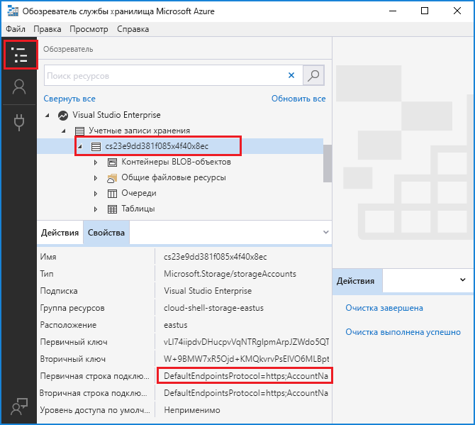

# <a name="work-with-azure-functions-core-tools"></a>Запуск основных инструментов службы "Функции Azure"

Основные инструменты службы "Функции Azure" позволяют разрабатывать и тестировать функции на локальном компьютере из командной строки или терминала. Локальные функции можно подключать к действующим службам Azure, а отладку функций можно выполнять на локальном компьютере с помощью полной среды выполнения службы "Функции Azure". Также есть возможность развернуть приложение-функцию в подписке Azure.

[!INCLUDE [Don't mix development environments](../../includes/functions-mixed-dev-environments.md)]

Разработке функций на локальном компьютере, а также их публикации в Azure с помощью основных инструментов службы включает следующие основные шаги.

> [!div class="checklist"]
> * [Установите основные инструменты службы и зависимости.](#v2)
> * [Создание проекта приложения-функции на основе шаблона конкретного языка.](#create-a-local-functions-project)
> * [Регистрация расширений триггера и привязки.](#register-extensions)
> * [Определите, хранения и других подключений.](#local-settings-file)
> * [Создание функции триггера и шаблонов языковой специфики.](#create-func)
> * [Локальное выполнение функции](#start)
> * [Публикация проекта в Azure](#publish)

## <a name="core-tools-versions"></a>Версии основных инструментов

Есть две версии основных инструментов службы "Функции Azure". Используемая версия зависит от локальной среды разработки, [выбора языка](supported-languages.md) и требуемого уровня поддержки:

+ Версия 1.x: поддерживает версию 1.x в среде выполнения. Эта версия поддерживается только на компьютерах с ОС Windows и устанавливается из [пакета npm](https://docs.npmjs.com/getting-started/what-is-npm). В этой версии можно создавать функции на экспериментальных языках, которые не имеют официальной поддержки. Дополнительные сведения см. в разделе [Supported languages in Azure Functions](supported-languages.md) (Поддерживаемые языки службы "Функции Azure")

+ [Версия 2.x](#v2): поддерживает версию [2.x среды выполнения](functions-versions.md). Эта версия поддерживает [Windows](#windows-npm), [macOS](#brew) и [Linux](#linux). Использует диспетчеры пакетов определенной платформы или пакеты npm для установки.

Если иное не указано, примеры в этой статье предназначены для версии 2.x.

## <a name="install-the-azure-functions-core-tools"></a>Установка основных инструментов Функций Azure

[Основные инструменты службы "Функции Azure"] являются локальной версией среды выполнения "Функции Azure", которую можно запускать на локальном компьютере для разработки. Она также предоставляет команды для создания функций, подключения к Azure и развертывания проектов функций.

### <a name="v2"></a>Версия 2.x

В версии 2.x инструментов используется среда выполнения Функций Azure версии 2.x, которая основана на .NET Core. Эта версия поддерживается на всех платформах, которые поддерживает .NET Core 2.x, включая [Windows](#windows-npm), [macOS](#brew) и [Linux](#linux). 

> [!IMPORTANT]
> Можно обойти требование для установки .NET Core 2.x SDK с помощью [пакеты расширения].

#### <a name="windows-npm"></a>Windows

На следующих шагах пакет npm используется для установки основных инструментов на компьютерах с Windows. Кроме того, можно использовать [Chocolatey](https://chocolatey.org/). Дополнительные сведения см. в [файле сведений об основных инструментах](https://github.com/Azure/azure-functions-core-tools/blob/master/README.md#windows).

1. Установите [Node.js], который содержит пакет npm. Для версии 2.x этих инструментов поддерживается только версия Node.js 8.5 и более поздние.

1. Установите пакет основных инструментов:

    ```bash
    npm install -g azure-functions-core-tools
    ```
1. Если вы не планируете использовать [пакеты расширения], установить [.NET Core 2.x пакета SDK для Windows](https://www.microsoft.com/net/download/windows).

#### <a name="brew"></a>MacOS с Homebrew

На следующих шагах Homebrew используется для установки основных инструментов на компьютерах macOS.

1. Установите [Homebrew](https://brew.sh/), если вы этого не сделали ранее.

1. Установите пакет основных инструментов:

    ```bash
    brew tap azure/functions
    brew install azure-functions-core-tools
    ```
1. Если вы не планируете использовать [пакеты расширения], установить [.NET Core 2.x пакета SDK для macOS](https://www.microsoft.com/net/download/macos).


#### <a name="linux"></a> Linux (Ubuntu/Debian) с APT

На следующих шагах [APT](https://wiki.debian.org/Apt) используется для установки основных инструментов на дистрибутив Linux Ubuntu/Debian. Чтобы выполнить установку на другие дистрибутивы Linux, ознакомьтесь с [файлом сведений об основных инструментах](https://github.com/Azure/azure-functions-core-tools/blob/master/README.md#linux).

1. Зарегистрируйте ключ продукта Майкрософт как доверенный:

    ```bash
    curl https://packages.microsoft.com/keys/microsoft.asc | gpg --dearmor > microsoft.gpg
    sudo mv microsoft.gpg /etc/apt/trusted.gpg.d/microsoft.gpg
    ```

1. Убедитесь, что на сервере используется одна из соответствующих версий Ubuntu, указанных в таблице ниже. Чтобы добавить источник apt, выполните команду:

    ```bash
    sudo sh -c 'echo "deb [arch=amd64] https://packages.microsoft.com/repos/microsoft-ubuntu-$(lsb_release -cs)-prod $(lsb_release -cs) main" > /etc/apt/sources.list.d/dotnetdev.list'
    sudo apt-get update
    ```

    | Дистрибутив Linux | Version |
    | --------------- | ----------- |
    | Ubuntu 18.10    | `cosmic`    |
    | Ubuntu 18.04    | `bionic`    |
    | Ubuntu 17.04    | `zesty`     |
    | Ubuntu 16.04/Linux Mint 18    | `xenial`  |

1. Установите пакет основных инструментов:

    ```bash
    sudo apt-get install azure-functions-core-tools
    ```
1. Если вы не планируете использовать [пакеты расширения], установить [.NET Core 2.x пакет SDK для Linux](https://www.microsoft.com/net/download/linux).

## <a name="create-a-local-functions-project"></a>Создание локального проекта службы "Функции"

Каталог проекта функций содержит файлы [host.json](functions-host-json.md) и [local.settings.json](#local-settings-file), а также вложенные папки, которые содержат код для отдельных функций. Этот каталог является эквивалентом приложения-функции в Azure. Дополнительные сведения о структуре папок службы "Функции Azure" см. в [Руководстве для разработчиков по Функциям Azure](functions-reference.md#folder-structure).

Версия 2.x требует при ее создании выбрать для проекта язык по умолчанию, и все добавленные функции будут использовать шаблоны языка по умолчанию. В версии 1.x пользователю необходимо указывать язык при каждом создании функции.

В окне терминала или из командной строки выполните следующую команду, чтобы создать проект и локальный репозиторий Git:

```bash
func init MyFunctionProj
```

Когда вы указываете имя проекта, то создается и инициализируется новая папка с этим именем. В противном случае инициализируется текущая папка.  
При запуске команды в версии 2.x необходимо выбрать среду выполнения для проекта. Для разработки функций JavaScript выберите следующий **узел**.

```output
Select a worker runtime:
dotnet
node
```

Для выбора языка используйте СТРЕЛКИ ВВЕРХ и ВНИЗ и клавишу ВВОД. Результат для проекта JavaScript выглядит примерно следующим образом.

```output
Select a worker runtime: node
Writing .gitignore
Writing host.json
Writing local.settings.json
Writing C:\myfunctions\myMyFunctionProj\.vscode\extensions.json
Initialized empty Git repository in C:/myfunctions/myMyFunctionProj/.git/
```

`func init` поддерживает следующие параметры, которые подходят только для версии 2.x, если не указано иное:

| Параметр     | Описание                            |
| ------------ | -------------------------------------- |
| **`--csx`** | Инициализирует проект скрипта C# (CSX). Необходимо указать `--csx` в последующих командах. |
| **`--docker`** | Создает файл Docker для контейнера с использованием базового образа, основанного на выбранном параметре `--worker-runtime`. Используйте этот параметр, если планируете опубликовать в пользовательский контейнер Linux. |
| **`--force`** | Инициализирует проект, даже если в нем уже есть файлы. Этот параметр перезаписывает имеющиеся файлы, используя те же имена. Это не влияет на другие файлы в папке проекта. |
| **`--no-source-control -n`** | Предотвращает создание по умолчанию репозитория Git в версии 1.x. В версии 2.x репозиторий Git не создается по умолчанию. |
| **`--source-control`** | Определяет, создается ли репозиторий Git. По умолчанию репозиторий не создается. Если задано значение `true`, репозиторий создается. |
| **`--worker-runtime`** | Задает языковую среду выполнения для проекта. Поддерживаемые значения: `dotnet`, `node` (JavaScript), `java` и `python`. Если этот параметр не задан, вам будет предложено выбрать среду выполнения во время инициализации. |

> [!IMPORTANT]
> По умолчанию версия 2.x средства Core создает проекты приложений функций для среды выполнения .NET как [проектов класса C#](functions-dotnet-class-library.md) (.csproj). Эти проекты C#, которые могут использоваться с Visual Studio или Visual Studio Code, собираются во время тестирования и при публикации в Azure. Если вы хотите создавать и работать с тем же файлом сценария C# (.csx), созданным в версии 1.x и на портале, необходимо указать параметр `--csx` при создании и развертывании функций.

## <a name="register-extensions"></a>Регистрация расширений

В версии 2.х среды выполнения "Функции Azure" нужно явно зарегистрировать расширения привязки (типы привязки), используемые в приложении-функции.

[!INCLUDE [Register extensions](../../includes/functions-core-tools-install-extension.md)]

Дополнительные сведения см. в статье [Основные понятия триггеров и привязок в Функциях Azure](./functions-bindings-expressions-patterns.md).

## <a name="local-settings-file"></a>Файл с локальными параметрами

Файл local.settings.json хранит параметры приложения, строки подключения и параметры основных инструментов службы "Функции Azure". Параметры в файле local.settings.json используются инструментами Функций только при выполнении в локальной среде. По умолчанию эти параметры не переносятся автоматически при публикации проекта в Azure. [При публикации](#publish) используйте параметр `--publish-local-settings`, чтобы добавить эти параметры в приложение-функцию в Azure. Обратите внимание, что значения **ConnectionStrings** никогда не публикуются. Файл имеет следующую структуру:

```json
{
  "IsEncrypted": false,
  "Values": {
    "FUNCTIONS_WORKER_RUNTIME": "<language worker>",
    "AzureWebJobsStorage": "<connection-string>",
    "AzureWebJobsDashboard": "<connection-string>",
    "MyBindingConnection": "<binding-connection-string>"
  },
  "Host": {
    "LocalHttpPort": 7071,
    "CORS": "*",
    "CORSCredentials": false
  },
  "ConnectionStrings": {
    "SQLConnectionString": "<sqlclient-connection-string>"
  }
}
```

| Параметр      | Описание                            |
| ------------ | -------------------------------------- |
| **`IsEncrypted`** | Если задано значение `true`, все значения шифруются с помощью ключа локального компьютера. Используется с командами `func settings`. По умолчанию имеет значение `false`. |
| **`Values`** | Коллекция параметров приложения и строк подключения, используемых при локальном выполнении. Эти значения соответствуют параметры приложения в приложении-функции в Azure, такие как [ `AzureWebJobsStorage` ]. Многие триггеры и привязки имеют свойство, которое ссылается на параметр приложения строки подключения, например `Connection` для [триггер хранилища BLOB-объектов](functions-bindings-storage-blob.md#trigger---configuration). Для таких свойств требуется параметр приложения, определенный в `Values` массива. <br/>[`AzureWebJobsStorage`] Обязательное приложение устанавливает для триггеров, отличных от HTTP. <br/>Версии 2.x среды выполнения функций требует [ `FUNCTIONS_WORKER_RUNTIME` ] параметр, который создается для проекта, основными инструментами. <br/> При наличии [эмулятора хранения Azure](../storage/common/storage-use-emulator.md) установлены локально, можно задать [ `AzureWebJobsStorage` ] для `UseDevelopmentStorage=true` и основных инструментов используется эмулятор. Во время разработки это удобно, но следует проверить подключение к фактическому хранилищу перед развертыванием. |
| **`Host`** | Параметры в этом разделе служат для настройки хост-процесса Функций при выполнении в локальной среде. |
| **`LocalHttpPort`** | Задает порт по умолчанию, используемый при выполнении локального узла Функций (`func host start` и `func run`). Параметр командной строки `--port` имеет приоритет над этим значением. |
| **`CORS`** | Определяет источники, для которых разрешен [общий доступ к ресурсам независимо от источника (CORS)](https://en.wikipedia.org/wiki/Cross-origin_resource_sharing). Источники указываются в виде разделенного запятыми списка без пробелов. Допускается подстановочное значение (\*), разрешающее запросы из любого источника. |
| **`CORSCredentials`** |  Задайте для него значение true, чтобы разрешить `withCredentials` запросов |
| **`ConnectionStrings`** | Не применяйте эту коллекцию для строк подключения, используемых функциями привязки. Эта коллекция используется только с платформ, которые обычно получают строк соединения из `ConnectionStrings` файл раздел конфигурации, такие как [Entity Framework](https://msdn.microsoft.com/library/aa937723(v=vs.113).aspx). Строки подключения, содержащиеся в этом объекте, добавляются в среду с типом поставщика [System.Data.SqlClient](https://msdn.microsoft.com/library/system.data.sqlclient(v=vs.110).aspx). Элементы этой коллекции не публикуются в Azure с другими параметрами приложения. Необходимо явным образом добавить эти значения для `Connection strings` коллекцию параметрах приложения-функции. Если вы создаете [ `SqlConnection` ](https://msdn.microsoft.com/library/system.data.sqlclient.sqlconnection(v=vs.110).aspx) в коде функции следует хранить значение строки подключения в **параметры приложения** на портале с другими подключениями. |

Эти значения параметров приложения-функции также могут считываться в коде как переменные среды. Дополнительные сведения см. в разделе о переменных среды в этих справочниках для определенного языка:

* [Предкомпилированный код C#](functions-dotnet-class-library.md#environment-variables)
* [Скрипт C# (CSX)](functions-reference-csharp.md#environment-variables)
* [Скрипт F# (FSX)](functions-reference-fsharp.md#environment-variables)
* [Java](functions-reference-java.md#environment-variables)
* [JavaScript](functions-reference-node.md#environment-variables)

Если для задано не допустимую строку соединения хранения [ `AzureWebJobsStorage` ] и не используется эмулятор, отображается следующее сообщение об ошибке:

> Отсутствует значение AzureWebJobsStorage в local.settings.json. This is required for all triggers other than HTTP. You can run 'func azure functionapp fetch-app-settings \<functionAppName\>' or specify a connection string in local.settings.json (Оно требуется для всех триггеров, отличных от HTTP. Выполните команду func azure functionapp fetch-app-settings <имя_приложения_функции> или укажите строку подключения в файле local.settings.json).

### <a name="get-your-storage-connection-strings"></a>Получение параметров строк подключения службы хранилища

Даже при использовании эмулятора хранилища для разработки приложений можно проверить подключение к фактическому хранилищу. При условии, что ваша [учетная запись хранения создана](../storage/common/storage-create-storage-account.md), действительную строку подключения к хранилищу можно получить одним из следующих способов:

+ На [портале Azure]. Перейдите к учетной записи хранения, выберите **Ключи доступа** в разделе **Параметры**, а затем скопируйте одно из значений **Строка подключения**.

  

+ Подключитесь к учетной записи Azure с помощью [Обозревателя службы хранилища Azure](https://storageexplorer.com/). В **Explorer** разверните свою подписку, выберите учетную запись хранения и скопируйте основную или вторичную строку подключения.

  

+ Используйте Core Tools для загрузки строки подключения из Azure при помощи одной из следующих команд:

  + Загрузите все параметры из существующего приложения-функции:

    ```bash
    func azure functionapp fetch-app-settings <FunctionAppName>
    ```
  + Получите строку подключения для указанной учетной записи хранения:

    ```bash
    func azure storage fetch-connection-string <StorageAccountName>
    ```

    Если вы еще не вошли в Azure, вам будет предложено сделать это.

## <a name="create-func"></a>Создание функции

Чтобы создать функцию, выполните следующую команду:

```bash
func new
```

В версии 2.x при запуске `func new` для приложения-функции предлагается выбрать шаблон языка по умолчанию, а затем имя для функции. В версии 1.x также предлагается выбрать язык.

```output
Select a language: Select a template:
Blob trigger
Cosmos DB trigger
Event Grid trigger
HTTP trigger
Queue trigger
SendGrid
Service Bus Queue trigger
Service Bus Topic trigger
Timer trigger
```

Код функции создается во вложенной папке с предоставленным именем функции, как показано в следующем выходе триггера очереди.

```output
Select a language: Select a template: Queue trigger
Function name: [QueueTriggerJS] MyQueueTrigger
Writing C:\myfunctions\myMyFunctionProj\MyQueueTrigger\index.js
Writing C:\myfunctions\myMyFunctionProj\MyQueueTrigger\readme.md
Writing C:\myfunctions\myMyFunctionProj\MyQueueTrigger\sample.dat
Writing C:\myfunctions\myMyFunctionProj\MyQueueTrigger\function.json
```

Эти параметры можно также задать в команде, указав следующие аргументы.

| Аргумент     | Описание                            |
| ------------------------------------------ | -------------------------------------- |
| **`--csx`** | (Версия 2.x). Создаются те же шаблоны сценариев C# (.csx), которые используются в версии 1.x и на портале. |
| **`--language -l`**| Язык программирования шаблона, например C#, F# или JavaScript. Этот параметр необходим в версии 1.x. Не используйте этот параметр в версии 2.x или выберите язык, который совпадает со средой выполнения рабочей роли. |
| **`--name -n`** | Имя функции. |
| **`--template -t`** | Используйте команду `func templates list`, чтобы просмотреть полный список доступных шаблонов для каждого поддерживаемого языка.   |

Например, чтобы создать триггер HTTP на JavaScript одной командой, выполните следующую команду.

```bash
func new --template "Http Trigger" --name MyHttpTrigger
```

Чтобы создать активируемую с помощью очереди функцию одной командой, выполните следующую команду.

```bash
func new --template "Queue Trigger" --name QueueTriggerJS
```

## <a name="start"></a>Запуск функций локально

Чтобы запустить проект службы "Функции", запустите узел этой службы. Узел включает триггеры для всех функций в проекте.

```bash
func host start
```

Команда `host` требуется только в версии 1.x.

`func host start` имеет указанные ниже параметры.

| Параметр     | Описание                            |
| ------------ | -------------------------------------- |
| **`--no-build`** | Не выполняйте сборку текущего проекта перед запуском. Только для проектов .NET. По умолчанию установлено значение false. Только версия 2.x. |
| **`--cert`** | Путь к PFX-файлу, который содержит закрытый ключ. Используется только с `--useHttps`. Только версия 2.x. |
| **`--cors-credentials`** | Разрешение запросов, прошедших проверку подлинности из разных источников (например, файлы cookie и заголовок проверки подлинности). Только версия 2.x. |
| **`--cors`** | Список разрешенных источников CORS, разделенный запятыми без пробелов. |
| **`--language-worker`** | Аргументы для настройки обработчика языка. Только версия 2.x. |
| **`--nodeDebugPort -n`** | Порт отладчика узла. Значение по умолчанию: значение из launch.json или 5858. Только версия 1.x. |
| **`--password`** | Пароль или файл, содержащий пароль для PFX-файла. Используется только с `--cert`. Только версия 2.x. |
| **`--port -p`** | Локальный порт для прослушивания. Значение по умолчанию: 7071. |
| **`--pause-on-error`** | Приостановка для получения дополнительных входных данных перед выходом из процесса. Используется только при запуске набора инструментов Core Tools из интегрированной среды разработки.|
| **`--script-root --prefix`** | Используется для указания пути к корню приложения-функции, которое необходимо запустить или развернуть. Используется для скомпилированных проектов, которые создают файлы проекта во вложенной папке. Например, при сборке проекта библиотеки классов C# файлы host.json, local.settings.json и function.json создаются в *корневой* вложенной папке с путем, таким как `MyProject/bin/Debug/netstandard2.0`. В этом случае задайте для префикса значение `--script-root MyProject/bin/Debug/netstandard2.0`. Это корень приложения-функции, работающего в Azure. |
| **`--timeout -t`** | Время ожидания для запуска узла службы "Функции" в секундах. Значение по умолчанию: 20 секунд.|
| **`--useHttps`** | Привязка к `https://localhost:{port}`, а не к `http://localhost:{port}`. По умолчанию этот параметр создает доверенный сертификат на компьютере.|

Для проекта библиотеки классов C# (CSPROJ) необходимо указать параметр `--build` для создания DLL-файла библиотеки.

При запуске узла службы "Функции" выводится URL-адрес функций, активируемых по HTTP:

```output
Found the following functions:
Host.Functions.MyHttpTrigger

Job host started
Http Function MyHttpTrigger: http://localhost:7071/api/MyHttpTrigger
```

>[!IMPORTANT]
>При локальном запуске аутентификация конечных точек HTTP не требуется. Это означает, что все локальные HTTP-запросы будут обрабатываться как `authLevel = "anonymous"`. Дополнительные сведения см. в статье о [привязке HTTP](functions-bindings-http-webhook.md#authorization-keys).

### <a name="passing-test-data-to-a-function"></a>Передача тестовых данных в функцию

Чтобы протестировать функции в локальной среде, [запустите узел службы "Функции"](#start) и вызовите конечные точки на локальном сервере, используя HTTP-запросы. Вызываемая конечная точка зависит от типа функции.

>[!NOTE]
> В примерах в этой статье используется инструмент cURL для отправки HTTP-запросов из терминала или командной строки. Вы можете использовать любой инструмент для отправки HTTP-запросов к локальному серверу. Инструмент cURL доступен по умолчанию в системах на основе Linux. При использовании Windows [инструмент cURL](https://curl.haxx.se/) необходимо сначала скачать и установить.

Дополнительные сведения о тестировании функций см. в статье [Методика тестирования кода с помощью Функций Azure](functions-test-a-function.md).

#### <a name="http-and-webhook-triggered-functions"></a>Функции, активируемые по протоколу HTTP или с помощью веб-перехватчика

Вызовите следующую конечную точку, чтобы запустить в локальной среде функции, активируемые по протоколу HTTP или с помощью веб-перехватчика.

    http://localhost:{port}/api/{function_name}

Используйте то же имя сервера и порт, прослушиваемый узлом службы "Функции". Их можно найти в выходных данных, полученных при запуске узла службы "Функции". Этот URL-адрес можно вызвать с помощью любого метода HTTP с поддержкой триггера.

Следующая команда cURL активирует функцию быстрого запуска `MyHttpTrigger` из запроса GET с параметром _name_, который передается в строке запроса.

```bash
curl --get http://localhost:7071/api/MyHttpTrigger?name=Azure%20Rocks
```

В следующем примере представлена та же функция, вызываемая из запроса POST с передачей параметра _name_ в тексте запроса:

```bash
curl --request POST http://localhost:7071/api/MyHttpTrigger --data '{"name":"Azure Rocks"}'
```

Запросы GET можно выполнять из браузера, передавая данные в строке запроса. Для всех остальных методов HTTP необходимо использовать cURL, Fiddler, Postman или аналогичный инструмент тестирования HTTP.

#### <a name="non-http-triggered-functions"></a>Функции, не активируемые по протоколу HTTP

Все виды функций, кроме триггеров HTTP и веб-перехватчиков, можно тестировать в локальной среде путем вызова конечной точки администрирования. Вызов этой конечной точки при помощи запроса HTTP POST на локальном сервере активирует функцию. При необходимости можно передать тестовые данные в среду выполнения в тексте запроса POST. Это аналогично выполнению функции с помощью вкладки **Тест** на портале Azure.

Вызовите следующую конечную точку администрирования, чтобы активировать функции, отличные от HTTP:

    http://localhost:{port}/admin/functions/{function_name}

Чтобы передать тестовые данные в конечную точку администрирования функции, укажите данные в тексте запроса POST. Текст сообщения должен иметь следующий формат JSON:

```JSON
{
    "input": "<trigger_input>"
}
```

Значение `<trigger_input>` содержит данные в формате, ожидаемом функцией. В следующем примере представлен запрос POST к функции `QueueTriggerJS`. В этом случае входные данные представляют собой строку, соответствующую сообщению, которое нужно найти в очереди.

```bash
curl --request POST -H "Content-Type:application/json" --data '{"input":"sample queue data"}' http://localhost:7071/admin/functions/QueueTriggerJS
```

#### <a name="using-the-func-run-command-in-version-1x"></a>Использование команды `func run` в версии 1.x

>[!IMPORTANT]
> Команда `func run` не поддерживается в версии 2.x инструментов. Дополнительные сведения см. в статье [Выбор целевых версий среды выполнения Функций Azure](set-runtime-version.md).

Вы также можете вызвать функцию напрямую с помощью `func run <FunctionName>` и предоставить входные данные для нее. Эта команда аналогична выполнению функции с помощью вкладки **Тест** на портале Azure.

`func run` имеет указанные ниже параметры.

| Параметр     | Описание                            |
| ------------ | -------------------------------------- |
| **`--content -c`** | Встроенное содержимое. |
| **`--debug -d`** | Подключение отладчика к хост-процессу перед выполнением функции.|
| **`--timeout -t`** | Время ожидания (в секундах), пока не будет готов локальный узел службы "Функции".|
| **`--file -f`** | Имя файла для использования в качестве содержимого.|
| **`--no-interactive`** | Не запрашивает тип входных данных. Полезно для сценариев автоматизации.|

Например, для вызова функции, активируемой по HTTP, и передачи основного содержимого выполните следующую команду:

```bash
func run MyHttpTrigger -c '{\"name\": \"Azure\"}'
```

## <a name="publish"></a>Публикация в Azure

Набор инструментов Core Tools поддерживает два типа развертывания: развертывание файлов проекта функции непосредственно в приложение-функцию и развертывание пользовательского контейнера Linux, который поддерживается только в версии 2.x. Вы уже должны были [создать приложение-функцию в подписке Azure](functions-cli-samples.md#create).

В версии 2.x перед публикацией необходимо [зарегистрировать расширения](#register-extensions) в проекте. Проекты, для которых требуется компиляция, должны быть созданы таким образом, чтобы двоичные файлы можно было развернуть.

### <a name="project-file-deployment"></a>Развертывание файлов проекта

Самый распространенный метод развертывания подразумевает использование набора инструментов Core Tools для упаковки проекта приложения-функции, двоичных данных и зависимостей, а также развертывания пакета в приложение-функцию. При необходимости можно [выполнять функции непосредственно из пакета развертывания](run-functions-from-deployment-package.md).

Чтобы опубликовать проект функций для приложения-функции в Azure, используйте команду `publish`:

```bash
func azure functionapp publish <FunctionAppName>
```

Эта команда публикует в существующее приложение-функцию в Azure. Если в подписке не существует `<FunctionAppName>`, то возникает ошибка. Чтобы узнать, как создать приложение-функцию из командной строки или из окна терминала, используя Azure CLI, см. статью [Создание приложения-функции для выполнения без сервера](./scripts/functions-cli-create-serverless.md).

Команда `publish` отправляет содержимое в каталог проекта функций. При удалении файлов в локальной среде команда `publish` не удаляет их из Azure. Удалить файлы в Azure можно с помощью [средства Kudu](functions-how-to-use-azure-function-app-settings.md#kudu) на [портале Azure].

>[!IMPORTANT]
> При создании приложения-функции на портале Azure по умолчанию используется версия 2.x среды выполнения Функций. Чтобы в приложении-функции использовалась среда выполнения версии 1.x, следуйте инструкциям, приведенным в разделе [Создание приложений 1.x](functions-versions.md#creating-1x-apps).
> Изменить версию среды выполнения для приложения-функции, в котором уже есть функции, невозможно.

Следующие параметры публикации проектов применимы для версий 1.x и 2.x:

| Параметр     | Описание                            |
| ------------ | -------------------------------------- |
| **`--publish-local-settings -i`** |  Публикация параметров из файла local.settings.json в Azure с запросом на перезапись, если параметр уже существует. Если используется эмулятор хранилища, измените параметр приложения на [подключение действующего хранилища](#get-your-storage-connection-strings). |
| **`--overwrite-settings -y`** | Отключите запрос на перезапись параметров приложения при использовании `--publish-local-settings -i`.|

Следующие параметры публикации проектов поддерживаются только в версии 2.x:

| Параметр     | Описание                            |
| ------------ | -------------------------------------- |
| **`--publish-settings-only -o`** |  Только публикует параметры и пропускает содержимое. Значение по умолчанию — запрос. |
|**`--list-ignored-files`** | Отображает основанный на файле FUNCIGNORE список файлов, которые будут проигнорированы во время публикации. |
| **`--list-included-files`** | Отображает основанный на файле FUNCIGNORE список файлов, которые будут опубликованы. |
| **`--nozip`** | Выключает режим по умолчанию `Run-From-Zip`. |
| **`--build-native-deps`** | Позволяет пропустить создание папки формата WHEELS при публикации приложений-функций Python. |
| **`--additional-packages`** | Создает список пакетов установки при создании собственных зависимостей. Например, `python3-dev libevent-dev`. |
| **`--force`** | Пропускает проверку, выполняемую до публикации, в определенных сценариях. |
| **`--csx`** | Публикует проект скрипта C# (CSX). |
| **`--no-build`** | Пропускает создание функций dotnet. |
| **`--dotnet-cli-params`** | При публикации скомпилированных функций C# (CSPROJ) набор инструментов Core Tools вызывает dotnet build --output bin/publish. Все параметры, передаваемые в этот метод, будут добавлены в командную строку. |

### <a name="custom-container-deployment"></a>Развертывание пользовательского контейнера

Функции позволяют развернуть проект функции в пользовательский контейнер Linux. Дополнительные сведения см. в статье [Создание функции в Linux из пользовательского образа (предварительная версия)](functions-create-function-linux-custom-image.md). Набор инструментов Core Tools версии 2.x поддерживает развертывание пользовательского контейнера. В пользовательских контейнерах должен быть файл Docker. Используйте параметр --dockerfile в `func init`.

```bash
func deploy
```

Для пользовательского контейнера доступны следующие параметры развертывания:

| Параметр     | Описание                            |
| ------------ | -------------------------------------- |
| **`--registry`** | Имя реестра Docker, в который вошел текущий пользователь. |
| **`--platform`** | Платформа размещения для приложения-функции. Допустимые параметры: `kubernetes`. |
| **`--name`** | Имя приложения-функции. |
| **`--max`**  | При необходимости задает максимальное число экземпляров приложения-функции, в которые будет выполняться развертывание. |
| **`--min`**  | При необходимости задает минимальное число экземпляров приложения-функции, в которые будет выполняться развертывание. |
| **`--config`** | Задает дополнительный файл конфигурации развертывания. |

## <a name="monitoring-functions"></a>Мониторинг функций

Рекомендуемый способ наблюдения за выполнение функций — интеграция с Azure Application Insights. При создании приложения-функции на портале Azure эта интеграция выполняется по умолчанию. Тем не менее при создании приложения-функции с помощью Azure CLI его интеграции в Azure не происходит.

Чтобы настроить Application Insights для приложения-функции, сделайте следующее:

[!INCLUDE [functions-connect-new-app-insights.md](../../includes/functions-connect-new-app-insights.md)]

Дополнительные сведения см. в статье [Мониторинг Функций Azure](functions-monitoring.md).
## <a name="next-steps"></a>Дальнейшие действия

Основные инструменты службы "Функции Azure" [имеют открытый код и размещаются на GitHub](https://github.com/azure/azure-functions-cli).  
Чтобы зарегистрировать ошибку или отправить запрос на функцию, [откройте вопрос на GitHub](https://github.com/azure/azure-functions-cli/issues).

<!-- LINKS -->

[Основные инструменты службы "Функции Azure"]: https://www.npmjs.com/package/azure-functions-core-tools
[портале Azure]: https://portal.azure.com 
[Node.js]: https://docs.npmjs.com/getting-started/installing-node#osx-or-windows
[«FUNCTIONS_WORKER_RUNTIME»]: functions-app-settings.md#functions_worker_runtime
[«AzureWebJobsStorage»]: functions-app-settings.md#azurewebjobsstorage
[пакеты расширения]: functions-bindings-register.md#local-development-with-azure-functions-core-tools-and-extension-bundles
