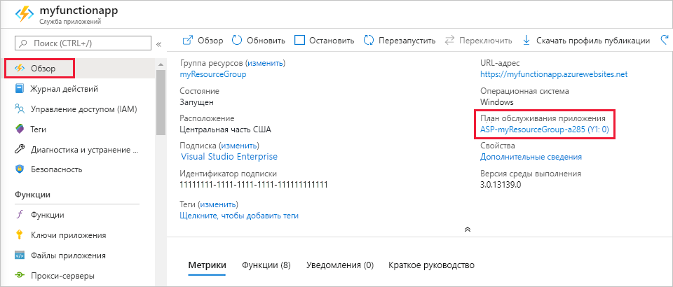

# <a name="azure-functions-scale-and-hosting"></a>Масштабирование и размещение Функций Azure

При создании приложения-функции в Azure необходимо выбрать план размещения для приложения. Для функций Azure доступны три плана размещения: План [потребления](#consumption-plan), [план Premium](#premium-plan)и [план службы приложений](#app-service-plan).

Выбранный план размещения определяет следующие варианты поведения:

* Как масштабируется приложение-функция.
* Ресурсы, доступные для каждого экземпляра приложения функции.
* Поддержка дополнительных функций, таких как подключение к виртуальной сети.

Планы потребления и Premium автоматически добавляют мощность вычислений при выполнении кода. Приложение масштабируется при необходимости для его загрузки и масштабирования при остановке выполнения кода. Для плана потребления также не нужно платить за бездействующие виртуальные машины или резервировать емкость заранее.  

План Premium предоставляет дополнительные функции, такие как экземпляры вычислений Premium, возможность непрерывного сохранения экземпляров и подключения к виртуальной сети.

План службы приложений позволяет воспользоваться преимуществами выделенной инфраструктуры, которыми вы управляете. Приложение-функция не масштабируется на основе событий, то есть никогда не масштабируется до нуля. (Требует включения [Always on](#always-on) .)

> [!NOTE]
> Вы можете переключиться между планами потребления и Premium, изменив свойство Plan ресурса приложения функции.

## <a name="hosting-plan-support"></a>Поддержка планов размещения

Поддержка функций делится на две следующие категории:

* Общедоступная версия: полностью поддерживается и утверждено для использования в рабочей среде.
* _Предварительная версия_: пока не полностью поддерживается и не утверждена для использования в рабочей среде.

В следующей таблице указывается текущий уровень поддержки для трех планов размещения при работе в Windows или Linux:

| | План потребления | План "Премиум" | Выделенный план |
|-|:----------------:|:------------:|:----------------:|
| Windows | GA | предварительный просмотр | GA |
| Linux | GA | предварительный просмотр | GA |

## <a name="consumption-plan"></a>План потребления

Если вы используете план потребления, экземпляры узла функций Azure динамически добавляются и удаляются в зависимости от числа входящих событий. Этот бессерверный план автоматически масштабируется, и вы платите за вычислительные ресурсы только тогда, когда ваши функции запущены. В плане потребления функция должна выполняться в течение настроенного времени (время ожидания).

Плата начисляется на основе числа операций выполнения, времени выполнения и объема использованной памяти. Плата начисляется совокупно за использование всех функций приложения-функции. Дополнительные сведения см. на [странице цен на Функции Azure](https://azure.microsoft.com/pricing/details/functions/).

План потребления является планом размещения по умолчанию. Он включает следующие преимущества:

* вы платите, только если функции выполняются;
* масштабирование выполняется автоматически, даже во время периодов высокой нагрузки.

Приложениям функций в одном регионе можно назначить один и тот же план потребления. Отсутствие недостатка или влияния на наличие нескольких приложений, работающих в одном плане потребления. Назначение нескольких приложений одному плану потребления не влияет на устойчивость, масштабируемость и надежность каждого приложения.

## <a name="premium-plan"></a>План Premium (Предварительная версия)

При использовании плана Premium экземпляры узла функций Azure добавляются и удаляются в зависимости от числа входящих событий, как в плане потребления.  План Premium поддерживает следующие функции:

* Бессрочные экземпляры, чтобы избежать холодного запуска
* Подключение виртуальных сетей
* Неограниченная длительность выполнения
* Размеры экземпляров класса Premium (одно ядро, два ядра и четыре основных экземпляра)
* Более прогнозируемые цены
* Распределение приложений с высокой плотностью для планов с несколькими приложениями-функциями

Сведения о том, как можно настроить эти параметры, можно найти в [документе план функций Azure Premium](functions-premium-plan.md).

Вместо выставления счетов за выполнение и потребление памяти, выставление счетов за план "Премиум" зависит от числа основных секунд, времени выполнения и объема памяти, используемой в необходимых и зарезервированных экземплярах.  Хотя бы один экземпляр должен быть горячим в любое время. Это означает, что имеется фиксированная месячная стоимость по активному плану, независимо от числа выполнений.

Рассмотрим план функций Azure уровня "Премиум" в следующих ситуациях.

* Приложения-функции выполняются непрерывно или почти непрерывно.
* Требуется больше параметров ЦП или памяти, чем предоставлено планом потребления.
* Код должен выполняться дольше, чем [Максимальное время выполнения](#timeout) , разрешенное в плане потребления.
* Требуются функции, доступные только в плане Premium, например подключение к виртуальной сети или VPN.

При выполнении функций JavaScript в плане Premium следует выбрать экземпляр с меньшим числом виртуальных ЦП. Дополнительные сведения см. в статье [Выбор одноядерных планов Premium](functions-reference-node.md#considerations-for-javascript-functions).  

## <a name="app-service-plan"></a>Выделенный план (служба приложений)

Приложения-функции также могут выполняться на тех же выделенных виртуальных машинах, что и другие приложения службы приложений (базовый, Стандартный, премиум и изолированный SKU).

Рассмотрим план службы приложений в следующих ситуациях.

* У вас есть неиспользуемые виртуальные машины, в которых уже запущены другие экземпляры служб приложений.
* Необходимо предоставить пользовательский образ для выполнения функций.

Вы оплачиваете те же функции для приложений-функций в плане службы приложений, что и для других ресурсов службы приложений, таких как веб-приложения. Дополнительную информацию о том, как действует план службы приложений, см. в статье [Подробный обзор планов службы приложений Azure](../app-service/overview-hosting-plans.md).

С помощью плана службы приложений можно вручную выполнить масштабирование, добавив дополнительные экземпляры виртуальных машин. Также можно включить Автомасштабирование. Дополнительные сведения см. в статье [Масштабирование числа экземпляров вручную или автоматически](../azure-monitor/platform/autoscale-get-started.md?toc=%2fazure%2fapp-service%2ftoc.json). Вы можете также увеличивать масштаб, используя разные планы службы приложений. Дополнительные сведения см. в статье [Увеличение масштаба приложения в Azure](../app-service/web-sites-scale.md). 

При запуске функций JavaScript в плане службы приложений нужно выбрать план с меньшим количеством виртуальных ЦП. Дополнительные сведения см. в статье [Выбор планов службы приложений с одним ядром](functions-reference-node.md#choose-single-vcpu-app-service-plans). 
<!-- Note: the portal links to this section via fwlink https://go.microsoft.com/fwlink/?linkid=830855 --> 

### <a name="always-on"></a>Always On

При использовании плана службы приложений следует включить параметр **Всегда включено**, чтобы ваше приложение-функция выполнялось правильно. В плане службы приложений среда выполнения функции переходит в состояние бездействия через несколько минут отсутствия активности, поэтому только триггеры HTTP могут на самом деле "пробудить" ваши функции. Параметр "Всегда включено" доступен только для плана службы приложений. В плане потребления платформа активирует приложения-функции автоматически.

[!INCLUDE [Timeout Duration section](../../includes/functions-timeout-duration.md)]


Даже с включенным параметром "Всегда включено" время ожидания выполнения для отдельных функций управляется с помощью параметра `functionTimeout` в файле проекта [host.json](functions-host-json.md#functiontimeout).

## <a name="determine-the-hosting-plan-of-an-existing-application"></a>Определение плана размещения существующего приложения

Чтобы определить план размещения, используемый приложением-функцией, на [портале Azure](https://portal.azure.com) просмотрите для приложения-функции раздел **План службы приложений/ценовая категория** на вкладке **Обзор**. Для планов службы приложений также указывается ценовая категория.



Для определения плана можно также использовать Azure CLI, как показано ниже:

```azurecli-interactive
appServicePlanId=$(az functionapp show --name <my_function_app_name> --resource-group <my_resource_group> --query appServicePlanId --output tsv)
az appservice plan list --query "[?id=='$appServicePlanId'].sku.tier" --output tsv
```  

Если в результате выполнения команды возвращается значение `dynamic`, ваше приложение-функция находится в плане потребления. Когда выходные данные этой команды имеют `ElasticPremium`значение, приложение-функция находится в плане Premium. Все остальные значения указывают на различные уровни плана службы приложений.

## <a name="storage-account-requirements"></a>Требования к учетной записи хранения

В любом плане для приложения-функции требуется общая учетная запись хранения Azure, которая поддерживает хранилище больших двоичных объектов, очередей, файлов и таблиц Azure. Это связано с тем, что функции используют службу хранилища Azure для таких операций, как Управление триггерами и ведение журнала выполнения функций, но некоторые учетные записи хранения не поддерживают очереди и таблицы. Эти учетные записи, которые включают учетные записи хранения только для больших двоичных объектов (включая хранилище класса Premium) и учетные записи хранения общего назначения с репликацией ZRS, отфильтровываются на основе выбранных вариантов **учетной записи хранения** при создании приложения-функции.

<!-- JH: Does using a Premium Storage account improve perf? -->

Дополнительные сведения о типах учетных записей хранилища см. в разделе [Введение в службы хранилища Azure](../storage/common/storage-introduction.md#azure-storage-services).

## <a name="how-the-consumption-and-premium-plans-work"></a>Как работают планы потребления и Premium

В планах потребления и Premium инфраструктура функций Azure масштабирует ресурсы ЦП и памяти, добавляя дополнительные экземпляры узла функций в зависимости от числа событий, на которые запускаются функции. Каждый экземпляр узла функций в плане потребления ограничен 1,5 ГБ памяти и одним ЦП.  Экземпляром узла является полное приложение-функция, означающее, что все функции в приложении-функции совместно используют ресурс в экземпляре и масштабируются в то же время. Приложения функций, которые используют один и тот же план потребления, масштабируются независимо друг от друга.  В плане "Премиум" Размер плана определит доступную память и ЦП для всех приложений в этом плане на этом экземпляре.  

Файлы кода функции хранятся в общих папках службы файлов Azure в основной учетной записи хранения функции. При удалении основной учетной записи хранения приложения-функции, файлы кода функции будут удалены без возможности восстановления.

> [!NOTE]
> При использовании триггера большого двоичного объекта в плане потребления обработка новых больших двоичных объектов может осуществляться с задержкой до 10 минут, если приложение-функция стало неактивным. После запуска приложения-функции большие двоичные объекты обрабатываются немедленно. Чтобы избежать этой задержки при холодном запуске, используйте план Premium или используйте [триггер сетки событий](functions-bindings-event-grid.md). Дополнительные сведения см. в разделе [Триггер](functions-bindings-storage-blob.md#trigger).

### <a name="runtime-scaling"></a>Масштабирование среды выполнения

Решение "Функции Azure" использует компонент, называемый *контроллером масштабирования*, чтобы отслеживать скорость событий и определять, необходимо ли выполнять масштабирование. Контроллер масштабирования использует эвристику для каждого типа триггеров. Например, при использовании триггера хранилища очередей Azure масштабирование выполняется в зависимости от длины запроса и возраста самого старого сообщения в очереди.

Единицей масштабирования для функций Azure является приложение-функция. При масштабировании приложения-функции выделяются дополнительные ресурсы для выполнения нескольких экземпляров узла службы "Функции Azure". И наоборот, когда потребность в вычислительных ресурсах уменьшается, контроллер масштабирования удаляет экземпляры узла функции. Если никакие функции не выполняются, то число экземпляров в приложении-функции в конечном итоге сократится до нуля.


### <a name="understanding-scaling-behaviors"></a>Основные сведения о действиях при масштабировании

Масштабирование может зависеть от ряда факторов и выполняться по-разному в зависимости от выбранного триггера и языка. Существует несколько тонкостей поведения масштабирования, которые следует учитывать:

* Отдельное приложение-функция масштабируется максимум до 200 экземпляров. Один экземпляр может обрабатывать одновременно более одного сообщения или запроса, поэтому для количества одновременных выполнений не установлено ограничение.
* Для триггеров HTTP новые экземпляры будут выделяться только один раз в 1 секунду.
* Для триггеров, отличных от HTTP, новые экземпляры будут выделяться только один раз в 30 секунд.

Для различных триггеров также могут быть установлены разные ограничения масштабирования, а также ограничения, указанные в следующем документе:

* [Концентратор событий](functions-bindings-event-hubs.md#trigger---scaling)

### <a name="best-practices-and-patterns-for-scalable-apps"></a>Рекомендации и шаблоны для масштабируемых приложений

В приложении-функции существует множество аспектов, влияющих на качество его масштабирования, в том числе конфигурация узла, используемый объем среды выполнения и эффективность использования ресурсов.  Дополнительные сведения см. в разделе [Рекомендации по масштабируемости](functions-best-practices.md#scalability-best-practices). Вам также следует учитывать поведение подключений при масштабировании приложения-функции. См. дополнительные сведения об [управлении подключениями в службе "Функции Azure"](manage-connections.md).

### <a name="billing-model"></a>Модель выставления счетов

Сведения о выставлении счетов для разных планов подробно описаны на [странице цен на функции Azure](https://azure.microsoft.com/pricing/details/functions/). Использование вычисляется на уровне приложения-функции. При этом учитывается только время выполнения кода функции. Счета выставляются по следующим единицам:

* **Потребление ресурсов в гигабайтах в секунду (ГБ/с)** . Вычисляется как сочетание объема памяти и времени выполнения для всех функций, выполняемых в приложении-функции. 
* **Выполнения**. Вычисляются при каждом выполнении функции в ответ на событие.

Полезные запросы и сведения о том, как узнать счет о потреблении, можно найти [в статье вопросы и ответы по выставлению счетов](https://github.com/Azure/Azure-Functions/wiki/Consumption-Plan-Cost-Billing-FAQ).

[Azure Functions pricing page]: https://azure.microsoft.com/pricing/details/functions

## <a name="service-limits"></a>Ограничения службы

В следующей таблице указаны ограничения, которые применяются к приложениям функций при выполнении в различных планах размещения.

[!INCLUDE [functions-limits](../../includes/functions-limits.md)]
