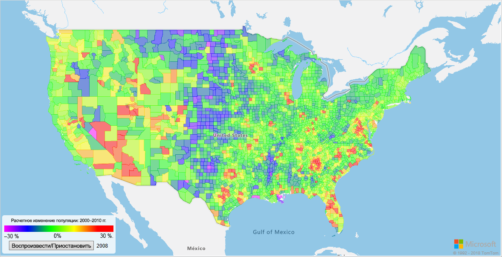
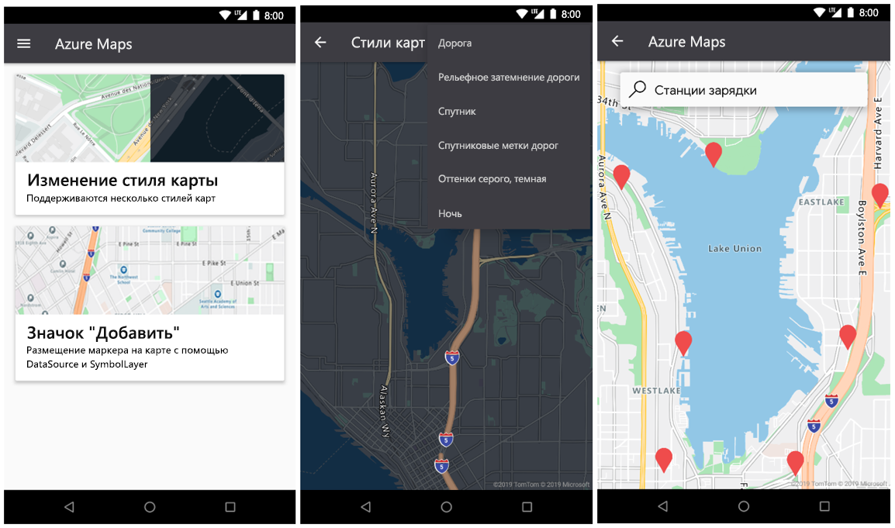

# <a name="what-is-azure-maps"></a>Что такое Azure Maps?

Azure Maps — это коллекция служб обработки геопространственных данных, использующих новые сопоставления данных для обеспечения географического контекста для мобильных и веб-приложений. Служба Azure Maps предоставляет:

* REST API для преобразования карт в несколько стилей и в спутниковые изображения.
* Службы "Поиск" для поиска адресов, мест и достопримечательностей по всему миру.
* Разнообразные типы построения маршрутов; например от точки к точке, многоточечная маршрутизация, многоточечная оптимизация, изохрона, коммерческое транспортное средство, влияние трафика и матричная маршрутизация.
* Представление потока трафика и представление инцидентов для приложений, которым требуются сведения о трафике.
* Служба "Мобильность" позволяет запросить логистику общественного транспорта, планировать маршруты в режиме реального времени, а также запросить сведения об альтернативных режимах транспортировки.
* Службы часовых поясов и геолокации и преобразование расположения в часовые пояса.
* Службы геозон и хранилище картографических данных с информацией о расположении, размещенной в Azure. 
* Определение расположения с помощью геопространственной аналитики. 

В дополнение, службы Azure Maps доступны с помощью веб-пакета SDK и пакета SDK для Android. Эти инструменты позволяют разработчикам быстро найти и масштабировать решения, которые интегрируют сведения в решения Azure. 

Зарегистрируйтесь для бесплатной [учетной записи в Azure Maps](https://azure.microsoft.com/services/azure-maps/) и начинайте разработку.

В следующем видео подробно объясняется принцип действия Azure Maps.

<br/>

<iframe src="https://channel9.msdn.com/Shows/Internet-of-Things-Show/Azure-Maps/player?format=ny" width="960" height="540" allowFullScreen frameBorder="0"></iframe>

## <a name="map-controls"></a>Элементы управления картами

### <a name="web-sdk"></a>веб-пакет SDK.

Веб-пакет SDK Azure Maps позволяет настраивать интерактивные карты, используя собственные изображения и содержимое. Эту интерактивную карту можно использовать как для веб-приложений, так и для мобильных устройств. Элемент управления картой использует WebGL, позволяя вам отображать большие наборы данных с высокой производительностью. Вы можете выполнять разработку с помощью пакета SDK, используя JavaScript или TypeScript.



### <a name="android-sdk"></a>Android SDK

Пакет SDK для Android в Azure Maps позволяет создавать мобильные приложения карт. 



## <a name="services-in-azure-maps"></a>Службы в Azure Maps

Служба Azure Maps состоит из следующих девяти служб, которые могут предоставить географический контекст для приложений Azure.

### <a name="data-service"></a>Служба данных

Данные крайне важны для карт. Используйте Службу данных для передачи и хранения геопространственных данных, которые нужны для пространственных операций или для создания изображений.  Предоставление данных о клиентах службе Azure Maps уменьшит задержку, повысит производительность и создаст новые сценарии для ваших приложений. Дополнительные сведения об этой службе см. в документации по [API-интерфейсам Службы данных](https://docs.microsoft.com/rest/api/maps/data).

### <a name="mobility-service"></a>Служба Mobility Service

Служба Мобильности Azure Maps позволяет планировать поездки в режиме реального времени. Она возвращает самые оптимальные варианты маршрута и предоставляет различные виды режимов перемещения. Для городских районов эти режимы могут включать в себя ходьбу, езду на велосипеде и общественный транспорт. Вы можете запрашивать детали маршрута, геометрические линии, списки остановок, прибытия по расписанию и прибытия в реальном времени, а также служебные оповещения.

Эта служба также позволяет выполнять поиск определенных типов объектов, находящиеся в разных расположениях. Пользователи могут искать станции проката велосипедов, мотороллеров или автомобилей по всему расположению. Пользователи могут запросить количество доступных велосипедов на ближайшей станции проката и найти доступный транспорт. Они также могут искать сведения о доступности транспорта в будущем и о текущем уровне топлива.

Дополнительные сведения о службе см. в [документации по API Службы мобильности](https://docs.microsoft.com/rest/api/maps/mobility).

### <a name="render-service"></a>Служба отрисовки

Служба "Отрисовка" предназначена для разработчиков, создающих веб-приложения и мобильные приложения с функциями картографирования. Служба использует либо высококачественные растровые графические изображения, доступные в 19 уровнях масштабирования, либо полностью настраиваемых изображениях в векторном формате.


Служба отрисовки теперь предоставляет предварительную версию API-интерфейсов, чтобы разработчики могли работать со спутниковыми изображениями. Дополнительные сведения см. в [документации по API отрисовки](https://docs.microsoft.com/rest/api/maps/render).

### <a name="route-service"></a>Служба построения маршрутов

Служба построения маршрутов содержит надежные геометрические вычисления инфраструктуры и направлений в реальных условиях для нескольких режимов движения. Эта служба позволяет разработчикам вычислять направления для нескольких режимов движения, в том числе на автомобиле, грузовике, велосипеде или пешком. Служба также учитывает входные данные, например условия трафика, ограничения массы или транспортировку опасных материалов.


Служба построения маршрутов предлагает предварительный просмотр расширенных функций, таких как: 

* Пакетная обработка нескольких запросов построения маршрута.
* Матрица, содержащая сведения о времени путешествия и расстояниях между набором исходных мест и мест назначения.
* Поиск маршрутов или расстояний, по которым пользователи могут путешествовать, основываясь на времени или потребностях в топливе. 

Дополнительные сведения о возможностях маршрутизации см. в [документации по API построения маршрутов](https://docs.microsoft.com/rest/api/maps/route).

### <a name="search-service"></a>Служба поиска

Служба поиска предназначена для разработчиков. Она позволяет искать адреса, расположения, деловые справочники по имени или категории и другую географическую информацию. Служба поиска также может применять [обратное геокодирование](https://en.wikipedia.org/wiki/Reverse_geocoding) к адресам и пересечениям улиц на основе широты и долготы.


Служба поиска также предоставляет расширенные функции, такие как:

* Поиск вдоль маршрута.
* Поиск внутри более широкой области.
* Пакетная группировка поисковых запросов.
* Поиск большей области вместо точки местоположения. 

API-интерфейсы пакетной службы и область поиска в настоящее время доступны в предварительной версии. Дополнительные сведения о возможности поиска см. в [документации по API поиска](https://docs.microsoft.com/rest/api/maps/search).

### <a name="spatial-operations-service"></a>Служба "Пространственные операции"

Служба "Пространственные операции" Azure Maps принимает сведения о расположении. Она быстро анализирует эти сведения, чтобы информировать клиентов о текущих событиях, происходящих во времени и пространстве. Это позволяет проводить анализ в реальном времени и выполнять прогнозное моделирование событий. 

Служба позволяет клиентам улучшить аналитику местоположений благодаря библиотеке общих геопространственных математических вычислений. К общим вычислениям относятся вычисления ближайшей точки, расстояния по ортодромии и буферов. Дополнительные сведения о службе и различных функциях см. в [документации по API Пространственных операций](https://docs.microsoft.com/rest/api/maps/spatial).

### <a name="time-zone-service"></a>Служба часовых поясов

Служба часовых поясов позволяет запрашивать сведения о текущем, хронологическом и будущем часовых поясах. Вы можете использовать координаты широты и долготы или [идентификатор IANA](https://www.iana.org/). Служба часовых поясов также обеспечивает такие возможности:

* Преобразование идентификаторов часовых поясов Microsoft Windows в часовые пояса IANA.
* Получение смещения часового пояса по отношению к UTC.
* Получение текущего времени в выбранном часовом поясе. 

Обычный ответ JSON на запрос к Службе часовых поясов выглядит следующим образом.

```JSON
{
    "Version": "2017c",
    "ReferenceUtcTimestamp": "2017-11-20T23:09:48.686173Z",
    "TimeZones": [{
        "Id": "America/Los_Angeles",
        "ReferenceTime": {
            "Tag": "PST",
            "StandardOffset": "-08:00:00",
            "DaylightSavings": "00:00:00",
            "WallTime": "2017-11-20T15:09:48.686173-08:00",
            "PosixTzValidYear": 2017,
            "PosixTz": "PST+8PDT,M3.2.0,M11.1.0"
        }
    }]
}
```

Дополнительные сведения об этой службе см. в документации по [API часовых поясов](https://docs.microsoft.com/rest/api/maps/timezone).

### <a name="traffic-service"></a>Служба отслеживания дорожного движения

Служба трафика — это набор веб-служб для разработчиков, которые можно использовать для веб- и мобильных приложений, требующих информацию о трафике. Эта служба предоставляет два типа данных.

* Поток транспорта. Сведения о скорости и времени проезда в реальном времени для всех ключевых дорог в сети.
* Дорожные пришествия. Актуальное представление о пробках и ДТП на дороге в сети.


Дополнительные сведения см. в [документации по API-интерфейсам служб дорожного движения](https://docs.microsoft.com/rest/api/maps/traffic).

### <a name="ip-to-location-service"></a>Служба определения расположения по IP-адресу

Служба определения расположения по IP-адресу позволяет просматривать полученный двухбуквенный код страны или региона для заданного IP-адреса. Эта служба поможет повысить удобство работы пользователей путем размещения содержимого настраиваемых приложений исходя из географического расположения.

Дополнительные сведения о службе определения расположения по IP-адресу в REST API см. в [этой статье](https://docs.microsoft.com/rest/api/maps/geolocation).

## <a name="programming-model"></a>Модель программирования

Azure Maps разрабатываются для мобильности и могут использоваться для разработки кроссплатформенных приложений. Служба использует модель программирования, которая не влияет на язык и поддерживает выходные данные JSON через [интерфейсы REST API](https://docs.microsoft.com/rest/api/maps/).

Кроме того, Azure Maps предлагает удобное [управление картой JavaScript](https://docs.microsoft.com/javascript/api/azure-maps-control) с простой моделью программирования. Разработка осуществляется быстро и просто для мобильных и веб-приложений.

## <a name="usage"></a>Использование

Для доступа к службам Azure Maps нужно перейти на [портал Azure](https://portal.azure.com) и создать учетную запись службы Azure Maps.

Служба Azure Maps использует схему проверки подлинности на основе ключа. Учетная запись поставляется с двумя предварительно созданными ключами. Вы можете использовать любой из них. Интегрируйте эти возможности использования географического расположения в приложение и создавайте запросы в службу Azure Maps.

Примечание. Azure Maps совместно со сторонним производителем TomTom использует предоставленные клиентом запросы адресов и расположений ("Запросы") для сопоставления функциональных возможностей. Запросы не связываются ни с одним клиентом или конечным пользователем при совместном использовании с TomTom и не могут использоваться для идентификации отдельных пользователей. Сейчас корпорация Майкрософт работает над добавлением TomTom в список субподрядчиков веб-служб. Обратите внимание, что сейчас предоставляется [ПРЕДВАРИТЕЛЬНАЯ ВЕРСИЯ](https://azure.microsoft.com/support/legal/preview-supplemental-terms/) службы "Мобильность" и Службы погоды, которые включают интеграцию с Moovit и AccuWeather.

## <a name="supported-regions"></a>Поддерживаемые регионы

Интерфейс API Azure Maps сейчас доступен во всех странах и регионах, за исключением следующих:

* Китай
* Южная Корея

Убедитесь, что расположение используемого IP-адреса относится к поддерживаемой стране или региону.

## <a name="next-steps"></a>Дальнейшие действия

Попробуйте пример приложения, которое демонстрирует работу службы Azure Maps.

> [!div class="nextstepaction"]
> [Краткое руководство. Создание карты с интерактивным поиском с помощью службы Azure Maps](quick-demo-map-app.md)

Будьте в курсе последних событий в работе службы Azure Maps: 

> [!div class="nextstepaction"]
> [Блог о работе со службой Azure Maps](https://azure.microsoft.com/blog/topics/azure-maps/).
