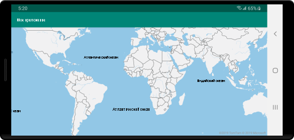

# <a name="quickstart-create-an-android-app-with-azure-maps"></a>Краткое руководство. Создание Android-приложения с поддержкой Azure Maps

В этой статье показано, как добавить Azure Maps в Android-приложение. В этом руководстве описывается:

* настройка среды разработки;
* создание учетной записи службы Azure Maps;
* получение первичного ключа Azure Maps для использования в приложении;
* ссылка на библиотеки Azure Maps из проекта;
* добавление в приложение элемента управления Azure Maps.

## <a name="prerequisites"></a>Предварительные требования

1. Создайте учетную запись Azure Maps, выполнив вход на [портал Azure](https://portal.azure.com). Если у вас еще нет подписки Azure, [создайте бесплатную учетную запись](https://azure.microsoft.com/free/), прежде чем начинать работу.
2. [Создайте учетную запись службы Azure Maps](quick-demo-map-app.md#create-an-azure-maps-account)
3. [Получите первичный ключ подписки](quick-demo-map-app.md#get-the-primary-key-for-your-account), который иногда называется первичным ключом или ключом подписки. Дополнительные сведения о проверке подлинности в Azure Maps см. в [этой статье](how-to-manage-authentication.md).
4. [Android Studio](https://developer.android.com/studio/) можно бесплатно загрузить с сайта Google.

## <a name="create-an-azure-maps-account"></a>создание учетной записи службы Azure Maps

Создайте учетную запись службы Azure Maps с помощью приведенных ниже действий.

1. В верхнем левом углу [портала Azure](https://portal.azure.com) щелкните **Создать ресурс**.
2. В поле *Поиск по Marketplace* введите **Azure Maps**.
3. Выберите *Результаты*, а затем — **Azure Maps**. Нажмите кнопку **Создать**, расположенную под картой.
4. На странице **Создание учетной записи Azure Maps** введите следующие значения:
    * *Подписку*, которую необходимо использовать для этой учетной записи.
    * Имя *группы ресурсов* для этой учетной записи. Вы *создать новую* или *использовать существующую* группу ресурсов.
    * *Имя* новой учетной записи.
    * *Ценовая категория* этой учетной записи.
    * Ознакомьтесь с *лицензией* и *заявлением о конфиденциальности*, а затем установите флажок, чтобы принять условия соглашения.
    * Нажмите кнопку **Создать** .

    

## <a name="get-the-primary-key-for-your-account"></a>Получение первичного ключа для учетной записи

После успешного создания учетной записи службы Azure Maps извлеките первичный ключ, позволяющий запрашивать API службы Azure Maps.

1. Откройте учетную запись службы "Карты Azure" на портале.
2. В разделе "Параметры" выберите **Проверка подлинности**.
3. Скопируйте **первичный ключ** в буфер обмена. Сохраните его локально для использования в этом руководстве позже.

>[!NOTE]
> Если вместо первичного ключа Azure Maps используется ключ подписки Azure, сопоставление будет отображаться неправильно. Кроме того, в целях безопасности рекомендуется чередовать первичный и вторичный ключи. Для этого обновите приложение, чтобы использовать вторичный ключ, разверните его, а затем нажмите кнопку цикла/обновления рядом с первичным ключом, чтобы создать первичный ключ. Старый первичный ключ будет отключен. Дополнительные сведения о чередовании ключей см. в статье [Настройка смены ключей и аудита в Azure Key Vault](../key-vault/secrets/tutorial-rotation-dual.md).


## <a name="create-a-project-in-android-studio"></a>Создание проекта в Android Studio

Во-первых, создайте проект с пустым действием. Выполните следующие действия, чтобы создать проект Android Studio.

1. В разделе **Choose your project** (Выберите проект) выберите **Phone and Tablet** (Телефоны и планшеты). Приложение будет предназначено для этого форм-фактора.
2. На вкладке **Phone and Tablet** (Телефоны и планшеты) выберите **Empty Activity** (Пустое действие) и нажмите кнопку **Next** (Далее).
3. В разделе **Configure your project** (Настройка проекта) выберите `API 21: Android 5.0.0 (Lollipop)` в качестве минимального пакета SDK. Это самая ранняя версия, поддерживаемая пакетом SDK для Android для Azure Maps.
4. Примите значения по умолчанию `Activity Name` и `Layout Name` и нажмите кнопку **Finish** (Готово).

Дополнительные сведения об установке Android Studio и создании проекта см. в [документации по Android Studio](https://developer.android.com/studio/intro/).


## <a name="set-up-a-virtual-device"></a>Настройка виртуального устройства

Android Studio позволяет настроить виртуальное устройство Android на вашем компьютере. Это позволит тестировать приложение во время разработки. Чтобы настроить виртуальное устройство, щелкните значок диспетчера виртуальных устройств Android (AVD) в правом верхнем углу экрана проекта, а затем выберите **Create Virtual Device** (Создать виртуальное устройство). Вы можете также перейти к диспетчеру AVD, выбрав на панели инструментов **Tools** > **Android** > **AVD Manager** (Инструменты > Android > Диспетчер AVD). В категории **Phones** (Телефоны) выберите **Nexus 5X** и щелкните **Next** (Далее).

Дополнительные сведения о настройке AVD см. в [документации по Android Studio](https://developer.android.com/studio/run/managing-avds).


## <a name="install-the-azure-maps-android-sdk"></a>Установка пакета SDK для Android для Azure Maps

Следующим шагом при создании приложения является установка пакета SDK для Android для Azure Maps. Чтобы установить этот пакет SDK, выполните следующие действия.

1. Откройте файл **build.gradle** верхнего уровня и добавьте следующий код во **все проекты** в разделе блока **репозиториев**.

    ```java
    maven {
        url "https://atlas.microsoft.com/sdk/android"
    }
    ```

2. Обновите файл **app/build.gradle** и добавьте в него следующий код.

    1. Убедитесь, что **minSdkVersion** проекта находится на уровне версии API 21 или более поздней.

    2. Добавьте в раздел Android следующий код:

        ```java
        compileOptions {
            sourceCompatibility JavaVersion.VERSION_1_8
            targetCompatibility JavaVersion.VERSION_1_8
        }
        ```

    3. Обновите блок зависимостей и добавьте новую строку зависимости реализации для последнего пакета SDK для Android в Azure Maps:

        ```java
        implementation "com.microsoft.azure.maps:mapcontrol:0.6"
        ```

        > [!Note]
        > Для номера версии можно задать значение "0+", чтобы в вашем коде всегда использовалась последняя версия.

    4. Перейдите в раздел **Файл** на панели инструментов, а затем щелкните **Sync Project with Gradle Files** (Синхронизировать проект с файлами Gradle).
3. Добавьте фрагмент карты в основное действие (res \> layout \> activity\_main.xml):

    ```XML
    <?xml version="1.0" encoding="utf-8"?>
    <FrameLayout
        xmlns:android="http://schemas.android.com/apk/res/android"
        xmlns:app="http://schemas.android.com/apk/res-auto"
        android:layout_width="match_parent"
        android:layout_height="match_parent"
        >

        <com.microsoft.azure.maps.mapcontrol.MapControl
            android:id="@+id/mapcontrol"
            android:layout_width="match_parent"
            android:layout_height="match_parent"
            />
    </FrameLayout>
    ```

4. В файле **MainActivity.java** нужно сделать следующее:

    * добавить операции импорта для пакета SDK в Azure Maps;
    * настроить сведения о проверке подлинности Azure Maps;
    * получить экземпляр элемента управления картой в методе **onCreate**.

    Если задать сведения о проверке подлинности в классе `AzureMaps` глобально с помощью методов `setSubscriptionKey` или `setAadProperties`, не нужно будет добавлять эти сведения в каждое представление.

    Элемент управления картой содержит собственные методы жизненного цикла для управления жизненным циклом OpenGL Android. Они должны вызываться непосредственно из содержащего их действия. Чтобы приложение правильно вызывало методы жизненного цикла элемента управления картой, переопределите приведенные ниже методы жизненного цикла в действии, содержащем элемент управления картой. Необходимо вызывать соответствующий метод элемента управления картой.

    * `onCreate(Bundle)`
    * `onStart()`
    * `onResume()`
    * `onPause()`
    * `onStop()`
    * `onDestroy()`
    * `onSaveInstanceState(Bundle)`
    * `onLowMemory()`

    Измените файл **MainActivity.java** следующим образом:

    ```Java
    package com.example.myapplication;
    
    //For older versions use: import android.support.v7.app.AppCompatActivity; 
    import androidx.appcompat.app.AppCompatActivity;
    import com.microsoft.azure.maps.mapcontrol.AzureMaps;
    import com.microsoft.azure.maps.mapcontrol.MapControl;
    import com.microsoft.azure.maps.mapcontrol.layer.SymbolLayer;
    import com.microsoft.azure.maps.mapcontrol.options.MapStyle;
    import com.microsoft.azure.maps.mapcontrol.source.DataSource;
    
    public class MainActivity extends AppCompatActivity {
        
    static {
        AzureMaps.setSubscriptionKey("<Your Azure Maps subscription key>");

        //Alternatively use Azure Active Directory authenticate.
        //AzureMaps.setAadProperties("<Your aad clientId>", "<Your aad AppId>", "<Your aad Tenant>");
    }

    MapControl mapControl;

    @Override
    protected void onCreate(Bundle savedInstanceState) {
        super.onCreate(savedInstanceState);
        setContentView(R.layout.activity_main);

        mapControl = findViewById(R.id.mapcontrol);

        mapControl.onCreate(savedInstanceState);

        //Wait until the map resources are ready.
        mapControl.onReady(map -> {
            //Add your post map load code here.

        });
    }

    @Override
    public void onResume() {
        super.onResume();
        mapControl.onResume();
    }

    @Override
    protected void onStart(){
        super.onStart();
        mapControl.onStart();
    }

    @Override
    public void onPause() {
        super.onPause();
        mapControl.onPause();
    }

    @Override
    public void onStop() {
        super.onStop();
        mapControl.onStop();
    }

    @Override
    public void onLowMemory() {
        super.onLowMemory();
        mapControl.onLowMemory();
    }

    @Override
    protected void onDestroy() {
        super.onDestroy();
        mapControl.onDestroy();
    }

    @Override
    protected void onSaveInstanceState(Bundle outState) {
        super.onSaveInstanceState(outState);
        mapControl.onSaveInstanceState(outState);
    }}
    ```

    > [!NOTE]
    > После выполнения предыдущих шагов вы, вероятно, получите предупреждения от Android Studio о коде. Чтобы устранить эти предупреждения, импортируйте классы, на которые ссылается `MainActivity.java`.
    > Вы можете автоматически импортировать эти классы, выбрав `Alt` + `Enter` (`Option` + `Return` на компьютере Mac).

5. Нажмите кнопку выполнения, как показано на следующем рисунке (или нажмите `Control` + `R` на компьютере Mac), чтобы выполнить сборку приложения.

    

Android Studio выполнит сборку приложения за несколько секунд. После этого вы сможете протестировать приложение на эмулированном устройстве Android. Должна отобразиться карта примерно следующего вида.



## <a name="clean-up-resources"></a>Очистка ресурсов

>[!WARNING]
> В следующих учебниках в разделе [Дальнейшие действия](#next-steps) подробно описывается использование и настройка службы Azure Maps с помощью учетной записи. Если вы намерены перейти к их изучению, не удаляйте ресурсы, созданные при работе с этим кратким руководством.

Если вы не намерены продолжать изучение учебников, выполните следующие действия, чтобы удалить ресурсы.

1. Закройте Android Studio и удалите созданное приложение.
2. Если вы тестировали приложение на внешнем устройстве, удалите приложение с этого устройства.

Если вы не планируете продолжать разработку с помощью пакета SDK для Android для Azure Maps:

1. Перейдите на страницу портала Azure. На главной странице портала выберите **Все ресурсы**. Или щелкните значок меню в верхнем левом углу. Щелкните **Все ресурсы**.
2. Выберите свою учетную запись службы Azure Maps. В верхней части страницы щелкните **Удалить**.
3. Кроме того, если вы не планируете продолжать разработку приложений для Android, удалите Android Studio.

Дополнительные примеры кода см. в следующих руководствах:

* [Управление аутентификацией в Azure Maps](how-to-manage-authentication.md)
* [Изменение стилей карт Android](set-android-map-styles.md)
* [Добавление слоя символов](how-to-add-symbol-to-android-map.md)
* [Добавление слоя линий](android-map-add-line-layer.md)
* [Добавление слоя многоугольников](how-to-add-shapes-to-android-map.md)

## <a name="next-steps"></a>Дальнейшие действия

В этом кратком руководстве вы создали учетную запись службы Azure Maps и запустили демоверсию приложения. Сведения об Azure Maps см. в этих учебниках:

> [!div class="nextstepaction"]
> [Загрузка данных GeoJSON в Azure Maps](tutorial-load-geojson-file-android.md)