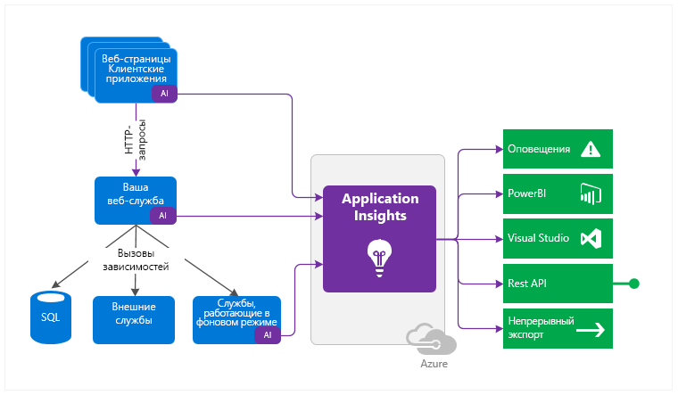
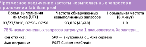
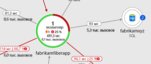
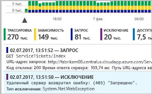
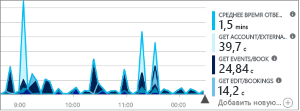
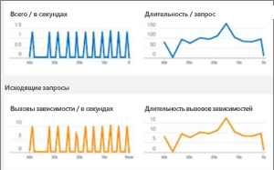
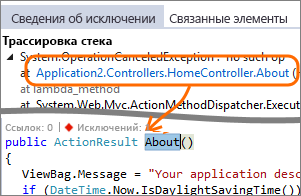
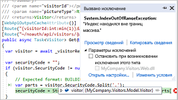
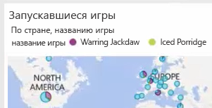

# Что такое Azure Application Insights?
Azure Application Insights, компонент [Azure Monitor](../overview.md), — это расширяемая служба управления производительностью приложений (APM) для разработчиков и специалистов по DevOps. Используйте ее для мониторинга ваших работающих приложений. Эта служба автоматически отслеживает аномалии производительности и предоставляет мощные аналитические инструменты, которые помогут вам диагностировать проблемы и понять, что пользователи фактически делают в вашем приложении.  Эта служба помогает постоянно улучшать производительность и удобство использования. Она работает с приложениями на разных платформах, включая .NET, Node.js, Java и Python, с размещением в локальной, гибридной или общедоступной облачной средах. Эта служба интегрируется с процессом DevOps и содержит точки подключения ко многим инструментам разработки. Она может выполнять мониторинг и анализ данных телеметрии из мобильных приложений благодаря интеграции с Центром приложений Visual Studio.

## Как работает Application Insights?
Вы устанавливаете в приложении небольшой пакет инструментирования (SDK) или включаете Application Insights с помощью соответствующего агента, [когда это возможно](./platforms.md). Функция инструментирования отслеживает ваше приложение и направляет данные телеметрии в ресурс Azure Application Insights, используя уникальный идентификатор GUID, который мы будем называть ключом инструментирования.

Вы можете инструментировать не только приложение веб-службы, но и любые фоновые компоненты, а также JavaScript на веб-страницах. (Приложение и его компоненты могут работать где угодно. Их не обязательно размещать в Azure.)

Кроме того, можно извлечь данные телеметрии из сред размещения, например данные счетчиков производительности, диагностики Azure или журналов Docker. Вы также можете настроить веб-тесты, которые периодически отправляют искусственные запросы в веб-службу.

Все эти потоки телеметрии интегрируются в Azure Monitor. На портале Azure к необработанным данным можно применять мощные инструменты анализа и поиска.

### Увеличение нагрузки
Влияние на производительность приложений невелико. Вызовы отслеживания не приводят к блокировке, выполняются в пакетном режиме и отправляется в отдельном потоке.

## Что отслеживает Application Insights

Служба Application Insights предназначена для команды разработчиков. Она позволяет получить сведения о производительности и использовании приложения. Она отслеживает следующее:

* **Частота запросов, время отклика и частота сбоев.** Узнайте, какие страницы наиболее популярны, в какое время дня их посещают чаще всего, а также узнайте о расположении пользователей. Узнайте, какие страницы работают лучше всего. Если при увеличении количества запросов повышается время отклика и частота сбоев, возможно, возникла проблема с ресурсами. 
* **Частота зависимостей, время отклика и частота сбоев.** Узнайте, замедляют ли внешние службы вашу работу.
* **Исключения.** Проанализируйте сводные статистические данные или выберите конкретные экземпляры и выполните детализацию трассировки стека и связанных запросов. Исключения сервера и браузера регистрируются.
* **Просмотры страниц и производительность загрузки.** Эти сведения сообщаются через браузеры пользователей.
* **Вызовы AJAX** с веб-страницы. Скорость, время отклика и частота сбоев.
* **Количество пользователей и сеансов.**
* **Счетчики производительности** с компьютеров с сервером Windows или Linux, такие как ЦП, память и использование сети. 
* **Размещение диагностики** из Docker или Azure. 
* **Журналы диагностики трассировки** из вашего приложения. Предназначены для сопоставления событий трассировки с запросами.
* **Пользовательские события и метрики**, которые вы напишете самостоятельно в коде клиента или сервера, для отслеживания бизнес-событий, таких как количество проданных единиц или выигранных игр.

## Где отображаются мои данные телеметрии?

Существует множество способов изучения данных. Ознакомьтесь со следующими статьями:

|  |  |
| --- | --- |
| [**Интеллектуальное обнаружение в Application Insights**](./proactive-diagnostics.md) Настройте автоматические оповещения, адаптированные к стандартным шаблонам телеметрии приложения, которые активируются, когда что-то не соответствует стандартному шаблону. Также можно [настроить оповещения](../platform/alerts-log.md) для определенных уровней пользовательских или стандартных метрик. | |
| [**Схема сопоставления приложений в Application Insights**](./app-map.md) Изучите компоненты приложения с основными метриками и оповещениями. |  |
| [**Профилирование динамических веб-приложений Azure с помощью Application Insights (предварительная версия)** ](./profiler.md) Проверьте профили запросов выборки. | |
| [**Usage analysis for web applications with Application Insights**](./usage-overview.md) (Аналитики использования для веб-приложений с Application Insights) Анализируйте сегментацию пользователей и хранение.| |
| [**Работа с Application Insights в Visual Studio**](./diagnostic-search.md) Поиск и фильтрация событий, таких как запросы, исключения, вызовы зависимостей, журналы трассировки и просмотры страниц.  | |
| [**Исследование метрик в Application Insights**](../platform/metrics-charts.md) Просмотр, фильтрация и сегментирование объединенных данных, таких как частоты запросов, ошибок и исключений, время отклика и время загрузки страницы. | |
| [**Панели мониторинга**](./overview-dashboard.md) Объединение разнородных данных из нескольких ресурсов и их совместное использование с другими пользователями. Идеальное решение для многокомпонентных приложений, а также для непрерывного отображения в комнате команды. | |
| [**Динамический поток метрик: мгновенные метрики для подробного отслеживания**](./live-stream.md) При развертывании новой сборки просматривайте эти индикаторы производительности в режиме, близком к реальному времени, чтобы убедиться, что все работает правильно. | |
| [**Аналитика в Application Insights**](../log-query/log-query-overview.md) Получите ответы на сложные вопросы о производительности и использовании приложения с помощью этого мощного языка запросов. | |
| [**Работа с Application Insights в Visual Studio**](./visual-studio.md) Просматривайте данные производительности в коде. Перейдите к коду из трассировки стека.| |
| [**Debug Snapshots on Exceptions in .NET Apps**](./snapshot-debugger.md) (Отладка моментальных снимков при исключениях в приложениях .NET) Отладка моментальных снимков, выбранных из активных операций со значениями параметров.| |
| [**Использование данных Application Insights в Power BI**](./export-power-bi.md) Интегрируйте метрики использования с другими метриками бизнес-аналитики.| |
| [**Use the Application Insights REST API to build custom solutions**](https://dev.applicationinsights.io/) (Использование интерфейса REST API Application Insights для создания пользовательских решений) Напишите код для выполнения запросов с помощью метрик и необработанных данных.|  |
| [**Экспорт данных телеметрии из Application Insights**](./export-telemetry.md) Выполняйте массовый экспорт необработанных данных в хранилище по мере их поступления. | |

## Как использовать Application Insights?

### Монитор
Установите Application Insights в веб-приложении, настройте [доступность веб-тестов](./monitor-web-app-availability.md) и:

* проверяйте [панель мониторинга приложений](./overview-dashboard.md) по умолчанию для комнаты своей команды, чтобы следить за нагрузкой, скоростью реагирования и производительностью зависимостей, а также загрузкой страниц и вызовами AJAX;
* узнавайте, какие запросы выполняются медленнее всех и какие чаще всего не выполняются;
* просматривайте [Live Stream](./live-stream.md) при развертывании новых выпусков, чтобы сразу же узнавать о любом снижении производительности.

### Обнаружение и диагностика
При получении предупреждения или обнаружении проблемы:

* Оцените, сколько пользователей столкнулось с проблемами.
* сопоставляйте сбои с исключениями, вызовами зависимостей и трассировками;
* изучите профилировщик, моментальные снимки, дамп стека и журналы трассировки.

### Создание, измерение и обучение
[Оцените эффективность](./usage-overview.md) каждой новой развертываемой функции.

* планируйте измерение того, как пользователи используют новые UX или бизнес-функции;
* записывайте пользовательскую телеметрию в свой код;
* основывайте следующий цикл разработки на объективных данных телеметрии.

## Начало работы
Application Insights — одна из многих служб, размещенных в Microsoft Azure, и данные телеметрии отправляются в нее для анализа и представления. Поэтому, чтобы приступить к каким-либо действиям, вам потребуется подписка на [Microsoft Azure](https://azure.com). Плата за регистрацию не взимается, и если выбрать [тарифный план](https://azure.microsoft.com/pricing/details/application-insights/) "Базовый" Application Insights, то плата не будет взиматься, пока ваше приложение не начнет значительно использовать ресурсы. Если у вашей организации уже есть подписка, в нее можно добавить вашу учетную запись Майкрософт.

Начать работу можно несколькими способами. Начните с того, который вам лучше подходит. Остальные можно использовать позже.

* **Во время выполнения — инструментирование веб-приложения на сервере.** Идеально подходит для приложений, которые уже развернуты. Не допускает обновление кода.
  * [**Приложения ASP.NET или ASP.NET Core, размещенные в веб-приложениях Azure**](./azure-web-apps.md)
  * [**Приложения ASP.NET, размещенные в IIS на виртуальной машине Azure или в масштабируемом наборе виртуальных машин Azure**](./azure-vm-vmss-apps.md)
  * [**Приложения ASP.NET, размещенные в IIS локально на виртуальной машине**](./monitor-performance-live-website-now.md)
* **Во время разработки — добавление Application Insights в код.** Позволяет настроить сбор данных телеметрии и отправлять дополнительные данные телеметрии.
  * [Приложения ASP.NET](./asp-net.md)
  * [Приложения ASP.NET Core](./asp-net-core.md)
  * [Консольные приложения .NET](./console.md)
  * [Java](./java-get-started.md)
  * [Node.js](./nodejs.md)
  * [Python](./opencensus-python.md)
  * [другие платформы.](./platforms.md)
* **[Инструментирование веб-страниц](./javascript.md)** для получения сведений о просмотрах страниц, вызовах AJAX и других данных телеметрии на стороне клиента.
* **[Анализ данных использования мобильного приложения](../learn/mobile-center-quickstart.md)** с помощью интеграции с Visual Studio App Center.
* **[Тесты доступности](./monitor-web-app-availability.md)** с наших серверов для регулярной проверки связи с вашим веб-сайтом.

## Дальнейшие действия
Приступите к работе во время выполнения с помощью:

* [Приложения, размещенные в IIS на виртуальной машине Azure или в масштабируемом наборе виртуальных машин Azure](./azure-vm-vmss-apps.md)
* [сервера IIS;](./monitor-performance-live-website-now.md)
* [Веб-приложения Azure](./azure-web-apps.md)

Приступите к работе во время разработки с помощью:

* [ASP.NET](./asp-net.md)
* [ASP.NET Core](./asp-net-core.md)
* [Java](./java-get-started.md)
* [Node.js](./nodejs.md)
* [Python](./opencensus-python.md)

## Поддержка и обратная связь
* Вопросы и проблемы
  * [Устранение неполадок][qna]
  * [Страница вопросов (раздел вопросов и ответов на сайте Майкрософт)](/answers/topics/azure-monitor.html)
  * [Stackoverflow](https://stackoverflow.com/questions/tagged/ms-application-insights)
* Ваши предложения:
  * [UserVoice](https://feedback.azure.com/forums/357324-application-insights/filters/top)
* Блог:
  * [Блог Application Insights](https://azure.microsoft.com/blog/tag/application-insights)

<!--Link references-->

[android]: ../learn/mobile-center-quickstart.md
[azure]: ../../insights-perf-analytics.md
[client]: ./javascript.md
[desktop]: ./windows-desktop.md
[greenbrown]: ./asp-net.md
[ios]: ../learn/mobile-center-quickstart.md
[java]: ./java-get-started.md
[knowUsers]: app-insights-web-track-usage.md
[platforms]: ./platforms.md
[portal]: https://portal.azure.com/
[qna]: ../faq.md
[redfield]: ./monitor-performance-live-website-now.md

