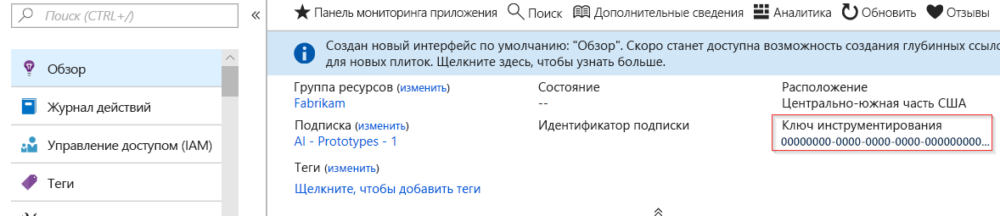
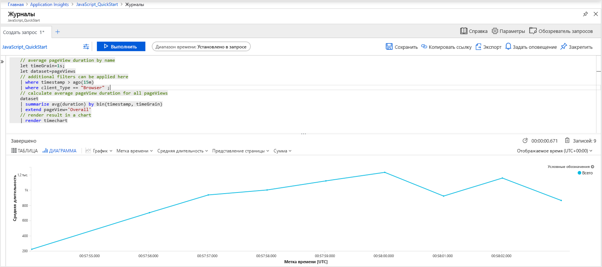
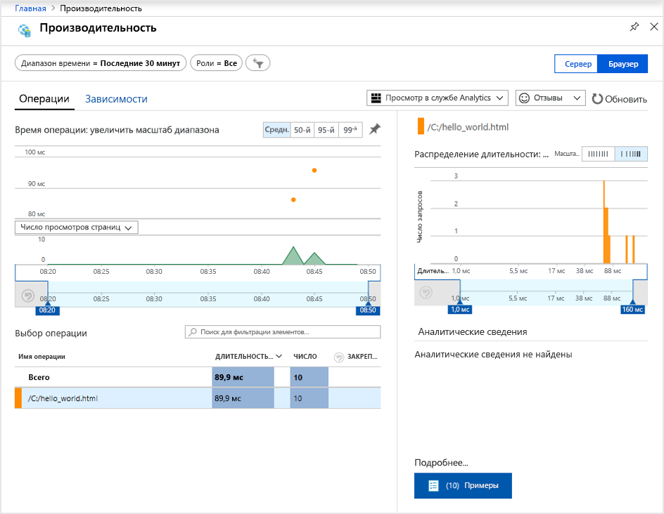
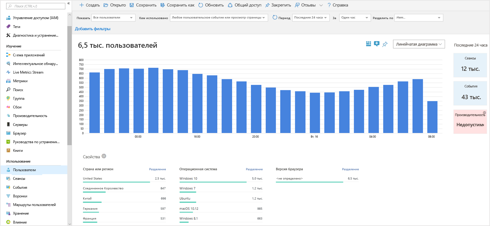
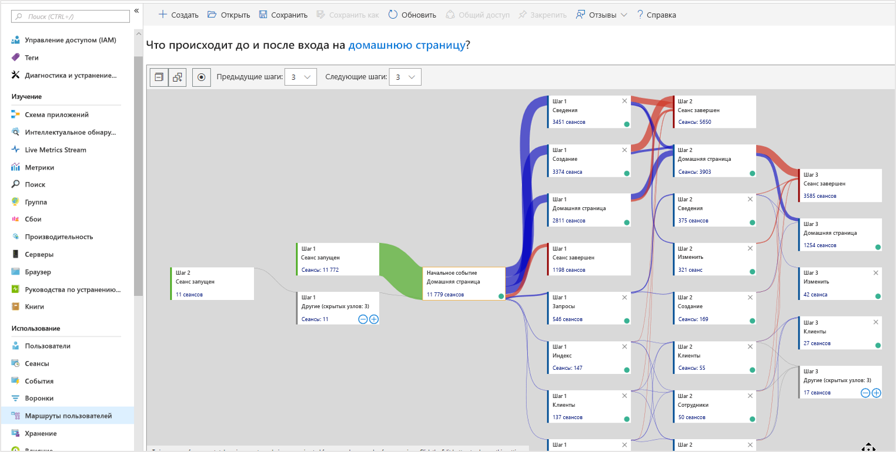

# <a name="start-monitoring-your-website"></a>Запуск мониторинга веб-сайта

С помощью Azure Monitor Application Insights вы можете легко наблюдать за доступностью, производительностью и использованием вашего веб-сайта. Вы также можете быстро идентифицировать и диагностировать ошибки в приложении, не дожидаясь, пока пользователь сообщит о них. Application Insights обеспечивает мониторинг на стороне сервера, а также на стороне клиента или браузера.

Это краткое руководство содержит пошаговые инструкции по добавлению [пакета SDK JavaScript с открытым исходным кодом для Application Insights](https://github.com/Microsoft/ApplicationInsights-JS), которые помогут вам понять, как работает ваш веб-сайт на стороне клиента (браузера).

## <a name="prerequisites"></a>Предварительные требования

Для работы с этим кратким руководством сделайте следующее:

- Вам понадобится подписка Azure.

Если у вас еще нет подписки Azure, создайте [бесплатную](https://azure.microsoft.com/free/) учетную запись Azure, прежде чем начинать работу.

## <a name="sign-in-to-the-azure-portal"></a>Вход на портал Azure

Войдите на [портале Azure](https://portal.azure.com/).

## <a name="enable-application-insights"></a>Включение Application Insights

Application Insights может собирать данные телеметрии из любого подключенного к Интернету приложения, которое работает в локальной среде или в облаке. Чтобы просмотреть эти данные, сделайте следующее.

1. Выберите **Создать ресурс** > **Средства управления** > **Application Insights**.

   > [!NOTE]
   >См. подробнее о [создании ресурса Application Insights](https://docs.microsoft.com/azure/azure-monitor/app/create-new-resource).

   Откроется окно настроек, в котором нужно заполнить все поля в соответствии с приведенной ниже таблицей.

    | Параметры        | Значение           | ОПИСАНИЕ  |
   | ------------- |:-------------|:-----|
   | **Имя**      | Глобально уникальное значение | Имя, идентифицирующее отслеживаемое приложение |
   | **Группа ресурсов**     | myResourceGroup      | Имя новой группы ресурсов для размещения данных App Insights |
   | **Местоположение.** | Восточная часть США | Выберите ближайшее расположение или расположение вблизи места размещения приложения |

2. Нажмите кнопку **Создать**.

## <a name="create-an-html-file"></a>Создание файла HTML

1. На локальном компьютере создайте файл с именем ``hello_world.html``. В этом примере файл будет помещен в корне диска C: ``C:\hello_world.html``.
2. Скопируйте приведенный ниже сценарий в ``hello_world.html``:

    ```html
    <!DOCTYPE html>
    <html>
    <head>
    <title>Azure Monitor Application Insights</title>
    </head>
    <body>
    <h1>Azure Monitor Application Insights Hello World!</h1>
    <p>You can use the Application Insights JavaScript SDK to perform client/browser-side monitoring of your website. To learn about more advanced JavaScript SDK configurations visit the <a href="https://github.com/Microsoft/ApplicationInsights-JS/blob/master/API-reference.md" title="API Reference">API reference</a>.</p>
    </body>
    </html>
    ```

## <a name="configure-app-insights-sdk"></a>Настройка пакета SDK App Insights

1. Выберите **Обзор** > **Основные компоненты** и скопируйте **ключ инструментирования** приложения.

   

2. Добавьте следующий скрипт в ``hello_world.html`` перед закрывающим тегом ``</head>``:

   ```javascript
    <script type="text/javascript">
      var sdkInstance="appInsightsSDK";window[sdkInstance]="appInsights";var aiName=window[sdkInstance],aisdk=window[aiName]||function(e){function n(e){t[e]=function(){var n=arguments;t.queue.push(function(){t[e].apply(t,n)})}}var t={config:e};t.initialize=!0;var i=document,a=window;setTimeout(function(){var n=i.createElement("script");n.src=e.url||"https://az416426.vo.msecnd.net/scripts/b/ai.2.min.js",i.getElementsByTagName("script")[0].parentNode.appendChild(n)});try{t.cookie=i.cookie}catch(e){}t.queue=[],t.version=2;for(var r=["Event","PageView","Exception","Trace","DependencyData","Metric","PageViewPerformance"];r.length;)n("track"+r.pop());n("startTrackPage"),n("stopTrackPage");var s="Track"+r[0];if(n("start"+s),n("stop"+s),n("setAuthenticatedUserContext"),n("clearAuthenticatedUserContext"),n("flush"),!(!0===e.disableExceptionTracking||e.extensionConfig&&e.extensionConfig.ApplicationInsightsAnalytics&&!0===e.extensionConfig.ApplicationInsightsAnalytics.disableExceptionTracking)){n("_"+(r="onerror"));var o=a[r];a[r]=function(e,n,i,a,s){var c=o&&o(e,n,i,a,s);return!0!==c&&t["_"+r]({message:e,url:n,lineNumber:i,columnNumber:a,error:s}),c},e.autoExceptionInstrumented=!0}return t}(
      {
         instrumentationKey:"INSTRUMENTATION_KEY"
      }
      );window[aiName]=aisdk,aisdk.queue&&0===aisdk.queue.length&&aisdk.trackPageView({});
   </script>
   ```

3. Измените ``hello_world.html`` и добавьте ключ инструментирования.

4. Откройте ``hello_world.html`` в сеансе локального браузера. В результате будет создано одностраничное представление. Вы можете обновить свой браузер, чтобы генерировать несколько просмотров тестовых страниц.

## <a name="start-monitoring-in-the-azure-portal"></a>Запуск мониторинга на портале Azure

1. Теперь можно повторно открыть страницу **Обзор** Application Insights на портале Azure, где вы извлекли ключ иснтрументирования, для просмотра сведений о выполняющемся в данный момент приложении. Четыре диаграммы по умолчанию на обзорной странице привязаны к серверным данным приложения. Так как мы рассматриваем взаимодействие на стороне клиента или браузера с использованием пакета SDK для JavaScript, это конкретное представление не применяется, если у нас также не установлен пакет SDK на стороне сервера.

2. Щелкните значок  **Analytics**.  Откроется окно **Analytics**, которое предоставляет полнофункциональный язык запросов для анализа всех данных, собранных Application Insights. Для просмотра данных, связанных с запросами браузера на стороне клиента, выполните следующий запрос:

    ```kusto
    // average pageView duration by name
    let timeGrain=1s;
    let dataset=pageViews
    // additional filters can be applied here
    | where timestamp > ago(15m)
    | where client_Type == "Browser" ;
    // calculate average pageView duration for all pageViews
    dataset
    | summarize avg(duration) by bin(timestamp, timeGrain)
    | extend pageView='Overall'
    // render result in a chart
    | render timechart
    ```

   

3. Вернитесь на страницу **Обзор**. Щелкните **Браузер** в заголовке **Исследовать**, а затем выберите **Производительность**. Здесь можно найти метрики, связанные с производительностью веб-сайта. Существует также соответствующее представление для анализа сбоев и исключений на вашем веб-сайте. Вы можете щелкнуть **Примеры**, чтобы развернуть отдельные данные транзакций. На этой странице можно получить доступ к [полным сведениям о транзакциях](../../azure-monitor/app/transaction-diagnostics.md).

   

4. Чтобы приступить к изучению возможностей [средств аналитики поведения пользователя](../../azure-monitor/app/usage-overview.md), в главном меню Application Insights выберите [**Пользователи**](../../azure-monitor/app/usage-segmentation.md) в заголовке **Использование**. Так как мы выполняем тестирование на одном компьютере, мы увидим данные только для одного пользователя. Для фактического веб-сайта распределение пользователей может выглядеть следующим образом:

     

5. Если бы мы рассматривали более сложный веб-сайт с несколькими страницами, можно было бы использовать другой полезный инструмент — [**Маршруты пользователей**](../../azure-monitor/app/usage-flows.md). Средство **Маршруты пользователей** позволяет отслеживать, как посетители проходят через различные части вашего веб-сайта.

   

Чтобы узнать о более сложных настройках для мониторинга веб-сайтов, ознакомьтесь с руководством [по работе с API пакета SDK для JavaScript](https://github.com/Microsoft/ApplicationInsights-JS/blob/master/API-reference.md).

## <a name="clean-up-resources"></a>Очистка ресурсов

Если вы планируете продолжать работу с этими руководствами по быстрому запуску или обычными руководствами, не удаляйте созданные ресурсы. В противном случае удалите все созданные ресурсы, выполнив на портале Azure следующие действия.

1. В меню слева на портале Azure щелкните **Группы ресурсов**, а затем выберите **myResourceGroup**.
2. На странице группы ресурсов щелкните **Удалить**, в текстовом поле введите **myResourceGroup** и щелкните **Удалить**.

## <a name="next-steps"></a>Дополнительная информация

> [!div class="nextstepaction"]
> [Аналитика в Application Insights](https://docs.microsoft.com/azure/application-insights/app-insights-analytics)
