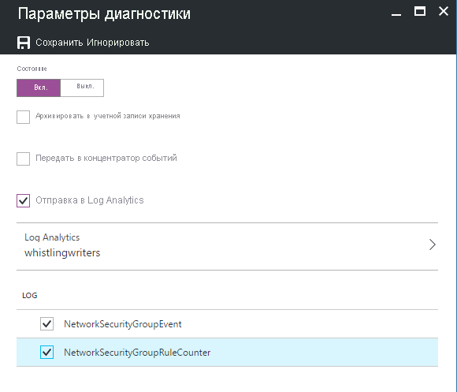

# <a name="azure-networking-monitoring-solutions-in-azure-monitor"></a>Решения в Azure Monitor для мониторинга сетей Azure

[!INCLUDE [updated-for-az](../../../includes/updated-for-az.md)]

Azure Monitor предлагает следующие решения для мониторинга сетей:
* Монитор производительности сети (NPM):
    * отслеживание работоспособности сети.
* Анализ шлюзов приложений Azure для проверки:
    * журналы шлюза приложений Azure;
    * метрику шлюза приложений Azure.
* Решения для отслеживания и аудита сетевой активности в облачной сети.
    * [Аналитика трафика](https://docs.microsoft.com/azure/networking/network-monitoring-overview#traffic-analytics) 
    * Анализ групп безопасности сети Azure

## <a name="network-performance-monitor-npm"></a>Монитор производительности сети

Решение по управлению [Монитор производительности сети](https://docs.microsoft.com/azure/networking/network-monitoring-overview) — это решение для мониторинга сети, которое отслеживает работоспособность и доступность сетей.  Оно используется для отслеживания подключения между следующими ресурсами:

* общедоступное облако и локальная среда;
* центры обработки данных и расположения пользователей (филиалы);
* подсети, в которых размещены различные уровни многоуровневого приложения.

Дополнительную информацию см. в статье [Решение монитора производительности сети в Azure Log Analytics](https://docs.microsoft.com/azure/networking/network-monitoring-overview).

## <a name="azure-application-gateway-and-network-security-group-analytics"></a>Шлюз приложений Azure и анализ групп безопасности сети
Чтобы использовать эти решения, выполните следующие действия.
1. Добавить решение по управлению в Azure Monitor и
2. Включите диагностику для диагностики в рабочую область Log Analytics в Azure Monitor. Необязательно записывать журналы в хранилище BLOB-объектов Azure.

Диагностику и соответствующее решение можно включить как для одного, так и для обоих компонентов (шлюз приложений и группы безопасности сети).

Если не включить ведение журналов диагностики для определенного типа ресурсов, но установить решение, то колонки панели мониторинга для этого ресурса будут пустыми, а также появится сообщение об ошибке.

> [!NOTE]
> В январе 2017 г поддерживаемый способ отправки журналов из шлюзов приложений и групп безопасности сети к рабочей области Log Analytics изменены. Если отобразится устаревшее решение **Анализ сетевой активности Azure (не рекомендуется)**, то выполните действия, описанные в разделе [Миграция из устаревшего решения для анализа сетевой активности](#migrating-from-the-old-networking-analytics-solution).
>
>

## <a name="review-azure-networking-data-collection-details"></a>Просмотр сведений о сборе данных о сетях Azure
Решения для управления анализом шлюзов приложений и групп безопасности сети Azure собирают журналы диагностики непосредственно из шлюзов приложений и групп безопасности сети Azure. Необязательно записывать журналы в хранилище BLOB-объектов Azure. Для сбора данных агенты не требуются.

В следующей таблице приведены методы сбора данных и другие сведения о сборе данных для анализа шлюзов приложений и групп безопасности сети Azure.

| платформа | Direct Agent | Агент Systems Center Operations Manager | Таблицы Azure | Нужен ли Operations Manager? | Отправка данных агента Operations Manager через группу управления | Частота сбора |
| --- | --- | --- | --- | --- | --- | --- |
| Таблицы Azure |  |  |&#8226; |  |  |при входе |


## <a name="azure-application-gateway-analytics-solution-in-azure-monitor"></a>Azure решение для анализа шлюзов приложений в Azure Monitor


Шлюзы приложений поддерживают следующие журналы:

* ApplicationGatewayAccessLog
* ApplicationGatewayPerformanceLog
* ApplicationGatewayFirewallLog

Шлюзы приложений поддерживают следующие метрики:


* пропускная способность за 5 минут.

### <a name="install-and-configure-the-solution"></a>Установка и настройка решения
Установите и настройте решение для анализа шлюзов приложений Azure, выполнив следующие указания:

1. Включите решение для анализа шлюзов приложений Azure из [Azure marketplace](https://azuremarketplace.microsoft.com/marketplace/apps/Microsoft.AzureAppGatewayAnalyticsOMS?tab=Overview) или используя процесс, описанный в [решения добавьте Azure Monitor из коллекции решений](../../azure-monitor/insights/solutions.md).
2. Включите ведение журнала диагностики для [шлюзов приложений](../../application-gateway/application-gateway-diagnostics.md), для которых требуется выполнять мониторинг.

#### <a name="enable-azure-application-gateway-diagnostics-in-the-portal"></a>Включение диагностики шлюза приложений Azure на портале

1. На портале Azure перейдите к ресурсу шлюза приложений необходимо отслеживать.
2. Выберите *журналы диагностики* чтобы открыть следующую страницу.

   
3. Нажмите кнопку *включить диагностику* чтобы открыть следующую страницу.

   
4. Чтобы включить диагностику, щелкните *на* под *состояние*.
5. Установите флажок для *отправить в Log Analytics*.
6. Выберите существующую рабочую область Log Analytics или создайте рабочую область.
7. Установите флажок в разделе **журнала** для каждого типа журнала для сбора.
8. Нажмите кнопку *Сохранить* активировать ведение журнала диагностики в Azure Monitor.

#### <a name="enable-azure-network-diagnostics-using-powershell"></a>Включение диагностики сети Azure с помощью PowerShell

Следующий сценарий PowerShell приведен в качестве примера того, как включить ведение журналов диагностики для шлюзов приложений:

```powershell
$workspaceId = "/subscriptions/d2e37fee-1234-40b2-5678-0b2199de3b50/resourcegroups/oi-default-east-us/providers/microsoft.operationalinsights/workspaces/rollingbaskets"

$gateway = Get-AzApplicationGateway -Name 'ContosoGateway'

Set-AzDiagnosticSetting -ResourceId $gateway.ResourceId  -WorkspaceId $workspaceId -Enabled $true
```

### <a name="use-azure-application-gateway-analytics"></a>Использование анализа шлюзов приложений Azure


Выбрав элемент **Azure Application Gateway analytics** (Анализ шлюзов приложений Azure) в разделе "Обзор", можно просмотреть сводные данные журналов и подробные сведения по следующим категориям:

* Журналы доступа к шлюзу приложений:
  * ошибки клиента и сервера для журналов доступа шлюза приложений;
  * количество запросов в час для каждого шлюза приложений;
  * количество неудачных запросов в час для каждого шлюза приложений;
  * ошибки агентов пользователя для шлюзов приложений.
* Производительность шлюза приложений:
  * работоспособность узла для шлюза приложений;
  * максимальное количество и 95-й процентиль для неудачных запросов шлюза приложений.


На панели мониторинга **Azure Application Gateway analytics** (Анализ шлюзов приложений Azure) просмотрите сводные данные в колонках, а затем щелкните одну из них, чтобы просмотреть подробные сведения на странице поиска журналов.

На любой из страниц поиска журналов можно просмотреть результаты по времени, подробные результаты и историю поиска журналов. Для сужения области результатов выполните фильтрацию по аспектам.


## <a name="azure-network-security-group-analytics-solution-in-azure-monitor"></a>Решение для анализа групп безопасности сети Azure в Azure Monitor


> [!NOTE]
> Решение для анализа групп безопасности сети переходит на поддержку сообщества, так как оно было заменено на [Аналитику трафика](../../network-watcher/traffic-analytics.md).
> - Это решение теперь доступно в [Шаблонах быстрого запуска Azure](https://azure.microsoft.com/resources/templates/oms-azurensg-solution/) и скоро перестанет быть доступным в Azure Marketplace.
> - Для существующих клиентов, которые уже добавили решение в свою рабочую область, решение продолжит работать без изменений.
> - Корпорация Майкрософт продолжит поддерживать отправку журналов диагностики групп безопасности сети в вашу рабочую область с использованием параметров диагностики.

Группы безопасности сети поддерживают следующие журналы:

* NetworkSecurityGroupEvent
* NetworkSecurityGroupRuleCounter

### <a name="install-and-configure-the-solution"></a>Установка и настройка решения
Установите и настройте решение для анализа сетей Azure, выполнив следующие указания:

1. Включите решение для анализа групп безопасности сети Azure из [Azure marketplace](https://azuremarketplace.microsoft.com/marketplace/apps/Microsoft.AzureNSGAnalyticsOMS?tab=Overview) или используя процесс, описанный в [решения добавьте Azure Monitor из коллекции решений](../../azure-monitor/insights/solutions.md).
2. Включите ведение журнала диагностики для ресурсов [групп безопасности сети](../../virtual-network/virtual-network-nsg-manage-log.md), для которых требуется выполнять мониторинг.

### <a name="enable-azure-network-security-group-diagnostics-in-the-portal"></a>Включение диагностики групп безопасности сети Azure на портале

1. На портале Azure перейдите к ресурсу группы безопасности сети, который необходимо отслеживать.
2. Выберите *Журналы диагностики*, чтобы открыть следующую страницу:

   
3. Щелкните *Включить диагностику*, чтобы открыть следующую страницу:

   
4. Чтобы включить диагностику, нажмите кнопку *Вкл.* в разделе *Состояние*.
5. Установите флажок *Send to Log Analytics* (Отправить в Log Analytics).
6. Выберите существующую рабочую область Log Analytics или создайте новую.
7. В разделе **Журнал** установите флажки для всех типов журналов, которые необходимо собирать.
8. Щелкните *Сохранить*, чтобы включить ведение журнала диагностики в Log Analytics.

### <a name="enable-azure-network-diagnostics-using-powershell"></a>Включение диагностики сети Azure с помощью PowerShell

Следующий сценарий PowerShell приведен в качестве примера того, как включить ведение журналов диагностики для групп безопасности сети:
```powershell
$workspaceId = "/subscriptions/d2e37fee-1234-40b2-5678-0b2199de3b50/resourcegroups/oi-default-east-us/providers/microsoft.operationalinsights/workspaces/rollingbaskets"

$nsg = Get-AzNetworkSecurityGroup -Name 'ContosoNSG'

Set-AzDiagnosticSetting -ResourceId $nsg.ResourceId  -WorkspaceId $workspaceId -Enabled $true
```

### <a name="use-azure-network-security-group-analytics"></a>Использование анализа групп безопасности сети Azure
Выбрав элемент **Azure Network Security Group analytics** (Анализ групп безопасности сети Azure) в разделе "Обзор", можно просмотреть сводные данные журналов и подробные сведения по следующим категориям:

* Заблокированные потоки группы безопасности сети:
  * правила группы безопасности сети с заблокированными потоками;
  * MAC-адреса c заблокированными потоками.
* Разрешенные потоки группы безопасности сети:
  * правила группы безопасности сети с разрешенными потоками;
  * MAC-адреса c разрешенными потоками.


На панели мониторинга **Azure Network Security Group analytics** (Анализ групп безопасности сети Azure) просмотрите сводные данные в колонках, а затем щелкните одну из них, чтобы просмотреть подробные сведения на странице поиска журналов.

На любой из страниц поиска журналов можно просмотреть результаты по времени, подробные результаты и историю поиска журналов. Для сужения области результатов выполните фильтрацию по аспектам.

## <a name="migrating-from-the-old-networking-analytics-solution"></a>Миграция из устаревшего решения для анализа сетевой активности
В январе 2017 г поддерживаемый способ отправки журналов из шлюзов приложений Azure и групп безопасности сети Azure к рабочей области Log Analytics изменены. Эти изменения обеспечивают следующие преимущества:
+ Журналы записываются непосредственно в Azure Monitor без необходимости использования учетной записи хранения
+ Меньше задержка между моментом создания журналов и к ним будут доступны в Azure Monitor
+ Меньше этапов настройки.
+ Общий формат для всех типов системы диагностики Azure.

Чтобы использовать обновленные решения, выполните следующие действия:

1. [Настройка диагностики для отправляться непосредственно в Azure Monitor из шлюзов приложений Azure](#enable-azure-application-gateway-diagnostics-in-the-portal)
2. [Настройка диагностики отправку непосредственно в Azure Monitor групп безопасности сети Azure](#enable-azure-network-security-group-diagnostics-in-the-portal)
2. Включить *анализа шлюзов приложений Azure* и *анализ групп безопасности сети Azure* решения, используя процесс, описанный в [решений для добавления Azure Monitor Коллекция решений](solutions.md)
3. Обновите все сохраненные запросы, панели мониторинга и оповещения, чтобы использовать новый тип данных.
   + Тип меняется на AzureDiagnostics. Параметр ResourceType можно использовать для фильтрации по журналам сети.

     | Используйте такую замену: | Используйте следующую команду: |
     | --- | --- |
     | NetworkApplicationgateways &#124; where OperationName=="ApplicationGatewayAccess" | AzureDiagnostics &#124; where ResourceType="APPLICATIONGATEWAYS" and OperationName=="ApplicationGatewayAccess" |
     | NetworkApplicationgateways &#124; where OperationName=="ApplicationGatewayPerformance" | AzureDiagnostics &#124; where ResourceType=="APPLICATIONGATEWAYS" and OperationName=ApplicationGatewayPerformance |
     | NetworkSecuritygroups | AzureDiagnostics &#124; where ResourceType=="NETWORKSECURITYGROUPS" |

   + Для любого поля, имя которого содержит суффикс \_s, \_d или \_g, переведите первый знак в нижний регистр.
   + Для любого поля, имя которого содержит суффикс \_o, данные разбиваются на отдельные поля на основе имен вложенных полей.
4. Удалите устаревшее решение *Анализ сетевой активности Azure (не рекомендуется)*.
   + Если вы используете PowerShell, используйте `Set-AzureOperationalInsightsIntelligencePack -ResourceGroupName <resource group that the workspace is in> -WorkspaceName <name of the log analytics workspace> -IntelligencePackName "AzureNetwork" -Enabled $false`

Данные, собранные до этого изменения, не отображаются в новом решении. Эти данные по-прежнему можно запрашивать с помощью старых имен типов и полей.

## <a name="troubleshooting"></a>Устранение неполадок
[!INCLUDE [log-analytics-troubleshoot-azure-diagnostics](../../../includes/log-analytics-troubleshoot-azure-diagnostics.md)]

## <a name="next-steps"></a>Дальнейшие действия
* Используйте [журнал запросов в Azure Monitor](../log-query/log-query-overview.md) для просмотра подробных данных диагностики Azure.
