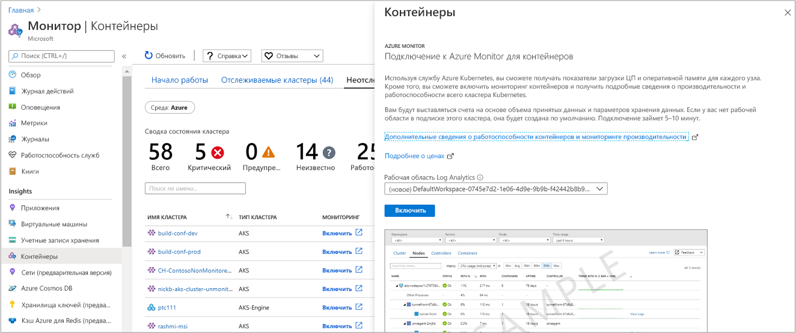

# <a name="configure-azure-red-hat-openshift-clusters-with-azure-monitor-for-containers"></a>Настройка кластеров OpenShift для Azure Red Hat с помощью Azure Monitor для контейнеров

Azure Monitor для контейнеров предоставляет широкие возможности мониторинга для кластеров подсистемы Azure Kubernetes Service (AKS) и AKS. В этой статье описывается, как включить мониторинг кластеров Kubernetes, размещенных в [Azure Red Hat OpenShift](../../openshift/intro-openshift.md) , для обеспечения аналогичного процесса мониторинга.

>[!NOTE]
>Поддержка Azure Red Hat OpenShift в настоящее время является функцией в общедоступной предварительной версии.
>

Azure Monitor для контейнеров можно включить для новых или нескольких существующих развертываний Azure Red Hat OpenShift, используя следующие поддерживаемые методы:

- Для существующего кластера из портал Azure или с помощью шаблона Azure Resource Manager
- Для нового кластера с помощью шаблона Azure Resource Manager 

## <a name="supported-and-unsupported-features"></a>Поддерживаемые и неподдерживаемые функции

Azure Monitor для контейнеров поддерживает мониторинг Azure Red Hat OpenShift, как описано в статье [Обзор](container-insights-overview.md) , за исключением следующих возможностей:

- Данные в реальном времени
- Отходы метрик Prometheus
- [Получение метрик](container-insights-update-metrics.md) из узлов кластера и модулей Pod и их сохранение в базе данных метрик Azure Monitor
- Функция работоспособности

## <a name="prerequisites"></a>Технические условия

- Чтобы включить функции и получить доступ к ним в Azure Monitor для контейнеров, как минимум необходимо быть участником роли *участника* Azure в подписке Azure и членом роли [*участника log Analytics*](../platform/manage-access.md#manage-access-using-azure-permissions) log Analytics рабочей области, настроенной с Azure Monitor для контейнеров.

- Для просмотра данных мониторинга вы являетесь членом разрешения роли [*log Analytics читатель*](../platform/manage-access.md#manage-access-using-azure-permissions) с рабочей областью log Analytics, настроенной с Azure Monitor для контейнеров.

## <a name="enable-for-a-new-cluster-using-an-azure-resource-manager-template"></a>Включение для нового кластера с помощью шаблона Azure Resource Manager

Выполните следующие действия, чтобы развернуть кластер Azure Red Hat OpenShift с включенным мониторингом. Прежде чем продолжать работу, ознакомьтесь с руководством [Создание кластера Azure Red Hat OpenShift](../../openshift/tutorial-create-cluster.md#prerequisites) , чтобы понять, какие зависимости необходимо настроить таким образом, чтобы среда была настроена правильно.

В этом методе используются два шаблона JSON. Один шаблон задает конфигурацию для развертывания кластера с включенным наблюдением, а другой содержит значения параметров, которые вы настраиваете для задания следующих значений:

- Идентификатор ресурса кластера Azure Red Hat OpenShift. 

- Группа ресурсов, в которой развернут кластер.

- [Azure Active Directory идентификатор клиента](../../openshift/howto-create-tenant.md#create-a-new-azure-ad-tenant) , указанный после выполнения шагов для создания одного или одного уже созданного.

- [Azure Active Directory идентификатор клиентского приложения](../../openshift/howto-aad-app-configuration.md#create-an-azure-ad-app-registration) , указанный после выполнения шагов для создания одного или одного уже созданного.

- [Azure Active Directory секрет клиента](../../openshift/howto-aad-app-configuration.md#create-a-client-secret) , указанный после выполнения шагов по созданию одного или одного уже созданного.

- [Группа безопасности Azure AD](../../openshift/howto-aad-app-configuration.md#create-an-azure-ad-security-group) , указанная после выполнения действий по созданию одной или одной уже созданной группы.

- Идентификатор ресурса существующей рабочей области Log Analytics.

- Число главных узлов, создаваемых в кластере.

- Число узлов вычислений в профиле пула агентов.

- Количество узлов инфраструктуры в профиле пула агентов. 

Если вы не знакомы с концепцией развертывания ресурсов с помощью шаблона, ознакомьтесь со статьями:

- [Развертывание ресурсов с использованием шаблонов Resource Manager и Azure PowerShell](../../azure-resource-manager/resource-group-template-deploy.md)

- [Развертывание ресурсов с использованием шаблонов Resource Manager и Azure CLI](../../azure-resource-manager/resource-group-template-deploy-cli.md)

Если вы решили использовать Azure CLI, необходимо сначала установить интерфейс командной строки и использовать его локально. Необходимо запустить Azure CLI версии 2.0.65 или более поздней. Для определения версии выполните `az --version`. Если вам необходимо установить или обновить Azure CLI, ознакомьтесь со статьей [Установка Azure CLI 2.0](https://docs.microsoft.com/cli/azure/install-azure-cli). 

Перед включением мониторинга с помощью Azure PowerShell или CLI необходимо создать рабочую область Log Analytics. Для создания рабочей области можно использовать [Azure Resource Manager](../../azure-monitor/platform/template-workspace-configuration.md), [PowerShell](../scripts/powershell-sample-create-workspace.md?toc=%2fpowershell%2fmodule%2ftoc.json) или [портал Azure](../../azure-monitor/learn/quick-create-workspace.md).

1. Скачайте и сохраните в локальной папке, шаблоне Azure Resource Manager и файле параметров, чтобы создать кластер с надстройкой мониторинга с помощью следующих команд:

    `curl -LO https://raw.githubusercontent.com/microsoft/OMS-docker/ci_feature/docs/aro/enable_monitoring_to_new_cluster/newClusterWithMonitoring.json`

    `curl -LO https://raw.githubusercontent.com/microsoft/OMS-docker/ci_feature/docs/aro/enable_monitoring_to_new_cluster/newClusterWithMonitoringParam.json` 

2. Войдите в Azure 

    ```azurecli
    az login    
    ```
    
    Если у вас есть доступ к нескольким подпискам, выполните команду `az account set -s {subscription ID}`, заменив `{subscription ID}` необходимой подпиской.
 
3. Создайте группу ресурсов для кластера, если она еще не создана. Список регионов Azure, поддерживающих OpenShift в Azure, см. в разделе [Поддерживаемые регионы](../../openshift/supported-resources.md#azure-regions). 

    ```azurecli
    az group create -g <clusterResourceGroup> -l <location> 
    ```

4. Измените файл параметров JSON **невклустервисмониторингпарам. JSON** и обновите следующие значения:

    - *location*
    - *имя_кластера*
    - *Aadtenantid и*
    - *аадклиентид*
    - *aadClientSecret* 
    - *аадкустомерадминграупид* 
    - *воркспацересаурцеид*
    - *мастернодекаунт*
    - *компутенодекаунт*
    - *инфранодекаунт*

5. На следующем шаге выполняется развертывание кластера с включенным мониторингом с помощью Azure CLI. 

    ```azurecli
    az group deployment create --resource-group <ClusterResourceGroupName> --template-file ./newClusterWithMonitoring.json --parameters @./newClusterWithMonitoringParam.json 
    ```
 
    Результат выглядит следующим образом:

    ```azurecli
    provisioningState       : Succeeded
    ```

## <a name="enable-for-an-existing-cluster"></a>Включить для существующего кластера

Чтобы включить мониторинг кластера Azure Red Hat OpenShift, развернутого в Azure, выполните следующие действия. Это можно сделать из портал Azure или с помощью предоставленных шаблонов.

### <a name="from-the-azure-portal"></a>на портале Azure;
 
1. Войдите на [портале Azure](https://portal.azure.com).

2. В меню портал Azure или на домашней странице выберите **Azure Monitor**. В разделе **Аналитика** выберите **Контейнеры**. 

3. На странице **Контейнеры** выберите **Non-monitored clusters** (Неотслеживаемые кластеры).

4. В списке неотслеживаемых кластеров найдите кластер в списке и нажмите кнопку **включить**. Результаты в списке можно найти, выполнив поиск значения **АТО** в столбце **тип кластера**.

5. Если рабочая область Log Analytics расположена в той же подписке, что и кластер, выберите ее из раскрывающегося списка на странице **Onboarding to Azure Monitor for containers** (Подключение к Azure Monitor для контейнеров).  
    В списке будет выбрана рабочая область по умолчанию и расположение, в которое развертывается кластер в подписке. 

    

    >[!NOTE]
    >Если вы хотите создать рабочую область Log Analytics для хранения данных мониторинга из кластера, выполните инструкции, описанные в статье [Создание рабочей области Log Analytics на портале Azure](../../azure-monitor/learn/quick-create-workspace.md). Не забудьте создать рабочую область в той же подписке, в которой развернут кластер RedHat OpenShift. 
 
После включения мониторинга может пройти около 15 минут, прежде чем вы сможете просмотреть метрики работоспособности кластера. 

### <a name="enable-using-an-azure-resource-manager-template"></a>Включение с помощью шаблона Azure Resource Manager

В этом методе используются два шаблона JSON. Один шаблон задает конфигурацию для включения мониторинга, а другой содержит значения параметров, которые можно настроить, чтобы указать следующее:

- Идентификатор ресурса кластера Azure RedHat OpenShift. 

- Группа ресурсов, в которой развернут кластер.

- Рабочая область Log Analytics.

Если вы не знакомы с концепцией развертывания ресурсов с помощью шаблона, ознакомьтесь со статьями:

- [Развертывание ресурсов с использованием шаблонов Resource Manager и Azure PowerShell](../../azure-resource-manager/resource-group-template-deploy.md)

- [Развертывание ресурсов с использованием шаблонов Resource Manager и Azure CLI](../../azure-resource-manager/resource-group-template-deploy-cli.md)

Если вы решили использовать Azure CLI, необходимо сначала установить интерфейс командной строки и использовать его локально. Необходимо запустить Azure CLI версии 2.0.65 или более поздней. Для определения версии выполните `az --version`. Если вам необходимо установить или обновить Azure CLI, ознакомьтесь со статьей [Установка Azure CLI 2.0](https://docs.microsoft.com/cli/azure/install-azure-cli). 

Перед включением мониторинга с помощью Azure PowerShell или CLI необходимо создать рабочую область Log Analytics. Для создания рабочей области можно использовать [Azure Resource Manager](../../azure-monitor/platform/template-workspace-configuration.md), [PowerShell](../scripts/powershell-sample-create-workspace.md?toc=%2fpowershell%2fmodule%2ftoc.json) или [портал Azure](../../azure-monitor/learn/quick-create-workspace.md).

1. Скачайте шаблон и файл параметров, чтобы обновить кластер с помощью надстройки мониторинга, используя следующие команды:

    `curl -LO https://raw.githubusercontent.com/microsoft/OMS-docker/ci_feature/docs/aro/enable_monitoring_to_existing_cluster/existingClusterOnboarding.json`

    `curl -LO https://raw.githubusercontent.com/microsoft/OMS-docker/ci_feature/docs/aro/enable_monitoring_to_existing_cluster/existingClusterParam.json` 

2. Войдите в Azure 

    ```azurecli
    az login    
    ```

    Если у вас есть доступ к нескольким подпискам, выполните команду `az account set -s {subscription ID}`, заменив `{subscription ID}` необходимой подпиской.

3. Укажите подписку кластера Azure RedHat OpenShift.

    ```azurecli
    az account set --subscription "Subscription Name"  
    ```

4. Выполните следующую команду, чтобы найти расположение кластера и идентификатор ресурса:

    ```azurecli
    az openshift show -g <clusterResourceGroup> -n <clusterName> 
    ```

5. Измените файл параметров JSON **ексистингклустерпарам. JSON** и обновите значения *араресаурцеид* и *араресоруцелокатион*. Значение для **workspaceResourceId** — это полный идентификатор ресурса рабочей области Log Analytics, который включает имя рабочей области. 

6. Чтобы выполнить развертывание с Azure CLI, выполните следующие команды: 

    ```azurecli
    az group deployment create --resource-group <ClusterResourceGroupName> --template-file ./ExistingClusterOnboarding.json --parameters @./existingClusterParam.json 
    ```

    Результат выглядит следующим образом:

    ```azurecli
    provisioningState       : Succeeded
    ```

## <a name="next-steps"></a>Дальнейшие действия

- С включенным наблюдением для получения сведений о работоспособности и использовании ресурсов в кластере RedHat OpenShift и рабочих нагрузках на них вы узнаете, [как использовать](container-insights-analyze.md) Azure Monitor для контейнеров.

- Сведения о том, как отключить мониторинг кластера с помощью Azure Monitor для контейнеров, см. в статье [как отключить мониторинг кластера Azure Red Hat OpenShift](container-insights-optout-openshift.md).