# <a name="using-service-map-solution-in-azure"></a>Использование решения "Сопоставление служб" в Azure
Служба схемы услуги автоматически обнаруживает компоненты приложений в системах Windows и Linux и сопоставляет взаимодействие между службами. Это решение позволяет рассматривать серверы как взаимосвязанные системы, обеспечивающие работу важных служб. Сопоставление служб отображает сведения о подключениях между серверами, процессами, задержками во входящих и выходящих подключениях и портами в любой подключенной по протоколу TCP архитектуре без дополнительной настройки. Пользователям требуется только установить агент.

Эта статья описывает подключение и использование Сопоставления служб. Сведения о настройке решения "Сопоставление служб" и соответствующих агентов подключения см. в статье [Настройка схемы услуги в Operations Management Suite]( service-map-configure.md).

>[!NOTE]
>Если Сопоставление служб уже развернуто, вы можете также просматривать свои карты в Azure Monitor для виртуальных машин, которая включает дополнительные возможности для мониторинга работоспособности и производительности виртуальной машины. Дополнительные сведения см. в разделе [Общие сведения об Azure Monitor для виртуальных машин](../../azure-monitor/insights/vminsights-overview.md).


## <a name="sign-in-to-azure"></a>Вход в Azure
Войдите на портал Azure по адресу [https://portal.azure.com](https://portal.azure.com).

## <a name="enable-service-map"></a>Включение Сопоставления служб
1. На портале Azure щелкните **+Создать ресурс**.
2. В строке поиска введите **Сопоставление служб** и нажмите клавишу **ВВОД**.
3. На странице результатов поиска по Marketplace выберите в списке значение **Сопоставление служб**.<br><br> <br>
4. В области обзора **Сопоставление служб** просмотрите сведения о решении и нажмите кнопку **Создать**, чтобы начать процесс подключения к рабочей области Log Analytics.<br><br> 
5. В области **Настройка решения** выберите существующую или создайте рабочую область Log Analytics.  Сведения о создании рабочей области см. в разделе [Создание рабочей области Log Analytics на портале Azure](../../azure-monitor/learn/quick-create-workspace.md). Указав необходимые сведения, нажмите кнопку **Создать**.  

Пока проверяются данные, ход развертывания решения можно проверить в разделе **Уведомления** в меню. 

Обратитесь к Сопоставлению служб на портале Azure из рабочей области Log Analytics и выберите параметр **Решения** на левой панели.<br><br> 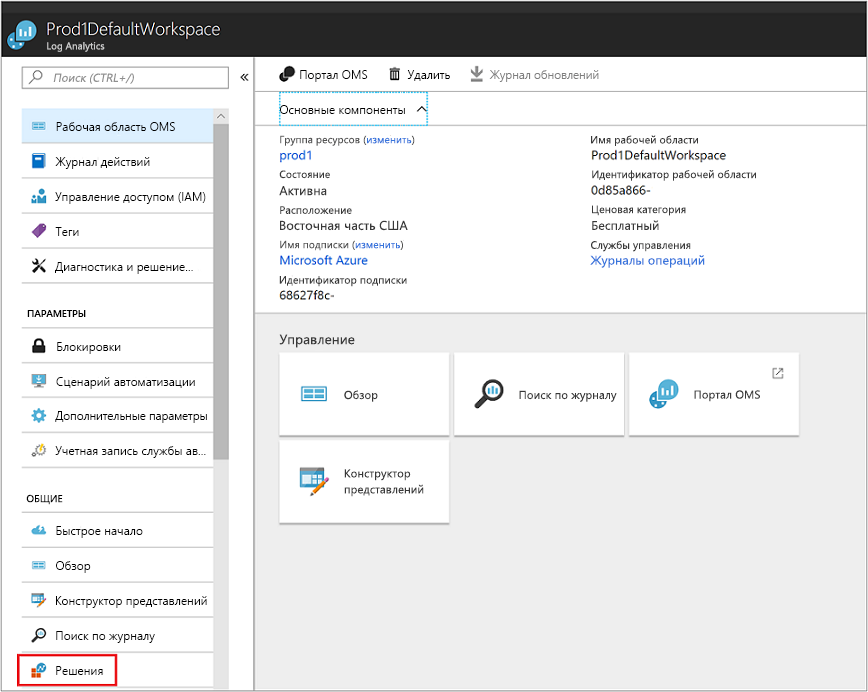<br> В списке решений выберите **ServiceMap(имя_рабочей_области)** и щелкните плитку сводки для Сопоставления служб на странице обзора решения Сопоставления служб.<br><br> 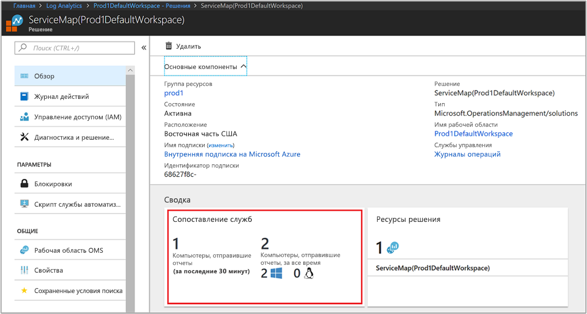

## <a name="use-cases-make-your-it-processes-dependency-aware"></a>Сценарии использования. Обеспечение учета зависимостей в ИТ-процессах

### <a name="discovery"></a>Обнаружение
Служба схемы услуги автоматически создает общую ссылочную карту зависимостей между серверами, процессами и сторонними службами. Она обнаруживает и сопоставляет все TCP-зависимости, определяя неожиданные подключения, удаленные сторонние системы, от которых зависит ваша система, и зависимости в традиционных "темных" областях вашей сети, например Active Directory. Кроме того, служба схемы услуги обнаруживает неудачные сетевые подключения пользовательских систем, что позволяет определить потенциальные неверные настройки сервера, простои служб и проблемы с сетью.

### <a name="incident-management"></a>Управление инцидентами
Схема услуги помогает быстрее изолировать проблему, предоставляя сведения о подключениях систем и их влиянии друг на друга. Помимо определения неудачных попыток подключения, она также помогает выявлять неправильно настроенные подсистемы балансировки нагрузки, неожиданные или избыточные нагрузки на важные службы и неавторизованные клиенты, такие как компьютеры разработчиков, взаимодействующие с рабочими системами. Используя интегрированные с решением для отслеживания изменений рабочие процессы, вы также можете определять, вызван ли инцидент событием изменения на внутреннем компьютере или во внутренней службе.

### <a name="migration-assurance"></a>Обеспечение миграции
Схема услуги позволяет эффективно спланировать, ускорить и проверить миграцию ресурсов в Azure, гарантируя полный перенос без простоев. Пользователи могут обнаруживать все взаимозависимые системы, которые нужно переносить вместе, оценивать конфигурацию и емкость системы, а также определять, следует ли переносить систему (возможно, ее уже нужно вывести из эксплуатации). После переноса вы можете проверить нагрузку и удостоверения клиента, чтобы убедиться в том, что тестовые системы и пользователи подключены. Если с планированием подсети и определениями брандмауэра возникли проблемы, то на основе неудачных подключений, отображаемых на картах сопоставления служб, можно определить системы, для которых требуется установить подключение.

### <a name="business-continuity"></a>Непрерывность бизнес-процессов
Если вы используете Azure Site Recovery и вам нужна помощь с определением последовательности восстановления среды приложения, служба схемы услуги может автоматически показать взаимосвязь между системами. Таким образом вы обеспечите надежный план восстановления. Выбрав важный сервер или группу и просмотрев их клиенты, можно определить внешние системы, которые следует восстановить после восстановления и обеспечения доступности сервера. И наоборот, просмотрев внутренние зависимости важного сервера, можно определить системы, которые необходимо восстановить после восстановления целевых систем.

### <a name="patch-management"></a>Управление исправлениями
За счет предоставления сведений о других группах и серверах, зависящих от вашей службы, решение "Сопоставление служб" расширяет возможности использования решения для оценки обновлений системы. Это позволяет заранее уведомлять об отключении системы для установки исправлений. Решение "Сопоставление служб" предоставляет также дополнительные возможности управления исправлениями, отображая сведения о доступности служб и правильности их подключения после установки исправлений или перезапуска.

## <a name="mapping-overview"></a>Общие сведения о сопоставлении
Агенты сопоставления служб собирают информацию обо всех подключенных по протоколу TCP процессах на сервере, где они установлены, а также сведения о входящих и исходящих подключениях для каждого процесса.

В списке в левой области можно выбрать компьютеры или группы с агентами Сопоставления служб, чтобы визуализировать их зависимости для определенного диапазона времени. Карты зависимостей компьютеров создаются для отдельного компьютера. На них представлены сведения о всех компьютерах, которые являются клиентами или серверами TCP, к которым может напрямую подключиться этот компьютер.  На картах групп компьютеров показаны наборы серверов и их зависимости.

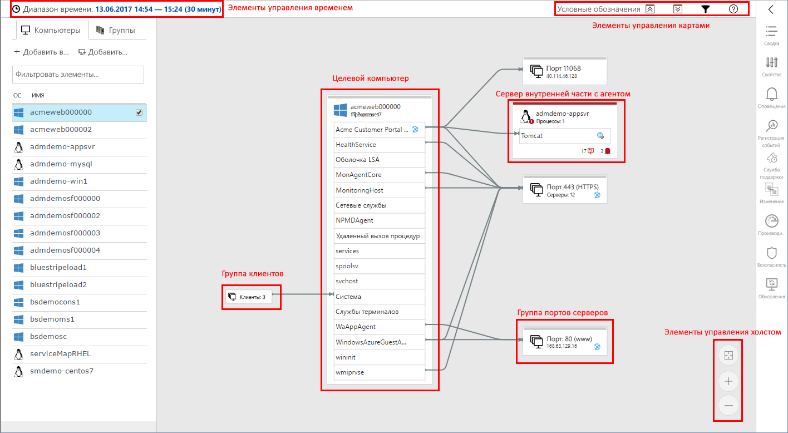

Чтобы получить сведения о выполняющихся группах процессов и процессах с активными сетевыми подключениями в течение определенного диапазона времени, компьютеры можно развернуть в представлении карты. При развертывании карты для удаленного компьютера с агентом схемы услуги отображаются только те процессы, которые взаимодействуют с целевым компьютером. Сведения о количестве подключенных к целевому компьютеру внешних компьютеров, на которых не установлены агенты, указаны слева от процессов, к которым они подключены. Если целевой компьютер подключается к внутреннему компьютеру без агента, этот внутренний сервер включается в группу портов сервера вместе с другими подключениями к порту с таким же номером.

По умолчанию на картах сопоставления служб представлены сведения о зависимостях за последние 30 минут. С помощью элементов управления временем, расположенных в левом верхнем углу, на картах можно запрашивать сведения максимум за 1 час. Так вы можете получать представление о зависимостях в прошлом (например, во время инцидента или перед изменением). В платных рабочих областях данные схемы услуги хранятся 30 дней, а в бесплатных — 7.

## <a name="status-badges-and-border-coloring"></a>Индикаторы состояния и цвет рамки представления
В нижней части схемы каждого сервера может отображаться список значков состояния с информацией о состоянии сервера. Наличие значков свидетельствует о том, что для сервера поступили важные сведения из одной из интеграций решения. Если щелкнуть значок, в области справа откроются сведения о состоянии. Сейчас доступны следующие значки состояния: "Предупреждения", "Служба поддержки", "Изменения", "Безопасность" и "Обновления".

В зависимости от серьезности индикатора состояния рамка представления со сведениями об узле компьютера может быть красной (критическое состояние), желтой (предупреждение) или синей (информационное оповещение). Цвет представляет высокую серьезность любого индикатора состояния. Серая рамка информирует об узле без индикаторов состояния.

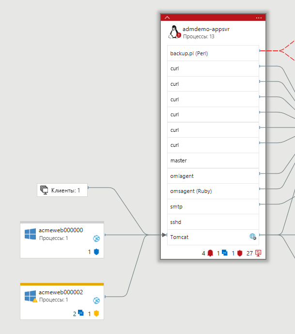

## <a name="process-groups"></a>Группы процессов
Группы процессов позволяют объединять процессы, связанные с общим продуктом или службой, в группы.  При развертывании узла компьютера будут отображаться автономные процессы и группы процессов.  Если произойдет сбой какого-либо входящего или исходящего подключения к процессу в группе, будет считаться, что подключение завершилось с ошибкой для всей группы процессов.

## <a name="machine-groups"></a>Группы компьютеров
Группы компьютеров позволяют просматривать карты для набора серверов, а не отдельного сервера, благодаря чему можно отображать на одной карте все элементы многоуровневого приложения или кластера серверов.

Пользователи выбирают серверы, относящиеся к одной группе, и указывают имя группы.  Затем можно выбрать, следует ли просмотреть группу со всеми процессами и подключениями или только с теми процессами и подключениями, которые напрямую связаны с другими элементами группы.

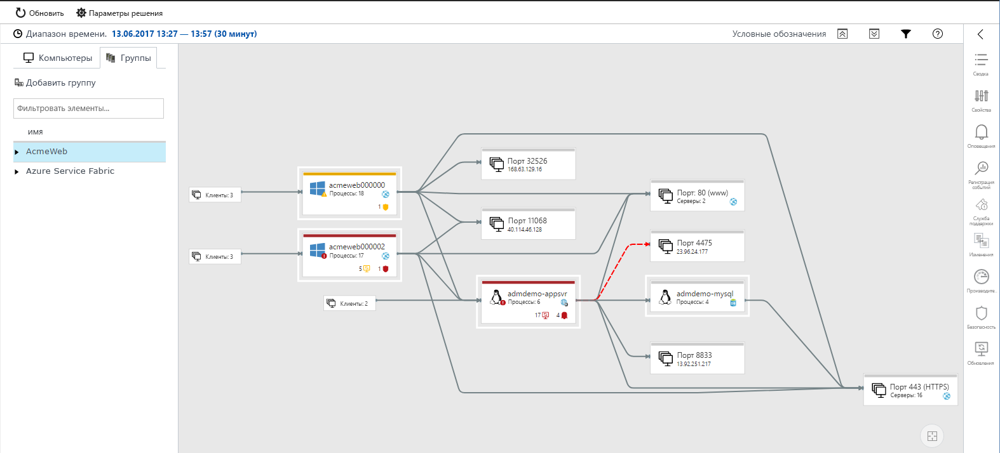

### <a name="creating-a-machine-group"></a>Создание группы компьютеров
Чтобы создать группу, выберите нужный компьютер или компьютеры в списке компьютеров и щелкните **Добавить в группу**.

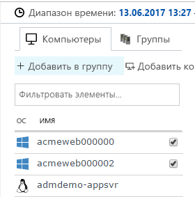

Далее можно выбрать **Создать** и присвоить группе имя.

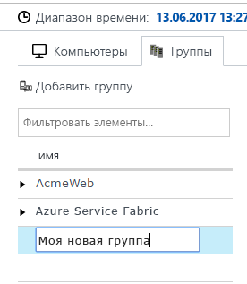

>[!NOTE]
>Группы компьютеров ограничены 10 серверами.

### <a name="viewing-a-group"></a>Просмотр группы
После создания групп их можно просмотреть на вкладке "Группы".

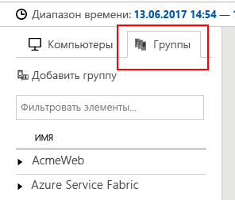

Затем выберите имя группы для просмотра карты этой группы компьютеров.
. Относящиеся к группе компьютеры обозначены на карте белым цветом.

При развертывании группы компьютеров выводится список входящих в нее компьютеров.

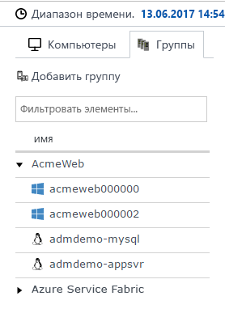

### <a name="filter-by-processes"></a>Фильтрация по процессам
Карту можно переключать между двумя режимами просмотра: отображение всех процессов и подключений в группе или только тех процессов и подключений, которые напрямую связаны с группой компьютеров.  По умолчанию отображаются все процессы.  Чтобы изменить режим, щелкните значок фильтра над картой.

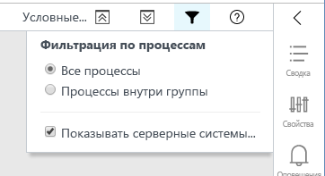

Если выбран фильтр **Все процессы**, на карте будут показаны все процессы и подключения на каждом компьютере группы.

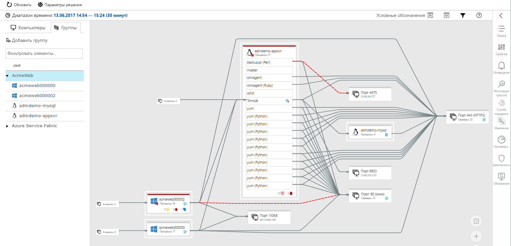

Если изменить режим на отображение **связанных с группой процессов**, карте будут показаны только те процессы и подключения, которые напрямую связаны с другими компьютерами в группе, что упрощает представление.

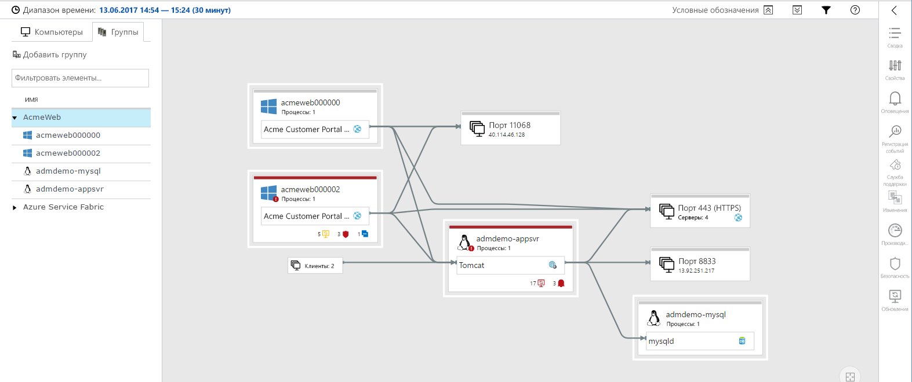
 
### <a name="adding-machines-to-a-group"></a>Добавление компьютеров в группу
Чтобы добавить компьютеры в существующую группу, установите флажки рядом с нужными компьютерами и щелкните **Добавить в группу**.  Затем выберите группу, в которую нужно добавить компьютеры.
 
### <a name="removing-machines-from-a-group"></a>Удаление компьютеров из группы
В списке групп разверните имя группы, чтобы получить список входящих в нее компьютеров.  Затем щелкните многоточие рядом с компьютером, который нужно удалить, и в открывшемся меню выберите пункт **Удалить**.

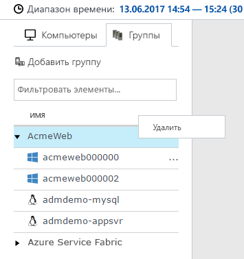

### <a name="removing-or-renaming-a-group"></a>Удаление или переименование группы
В списке групп щелкните многоточие рядом с именем группы, чтобы открыть меню.

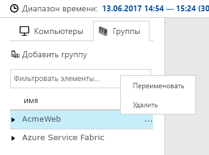


## <a name="role-icons"></a>Значки ролей
Определенным процессам присваиваются определенные роли на компьютерах: веб-серверы, серверы приложений, базы данных и т. д. На схеме служб процессы и поля, представляющие компьютеры, обозначены значками ролей. Эти значки помогают быстро определить роль, присвоенную процессу или серверу.

| Значок роли | ОПИСАНИЕ |
|:--|:--|
|  | Веб-сервер |
|  | Сервер приложений |
|  | Сервер базы данных |
|  | Сервер LDAP |
|  | Сервер SMB |

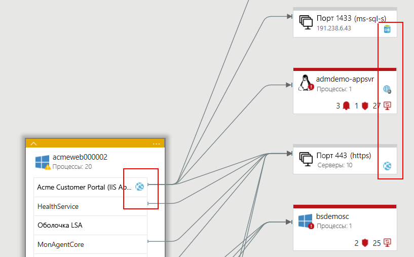


## <a name="failed-connections"></a>Неудачные подключения
На картах схемы услуги отображаются сведения о неудачных подключениях компьютеров и процессов. Пунктирная красная линия указывает на то, что при подключении клиентской системы к процессу или порту произошел сбой. Сведения о неудачных подключениях поступают из всех систем, на которых развернут агент схемы услуги и где попытка подключения завершилась сбоем. Служба схемы услуги оценивает этот процесс путем наблюдения за TCP-сокетами, которым не удалось установить подключение. Ошибки подключения могут быть связаны с брандмауэром, неправильными настройками клиента или сервера, а также с недоступностью удаленной службы.

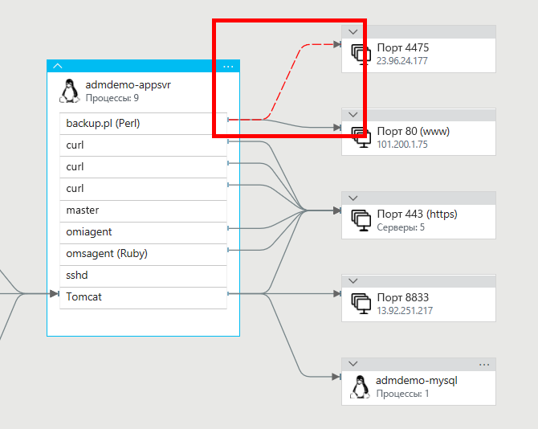

Понятие причин сбоя подключений может помочь с устранением неполадок, проверкой переноса и выполнением анализа безопасности, а также разобраться, как устроена архитектура. Иногда неудачные подключения безвредны, но зачастую они указывают на проблему, например внезапную недоступность среды отработки отказа или отсутствие взаимодействия между двумя уровнями приложения после миграции в облако.

## <a name="client-groups"></a>Группы клиентов
Клиентские группы представлены на схеме элементами, представляющими клиентские компьютеры без агентов зависимостей. Одна группа клиентов представляет клиентов для отдельного процесса или компьютера.

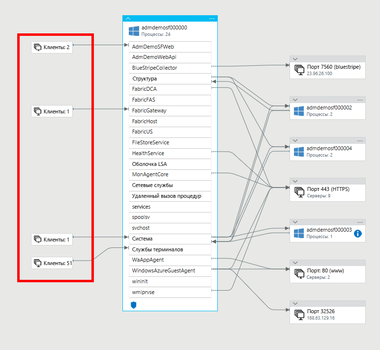

Чтобы просмотреть IP-адреса серверов в группе клиентов, выберите соответствующую группу. Содержимое группы выводится в области **Свойства группы клиентов**.

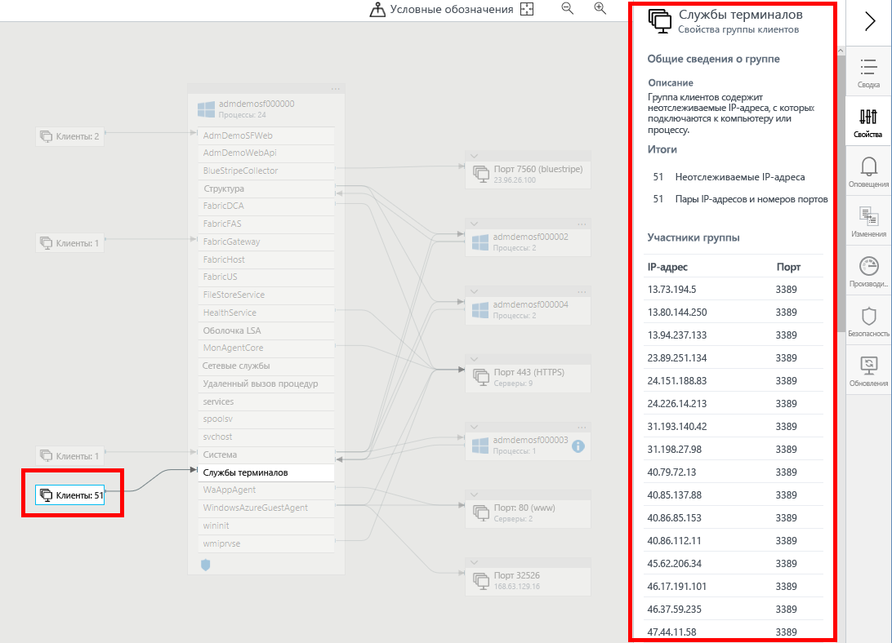

## <a name="server-port-groups"></a>Группы портов серверов
Группы портов серверов — это элементы, представляющие порты серверов на серверах, которые не имеют агентов зависимостей. В элементе отображается порт сервера и число серверов, подключенных к этому порту. Разверните элемент, чтобы просмотреть отдельные серверы и подключения. Если в списке отображается только один сервер, указывается его имя или IP-адрес.

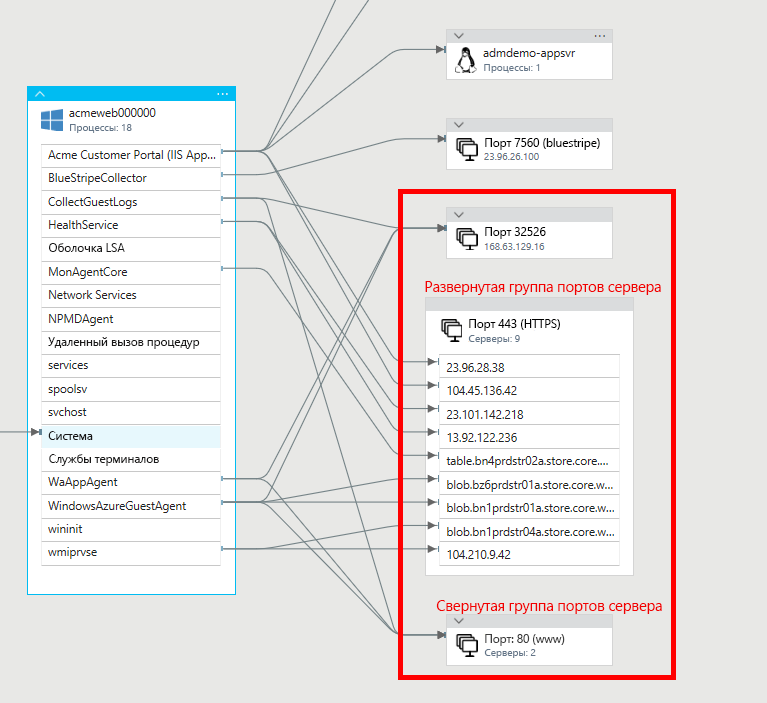

## <a name="context-menu"></a>Контекстное меню
Если щелкнуть многоточие (...) в правом верхнем углу любого сервера, откроется контекстное меню для этого сервера.

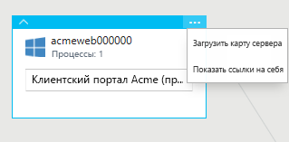

### <a name="load-server-map"></a>Загрузить карту сервера
Если выбрать пункт **Загрузить карту сервера**, откроется новая карта с выбранным сервером в качестве нового целевого компьютера.

### <a name="show-self-links"></a>Показать ссылки на себя
Если выбрать пункт **Показать ссылки на себя**, будет обновлен узел сервера, включая все циклические ссылки, которые являются TCP-подключениями, начинающимися и заканчивающимися в процессах в пределах сервера. Если циклические ссылки отображаются, команда меню меняется на **Скрыть ссылки на себя**, что позволяет отключить ссылки.

## <a name="computer-summary"></a>Сводка по компьютеру
В области **Machine Summary** (Сводка по компьютеру) представлены общие сведения об операционной системе сервера, числе зависимостей, а также данные из других решений. Эти данные включают в себя метрики производительности, билеты на обслуживание в службе поддержки, данные отслеживания изменений, сведения о безопасности и обновления.

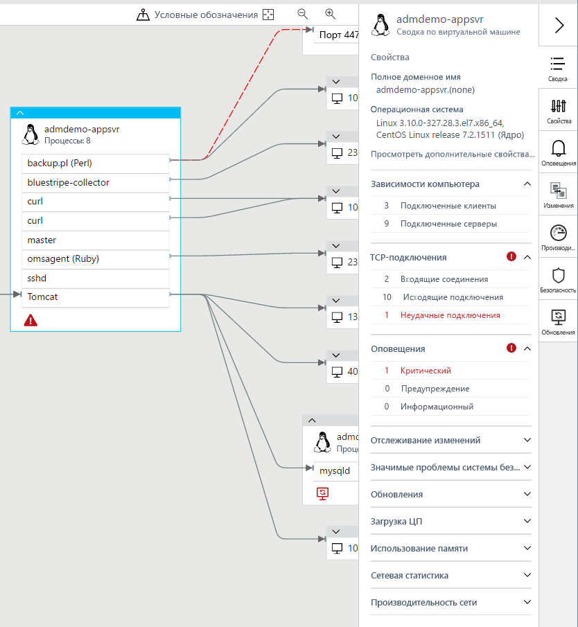

## <a name="computer-and-process-properties"></a>Свойства компьютера и процесса
Выбрав на карте схемы услуги компьютеры и процессы, можно просмотреть дополнительные сведения об их свойствах. Для виртуальных машин предоставляются сведения о DNS-имени, IPv4-адресах, мощности ЦП и объеме памяти, типе виртуальной машины, версии операционной системы, времени последнего перезапуска и идентификаторах соответствующих агентов OMS и сопоставления служб.

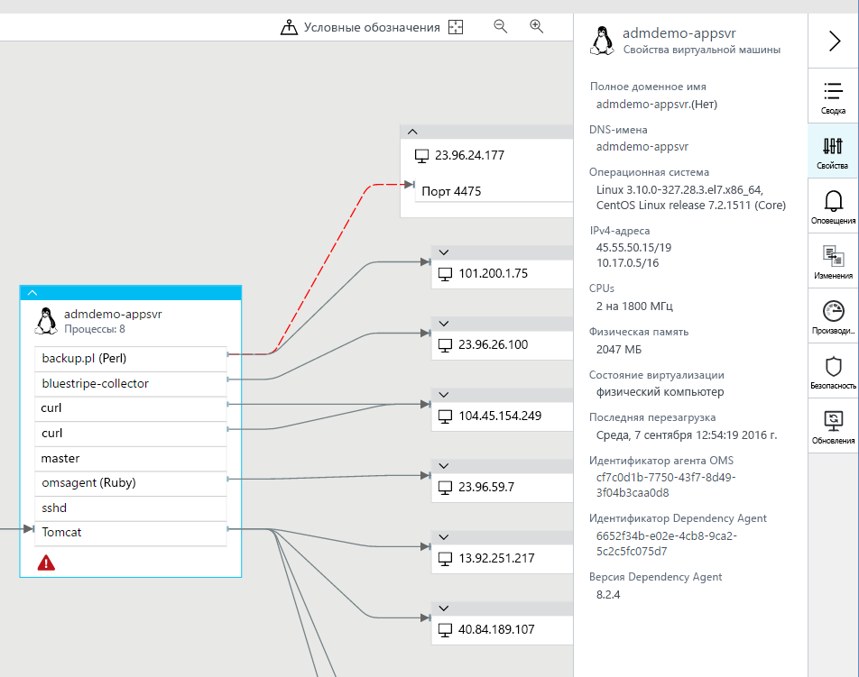

Вы можете собирать сведения о выполняющихся процессах на основе метаданных операционной системы. К ним относятся имя процесса, его описание, имя пользователя и домен (в Windows), название компании, имя продукта, версия продукта, рабочий каталог, командная строка и время запуска процесса.

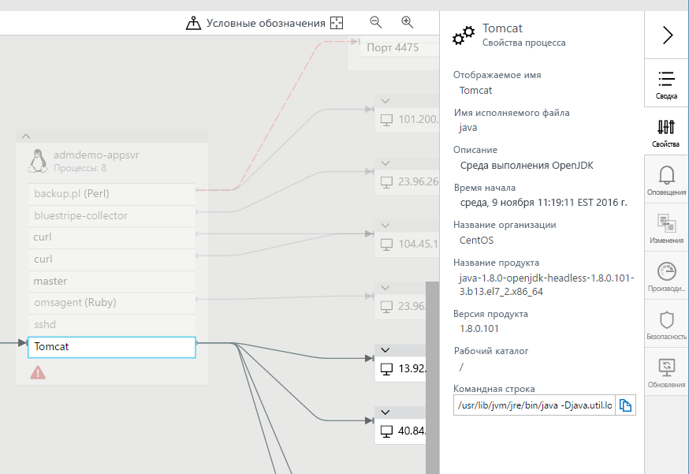

В области **Сводка по процессу** приведены дополнительные сведения о подключениях процесса, в том числе привязанные порты, входящие и исходящие подключения, а также неудачные подключения.

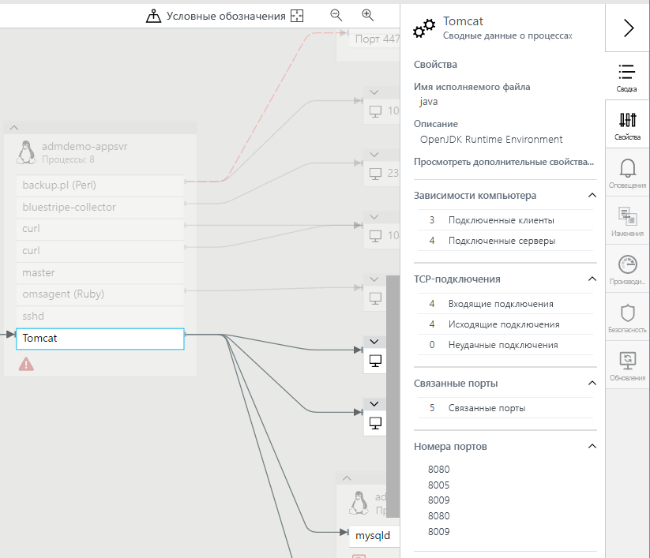

## <a name="alerts-integration"></a>Интеграция с решением для управления оповещениями
Сопоставление служб интегрируется с оповещениями Azure для отображения активированных оповещений для выбранного сервера за указанный диапазон времени. При наличии предупреждений на сервере отображается соответствующий значок, и предупреждения отображаются в области **предупреждений компьютера**.

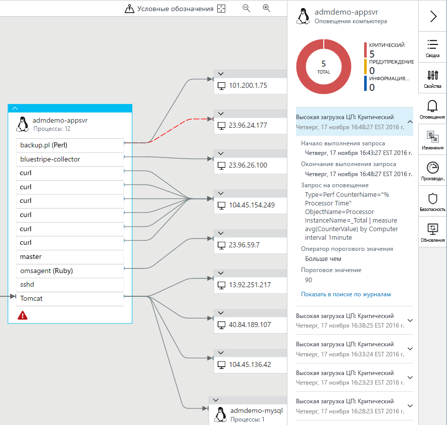

Чтобы включить отображение важных предупреждений в службе схемы услуги, создайте правило предупреждений, которое запускается для определенного компьютера. Ниже описано, как правильно создавать оповещения.
- Добавьте предложение для группирования по компьютеру (например, **by Computer interval 1 minute**).
- Выберите предупреждение на основе измерения метрики.

## <a name="log-events-integration"></a>Интеграция событий журнала
Схема услуги интегрируется со службой поиска по журналам для отображения количества всех событий журнала, доступных для выбранного сервера за указанный диапазон времени. Можно щелкнуть любую строку в списке количества событий, чтобы перейти к поиску по журналам и просмотреть отдельные события журнала.

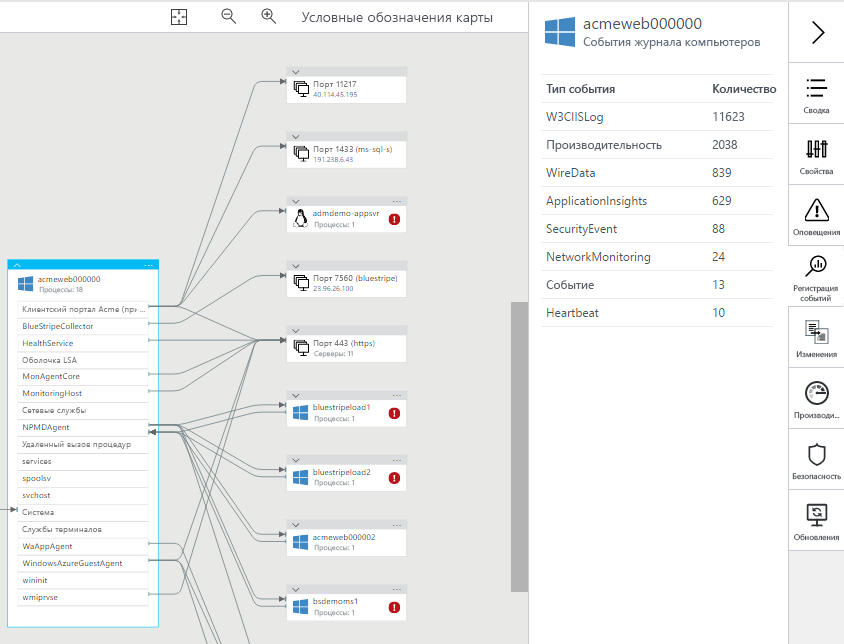

## <a name="service-desk-integration"></a>Интеграция службы поддержки
Если решение "Сопоставление служб" и соединитель управления ИТ-услугами включены и настроены в рабочей области Log Analytics, они интегрируются друг с другом автоматически. Эта интеграция обозначена в схеме услуги как "Служба поддержки". Дополнительные сведения см. в статье [Централизованное управление рабочими элементами ITSM с помощью соединителя управления ИТ-службами](https://docs.microsoft.com/azure/log-analytics/log-analytics-itsmc-overview).

В области **службы поддержки компьютера** отображается список всех событий управления ИТ-службами для выбранного сервера за указанный диапазон времени. При наличии текущих элементов на сервере отображается значок, а их список приводится в области службы поддержки компьютера.


Чтобы открыть элемент в подключенном решении ITSM, щелкните **Просмотреть рабочий элемент**.

Чтобы просмотреть сведения об элементе в области "Поиск по журналам", щелкните **Показать в поиске по журналам**.
Метрики подключений записываются в две новые таблицы в службе Log Analytics 

## <a name="change-tracking-integration"></a>Интеграция с решением для отслеживания изменений
Если решения "Сопоставление служб" и "Отслеживание изменений" включены и настроены в вашей рабочей области Log Analytics, то они интегрируются друг с другом автоматически.

В области **Отслеживание изменений на компьютере** содержится список всех изменений (начиная с последнего), а также ссылка на поиск по журналам для получения дополнительных сведений.

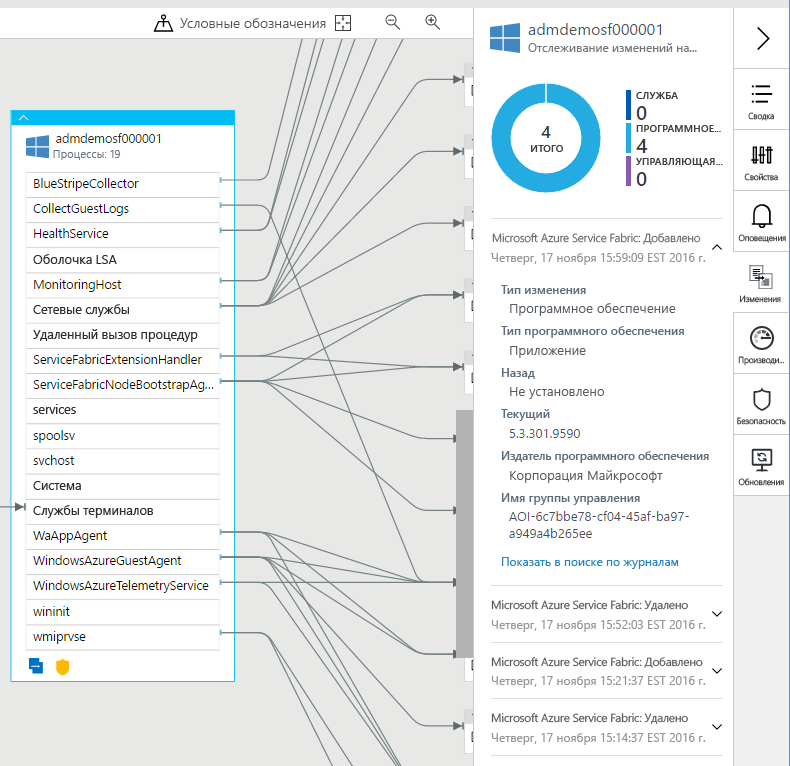

Ниже приведен пример подробных сведений о событии ConfigurationChange, которые отображаются после выбора команды **Показать в Log Analytics**.

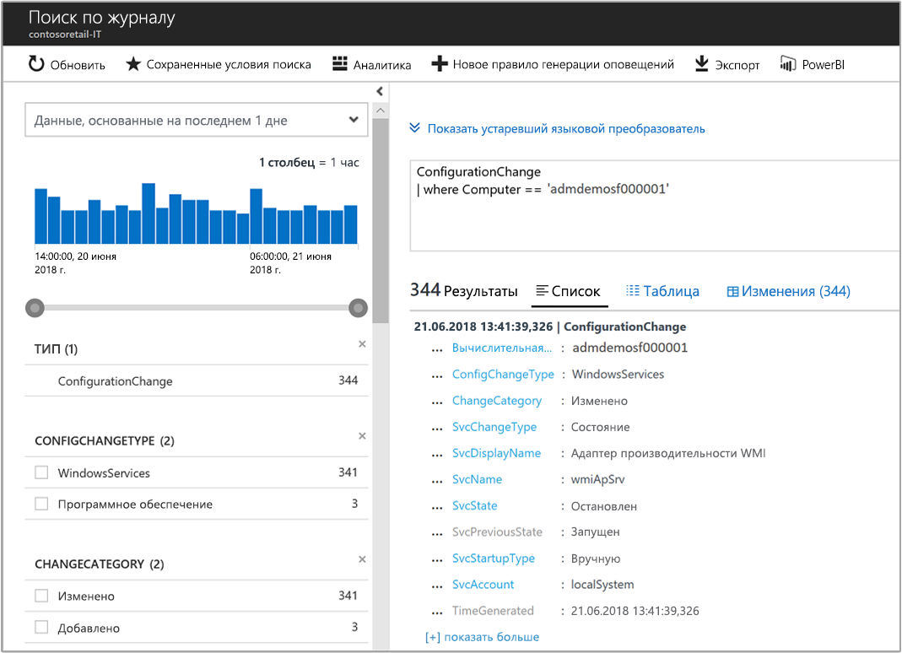

## <a name="performance-integration"></a>Интеграция с решением для определения производительности
В области **производительности компьютера** приводятся стандартные метрики производительности для выбранного сервера. Сюда входят метрики использования ЦП, использования памяти, числа отправленных и полученных по сети байтов, а также список основных процессов, упорядоченный по числу байтов, отправленных и полученных по сети.

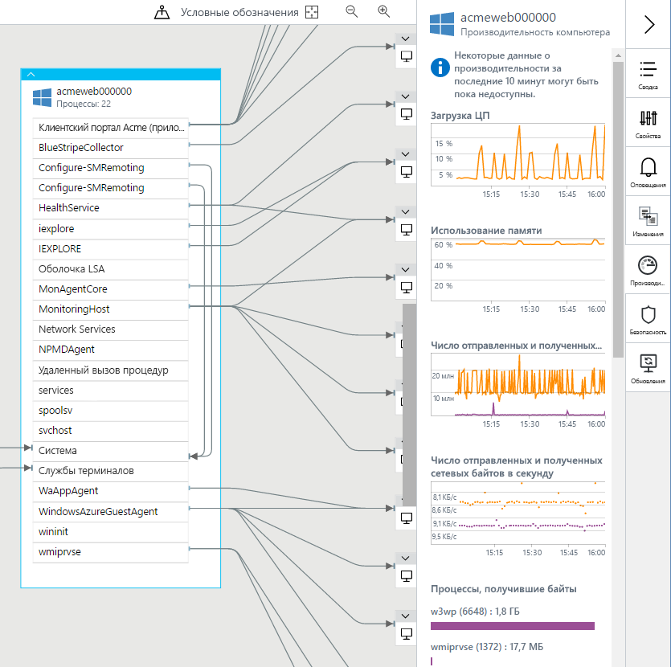

Чтобы просмотреть данные о производительности, может потребоваться [включить соответствующие счетчики производительности Log Analytics](https://docs.microsoft.com/azure/log-analytics/log-analytics-data-sources-performance-counters).  Счетчики, которые потребуется включить:

Windows:
- Процессор(*)\\% загруженности процессора.
- Память\\% использования выделенной памяти.
- Сетевой адаптер(*)\\отправленных байтов/с.
- Сетевой адаптер(*)\\полученных байтов/с.

Linux:
- Процессор(*)\\% загруженности процессора.
- Память(*)\\% использованной памяти.
- Сетевой адаптер(*)\\отправленных байтов/с.
- Сетевой адаптер(*)\\полученных байтов/с.

Чтобы получить данные о производительности сети, необходимо включить решение Wire Data 2.0 в рабочей области.
 
## <a name="security-integration"></a>Интеграция решений для обеспечения безопасности
Если решения "Сопоставление служб" и "Безопасность и аудит" включены и настроены в вашей рабочей области Log Analytics, то они интегрируются друг с другом автоматически.

Панель **безопасности виртуальной машины** отображает данные из решения для безопасности и аудита для выбранного сервера. В этой области содержится сводка необработанных проблем безопасности для сервера за выбранный диапазон времени. Если щелкнуть проблему безопасности, будет выполнен поиск подробных сведений о ней в журналах.

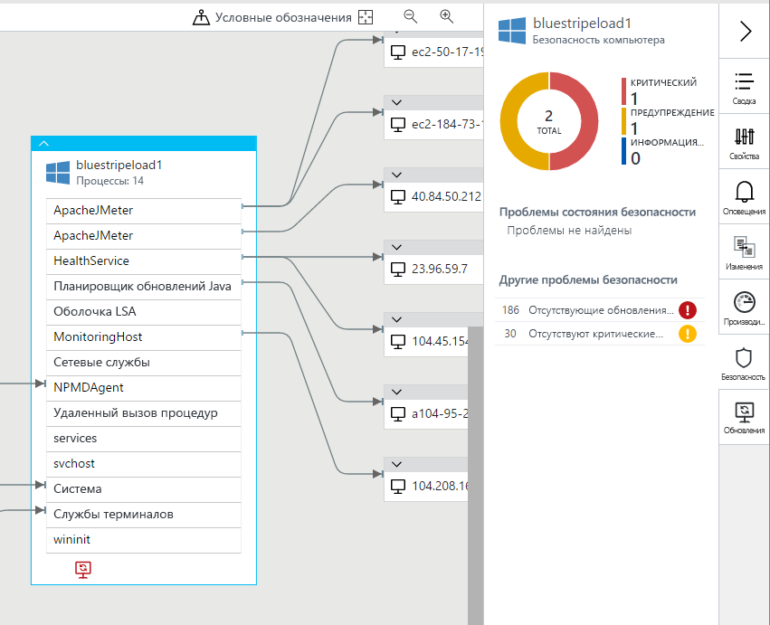

## <a name="updates-integration"></a>Интеграция с решением для управления обновлениями
Если решения "Сопоставление служб" и "Управление обновлениями" включены и настроены в вашей рабочей области Log Analytics, то они интегрируются друг с другом автоматически.

Панель **обновлений виртуальной машины** отображает данные из решения для управления обновлениями для выбранного сервера. В этой области содержится сводка по отсутствующим обновлениям для сервера за выбранный диапазон времени.

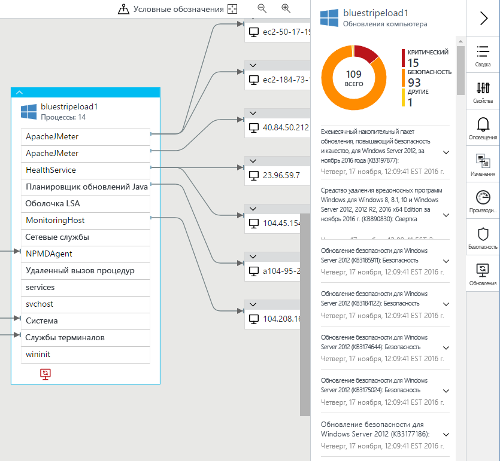

## <a name="log-analytics-records"></a>Записи Log Analytics
Данные инвентаризации компьютеров и процессов из схемы услуги можно получить, выполнив [поиск](../../azure-monitor/log-query/log-query-overview.md) в Log Analytics. Эти данные используются в различных сценариях, таких как планирование миграции, анализ емкости, обнаружение и устранение проблем с производительностью по требованию.

Для каждого уникального компьютера и процесса создается одна запись в час. Кроме того, записи создаются во время запуска компьютера или процесса, а также при подключении их к схеме услуги. В таблице ниже приведены свойства этих записей. Поля и значения в событиях ServiceMapComputer_CL сопоставляются с полями ресурса Machine (Компьютер) в API ServiceMap Azure Resource Manager. Поля и значения в событиях ServiceMapProcess_CL сопоставляются с полями ресурса Process (Процесс) в API ServiceMap Azure Resource Manager. Поле ResourceName_s совпадает с полем имени в соответствующем ресурсе Resource Manager. 

>[!NOTE]
>По мере расширения функций схемы услуги эти поля могут изменяться.

На основе созданных в системе свойств можно определить уникальные компьютеры или процессы:

- Компьютер. Для уникальной идентификации компьютера в рабочей области Log Analytics используйте свойство *ResourceId* или *ResourceName_s*.
- Процесс. Для уникальной идентификации процесса в рабочей области Log Analytics используйте свойство *ResourceId*. Свойство *ResourceName_s* уникально в контексте компьютера, на котором выполняется процесс (MachineResourceName_s). 

Так как для указанных процесса и компьютера в заданном диапазоне времени могут существовать несколько записей, то запросы могут возвращать несколько записей для одного и того же компьютера или процесса. Чтобы включить только самую последнюю запись, добавьте к запросу строку "| dedup ResourceId".

### <a name="connections"></a>Подключения
Метрики подключений записываются в новой таблице VMConnection в службе Log Analytics. Эта таблица содержит сведения о подключениях (входящих и исходящих) для компьютера. Кроме того, доступ к метрикам подключений можно организовать с помощью API, включающих средства для получения определенной метрики в пределах временного окна.  Подключения TCP, созданные в результате *принятия* данных на сокете прослушивания, являются входящими, а подключения, созданные в результате *подключения* к заданному IP-адресу и порту, считаются исходящими. Направление подключения указано в свойстве Direction (Направление), которое может иметь значение **inbound** (Входящее) или **outbound** (Исходящее). 

Записи в этих таблицах создаются на основе данных, полученных программой Dependency Agent. Каждая запись соответствует наблюдению, выполняемому один раз в минуту. Свойство TimeGenerated указывает начало интервала времени. Каждая запись содержит сведения для определения соответствующего объекта, то есть подключения или порта, а также метрики, связанные с этим объектом. На данный момент система собирает данные, касающиеся только действий в сети, связанных с протоколом TCP/IPv4.

Чтобы можно было управлять затратами и сложностью, записи о подключениях не представляют отдельные физические сетевые подключения. Система группирует несколько физических сетевых подключений в логическое подключение, которое затем отображается в соответствующей таблице.  Это означает, что запись в таблице *VMConnection* представляет логическую группу, а не отдельные отслеживаемые физические подключения. Физические сетевые подключения, для которых используется одно и то же общее значение для указанных ниже атрибутов в течение заданного одноминутного интервала, агрегированы в одну логическую запись в таблице *VMConnection*. 

| Свойство | ОПИСАНИЕ |
|:--|:--|
|Направление |Направление подключения. Возможные значения: *inbound* (Входящее) или *outbound* (Исходящее). |
|Машина |Полное доменное имя компьютера |
|Process |Удостоверение процесса или группы процессов, создающей или принимающей подключение. |
|SourceIp |IP-адрес источника. |
|DestinationIp |IP-адрес назначения. |
|DestinationPort |Номер порта назначения. |
|Протокол |Протокол, используемый для подключения.  Значение: *tcp*. |

Чтобы учесть влияние группирования, в указанных ниже свойствах записи приведены сведения о количестве сгруппированных физических подключений.

| Свойство | ОПИСАНИЕ |
|:--|:--|
|LinksEstablished |Количество физических сетевых подключений, созданных в течение отчетного периода. |
|LinksTerminated |Количество физических сетевых подключений, разорванных в течение отчетного периода. |
|LinksFailed |Количество физических сетевых подключений, которые не удалось создать во время отчетного периода. На данный момент эта информация доступна только для исходящих подключений. |
|LinksLive |Количество открытых физических сетевых подключений на конец отчетного периода.|

#### <a name="metrics"></a>Метрики

В дополнение к метрикам количества подключений в указанных ниже свойствах записи содержатся сведения об объемах отправленных и принятых данных для заданного логического подключения или порта.

| Свойство | ОПИСАНИЕ |
|:--|:--|
|BytesSent |Общее количество байтов, отправленных в течение отчетного периода. |
|BytesReceived |Общее количество байтов, принятых в течение отчетного периода. |
|Ответы |Количество откликов, наблюдаемых в течение отчетного периода. 
|ResponseTimeMax |Наибольшее время отклика (в миллисекундах), наблюдаемое во время отчетного периода.  Если значение не указано, свойство будет пустым.|
|ResponseTimeMin |Наименьшее время отклика (в миллисекундах), наблюдаемое во время отчетного периода.  Если значение не указано, свойство будет пустым.|
|ResponseTimeSum |Сумма всех значений времени отклика (в миллисекундах), наблюдаемых во время отчетного периода.  Если значение не указано, свойство будет пустым.|

Третий тип собираемых данных — время отклика. Это время, в течение которого вызывающая сторона ожидает обработки запроса, отправленного через подключение, и отклика на него от удаленной конечной точки. Полученное время отклика — это оценочное значение истинного времени отклика базового протокола приложений. Для его вычисления используется эвристика на основе наблюдения за потоком данных между источником и точкой назначения физического сетевого подключения. По сути, это разница между временем, когда последний байт запроса покидает отправителя, и временем, когда последний байт отклика возвращается к нему. Эти две метки времени используются для регистрации событий запроса и отклика для заданного физического подключения. Разность этих значений представляет собой время отклика для одного запроса. 

В первом выпуске данной функции мы используем алгоритм аппроксимации, который может работать с разными степенями успешности, которые зависят от того, какой протокол фактически используется для заданного сетевого подключения. Например, текущий подход хорошо работает для протоколов, основанных на запросах и откликах, например протокола HTTP(S), но не работает с однонаправленными или основанными на очереди сообщений протоколами.

Необходимо учитывать указанные ниже важные моменты.

1. Если процесс принимает подключения на один IP-адрес, но через несколько сетевых интерфейсов, то для каждого интерфейса будет создана отдельная запись. 
2. В записях с диапазонами IP-адресов не будет никаких сведений о действиях. Такие записи используются для обозначения того факта, что какой-либо порт компьютера открыт для входящего трафика.
3. Чтобы снизить уровень детализации и уменьшить объем данных, система пропускает записи с диапазонами IP-адресов, если имеется совпадающая запись (для того же процесса, порта и протокола) с указанным IP-адресом. Если запись с диапазоном IP-адресов пропущена, свойству IsWildcardBind записи с определенным IP-адресом будет присвоено значение True (Истина), указывающее, что порт доступен через любой интерфейс соответствующего компьютера.
4. Для портов, которые связаны только в определенном интерфейсе, свойство IsWildcardBind имеет значение False (Ложь).

#### <a name="naming-and-classification"></a>Именование и классификация
Для удобства IP-адрес удаленной стороны подключения включается в свойство RemoteIp. Для входящих подключений свойство RemoteIp имеет то же значение, что и свойство SourceIp, а для исходящих подключений у него будет такое же значение, что и у свойства DestinationIp. Свойство RemoteDnsCanonicalNames представляет канонические имена DNS, переданные компьютером для свойства RemoteIp. Свойства RemoteDnsQuestions и RemoteClassification зарезервированы для использования в будущем. 

#### <a name="geolocation"></a>Географическое положение
*VMConnection* для каждой записи подключения содержит указанные ниже свойства со сведениями о географическом положении для удаленной стороны. 

| Свойство | ОПИСАНИЕ |
|:--|:--|
|RemoteCountry |Название страны, в которой размещена сторона с IP-адресом, указанным в свойстве RemoteIp.  Пример: *United States* (США). |
|RemoteLatitude |Широта географического положения.  Пример: *47,68*. |
|RemoteLongitude |Долгота географического положения.  Пример: *–122,12*. |

#### <a name="malicious-ip"></a>Вредоносный IP-адрес
Система проверяет, не внесен ли адрес, указанный в свойстве RemoteIp в таблице *VMConnection*, в список IP-адресов, связанных с вредоносными действиями. Если система обнаружит, что адрес, указанный в свойстве RemoteIp, вредоносный, будут заполнены указанные ниже свойства записи (если IP-адрес не считается вредоносным, эти свойства пусты).

| Свойство | ОПИСАНИЕ |
|:--|:--|
|MaliciousIp |Адрес, указанный в свойстве RemoteIp. |
|IndicatorThreadType |Обнаруженный индикатор угроз является одним из следующих значений: *Botnet*, *C2*, *CryptoMining*, *Darknet*, *DDos*, *MaliciousUrl*, *Malware*, *Phishing*, *Proxy*, *PUA*, *Watchlist*.   |
|ОПИСАНИЕ |Описания наблюдаемой угрозы. |
|TLPLevel |Уровень протокола Traffic Light (TLP) является одним из определенных значений: *White*, *Green*, *Amber*, *Red*. |
|Достоверность |Значения: *0–100*. |
|Уровень серьезности |Значения: *0–5*, где *5* является самым серьезным, а *0* не является серьезным вообще. Значение по умолчанию — *3*.  |
|FirstReportedDateTime |Впервые поставщик сообщил об этом индикаторе. |
|LastReportedDateTime |В последний раз индикатор был просмотрен Interflow. |
|IsActive |Указывает, что индикаторы деактивированы со значением *True* или *False*. |
|ReportReferenceLink |Ссылки на отчеты, связанные с данным наблюдаемым. |
|AdditionalInformation |Предоставляет дополнительную информацию, если применимо, о наблюдаемой угрозе. |

### <a name="servicemapcomputercl-records"></a>Записи ServiceMapComputer_CL
В записях типа *AdmComputer_CL* содержатся данные инвентаризации для серверов с агентами схемы услуги. У этих записей есть свойства, приведенные в таблице ниже.

| Свойство | ОПИСАНИЕ |
|:--|:--|
| `Type` | *ServiceMapComputer_CL* |
| `SourceSystem` | *OpsManager* |
| `ResourceId` | Уникальный идентификатор для компьютера в рабочей области |
| `ResourceName_s` | Уникальный идентификатор для компьютера в рабочей области |
| `ComputerName_s` | Полное доменное имя компьютера |
| `Ipv4Addresses_s` | Список IPv4-адресов сервера |
| `Ipv6Addresses_s` | Список IPv6-адресов сервера |
| `DnsNames_s` | Массив DNS-имен |
| `OperatingSystemFamily_s` | Windows или Linux |
| `OperatingSystemFullName_s` | Полное имя операционной системы  |
| `Bitness_s` | Разрядность компьютера (32- или 64-разрядный)  |
| `PhysicalMemory_d` | Объем физической памяти в МБ |
| `Cpus_d` | Количество ЦП |
| `CpuSpeed_d` | Скорость ЦП в МГц|
| `VirtualizationState_s` | *неизвестно*, *физический*, *виртуальный*, *гипервизор* |
| `VirtualMachineType_s` | *hyperv*, *vmware* и т. д. |
| `VirtualMachineNativeMachineId_g` | Идентификатор виртуальной машины, назначенный ее гипервизором |
| `VirtualMachineName_s` | Имя виртуальной машины |
| `BootTime_t` | Время загрузки |

### <a name="servicemapprocesscl-type-records"></a>Записи типа ServiceMapProcess_CL
В записях типа *ServiceMapProcess_CL* содержатся данные инвентаризации для подключенных по протоколу TCP процессов на серверах с агентами схемы услуги. У этих записей есть свойства, приведенные в таблице ниже.

| Свойство | ОПИСАНИЕ |
|:--|:--|
| `Type | *ServiceMapProcess_CL* |
| `SourceSystem` | *OpsManager* |
| `ResourceId` | Уникальный идентификатор для процесса в рабочей области |
| `ResourceName_s` | Уникальный идентификатор для процесса на компьютере, на котором он выполняется|
| `MachineResourceName_s` | Имя ресурса компьютера |
| `ExecutableName_s` | Имя исполняемого файла процесса |
| `StartTime_t` | Время запуска пула процессов |
| `FirstPid_d` | Первый идентификатор процесса в пуле процессов |
| `Description_s` | Описание процесса |
| `CompanyName_s` | Название организации |
| `InternalName_s` | Внутреннее имя |
| `ProductName_s` | Имя продукта |
| `ProductVersion_s` | Версия продукта |
| `FileVersion_s` | Версия файла |
| `CommandLine_s` | Командная строка |
| `ExecutablePath _s` | Путь к исполняемому файлу |
| `WorkingDirectory_s` | Рабочий каталог |
| `UserName` | Учетная запись, с которой выполняется процесс |
| `UserDomain` | Домен, в котором выполняется процесс |

## <a name="sample-log-searches"></a>Пример поисков журналов

### <a name="list-all-known-machines"></a>Список всех известных компьютеров
ServiceMapComputer_CL | summarize arg_max(TimeGenerated, *) by ResourceId

### <a name="list-the-physical-memory-capacity-of-all-managed-computers"></a>Вывод сведений об объеме физической памяти для всех управляемых компьютеров
ServiceMapComputer_CL | summarize arg_max(TimeGenerated, *) by ResourceId | project PhysicalMemory_d, ComputerName_s

### <a name="list-computer-name-dns-ip-and-os"></a>Список сведений об имени компьютера, DNS-имени, IP-адресе и ОС
ServiceMapComputer_CL | summarize arg_max(TimeGenerated, *) by ResourceId | project ComputerName_s, OperatingSystemFullName_s, DnsNames_s, Ipv4Addresses_s

### <a name="find-all-processes-with-sql-in-the-command-line"></a>Поиск всех процессов с "sql" в командной строке
ServiceMapProcess_CL | where CommandLine_s contains_cs "sql" | summarize arg_max(TimeGenerated, *) by ResourceId

### <a name="find-a-machine-most-recent-record-by-resource-name"></a>Поиск компьютера (самой последней записи) по имени ресурса
search in (ServiceMapComputer_CL) "m-4b9c93f9-bc37-46df-b43c-899ba829e07b" | summarize arg_max(TimeGenerated, *) by ResourceId

### <a name="find-a-machine-most-recent-record-by-ip-address"></a>Поиск компьютера (самой последней записи) по IP-адресу
search in (ServiceMapComputer_CL) "10.229.243.232" | summarize arg_max(TimeGenerated, *) by ResourceId

### <a name="list-all-known-processes-on-a-specified-machine"></a>Вывод списка всех известных процессов на определенном компьютере
ServiceMapProcess_CL | where MachineResourceName_s == "m-559dbcd8-3130-454d-8d1d-f624e57961bc" | summarize arg_max(TimeGenerated, *) by ResourceId

### <a name="list-all-computers-running-sql"></a>Вывод списка всех компьютеров, на которых выполняется SQL
ServiceMapComputer_CL | where ResourceName_s in ((search in (ServiceMapProcess_CL) "\*sql\*" | distinct MachineResourceName_s)) | distinct ComputerName_s

### <a name="list-all-unique-product-versions-of-curl-in-my-datacenter"></a>Вывод списка всех уникальных версий продукта cURL в центре обработки данных
ServiceMapProcess_CL | where ExecutableName_s == "curl" | distinct ProductVersion_s

### <a name="create-a-computer-group-of-all-computers-running-centos"></a>Создание группы, объединяющей все компьютеры, на которых выполняется CentOS
ServiceMapComputer_CL | where OperatingSystemFullName_s contains_cs "CentOS" | distinct ComputerName_s

### <a name="summarize-the-outbound-connections-from-a-group-of-machines"></a>Создание сводки исходящих подключений для группы компьютеров
```
// the machines of interest
let machines = datatable(m: string) ["m-82412a7a-6a32-45a9-a8d6-538354224a25"];
// map of ip to monitored machine in the environment
let ips=materialize(ServiceMapComputer_CL
| summarize ips=makeset(todynamic(Ipv4Addresses_s)) by MonitoredMachine=ResourceName_s
| mvexpand ips to typeof(string));
// all connections to/from the machines of interest
let out=materialize(VMConnection
| where Machine in (machines)
| summarize arg_max(TimeGenerated, *) by ConnectionId);
// connections to localhost augmented with RemoteMachine
let local=out
| where RemoteIp startswith "127."
| project ConnectionId, Direction, Machine, Process, ProcessName, SourceIp, DestinationIp, DestinationPort, Protocol, RemoteIp, RemoteMachine=Machine;
// connections not to localhost augmented with RemoteMachine
let remote=materialize(out
| where RemoteIp !startswith "127."
| join kind=leftouter (ips) on $left.RemoteIp == $right.ips
| summarize by ConnectionId, Direction, Machine, Process, ProcessName, SourceIp, DestinationIp, DestinationPort, Protocol, RemoteIp, RemoteMachine=MonitoredMachine);
// the remote machines to/from which we have connections
let remoteMachines = remote | summarize by RemoteMachine;
// all augmented connections
(local)
| union (remote)
//Take all outbound records but only inbound records that come from either //unmonitored machines or monitored machines not in the set for which we are computing dependencies.
| where Direction == 'outbound' or (Direction == 'inbound' and RemoteMachine !in (machines))
| summarize by ConnectionId, Direction, Machine, Process, ProcessName, SourceIp, DestinationIp, DestinationPort, Protocol, RemoteIp, RemoteMachine
// identify the remote port
| extend RemotePort=iff(Direction == 'outbound', DestinationPort, 0)
// construct the join key we'll use to find a matching port
| extend JoinKey=strcat_delim(':', RemoteMachine, RemoteIp, RemotePort, Protocol)
// find a matching port
| join kind=leftouter (VMBoundPort 
| where Machine in (remoteMachines) 
| summarize arg_max(TimeGenerated, *) by PortId 
| extend JoinKey=strcat_delim(':', Machine, Ip, Port, Protocol)) on JoinKey
// aggregate the remote information
| summarize Remote=makeset(iff(isempty(RemoteMachine), todynamic('{}'), pack('Machine', RemoteMachine, 'Process', Process1, 'ProcessName', ProcessName1))) by ConnectionId, Direction, Machine, Process, ProcessName, SourceIp, DestinationIp, DestinationPort, Protocol
```

## <a name="rest-api"></a>REST API
Все данные серверов, процессов и зависимостей в сопоставлении служб доступны через [REST API сопоставления служб](https://docs.microsoft.com/rest/api/servicemap/).

## <a name="diagnostic-and-usage-data"></a>Данные диагностики и использования
Корпорация Майкрософт автоматически собирает данные об использовании и производительности с помощью службы схемы услуги. Эти данные используются, чтобы улучшить качество, повысить безопасность и целостность службы схемы услуги. Чтобы предоставить возможности для точного и эффективного устранения неполадок, они включают в себя сведения о конфигурации программного обеспечения, такие как версия операционной системы, а также IP-адрес, DNS-имя и имя рабочей станции. Корпорация Майкрософт не собирает сведения об именах, адресах и другую контактную информацию.

Дополнительные сведения о сборе и использовании данных см. в [заявлении о конфиденциальности служб Microsoft Online Services](https://go.microsoft.com/fwlink/?LinkId=512132).


## <a name="next-steps"></a>Дальнейшие действия
Узнайте больше о [поиске по журналам](../../azure-monitor/log-query/log-query-overview.md) в Log Analytics для получения данных, собранных с помощью схемы услуги.


## <a name="troubleshooting"></a>Устранение неполадок
См. раздел об [устранении неполадок в документе по настройке схемы услуги]( service-map-configure.md#troubleshooting).


## <a name="feedback"></a>Отзыв
У вас есть комментарии относительно схемы услуги или этой документации?  Посетите нашу страницу [User Voice](https://feedback.azure.com/forums/267889-log-analytics/category/184492-service-map), где можно предложить функции или проголосовать за существующие предложения.
