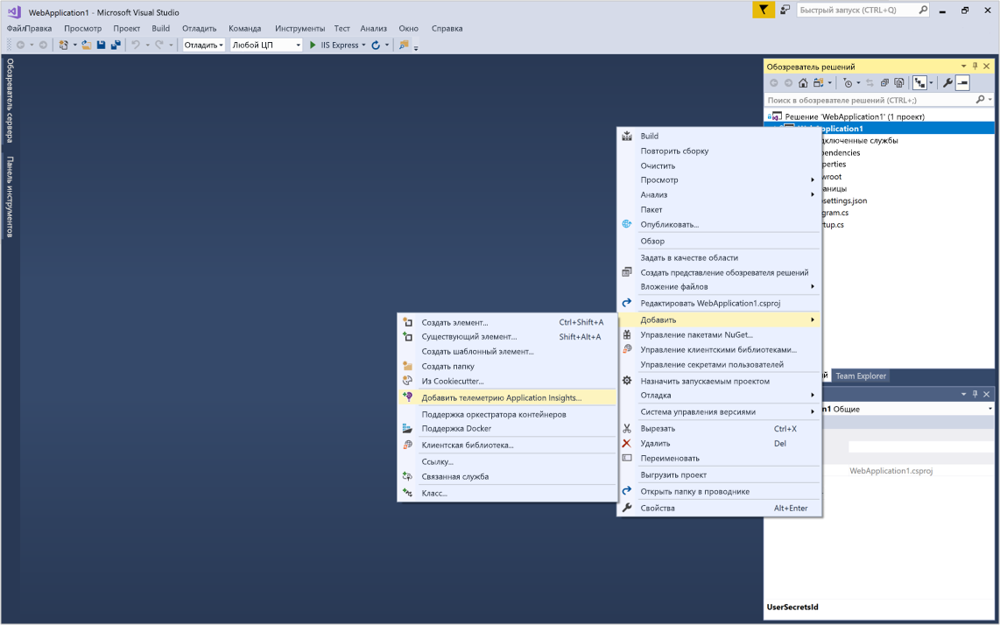
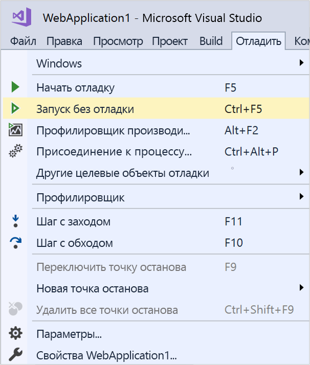
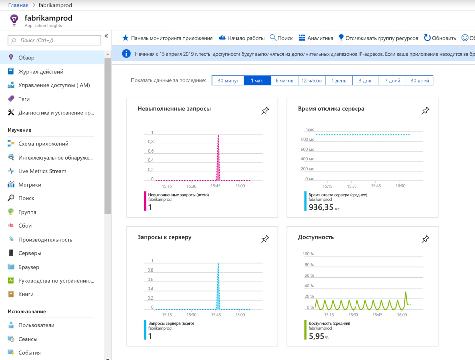
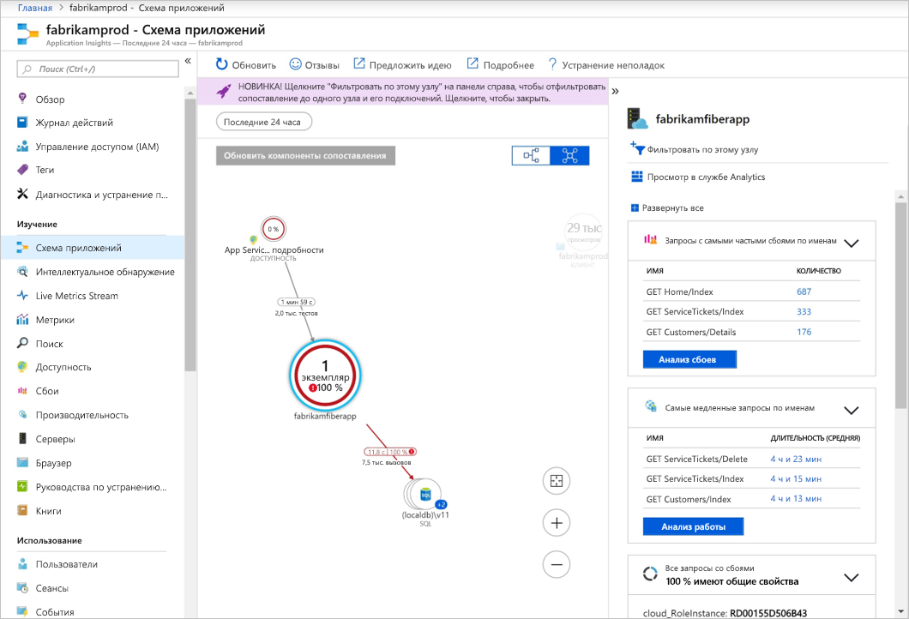
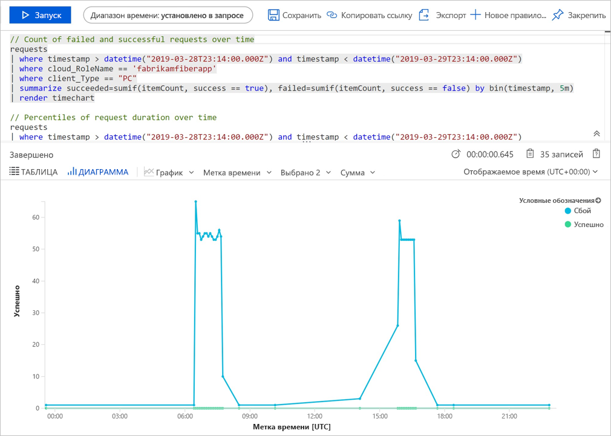
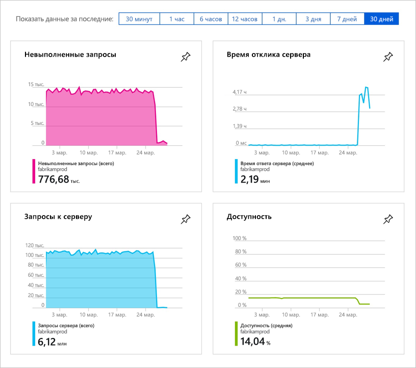
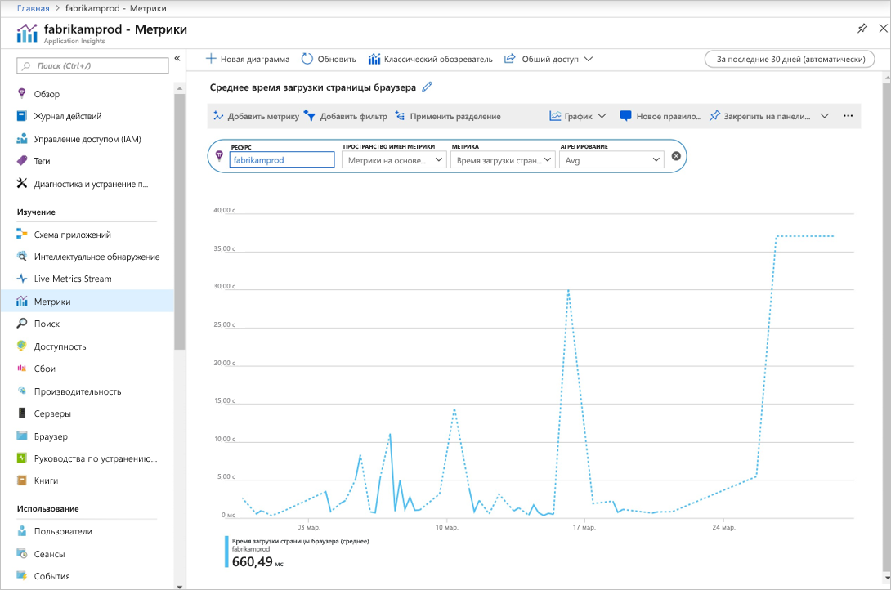

# Запуск мониторинга веб-приложения ASP.NET Core

С помощью Azure Application Insights можно легко отслеживать доступность, производительность и использование своего веб-приложения. Вы также можете быстро идентифицировать и диагностировать ошибки в приложении, не дожидаясь, пока пользователь сообщит о них. 

Это краткое руководство поможет добавить пакет SDK для Application Insights в имеющееся веб-приложение ASP.NET Core. Дополнительные сведения о настройке Application Insights без извлечения в Visual Studio см. в [этой статье](https://docs.microsoft.com/azure/azure-monitor/app/asp-net-core).

## Предварительные требования

Для работы с этим кратким руководством сделайте следующее:

- Установите [Visual Studio 2019](https://www.visualstudio.com/downloads/) с указанными ниже рабочими нагрузками:
  - ASP.NET и веб-разработка.
  - разработка Azure;
- [Установите пакет SDK для .NET Core 2.0.](https://www.microsoft.com/net/core)
- Потребуется подписка Azure и веб-приложение .NET Core.

Если у вас нет веб-приложения ASP.NET Core, [создайте его и добавьте Application Insights](../../azure-monitor/app/asp-net-core.md) с помощью нашего пошагового руководства.

Если у вас еще нет подписки Azure, создайте [бесплатную](https://azure.microsoft.com/free/) учетную запись Azure, прежде чем начинать работу.

## Вход на портал Azure

Войдите на [портале Azure](https://portal.azure.com/).

## Включение Application Insights

В Application Insights можно собирать данные телеметрии из любого подключенного к Интернету приложения, независимо от того, работает оно локально или в облаке. Чтобы просмотреть эти данные, сделайте следующее.

1. Последовательно выберите **Создать ресурс** > **Средства разработчика** > **Application Insights**.

   > [!NOTE]
   >Если вы создаете ресурс Application Insights впервые, ознакомьтесь с дополнительными сведениями в статье [Create an Application Insights resource](https://docs.microsoft.com/azure/azure-monitor/app/create-new-resource) (Создание ресурса Application Insights).

    Откроется окно настроек, в котором нужно заполнить все поля в соответствии с приведенной ниже таблицей.

   | Параметры        |  Значение           | ОПИСАНИЕ  |
   | ------------- |:-------------|:-----|
   | **Имя**      | Глобально уникальное значение | Имя, идентифицирующее отслеживаемое приложение |
   | **Группа ресурсов**     | myResourceGroup      | Имя новой группы ресурсов для размещения данных App Insights |
   | **Местоположение.** | Восточная часть США | Выберите ближайшее расположение или расположение вблизи места размещения приложения |

2. Нажмите кнопку **Создать**.

## Настройка пакета SDK App Insights

1. Откройте **проект** в веб-приложении ASP.NET Core в Visual Studio, щелкните правой кнопкой мыши AppName в **обозревателе решений** и щелкните **Добавить** > **Телеметрия Application Insights**.

    

2. Нажмите кнопку **Начало работы**.

3. Выберите учетную запись и подписку, выберите **существующий ресурс**, который вы создали на портале Azure, и нажмите кнопку **Зарегистрировать**.

4. Выберите **Project (Проект)**  > **Manage NuGet Packages (Управление пакетами NuGet)**  > **Package source: nuget.org (Источник пакета: nuget.org)**  > **Update the Application Insights SDK packages to the latest stable release** (Обновить пакеты SDK Application Insights до последней стабильной версии).

5. Чтобы запустить приложение, выберите **Отладка** > **Start without Debugging** (Запуск без отладки) (Ctrl + F5).

    

> [!NOTE]
> Данные начнут появляться на портале через 3–5 минут. Если это тестовое приложение со сниженным трафиком, следует помнить, что большинство метрик собираются только при наличии активных запросов или операций.

## Запуск мониторинга на портале Azure

1. Повторно откройте страницу **Обзор** в Application Insights на портале Azure, выбрав **Домой**, и в разделе последних ресурсов выберите ресурс, который вы недавно создали, чтобы просмотреть сведения о выполняющемся сейчас приложении.

   

2. Щелкните **схему приложений**, чтобы получить визуальный макет отношений зависимости между компонентами приложения. Каждый компонент показывает ключевой показатель эффективности, такие как производительность, сбои и оповещения.

   

3. Щелкните значок **аналитики приложений** >  > **Просмотр в службе Analytics**. Откроется окно **Application Insights Analytics** (Application Insights — аналитика), которое предоставляет полнофункциональный язык запросов для анализа всех данных, собранных Application Insights. В этом случае создается запрос, который преобразовывает число запросов для просмотра в виде диаграммы. Вы можете записывать собственные запросы для анализа других данных.

   

4. Вернитесь к странице **Обзор** и изучите панель мониторинга ключевых показателей эффективности.  Эта панель мониторинга предоставляет статистические данные о работоспособности приложения, включая число входящих запросов, продолжительности этих запросов и возникающие ошибки. 

   

5. Слева щелкните **Метрики**. Используйте обозреватель метрик для анализа работоспособности и использования ресурса. Щелкните **Add new chart** (Добавить новую диаграмму), чтобы создать дополнительные пользовательские представления, или **Изменение**, чтобы изменить имеющиеся типы диаграмм, высоту, цветовую палитру, группирования и метрики. Например, можно сделать диаграмму, на которой будет показано среднее время загрузки страницы браузера. Для этого в раскрывающемся списке метрик выберите "Время загрузки страницы браузера" и "Среднее" в столбце агрегирования. Дополнительные сведения об обозревателе метрик Azure см. в статье [Getting started with Azure Metrics Explorer](../../azure-monitor/platform/metrics-getting-started.md) (Начало работы с обозревателем метрик Azure).

     

## Видео

- Пошаговые видеоинструкции по [настройке Application Insights с помощью .NET Core и Visual Studio](https://www.youtube.com/watch?v=NoS9UhcR4gA&t).
- Пошаговые видеоинструкции по [настройке Application Insights с помощью .NET Core и Visual Studio Code](https://youtu.be/ygGt84GDync) с нуля.

## Очистка ресурсов
Закончив работу, можно удалить группу ресурсов и все связанные с ней ресурсы. Для этого выполните описанные ниже действия.

1. В меню слева на портале Azure щелкните **Группы ресурсов**, а затем выберите **myResourceGroup**.
2. На странице группы ресурсов щелкните **Удалить**, в текстовом поле введите **myResourceGroup** и щелкните **Удалить**.

## Дополнительная информация

> [!div class="nextstepaction"]
> [Поиск и диагностика исключений во время выполнения](https://docs.microsoft.com/azure/application-insights/app-insights-tutorial-runtime-exceptions)
