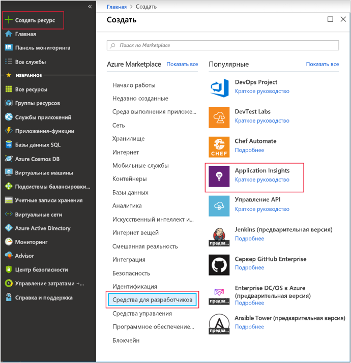
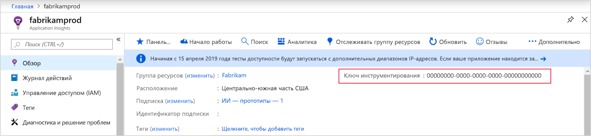
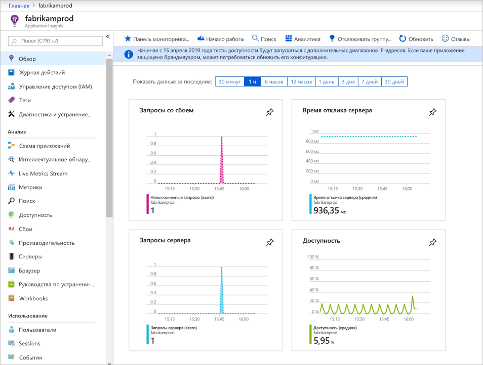
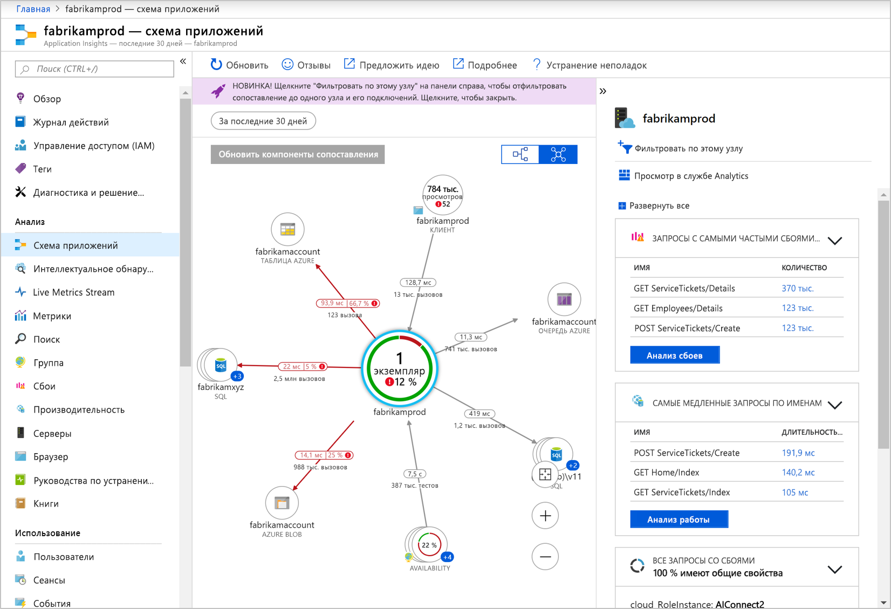
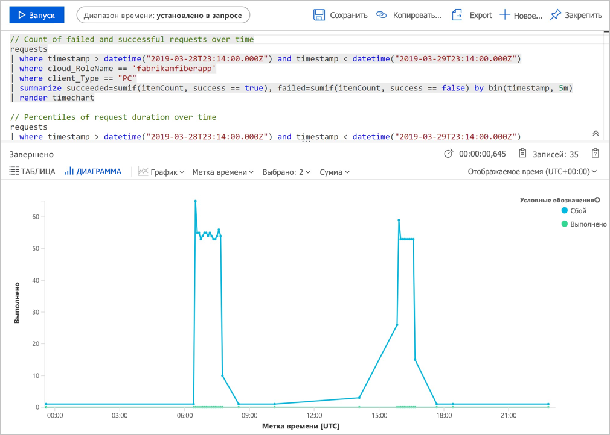
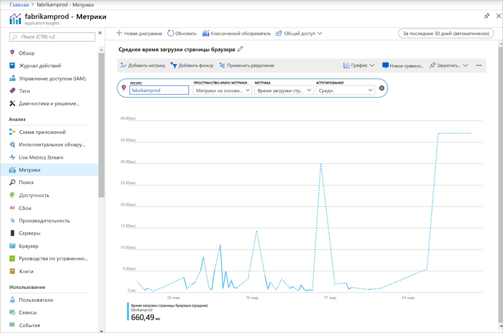

# <a name="quickstart-start-monitoring-your-nodejs-web-application-with-azure-application-insights"></a>Краткое руководство. Начало мониторинга веб-приложения Node.js с помощью Application Insights в Azure

С помощью этого краткого руководства вы сможете добавить пакет SDK Application Insights версии 0.22 для Node.js в имеющееся веб-приложение Node.js.

С помощью Azure Application Insights можно легко отслеживать доступность, производительность и использование своего веб-приложения. Вы также можете быстро идентифицировать и диагностировать ошибки в приложении, не дожидаясь, пока пользователь сообщит о них. С помощью пакета SDK выпуска 0.20 можно отслеживать общие пакеты сторонних разработчиков, включая MongoDB, MySQL и Redis.

## <a name="prerequisites"></a>Предварительные требования

Для работы с этим кратким руководством сделайте следующее:

- Подписка Azure и веб-приложение Node.js.

Если у вас нет веб-приложения Node.js, его можно создать, следуя руководству [Создание веб-приложений Node.js в Azure](https://docs.microsoft.com/azure/app-service/app-service-web-get-started-nodejs).

Если у вас еще нет подписки Azure, создайте [бесплатную](https://azure.microsoft.com/free/) учетную запись Azure, прежде чем начинать работу.

## <a name="sign-in-to-the-azure-portal"></a>Вход на портал Azure

Войдите на [портал Azure](https://portal.azure.com/).

## <a name="enable-application-insights"></a>Включение Application Insights

В Application Insights можно собирать данные телеметрии из любого подключенного к Интернету приложения, независимо от того, работает оно локально или в облаке. Чтобы просмотреть эти данные, сделайте следующее.

1. Последовательно выберите **Создать ресурс** > **Средства разработчика** > **Application Insights**.

   

   > [!NOTE]
   >Если вы создаете ресурс Application Insights впервые, ознакомьтесь с дополнительными сведениями в статье [Создание ресурса Application Insights](https://docs.microsoft.com/azure/azure-monitor/app/create-new-resource).

   Откроется страница с параметрами, на которой нужно заполнить все поля в соответствии с приведенной ниже таблицей. 

    | Параметры        | Значение           | ОПИСАНИЕ  |
   | ------------- |:-------------|:-----|
   | **Имя**      | Глобально уникальное значение | Имя, идентифицирующее отслеживаемое приложение |
   | **Тип приложения** | Приложение Node.js | Тип отслеживаемого приложения |
   | **Местоположение.** | Восточная часть США | Выберите ближайшее расположение или расположение вблизи места размещения приложения |

2. Нажмите кнопку **Создать**.

## <a name="configure-app-insights-sdk"></a>Настройка пакета SDK App Insights

1. Выберите **Обзор** и скопируйте **Ключ инструментирования** приложения.

   

2. Добавьте в приложение пакет SDK Application Insights для Node.js. Из корневой папки приложения выполните следующий код:

   ```bash
   npm install applicationinsights --save
   ```

3. Измените первый JS-файл приложения и добавьте две следующие строки в самую верхнюю часть своего скрипта. Если вы используете [приложение быстрого запуска Node.js](https://docs.microsoft.com/azure/app-service/app-service-web-get-started-nodejs), необходимо изменить файл index.js. Замените &lt;instrumentation_key&gt; ключом инструментирования для приложения. 

   ```JavaScript
   const appInsights = require('applicationinsights');
   appInsights.setup('<instrumentation_key>').start();
   ```

4. Перезапустите приложение.

> [!NOTE]
> Данные начнут появляться на портале через 3–5 минут. Если это тестовое приложение со сниженным трафиком, следует помнить, что большинство метрик собираются только при возникновении активных запросов или операций.

## <a name="start-monitoring-in-the-azure-portal"></a>Запуск мониторинга на портале Azure

1. Теперь можно повторно открыть страницу **Обзор** Application Insights на портале Azure, где вы извлекли ключ иснтрументирования, для просмотра сведений о выполняющемся в данный момент приложении.

   

2. Щелкните **схему приложений**, чтобы получить визуальный макет отношений зависимости между компонентами приложения. Каждый компонент показывает ключевой показатель эффективности, такие как производительность, сбои и оповещения.

   

3. Щелкните в **Aналитике приложений** значок  **Просмотр в службе Analytics**.  Откроется окно **аналитики Application Insights**, которое предоставляет многофункциональный язык запросов для анализа всех данных, собираемых Application Insights. В этом случае автоматически создается запрос, который преобразует число запросов для просмотра в виде диаграммы. Вы можете писать собственные запросы для анализа других данных.

   

4. Вернитесь к странице **Обзор** и изучите графики с КПЭ.  Эта панель мониторинга предоставляет статистические данные о работоспособности приложения, включая число входящих запросов, продолжительности этих запросов и возникающие ошибки.

   

   Чтобы включить диаграмму **Время загрузки страницы** для заполнения данных **телеметрии на стороне клиента**, добавьте этот скрипт на каждую страницу, которую требуется отслеживать:

   ```HTML
   <!-- 
   To collect user behavior analytics tools about your application, 
   insert the following script into each page you want to track.
   Place this code immediately before the closing </head> tag,
   and before any other scripts. Your first data will appear 
   automatically in just a few seconds.
   -->
   <script type="text/javascript">
     var appInsights=window.appInsights||function(config){
       function i(config){t[config]=function(){var i=arguments;t.queue.push(function(){t[config].apply(t,i)})}}var t={config:config},u=document,e=window,o="script",s="AuthenticatedUserContext",h="start",c="stop",l="Track",a=l+"Event",v=l+"Page",y=u.createElement(o),r,f;y.src=config.url||"https://az416426.vo.msecnd.net/scripts/a/ai.0.js";u.getElementsByTagName(o)[0].parentNode.appendChild(y);try{t.cookie=u.cookie}catch(p){}for(t.queue=[],t.version="1.0",r=["Event","Exception","Metric","PageView","Trace","Dependency"];r.length;)i("track"+r.pop());return i("set"+s),i("clear"+s),i(h+a),i(c+a),i(h+v),i(c+v),i("flush"),config.disableExceptionTracking||(r="onerror",i("_"+r),f=e[r],e[r]=function(config,i,u,e,o){var s=f&&f(config,i,u,e,o);return s!==!0&&t["_"+r](config,i,u,e,o),s}),t
       }({
           instrumentationKey:"<insert instrumentation key>"
       });
       
       window.appInsights=appInsights;
       appInsights.trackPageView();
   </script>
   ```

5. В области слева выберите **Метрики**. Используйте обозреватель метрик для анализа работоспособности и использования ресурса. Щелкните **Добавить новую диаграмму**, чтобы создать дополнительные пользовательские представления, или **Изменение**, чтобы изменить имеющиеся типы диаграмм, высоту, цветовую палитру, группирования и метрики. Например, можно сделать диаграмму, на которой будет показано среднее время загрузки страницы браузера. Для этого в раскрывающемся списке метрик выберите "Время загрузки страницы браузера" и "Среднее" в столбце агрегирования. Дополнительные сведения об обозревателе метрик Azure см. в статье [Getting started with Azure Metrics Explorer](../../azure-monitor/platform/metrics-getting-started.md) (Начало работы с обозревателем метрик Azure).

   

Дополнительные сведения о мониторинге Node.js см. в статье [Мониторинг служб и приложений Node.js с помощью Application Insights](../../azure-monitor/app/nodejs.md).

## <a name="clean-up-resources"></a>Очистка ресурсов

Закончив работу, можно удалить группу ресурсов и все связанные с ней ресурсы. Для этого выполните описанные ниже действия.

1. На портале Azure в меню слева щелкните **Группы ресурсов**, а затем выберите **myResourceGroup**.
2. На странице группы ресурсов щелкните **Удалить**, в текстовом поле введите **myResourceGroup** и выберите **Удалить**.

## <a name="next-steps"></a>Дополнительная информация

> [!div class="nextstepaction"]
> [Аналитика в Application Insights](https://docs.microsoft.com/azure/application-insights/app-insights-analytics)
