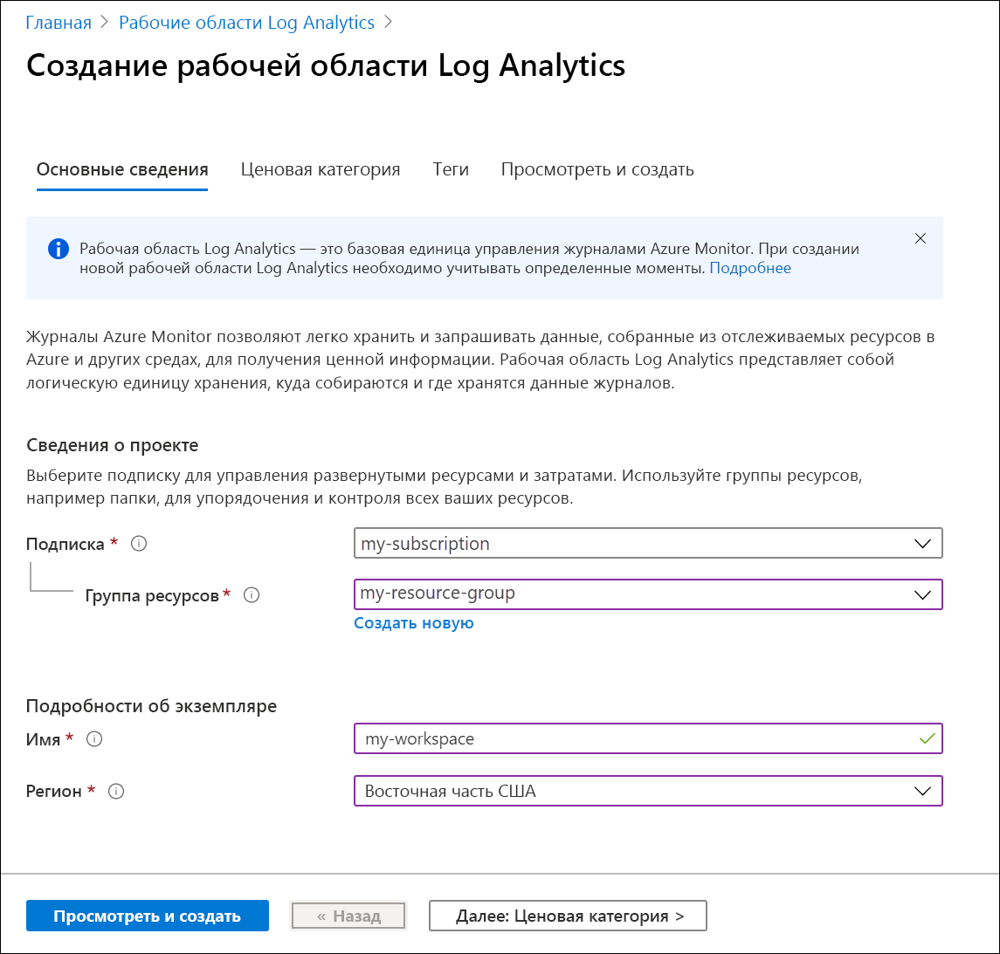
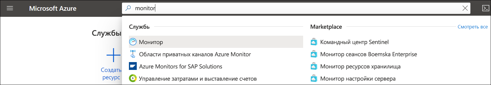
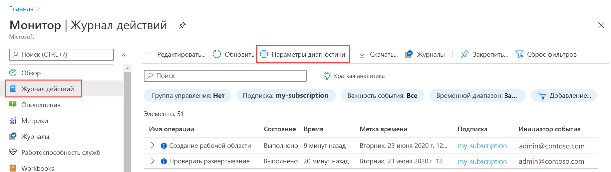
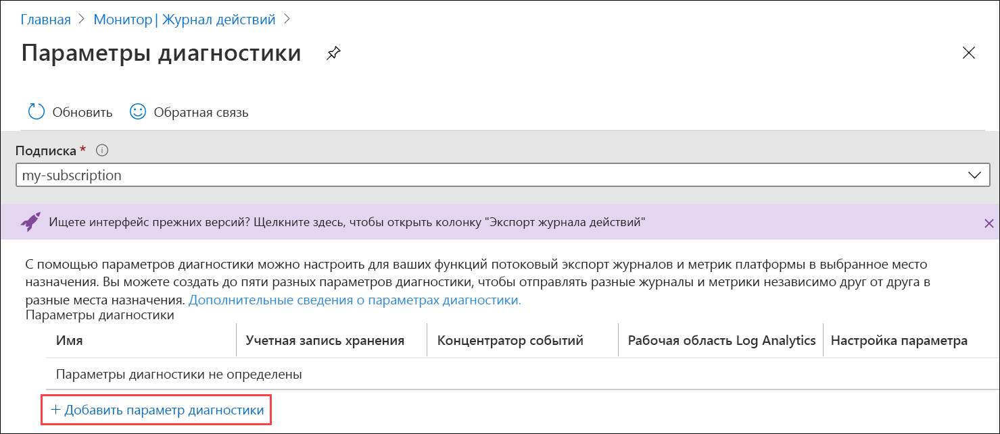
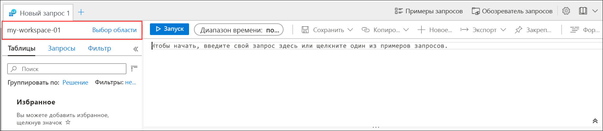
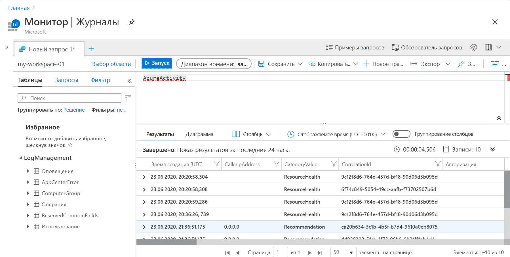
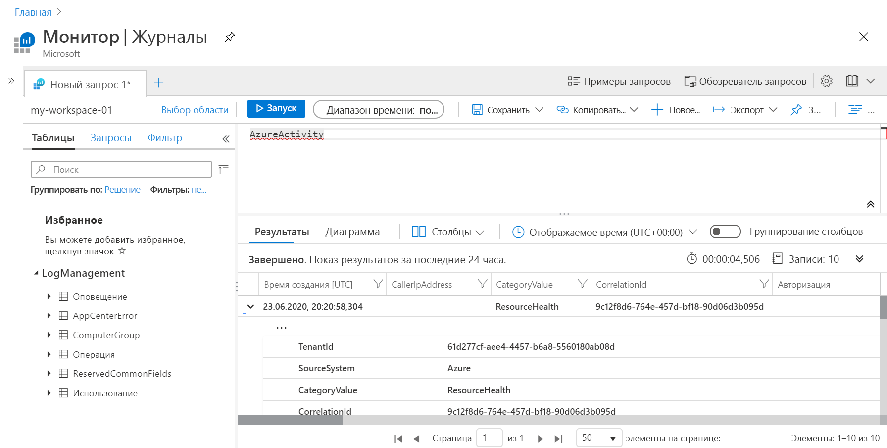
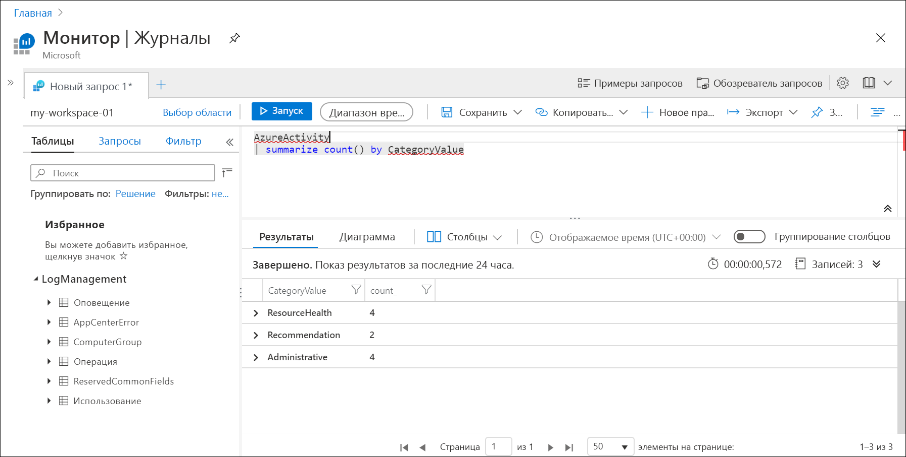

# Отправка журнала действий Azure в рабочую область Log Analytics с помощью портала Azure
Журнал действий — это журнал платформы в Azure, который предоставляет аналитические сведения о событиях уровня подписки, например об изменении ресурса или запуске виртуальной машины. Вы можете просмотреть журнал действий на портале Azure или получить записи с помощью PowerShell и CLI. В этом кратком руководстве показано, как применить портал Azure для создания параметра диагностики и рабочей области Log Analytics, а также для отправки журнала действий в журналы Azure Monitor, где можно их анализировать с помощью [запросов по журналам](../log-query/log-query-overview.md) и применять другие возможности, такие как [оповещения журнала](../platform/alerts-log-query.md) и [книги](../platform/workbooks-overview.md). 

## Вход на портал Azure
Войдите на портал Azure по адресу [https://portal.azure.com](https://portal.azure.com). 

## Создание рабочей области Log Analytics
На портале Azure найдите и выберите **Рабочие области Log Analytics**. 

  
Щелкните **Добавить**, а затем укажите значения для параметров **Группа ресурсов**, **Имя** и **Расположение** рабочей области. Имя рабочей области должно быть уникальным в пределах всех подписок Azure.

Щелкните **Проверка и создание**, чтобы проверить параметры, а затем щелкните **Создать**, чтобы создать рабочую область. По умолчанию будет выбрана ценовая категория **с оплатой по мере использования**, по которой вы не будете нести расходов, пока не соберете достаточно большой объем данных. За сбор журнала действий плата не взимается.

## Создание параметра диагностики
На портале Azure найдите и выберите **Монитор**. 

Выберите **Журнал действий**. Здесь вы увидите последние события для текущей подписки. Щелкните **Параметры диагностики**, чтобы просмотреть параметры диагностики для подписки.

Щелкните **Добавить параметр диагностики**, чтобы создать новый параметр. 

Введите имя, например *Отправка журнала действий в рабочую область*. Выберите каждую из категорий. Выберите **Отправить в Log Analytics** как единственное место назначения, а затем укажите только что созданную рабочую область. Щелкните **Сохранить**, чтобы создать параметр диагностики, а затем закройте страницу.

## Создание данных журнала
В рабочую область Log Analytics будут отправляться только новые записи журнала действий, поэтому выполните в подписке действия, которые будут регистрироваться, например запустите или остановите виртуальную машину либо создайте или измените другой ресурс. Создание параметра диагностики и запись данных в рабочую область может занять несколько минут. После этого все события, записанные в журнал действий, будут отправлены в рабочую область в течение нескольких секунд.

## Получение данных с помощью запросов по журналам

Выберите **Журналы** в меню **Azure Monitor**. Закройте страницу **Примеры запросов**. Если для созданной рабочей области не задана область, щелкните **Выбрать область** и найдите ее.

В окне запроса введите `AzureActivity` и щелкните **Выполнить**. Этот простой запрос возвращает все записи в таблице *AzureActivity*, где хранятся все записи, отправленные из журнала действий.

Разверните одну из записей, чтобы просмотреть ее подробные свойства.

Попробуйте отправить более сложный запрос, например `AzureActivity | summarize count() by CategoryValue`, который возвращает количество событий, суммированных по категориям.

## Дальнейшие действия
Из этого краткого руководства вы узнали, как настроить отправку журнала действий в рабочую область Log Analytics. Теперь вы можете настроить сбор других данных в рабочую область, где их можно анализировать с помощью [запросов к журналам](../log-query/log-query-overview.md) в Azure Monitor, и применять другие возможности, например [оповещения журналов](../platform/alerts-log-query.md) и [книги](../platform/workbooks-overview.md). Затем вам нужно собрать [журналы ресурсов](../platform/resource-logs.md) из ресурсов Azure, которые дополняют данные в журнале действий. Так вы сможете получить представление об операциях, выполненных в пределах каждого ресурса.

> [!div class="nextstepaction"]
> [Получение и анализ журналов ресурсов с помощью Azure Monitor](tutorial-resource-logs.md)
