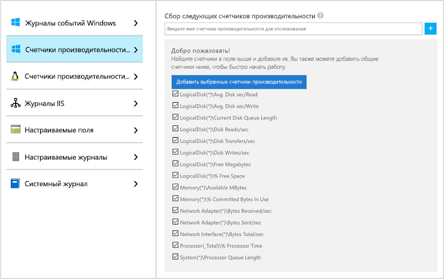
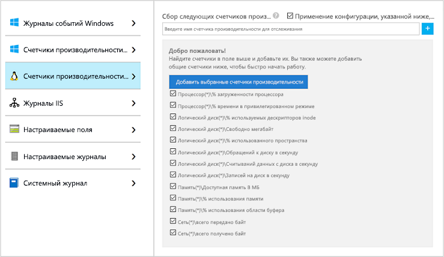

# Сбор данных из виртуальной машины Azure с помощью Azure Monitor

[Azure Monitor](../overview.md) может собирать данные напрямую из виртуальных машин Azure в рабочую область Log Analytics для подробного анализа и корреляции. Установка расширения виртуальной машины Log Analytics для [Windows](../../virtual-machines/extensions/oms-windows.md) и [Linux](../../virtual-machines/extensions/oms-linux.md) позволяет Azure Monitor собирать данные из виртуальных машин Azure. В этом кратком руководстве показано, как несколькими простыми действиями настроить и собирать данные из виртуальных машин Azure под управлением Linux или Windows с помощью расширения виртуальной машины.  
 
В этом кратком руководстве предполагается, что у вас уже есть виртуальная машина Azure. Если нет, можно создать [виртуальную машину Windows](../../virtual-machines/windows/quick-create-portal.md) или [виртуальную машину Linux](../../virtual-machines/linux/quick-create-cli.md) с помощью соответствующих кратких руководств.

## Вход на портал Azure

Войдите на портал Azure по адресу [https://portal.azure.com](https://portal.azure.com). 

## Создание рабочей области

1. На портале Azure щелкните **Все службы**. В списке ресурсов введите **Log Analytics**. Как только вы начнете вводить символы, список отфильтруется соответствующим образом. Выберите **Рабочие области Log Analytics**.

       

2. Выберите **Создать** и задайте следующие параметры:

   * Введите имя для новой **рабочей области Log Analytics**, например *DefaultLAWorkspace*.  
   * Выберите в раскрывающемся списке **подписку**, с которой нужно связать рабочую область, если выбранная по умолчанию не подходит.
   * В разделе **Группа ресурсов** выберите имеющуюся группу ресурсов, в которой содержится одна или несколько виртуальных машин Azure.  
   * Выберите **Расположение**, в котором развернуты виртуальные машины.  Дополнительные сведения о доступности службы Log Analytics в регионах см. в [этой статье](https://azure.microsoft.com/regions/services/).
   * При создании рабочей области в новой подписке, созданной после 2 апреля 2018 г., будет автоматически использоваться тарифный план *За ГБ*, и выбор ценовой категории будет недоступен.  При создании рабочей области в существующей подписке, созданной до 2 апреля, или в подписке, которая была привязана к существующей регистрации EA, выберите нужную ценовую категорию.  Дополнительные сведения о конкретной ценовой категории см. в статье [Цены на Log Analytics](https://azure.microsoft.com/pricing/details/log-analytics/).
  
         

3. Завершив ввод обязательных сведений на панели **Рабочая область Log Analytics**, щелкните **OK**.  

Пока проверяются данные, ход создания рабочей области можно проверить в разделе **Уведомления** в меню. 

## Включение расширения виртуальной машины Log Analytics

[!INCLUDE [log-analytics-agent-note](../../../includes/log-analytics-agent-note.md)] 

На виртуальные машины Windows и Linux, развернутые в Azure, устанавливается агент Log Analytics с расширением виртуальной машины Log Analytics. Использование расширения упрощает процесс установки и автоматически настраивает агент на отправку данных в указанную вами рабочую область Log Analytics. Кроме того, агент обновляется автоматически при доступности новой версии, обеспечивая наличие новейших компонентов и исправлений. Прежде чем продолжить, проверьте, запущена ли виртуальная машина. В противном случае процесс не будет успешно завершен.  

>[!NOTE]
>Агент Log Analytics для Linux невозможно настроить для отправки отчетов в несколько рабочих областей Log Analytics. 

1. На портале Azure щелкните **Все службы** вверху слева. В списке ресурсов введите **Log Analytics**. Как только вы начнете вводить символы, список отфильтруется соответствующим образом. Выберите **Рабочие области Log Analytics**.

2. В списке рабочих областей Log Analytics выберите рабочую область *DefaultLAWorkspace*, созданную ранее.

3. В меню слева в разделе "Источники данных рабочей области" щелкните **Виртуальные машины**.  

4. В списке **виртуальных машин** выберите ту, на которую необходимо установить агент. Обратите внимание, что в **состоянии подключения Log Analytics** выбранной виртуальной машины указано значение **Не подключено**.

5. В колонке сведений о выбранной виртуальной машине выберите **Подключить**. Агент будет автоматически установлен и настроен для рабочей области Log Analytics. Этот процесс занимает несколько минут. Все это время отображается **состояние** **Подключение**.

6. После установки и подключения агента **состояние подключения Log Analytics** обновится и примет значение **Эта рабочая область**.

## Сбор данных событий и производительности

Azure Monitor может собирать события из журналов событий Windows или системного журнала Linux и счетчиков производительности, указанных для долгосрочного анализа и формирования отчетов, а также предпринимать действия при обнаружении определенного условия. Сначала выполните такие действия для настройки сбора событий из системного журнала Windows и Linux, а также нескольких стандартных счетчиков производительности.  

### Сбор данных из виртуальной машины Windows

1. Выберите **Дополнительные параметры**.

    

2. Выберите **Данные**, а затем — **Журналы событий Windows**.

3. Чтобы добавить журнал событий, введите его имя.  Введите **Система** и щелкните знак "плюс" ( **+** ).

4. Проверьте степени серьезности **Ошибка** и **Предупреждение** в таблице.

5. Вверху щелкните **Сохранить**, чтобы сохранить конфигурацию.

6. Выберите **Windows Performance Data** (Данные производительности Windows), чтобы включить сбор данных счетчиков производительности на компьютере Windows.

7. При первой настройке счетчиков производительности Windows для новой рабочей области Log Analytics вы можете быстро создать несколько распространенных счетчиков. Рядом с каждым счетчиком в списке есть флажок.

    

    Щелкните **Добавить выбранные счетчики производительности**.  Они добавляются и устанавливаются с десятисекундным интервалом сбора.
  
8. Вверху щелкните **Сохранить**, чтобы сохранить конфигурацию.

### Сбор данных из виртуальной машины Linux

1. Выберите **Системный журнал**.  

2. Чтобы добавить журнал событий, введите его имя.  Введите **Системный журнал** и щелкните знак "плюс" ( **+** ).  

3. В таблице снимите флажок для степеней серьезности **Информация**, **Уведомление** и **Отладить**. 

4. Вверху щелкните **Сохранить**, чтобы сохранить конфигурацию.

5. Выберите **Linux Performance Data** (Данные производительности Linux), чтобы включить сбор данных счетчиков производительности на компьютере Linux. 

6. При первой настройке счетчиков производительности Linux для новой рабочей области Log Analytics вы можете быстро создать несколько распространенных счетчиков. Рядом с каждым счетчиком в списке есть флажок.

    

    Выберите **Применение конфигурации, указанной ниже, к моим машинам** и щелкните **Добавить выбранные счетчики производительности**.  Они добавляются и устанавливаются с десятисекундным интервалом сбора.  

7. Вверху щелкните **Сохранить**, чтобы сохранить конфигурацию.

## Просмотр собранных данных

Теперь, когда сбор данных включен, можно запустить простой пример поиска по журналам, чтобы просмотреть некоторые данные из целевых виртуальных машин.  

1. В выбранной рабочей области на панели слева выберите **Журналы**.

2. На странице запросов к журналам в редакторе запросов введите `Perf` и щелкните **Run** (Выполнить).

     

    Например, запрос на следующем рисунке вернул 10 000 записей о производительности. Ваши результаты будут значительно меньше.

    

## Очистка ресурсов

Удалите рабочую область Log Analytics, если она больше не нужна. Для этого выберите рабочую область Log Analytics, созданную ранее, и на странице ресурсов щелкните **Удалить**.

## Дополнительная информация

Теперь, когда вы собираете данные о работе и производительности со своих виртуальных машин Windows или Linux, можно легко начать изучение и анализ собранных данных, а также работать с ними *бесплатно*.  

Чтобы узнать, как просматривать и анализировать данные, перейдите к следующему руководству.

> [!div class="nextstepaction"]
> [Просмотр и анализ данных, собранных с помощью поиска по журналам Log Analytics](../../azure-monitor/learn/tutorial-viewdata.md)
