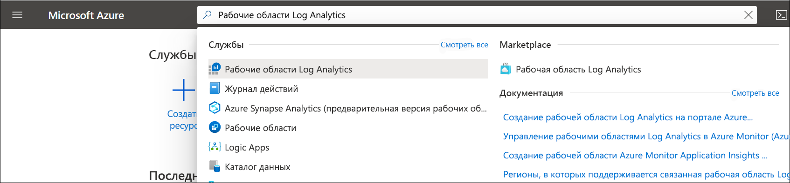

# Создание рабочей области Log Analytics на портале Azure
Используйте меню **Рабочие области Log Analytics**, чтобы создать рабочую область Log Analytics с помощью портала Azure. Рабочая область Log Analytics — это уникальная среда для данных журналов Azure Monitor. Каждая рабочая область имеет свои репозиторий данных и конфигурации, при этом источники данных и решения настроены для хранения данных в определенной рабочей области. Вам понадобится рабочая область Log Analytics, если вы собираете данные из следующих источников:

* ресурсы Azure в подписке;
* локальные компьютеры, которые отслеживает System Center Operations Manager;
* коллекции устройств из Configuration Manager; 
* Данные диагностики и журнала из Службы хранилища Azure

Сведения о других источниках, таких как виртуальные машины Azure и виртуальные машины Windows или Linux в вашей среде, см. в статьях ниже.

*  [Сбор данных о виртуальных машинах Azure](./quick-collect-azurevm.md) 
*  [Настройка агента Log Analytics для компьютеров Linux в гибридной среде](./quick-collect-linux-computer.md)
*  [Настройка агента Log Analytics для компьютеров Windows в гибридной среде](quick-collect-windows-computer.md)

Если у вас еще нет подписки Azure, [создайте бесплатную учетную запись](https://azure.microsoft.com/free/?WT.mc_id=A261C142F), прежде чем начинать работу.

## Вход на портал Azure
Войдите на портал Azure по адресу [https://portal.azure.com](https://portal.azure.com). 

## Создание рабочей области
1. На портале Azure щелкните **Все службы**. В списке ресурсов введите **Log Analytics**. Как только вы начнете вводить символы, список отфильтруется соответствующим образом. Выберите **Рабочие области Log Analytics**.

    
  
2. Щелкните **Добавить** и выберите параметры для следующих элементов:

   * Введите имя для новой **Рабочей области Log Analytics**, например *DefaultLAWorkspace*. Это имя должно быть уникальным среди всех подписок Azure Monitor.
   * Выберите в раскрывающемся списке **Подписку**, с которой нужно связать рабочую область, если выбранная по умолчанию не подходит.
   * Для **группы ресурсов** выберите существующую и уже настроенную группу ресурсов или создайте новую.  
   * Выберите доступное **расположение**.  Получите дополнительные сведения о [поддерживаемых регионах для Log Analytics](https://azure.microsoft.com/regions/services/) и найдите Azure Monitor в поле **Поиск продукта**.  
   * При создании рабочей области в новой подписке, созданной после 2 апреля 2018 г., будет автоматически использоваться тарифный план *За ГБ*, и выбор ценовой категории будет недоступен.  При создании рабочей области в существующей подписке, созданной до 2 апреля, или в подписке, которая была привязана к существующей регистрации Соглашения Enterprise (EA), выберите нужную ценовую категорию.  Дополнительные сведения о конкретной ценовой категории см. в статье [Цены на Log Analytics](https://azure.microsoft.com/pricing/details/log-analytics/).

          

3. После ввода необходимых сведений в области **Рабочая область Log Analytics** щелкните **OK**.  

Пока проверяются данные, ход создания рабочей области можно проверить в разделе **Уведомления** в меню. 

## Устранение неполадок
При создании рабочей области, которая была удалена в течение последних 14 дней и находится в [состоянии обратимого удаления](../platform/delete-workspace.md#soft-delete-behavior), операция может приводить к разным результатам в зависимости от конфигурации рабочей области.
1. Если вы указали то же имя рабочей области, группы ресурсов, подписки и региона, которые использовались для удаленной рабочей области, она будет полностью восстановлена с сохранением данных, конфигурации и подключенных агентов.
2. Если вы указали то же имя рабочей области, но другую группу ресурсов, подписку или регион, появится ошибка с сообщением *Имя рабочей области уже используется. Выберите другое имя*. Чтобы переопределить обратимое удаление и окончательно удалить рабочую область и создать новую рабочую область с тем же именем, выполните следующие шаги, чтобы сначала восстановить рабочую область, а затем удалить ее без возможности восстановления:
   - [Восстановите](../platform/delete-workspace.md#recover-workspace) свою рабочую область.
   - [Безвозвратно удалите](../platform/delete-workspace.md#permanent-workspace-delete) рабочую область.
   - Создайте новую рабочую область с именем удаленной рабочей области.

## Дальнейшие действия
Теперь, когда рабочая область доступна, вы можете настроить сбор данных телеметрии для мониторинга, выполнять поиск по журналам для анализа этих данных, а также добавить решение по управлению для предоставления дополнительных данных и аналитических сведений. 

* Сведения о том, как включить сбор данных из ресурсов Azure с помощью системы диагностики Azure или службы хранилища Azure, см. в статье [Сбор журналов и метрик для служб Azure для использования в Log Analytics](../platform/resource-logs.md#send-to-log-analytics-workspace).  
* Добавьте [System Center Operations Manager в качестве источника данных](../platform/om-agents.md), чтобы собирать данные с агентов, которые предоставляют отчеты группе управления Operations Manager, и хранить эти данные в рабочей области Log Analytics. 
* Подключите [Configuration Manager](../platform/collect-sccm.md) для импорта данных с компьютеров, которые являются элементами коллекций в иерархии.  
* Просмотрите список доступных [решений для мониторинга](../insights/solutions.md) и узнайте, как добавить решение в рабочую область или удалить его из нее.

