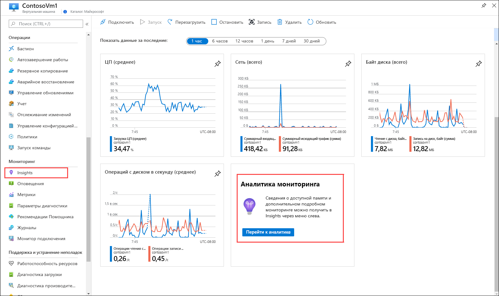
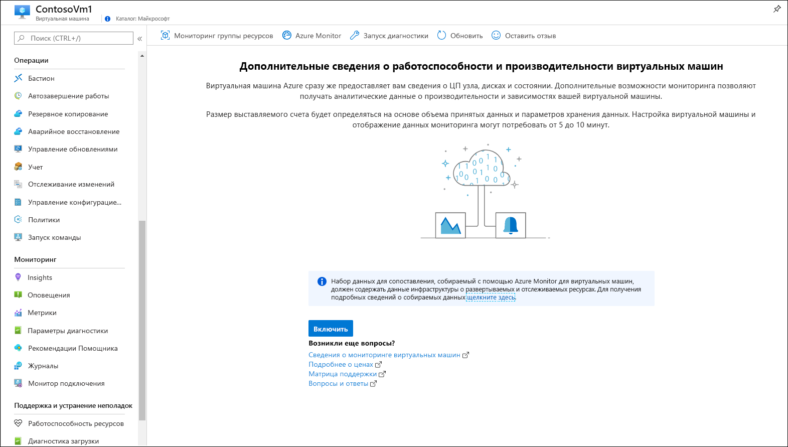
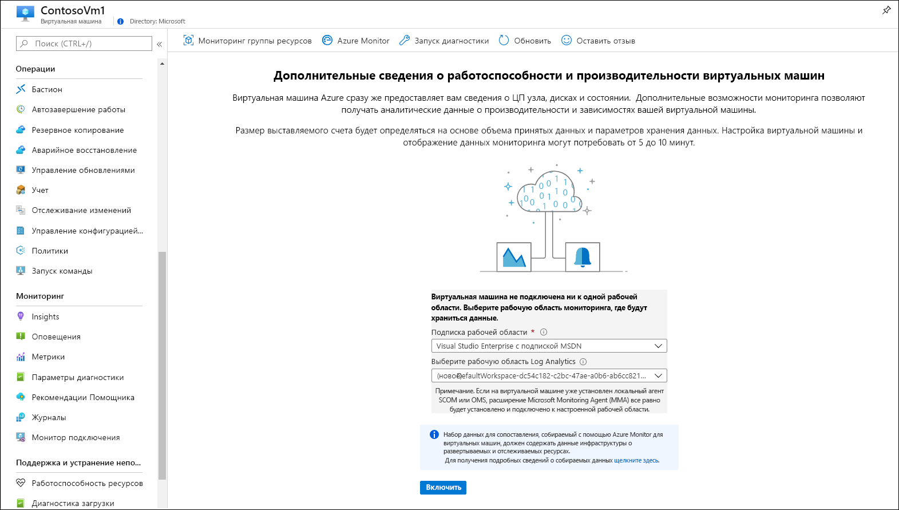
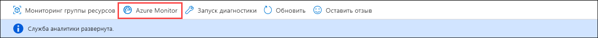
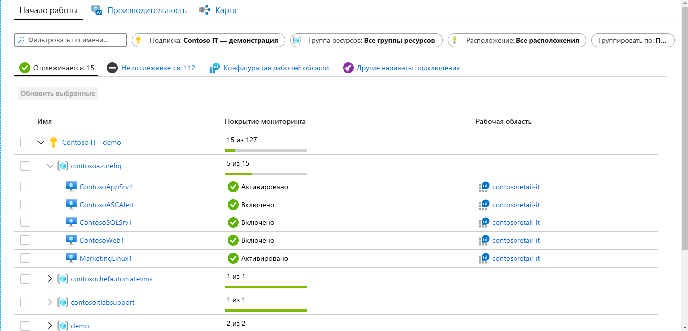
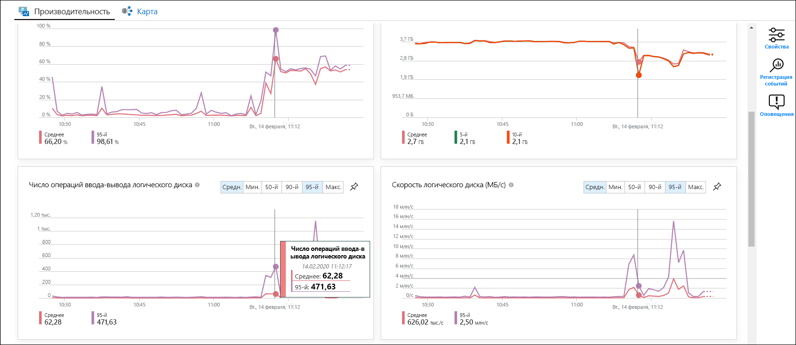
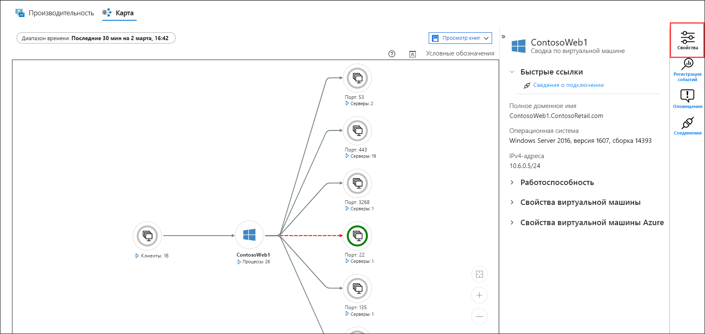
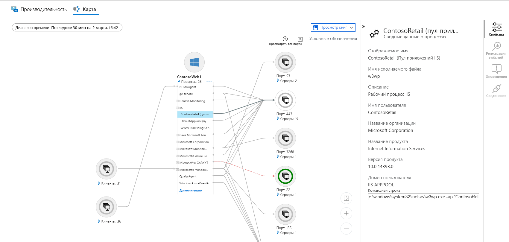
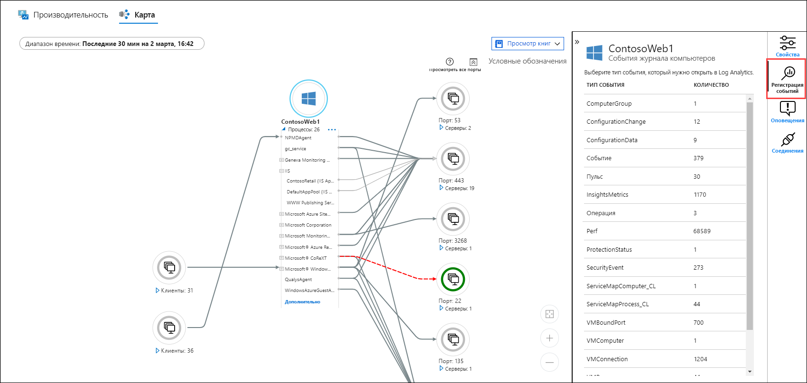
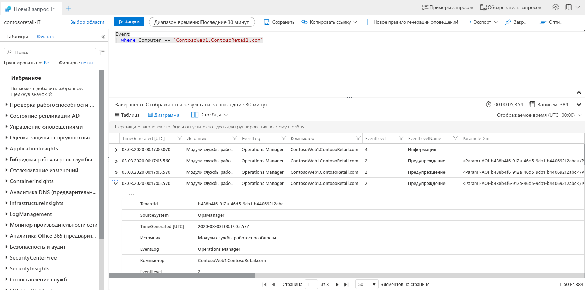

# Мониторинг виртуальной машины Azure с помощью Azure Monitor.
[Azure Monitor](../overview.md) начинает сбор данных из виртуальных машин Azure с момента их создания. В этом кратком руководстве описываются данные, которые автоматически собираются для каждой виртуальной машины Azure, и показано, как просматривать эти данные на портале Azure. Затем вы включите для виртуальной машины [Azure Monitor для виртуальных машин](../insights/vminsights-overview.md), чтобы агенты на виртуальной машине могли получать и анализировать данные из гостевой операционной системы, в том числе сведения о процессах и зависимостях.

В этом кратком руководстве предполагается, что у вас уже есть виртуальная машина Azure. Если нет, можно создать виртуальную машину [Windows](../../virtual-machines/windows/quick-create-portal.md) или [Linux](../../virtual-machines/linux/quick-create-cli.md) с помощью соответствующих кратких руководств.

Более подробное описание данных мониторинга, собираемых из ресурсов Azure, см. в руководстве по [мониторингу виртуальных машин Azure с помощью Azure Monitor](../insights/monitor-vm-azure.md).

## Пройдите краткое руководство по мониторингу ресурсов Azure.
Пройдите руководство [по мониторингу ресурса Azure с помощью Azure Monitor](quick-monitor-azure-resource.md), чтобы просмотреть страницу обзорных сведений, журнал действий и метрики для виртуальной машины в вашей подписке. Виртуальные машины Azure собирают те же данные мониторинга, что и любой другой ресурс Azure, но это только в отношении виртуальной машины узла. Остальная часть этого краткого руководства посвящена мониторингу операционной системы на виртуальной машине и ее рабочих нагрузок.

## Включение Azure Monitor для виртуальных машин
Для виртуальной машины узла будут собраны метрики и журналы действий, но вам потребуется агент и дополнительная настройка для сбора и анализа данных мониторинга из операционной системы на виртуальной машине и ее рабочих нагрузок. Azure Monitor для виртуальных машин устанавливает эти агенты и предоставляет дополнительные мощные функции для мониторинга виртуальных машин.

1. Перейдите в меню для нужной виртуальной машины.
2. Щелкните **Перейти к аналитике** на плитке на странице **Обзор** или выберите **Аналитические сведения** в меню **Мониторинг**.

    

3. Если решение Azure Monitor для виртуальных машин еще не включено для нужной виртуальной машины, щелкните **Включить**. 

    

4. Если виртуальная машина еще не подключена к рабочей области Log Analytics, вам будет предложено выбрать существующую рабочую область или создать новую. Подтвердите вариант по умолчанию — рабочую область с уникальным именем в том же регионе, где расположена виртуальная машина.

    

5. Подключение займет несколько минут, пока на виртуальной машине включаются расширения и устанавливаются агенты. По завершении вы получите сообщение об успешном развертывании аналитических сведений. Щелкните **Azure Monitor**, чтобы открыть Azure Monitor для виртуальных машин.

    

6. Вы увидите виртуальную машину в списке подключенных виртуальных машин в этой подписке. Если вы хотите просмотреть неподключенные виртуальные машины в подписке, выберите вкладку **Не отслеживается**.

    

## Настройка рабочей области
В создаваемой рабочей области Log Analytics необходимо настроить получение журналов. Это нужно сделать только один раз, а затем эта конфигурация будет применяться ко всем подключаемым виртуальным машинам.

1. Щелкните **Конфигурация рабочей области** и выберите свою рабочую область.

2. Щелкните **Дополнительные параметры**.

    

### Сбор данных из виртуальной машины Windows

2. Выберите **Данные**, а затем — **Журналы событий Windows**.

3. Добавьте журнал событий, введя его имя.  Введите **Система** и щелкните знак "плюс" (**+**).

4. Проверьте степени серьезности **Ошибка** и **Предупреждение** в таблице.

5. Вверху щелкните **Сохранить**, чтобы сохранить конфигурацию.

### Сбор данных из виртуальной машины Linux

1. Выберите **Данные** и **Системный журнал**.

2. Добавьте журнал событий, введя его имя.  Введите **Системный журнал** и щелкните знак "плюс" (**+**).  

3. В таблице снимите флажок для степеней серьезности **Информация**, **Уведомление** и **Отладка**. 

4. Вверху щелкните **Сохранить**, чтобы сохранить конфигурацию.

## Просмотр собранных данных

7. Щелкните виртуальную машину, а затем откройте вкладку **Производительность**, которая находится под пунктом **Аналитические сведения** в меню **Мониторинг**. Здесь отобразится группа счетчиков производительности, собираемых из операционной системы виртуальной машины. Прокрутите вниз, чтобы увидеть дополнительные счетчики, и наведите указатель мыши на диаграмму, чтобы просмотреть средние значения и процентили за разные периоды.

    

9. Щелкните **Карта**, чтобы открыть функцию отображения процессов, запущенных на виртуальной машине, и их зависимостей в формате карты. Щелкните **Свойства**, чтобы открыть панель свойств, если она еще не открыта.

    

11. Разверните процессы, выполняемые на виртуальной машине. Выберите любой из процессов, чтобы просмотреть сведения о нем и выделить его зависимости.

    

12. Снова выберите виртуальную машину и щелкните **События журнала**. 

    

13. Отобразится список таблиц, которые хранятся в рабочей области Log Analytics для этой виртуальной машины. Этот список будет разным в зависимости от того, используете ли вы виртуальную машину Windows или Linux. Перейдите на вкладку **События**. Здесь перечислены все события из журнала событий Windows. Откроется Log Analytics с простым запросом для получения записей журнала событий.

    

## Дальнейшие действия
В этом кратком руководстве показано, как включить для требуемой виртуальной машины Azure Monitor для виртуальных машин и включить в рабочей области Log Analytics получение сведений о событиях для операционной системы на виртуальной машине. Чтобы узнать, как просматривать и анализировать данные, перейдите к следующему руководству.

> [!div class="nextstepaction"]
> [Просмотр и анализ данных, собранных с помощью поиска по журналам Log Analytics](../log-query/log-analytics-tutorial.md)