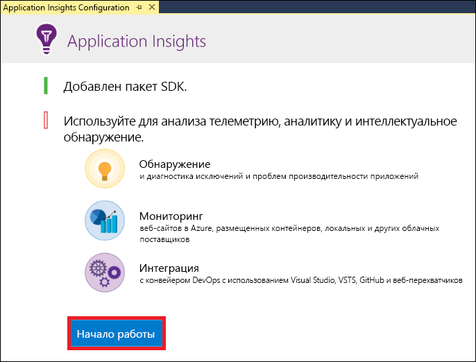
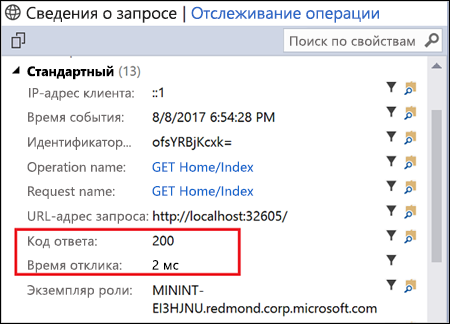
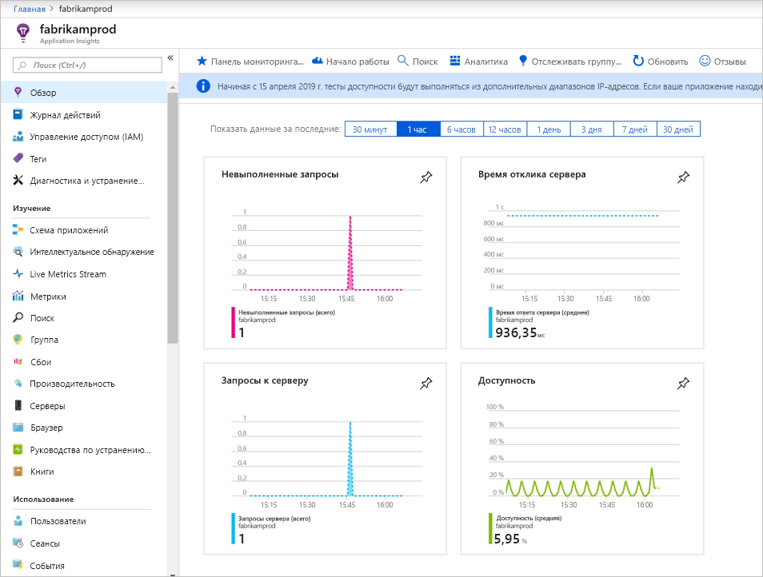
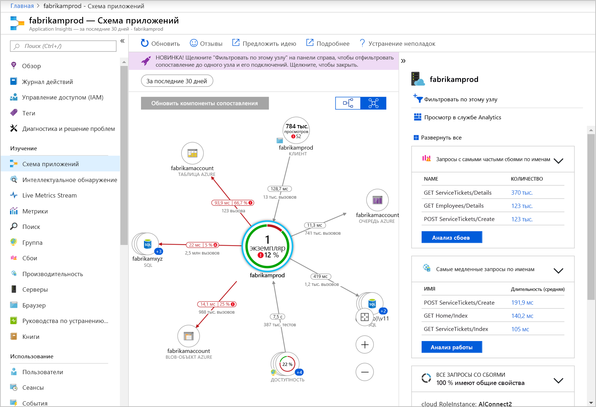
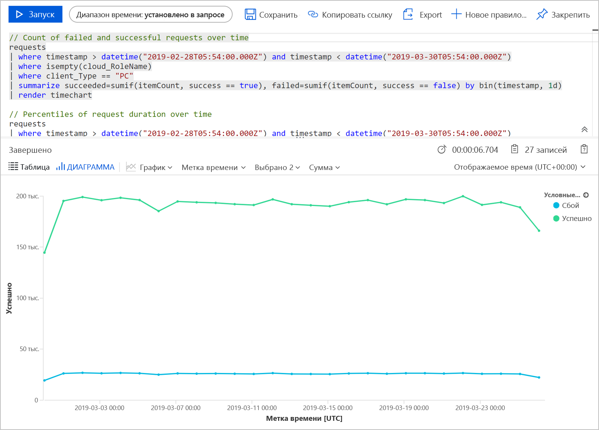
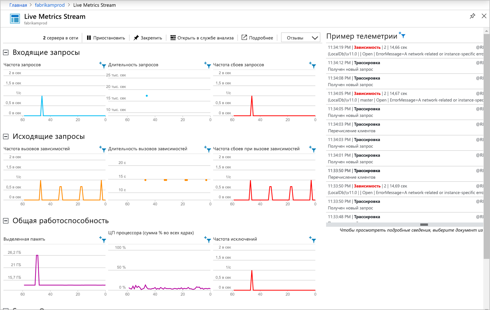

# <a name="start-monitoring-your-aspnet-web-application"></a>Запуск мониторинга веб-приложения ASP.NET

С помощью Azure Application Insights можно легко отслеживать доступность, производительность и использование своего веб-приложения.  Вы также можете быстро идентифицировать и диагностировать ошибки в приложении, не дожидаясь, пока пользователь сообщит о них.  На основе сведений о производительности и эффективности приложения, получаемых из Application Insights, можно сделать обдуманный выбор по поддержке и улучшению приложения.

В этом руководстве показано, как добавить Application Insights в имеющееся веб-приложение ASP.NET и начать анализировать статистику в реальном времени с помощью одного из различных методов, которые можно использовать для анализа работы приложения. Если у вас нет веб-приложения ASP.NET, его можно создать, выполнив инструкции из статьи [Создание веб-приложения ASP.NET Framework в Azure](../../app-service/app-service-web-get-started-dotnet-framework.md).

## <a name="prerequisites"></a>Предварительные требования
Для работы с этим кратким руководством сделайте следующее:

- Установите [Visual Studio 2017](https://www.visualstudio.com/downloads/) с указанными ниже рабочими нагрузками:
    - ASP.NET и веб-разработка.
    - разработка Azure;


Если у вас еще нет подписки Azure, создайте [бесплатную](https://azure.microsoft.com/free/) учетную запись Azure, прежде чем начинать работу.

## <a name="enable-application-insights"></a>Включение Application Insights

1. Откройте проект в Visual Studio 2017.
2. В меню "Проект" выберите **Настроить Application Insights**. С помощью Visual Studio пакет SDK Application Insights добавляется в приложение.

    > [!IMPORTANT]
    > Процесс добавления Application Insights зависит от типа шаблона ASP.NET. Если вы используете **пустой** шаблон или шаблон **мобильного приложения Azure**, выберите **Проект** > **Add Application Insights Telemetry** (Добавить телеметрию Application Insights). Для работы со всеми другими шаблонами ASP.NET ознакомьтесь с инструкциями на предыдущем шаге. 

3. Щелкните **Приступить к работе** (в более ранних версиях Visual Studio это кнопка **Начать бесплатно**).

    

4. Выберите свою подписку и щелкните **Зарегистрироваться**.

5. Запустите приложение, выбрав в меню **Отладить** пункт **Начать отладку** или нажав клавишу F5.

## <a name="confirm-app-configuration"></a>Подтверждение настройки приложения

Application Insights собирает данные телеметрии из приложения независимо от того, где оно работает. Чтобы просмотреть эти данные, сделайте следующее.

1. Откройте Application Insights, последовательно выбрав **Вид** -> **Другие окна** -> **Поиск по Application Insights**.  Это телеметрия из текущего сеанса.<BR><br>

2. Щелкните первый запрос в списке (в этом примере GET Home/Index), чтобы просмотреть сведения о нем. Обратите внимание, что состояние кода и время ответа поставляются вместе с другой ценной информацией о запросе.<br><br>

## <a name="start-monitoring-in-the-azure-portal"></a>Запуск мониторинга на портале Azure

Теперь можно открыть Application Insights на портале Azure для просмотра различных сведений о запущенном приложении.

1. В обозревателе решений откройте папку **Connected Services** (Подключенные службы), нажав значок с облаком и вилкой, правой кнопкой мыши щелкните папку **Application Insights**, а затем — **Открыть портал Application Insights**.  Появятся некоторые сведения о приложении и разнообразные параметры.

    

2. Щелкните **Схема сопоставления приложений**, чтобы получить визуальный макет отношений зависимости между компонентами приложения.  Каждый компонент показывает ключевой показатель эффективности, такие как производительность, сбои и оповещения.

    

3. Щелкните значок **аналитики приложений** >  > **Просмотр в службе Analytics** для одного из компонентов приложения. Откроется окно **Application Insights Analytics** (Application Insights — аналитика), которое предоставляет полнофункциональный язык запросов для анализа всех данных, собранных Application Insights.  В этом случае создается запрос, который преобразовывает число запросов для просмотра в виде диаграммы. Вы можете записывать собственные запросы для анализа других данных.

    

4. Слева в разделе изучения щелкните **Live Metrics Stream**. После этого появится статистика приложения во время его работы. Включается такая информация, как число входящих запросов, их продолжительность и все возникающие ошибки. Вы также можете проверить важные метрики производительности, такие как процессор и память.

    

    Если вы готовы к размещению приложения в Azure, его можно опубликовать сейчас. Выполните действия, описанные в разделе [Обновление и повторное развертывание приложения](../../app-service/app-service-web-get-started-dotnet.md#update-the-app-and-redeploy).

5. Если вы используете Visual Studio для добавления функций мониторинга Application Insights, можно автоматически добавить функции наблюдения на стороне клиента. Чтобы вручную добавить функции мониторинга на стороне клиента для приложения, добавьте в это приложение следующий код JavaScript:

```html
<!-- 
To collect user behavior analytics about your application, 
insert the following script into each page you want to track.
Place this code immediately before the closing </head> tag,
and before any other scripts. Your first data will appear 
automatically in just a few seconds.
-->
<script type="text/javascript">
var appInsights=window.appInsights||function(a){
  function b(a){c[a]=function(){var b=arguments;c.queue.push(function(){c[a].apply(c,b)})}}var c={config:a},d=document,e=window;setTimeout(function(){var b=d.createElement("script");b.src=a.url||"https://az416426.vo.msecnd.net/scripts/a/ai.0.js",d.getElementsByTagName("script")[0].parentNode.appendChild(b)});try{c.cookie=d.cookie}catch(a){}c.queue=[];for(var f=["Event","Exception","Metric","PageView","Trace","Dependency"];f.length;)b("track"+f.pop());if(b("setAuthenticatedUserContext"),b("clearAuthenticatedUserContext"),b("startTrackEvent"),b("stopTrackEvent"),b("startTrackPage"),b("stopTrackPage"),b("flush"),!a.disableExceptionTracking){f="onerror",b("_"+f);var g=e[f];e[f]=function(a,b,d,e,h){var i=g&&g(a,b,d,e,h);return!0!==i&&c["_"+f](a,b,d,e,h),i}}return c
  }({
      instrumentationKey:"<your instrumentation key>"
  });

window.appInsights=appInsights,appInsights.queue&&0===appInsights.queue.length&&appInsights.trackPageView();
</script>
```

Чтобы узнать больше, посетите репозиторий GitHub для нашего [пакета SDK для JavaScript с открытым кодом](https://github.com/Microsoft/ApplicationInsights-JS).

## <a name="video"></a>Видео

* Пошаговые видеоинструкции о [настройке Application Insights с помощью приложения .NET](https://www.youtube.com/watch?v=blnGAVgMAfA).

## <a name="clean-up-resources"></a>Очистка ресурсов
Закончив работу, можно удалить группу ресурсов и все связанные с ней ресурсы. Для этого выполните описанные ниже действия.
1. В меню слева на портале Azure щелкните **Группы ресурсов**, а затем выберите **myResourceGroup**.
2. На странице группы ресурсов щелкните **Удалить**, в текстовом поле введите **myResourceGroup** и щелкните **Удалить**.

## <a name="next-steps"></a>Дополнительная информация
В этом кратком руководстве было показано, как включить мониторинг приложения с помощью Azure Application Insights.  Перейдите к руководствам, чтобы узнать как использовать статистику мониторинга и обнаруживать проблемы в своем приложении.

> [!div class="nextstepaction"]
> [Find and diagnose run-time exceptions with Azure Application Insights](tutorial-runtime-exceptions.md) (Поиск и диагностика исключений времени выполнения с помощью Azure Application Insights)
