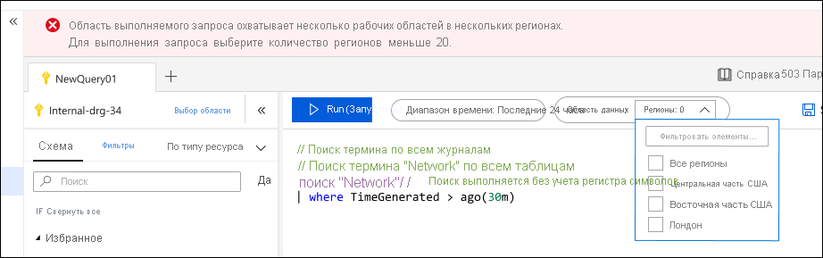
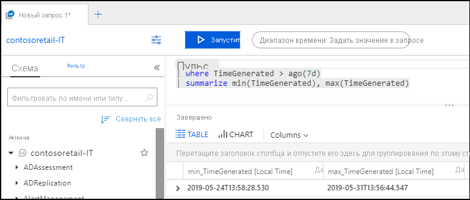
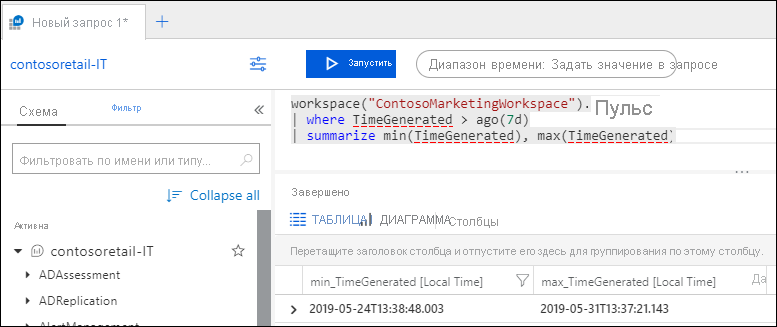
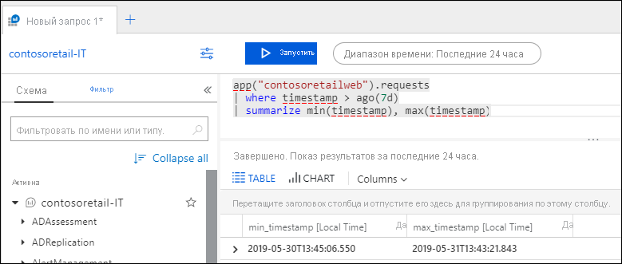

# Область запросов журнала и временной диапазон в Azure Monitor Log Analytics
При выполнении запроса к [журналу](log-query-overview.md) в [log Analytics в портал Azure](get-started-portal.md)набор данных, оцениваемый запросом, зависит от выбранной области и выбранного диапазона времени. В этой статье описывается область и диапазон времени, а также способы их настройки в зависимости от требований. В нем также описывается поведение различных типов областей.

## Область запроса
Область запроса определяет записи, которые оцениваются запросом. Обычно они включают в себя все записи в одной Log Analytics рабочей области или Application Insights приложении. Log Analytics также позволяет задать область для определенного отслеживаемого ресурса Azure. Это позволяет владельцу ресурса сосредоточиться только на данных, даже если этот ресурс выполняет запись в несколько рабочих областей.

Область всегда отображается в левом верхнем углу окна Log Analytics. Значок указывает, является ли область Log Analytics рабочей или Application Insights приложением. Ни один из значков не указывает на другой ресурс Azure.

Область определяется методом, который используется для запуска Log Analytics. в некоторых случаях эту область можно изменить, щелкнув ее. В следующей таблице перечислены различные типы используемой области и различные сведения для каждого из них.

| Область запроса | Записи в области | Выбор | Изменение области |
|:---|:---|:---|:---|
| Рабочая область Log Analytics | Все записи в рабочей области Log Analytics. | Выберите **журналы** в меню **Azure Monitor** или в меню **log Analytics рабочие области** .  | Может изменить область на любой другой тип ресурсов. |
| Приложение Application Insights | Все записи в приложении Application Insights. | Выберите **аналитика** на странице **обзора** Application Insights. | Можно изменить область только на другое приложение Application Insights. |
| Группа ресурсов | Записи, созданные всеми ресурсами в группе ресурсов. Может включать данные из нескольких рабочих областей Log Analytics. | Выберите **журналы** в меню Группа ресурсов. | Не удается изменить область.|
| Подписка | Записи, созданные всеми ресурсами в подписке. Может включать данные из нескольких рабочих областей Log Analytics. | Выберите **журналы** в меню подписка.   | Не удается изменить область. |
| Другие ресурсы Azure | Записи, созданные ресурсом. Может включать данные из нескольких рабочих областей Log Analytics.  | Выберите **журналы** в меню ресурс. ИЛИ Выберите **журналы** в меню **Azure Monitor** , а затем выберите новую область. | Можно изменить область только на тот же тип ресурса. |

### Ограничения по области действия ресурса

Если область запроса является Log Analytics рабочей областью или Application Insights приложением, доступны все параметры на портале и всех командах запроса. При наличии области действия для ресурса следующие параметры на портале недоступны, так как они связаны с одной рабочей областью или приложением:

- Сохранить
- Обозреватель запросов
- Новое правило генерации оповещений

Нельзя использовать следующие команды в запросе при работе с областью действия ресурса, так как область запроса уже включает в себя любые рабочие области с данными для этого ресурса или набора ресурсов:

- [app](app-expression.md)
- [workspace](workspace-expression.md)
 

## Ограничения запросов
У вас могут быть бизнес-требования к ресурсу Azure для записи данных в несколько рабочих областей Log Analytics. Рабочая область не обязательно должна находиться в том же регионе, что и ресурс, и одна рабочая область может собирать данные из ресурсов в различных регионах.  

Задание области для ресурса или набора ресурсов является особенно мощным компонентом Log Analytics поскольку позволяет автоматически консолидировать распределенные данные в одном запросе. Это может значительно повлиять на производительность, если данные необходимо извлечь из рабочих областей в нескольких регионах Azure.

Log Analytics помогает защититься от чрезмерных издержек запросов, охватывающих рабочие области в нескольких регионах, выдавая предупреждение или ошибку при использовании определенного числа регионов. Запрос будет выдавать предупреждение, если область включает рабочие области в 5 или более регионах. Он по-прежнему будет работать, но может занять слишком много времени.

Выполнение запроса будет заблокировано, если область включает рабочие области в 20 или более регионах. В этом случае вам будет предложено сократить количество регионов рабочей области и повторить попытку выполнения запроса. В раскрывающемся списке отобразятся все регионы в области запроса, и необходимо уменьшить количество регионов, прежде чем пытаться снова выполнить запрос.

## Диапазон времени
Диапазон времени определяет набор записей, которые оцениваются для запроса на основе времени создания записи. Это определяется стандартным свойством для каждой записи в рабочей области или приложении, как указано в следующей таблице.

| Местоположение | Свойство |
|:---|:---|
| Рабочая область Log Analytics          | TimeGenerated |
| Приложение Application Insights | timestamp     |

Задайте диапазон времени, выбрав его из средства выбора времени в верхней части окна Log Analytics.  Можно выбрать предопределенный период или выбрать **Пользовательский** , чтобы указать определенный диапазон времени.

Если в запросе задан фильтр, использующий стандартное свойство Time, как показано в таблице выше, то средство выбора времени изменится на **установлено в запросе**, а средство выбора времени будет отключено. В этом случае наиболее эффективным является размещение фильтра в верхней части запроса, чтобы любая последующая обработка работала только с отфильтрованными записями.

При использовании [рабочей области](workspace-expression.md) или команды [приложения](app-expression.md) для получения данных из другой рабочей области или приложения средство выбора времени может вести себя по-разному. Если область является Log Analytics рабочей областью и используется **приложение**или если область является Application Insights приложением и используется **Рабочая область**, то log Analytics может не понять, что свойство, используемое в фильтре, должно определять фильтр времени.

В следующем примере область задается в Log Analytics рабочей области.  Запрос использует **рабочую область** для получения данных из другой log Analytics рабочей области. Выбор времени изменяется для **задания в запросе** , так как он видит фильтр, использующий ожидаемое свойство **timegenerated** .

Если запрос использует **приложение** для извлечения данных из Application Insights приложения, log Analytics не распознает свойство **метки времени** в фильтре, а средство выбора времени остается неизменным. В этом случае применяются оба фильтра. В этом примере в запрос включаются только записи, созданные за последние 24 часа, хотя в предложении **WHERE** указывается 7 дней.

## Следующие шаги

- Пошаговое [руководство по использованию log Analytics в портал Azure](get-started-portal.md).
- Пошаговое [руководство по написанию запросов](get-started-queries.md).