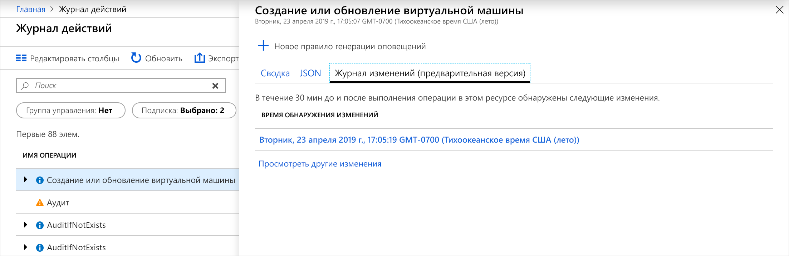
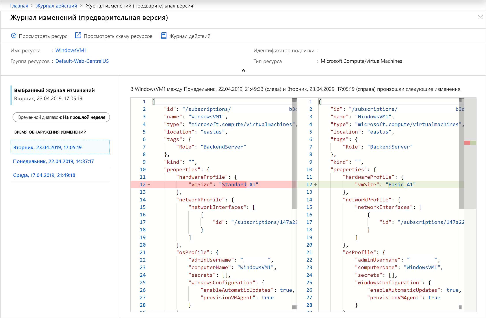

# <a name="view-and-retrieve-azure-activity-log-events"></a>Просмотр и получение событий журнала действий Azure

[Журнал действий Azure](activity-logs-overview.md) предоставляет сведения о событиях уровня подписки, которые произошли в Azure. Эта статья содержит сведения на различные методы для просмотра и извлечения сведений о событиях журнала действий.

## <a name="azure-portal"></a>Портал Azure
Просмотр журнала действий для всех ресурсов из **монитор** меню на портале Azure. Просмотр журнала действий для конкретного ресурса из **журнал действий** в меню этого ресурса.


Вы можете фильтровать события журнала действий по следующим полям:

* **TimeSpan**: Время начала и окончания для событий.
* **Категория**. Категория событий, как описано в разделе [категорий в журнале действий](activity-logs-overview.md#categories-in-the-activity-log).
* **Подписка**: Один или несколько имен подписок Azure.
* **Группа ресурсов.** Один или несколько групп ресурсов в выбранных подписок.
* **"Имя ресурса»** :-имя определенного ресурса.
* **Тип ресурса**. Тип ресурса, например _Microsoft.Compute/virtualmachines_.
* **Имя операции** -имя операции Azure Resource Manager, например _Microsoft.SQL/servers/Write_.
* **Уровень серьезности**. Уровень серьезности события. Доступные значения: _Информационное_, _предупреждение_, _ошибка_, _критическое_.
* **Кем инициировано событие**. Пользователь, выполнивший операцию.
* **Откройте поиск по**: Открыть текстовое поле поиска, который ищет эту строку во всех полях всех событий.

### <a name="view-change-history"></a>Просмотр журнала изменений

При просмотре журнала действий, может помочь определить, что изменения произошло во время этого времени событий. Можно просмотреть эти сведения с **журнал изменений**. Выберите событие из журнала действий, которые вы хотите найти более подробно ознакомиться. Выберите **журнал (Предварительная версия) изменений** вкладку для просмотра любого изменения связанный с событием.



Если любые изменения, связанные с событием, вы увидите список изменений, которые можно выбрать. Это открывает **журнал (Предварительная версия) изменений** страницы. На этой странице появится изменения ресурса. Как видно из следующего примера, мы не только увидеть, что виртуальная машина изменены размеры, но был предыдущий размер виртуальной Машины перед изменением, и он был изменен на.



Дополнительные сведения о журнале изменений, см. в разделе [получить изменения ресурсов](../../governance/resource-graph/how-to/get-resource-changes.md).


## <a name="log-analytics-workspace"></a>Рабочая область Log Analytics
Нажмите кнопку **журналы** в верхней части **журнал действий** страницы, чтобы открыть [анализ журнала действий, решение для мониторинга](activity-log-collect.md) для подписки. Благодаря этому можно просматривать данные аналитики журнала действий и запускать [журнал запросов](../log-query/log-query-overview.md) с **AzureActivity** таблицы. Если журнал действий не подключен к рабочей области Log Analytics, вам будет предложено выполнить эту настройку.


## <a name="powershell"></a>PowerShell
Используйте [Get AzLog](https://docs.microsoft.com/powershell/module/az.monitor/get-azlog) командлет, чтобы получить журнал действий с помощью PowerShell. Ниже приведено несколько типичных примеров.

> [!NOTE]
> `Get-AzLog` предоставляет данные журнала только за 15 дней. Используйте **- MaxEvents** параметр запрашивать N последних событий за 15 дней. Чтобы получить события старше 15 дней, используйте REST API или SDK. Если не указать **StartTime**, то значением **EndTime** по умолчанию будет минус один час. Если не указать **EndTime**, то значением по умолчанию будет текущее время. Все значения времени указаны в формате UTC.


Получение записей журнала, созданные после определенной даты и времени.

```powershell
Get-AzLog -StartTime 2016-03-01T10:30
```

Получение записей журнала между промежутком времени.

```powershell
Get-AzLog -StartTime 2015-01-01T10:30 -EndTime 2015-01-01T11:30
```

Получение записей журнала для определенной группы ресурсов.

```powershell
Get-AzLog -ResourceGroup 'myrg1'
```

Получение записей журнала от конкретного поставщика ресурсов между промежутком времени.

```powershell
Get-AzLog -ResourceProvider 'Microsoft.Web' -StartTime 2015-01-01T10:30 -EndTime 2015-01-01T11:30
```

Получение записей журнала для конкретной вызывающей стороны.

```powershell
Get-AzLog -Caller 'myname@company.com'
```

Получите последние 1000 событий:

```powershell
Get-AzLog -MaxEvents 1000
```


## <a name="cli"></a>Интерфейс командной строки
Используйте [az monitor-журнал действий](cli-samples.md#view-activity-log-for-a-subscription) для получения журнала активности из интерфейса командной строки. Ниже приведено несколько типичных примеров.


Просмотрите все доступные параметры.

```azurecli
az monitor activity-log list -h
```

Получение записей журнала для определенной группы ресурсов.

```azurecli
az monitor activity-log list --resource-group <group name>
```

Получение записей журнала для конкретной вызывающей стороны.

```azurecli
az monitor activity-log list --caller myname@company.com
```

Получение журналов для вызывающего объекта на тип ресурса в определенном диапазоне дат:

```azurecli
az monitor activity-log list --resource-provider Microsoft.Web \
    --caller myname@company.com \
    --start-time 2016-03-08T00:00:00Z \
    --end-time 2016-03-16T00:00:00Z
```

## <a name="rest-api"></a>REST API
Используйте [Azure Monitor REST API](https://docs.microsoft.com/rest/api/monitor/) для получения журнала активности из клиента REST. Ниже приведено несколько типичных примеров.

Получение журналов действий с помощью фильтра:

``` HTTP
GET https://management.azure.com/subscriptions/089bd33f-d4ec-47fe-8ba5-0753aa5c5b33/providers/microsoft.insights/eventtypes/management/values?api-version=2015-04-01&$filter=eventTimestamp ge '2018-01-21T20:00:00Z' and eventTimestamp le '2018-01-23T20:00:00Z' and resourceGroupName eq 'MSSupportGroup'
```

Получение журналов действий с помощью фильтра и выберите пункт:

```HTTP
GET https://management.azure.com/subscriptions/089bd33f-d4ec-47fe-8ba5-0753aa5c5b33/providers/microsoft.insights/eventtypes/management/values?api-version=2015-04-01&$filter=eventTimestamp ge '2015-01-21T20:00:00Z' and eventTimestamp le '2015-01-23T20:00:00Z' and resourceGroupName eq 'MSSupportGroup'&$select=eventName,id,resourceGroupName,resourceProviderName,operationName,status,eventTimestamp,correlationId,submissionTimestamp,level
```

Получение журналов действий с помощью select:

```HTTP
GET https://management.azure.com/subscriptions/089bd33f-d4ec-47fe-8ba5-0753aa5c5b33/providers/microsoft.insights/eventtypes/management/values?api-version=2015-04-01&$select=eventName,id,resourceGroupName,resourceProviderName,operationName,status,eventTimestamp,correlationId,submissionTimestamp,level
```

Получение журналов действий без фильтра, или выберите:

```HTTP
GET https://management.azure.com/subscriptions/089bd33f-d4ec-47fe-8ba5-0753aa5c5b33/providers/microsoft.insights/eventtypes/management/values?api-version=2015-04-01
```


## <a name="next-steps"></a>Следующие шаги

* [Ознакомьтесь с обзором журнала действий](activity-logs-overview.md)
* [Архивация журнала действий в хранилище или потоком в концентраторы событий](activity-log-export.md)
* [Потоковая передача журнала действий Azure в Центры событий](activity-logs-stream-event-hubs.md)
* [Архивация журнала действий Azure в хранилище](archive-activity-log.md)

