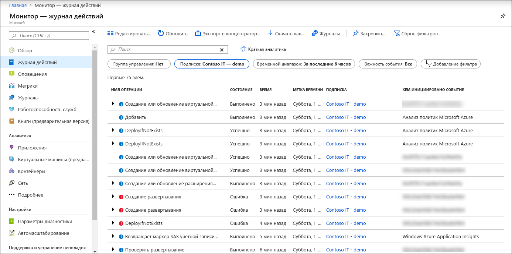

# Общие сведения о журнале действий Azure

**Журнал действий Azure** предоставляет сведения о событиях уровня подписки, которые произошли в Azure. Сюда входят различные данные — от операционных данных Azure Resource Manager до обновлений в событиях работоспособности службы. Журнал действий раньше назывался _журналы аудита_ или _операционные журналы_, так как Эта административная категория содержит связанные с подписками события уровня управления. 

Использование журнала действий, чтобы определить _что_, _,_ , и _при_ для любой операции записи (PUT, POST, DELETE выполненной с ресурсами в вашей подписке). Вы также можете отслеживать состояние операции и другие ее свойства. 

Журнал действий не содержит операции чтения (GET) или операции с ресурсами, которые используют классическую модель или модель RDFE.

## Сравнение для журналов диагностики
Имеется один журнал действий для каждой подписки Azure. Он предоставляет данные об операциях с ресурсами вне («плоскости управления»). [Журналы диагностики](diagnostic-logs-overview.md) выдаются ресурсом и содержат данные о работе этого ресурса («плоскости данных»). Необходимо включить параметры диагностики для каждого ресурса.

> [!NOTE]
> Журнал действий Azure используется главным образом для действий, которые происходят в Azure Resource Manager. Ресурсы, использующие классическую модель или модель RDFE, не отслеживаются. Для некоторых классических типов ресурсов в Azure Resource Manager имеется прокси-поставщик ресурсов (например, Microsoft.ClassicCompute). Если вы взаимодействуете с ресурсом классического типа через Azure Resource Manager с помощью этих прокси-поставщиков ресурсов, то такие операции отображаются в журнале действий. Если вы взаимодействуете с ресурсом классического типа за пределами прокси Azure Resource Manager, ваши действия записываются только в журнал операций. Журнал операций можно просмотреть в отдельном разделе портала.

## Срок хранения журнала действий
После создания записи журнала действий не будут изменены или удалены системой. Кроме того их нельзя изменить, в интерфейсе или программным способом. События журнала действий хранятся в течение 90 дней. Для хранения этих данных на более продолжительные отрезки [собирать их в Azure Monitor](activity-log-collect.md) или [экспортировать в хранилища или концентраторы событий](activity-log-export.md).

## Просмотр журнала действий
Просмотр журнала действий для всех ресурсов из **монитор** меню на портале Azure. Просмотр журнала действий для конкретного ресурса из **журнал действий** в меню этого ресурса. Также можно получить записи журнала действий с помощью PowerShell, CLI или REST API.  См. в разделе [представление и извлечь действия Azure журнал событий](activity-log-view.md).

## Сбор журнала действий в Azure Monitor
Сбор журнала действий в рабочем пространстве Log Analytics в Azure Monitor позволяет анализировать их с другими данными мониторинга, сохранив данные дольше, чем 90 дней. См. в разделе [сбор и анализ журналов действий Azure в рабочую область Log Analytics в Azure Monitor](activity-log-collect.md).

## Экспорт журнала действий
Экспорт журнала действий в службе хранилища Azure для архивирования или потоком в концентратор событий для приема сторонней службе или пользовательском аналитическом решении. См. в разделе [Экспорт журнала действий Azure](activity-log-export.md). Можно также анализировать события журнала действий в Power BI с помощью [ **пакет содержимого Power BI**](https://powerbi.microsoft.com/documentation/powerbi-content-pack-azure-audit-logs/).

## Предупреждения в журнале действий.
Можно создать оповещение при создании определенного события в журнале действий с [оповещения журнала действий](activity-log-alerts.md). Кроме того, можно создать оповещения, выбрав [запроса журнала](alerts-log-query.md) при журнал действий подключен к рабочей области Log Analytics, но требует затрат в журнал запрос оповещения. Нет никаких затрат для оповещений журнала действий.

## Категории в журнале действий
Каждое событие в журнале действий имеет определенной категории, описанные в следующей таблице. Подробные сведения см. в статье [Схема событий журнала действий Azure](activity-log-schema.md). 

| Категория | Описание |
|:---|:---|
| Administrative | Содержит записи всех операций создания, обновления, удаления и других действий выполняются через Resource Manager. Примеры административные события _Создание виртуальной машины_ и _удалить сетевую группу безопасности_.  Каждое действие, выполняемое пользователем или приложением, с помощью Resource Manager, моделируется как операция определенного типа ресурсов. Если тип операции — _записи_, _удалить_, или _действие_, записи и начальное и успех или сбой операции записываются в административную категорию. Административные события также включают все изменения в управление доступом на основе ролей в подписке. |
| Работоспособность служб | Содержит записи проблемы работоспособности службы, которые произошли в Azure. Примером события службы работоспособности _SQL Azure в восточной части США простаивает_.   События работоспособности служб могут быть пять видов: _Требуется действие_, _помощь при восстановлении_, _инцидент_, _обслуживания_, _сведения_, или  _Безопасность_. Эти события создаются только в том случае, если у вас есть ресурс в подписке, которая будет затронута событием.
| Работоспособность ресурса | Содержит записи всех событий работоспособности ресурсов, которые произошли с ресурсами Azure. Пример события работоспособности ресурсов — _состояние работоспособности виртуальной машины изменилось на недоступна_.  События работоспособности ресурсов могут представлять один из четырех состояний работоспособности. _Доступные_, _недоступна_, _Деградация_, и _Неизвестный_. Кроме того, события работоспособности ресурсов можно классифицировать как _платформа инициировала_ или _, инициированное пользователем_. |
| Предупреждение | Содержит записи активаций для оповещений Azure. Пример запуска события оповещения — _% ЦП на myVM за последние 5 минут была более 80_.|
| Автомасштабирование | Содержит записи всех событий, связанных с операциями системы автоматического масштабирования основании лежат параметры автомасштабирования, которые вы определили в вашей подписке. Пример события автомасштабирования — _не удалось выполнить автоматическое увеличение масштаба_. |
| Рекомендации | Содержит события рекомендации от помощника по Azure. |
| Безопасность | Содержит запись любых предупреждений, созданных с помощью центра безопасности Azure. Пример события безопасности — _подозрительным двойным расширением файла выполняется_. |
| Политика | Содержит записи всех операций эффект действия, выполняемые "Политика Azure". Примеры событий политики _аудита_ и _Deny_. Каждое действие, выполняемое Политикой, моделируется как операция для ресурса. |

## Следующие шаги

* [Создайте профиль журнала, чтобы экспортировать журнал действий Azure](activity-log-export.md)
* [Потоковая передача журнала действий Azure в Центры событий](activity-logs-stream-event-hubs.md)
* [Архивация журнала действий Azure в хранилище](archive-activity-log.md)

