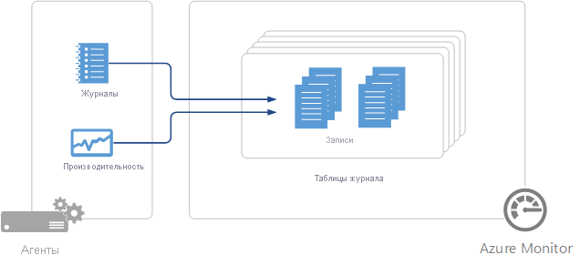

# Источники данных агентов в Log Analytics
Log Analytics собирает данные от агентов, заданных источниками данных, которые вы настроили.  Данные от агентов хранятся в виде [данных журнала](data-collection.md) с набором записей.  Каждый источник данных создает записи определенного типа, а каждый тип обладает собственным набором свойств.

## Сводка источников данных
В приведенной ниже таблице перечислены источники данных агентов, доступные сейчас в службе Log Analytics.  Для каждого дается ссылка на отдельную статью, содержащую сведения об этом источнике данных.   В ней также приведены сведения о методах и частоте сбора. 

| Источник данных | платформа | Microsoft Monitoring Agent | Агент Operations Manager | Хранилище Azure | Нужен ли Operations Manager? | Отправка данных агента Operations Manager через группу управления | Частота сбора |
| --- | --- | --- | --- | --- | --- | --- | --- | --- |
| [Пользовательские журналы](data-sources-custom-logs.md) |  Windows |&#8226; |  | |  |  | При получении |
| [Пользовательские журналы](data-sources-custom-logs.md) | Linux   |&#8226; |  | |  |  | При получении |
| [Журналы IIS](data-sources-iis-logs.md) |  Windows |&#8226; |&#8226; |&#8226; |  |  |в зависимости от параметров смены файла журнала |
| [Счетчики производительности](data-sources-performance-counters.md) |  Windows |&#8226; |&#8226; |  |  |  |по расписанию, не менее 10 секунд |
| [Счетчики производительности](data-sources-performance-counters.md) | Linux |&#8226; |  |  |  |  |по расписанию, не менее 10 секунд |
| [Системный журнал](data-sources-syslog.md) | Linux |&#8226; |  |  |  |  |из хранилища Azure — 10 минут, из агента — при получении |
| [Журналы событий Windows](data-sources-windows-events.md) | Windows |&#8226; |&#8226; |&#8226; |  |&#8226; | При получении |

## Настройка источников данных
Источники данных можно настроить в меню **Данные** в разделе **Дополнительные параметры** для рабочей области.  Конфигурация передается на все подключенные источники в рабочей области.  В настоящее время исключать агенты из этой конфигурации нельзя.

1. На портале Azure щелкните **Log Analytics**, выберите свою рабочую область, а затем — **Дополнительные параметры**.
2. Выберите **Данные**.
3. Щелкните источник данных, который нужно настроить.
4. Перейдите по ссылке на документацию для каждого источника данных в приведенной выше таблице и найдите сведения об их настройке.

## Сбор данных
Конфигурации источников данных передаются в агенты, подключенные к Log Analytics напрямую, в течение нескольких минут.  Указанные данные собираются из агента и передаются непосредственно в службу Log Analytics с периодичностью, указанной для каждого источника данных.  Особенности каждого источника данных см. в соответствующей документации.

Для агентов System Center Operations Manager в подключенной группе управления конфигурации источников данных преобразуются в пакеты управления и по умолчанию передаются в группу управления через каждые 5 минут.  Агент загружает пакет управления обычным способом и собирает указанные данные. В зависимости от источника данных возможны два сценария: либо данные будут отправляться на сервер управления, который перенаправляет их в службу Log Analytics, либо агент будет отправлять данные в службу Log Analytics, минуя сервер управления. Дополнительные сведения см. в статье [Информация о сборе данных для решений по управлению в Azure](../../azure-monitor/insights/solutions-inventory.md).  Подробные сведения о подключении Operations Manager и Log Analytics и изменении частоты доставки конфигурации см. в статье о [настройке интеграции с System Center Operations Manager](../../log-analytics/log-analytics-om-agents.md).

Если агенту не удается подключиться к Log Analytics или Operations Manager, он будет продолжать собирать данные, чтобы передать их после успешного подключения.  Данные могут быть потеряны, если их объем достигнет максимального размера кэша для клиента или агент не сможет установить подключение в течение 24 часов.

## Записи журнала
Все данные, собранные службой Log Analytics, хранятся в рабочей области в виде записей.  Записи, собираемые различными источниками данных, получают собственный набор свойств и идентифицируются по свойству **Тип**.  Подробные сведения о каждом типе записей см. в документации по каждому типу источников и решению.

## Дополнительная информация
* Узнайте больше о [решениях мониторинга](../../azure-monitor/insights/solutions.md), которые расширяют функции службы Azure Monitor и собирают данные в ее рабочей области.
* Узнайте больше о [запросах журнала](../../log-analytics/log-analytics-queries.md), которые можно применять для анализа данных, собираемых из источников данных и решений для мониторинга.  
* Настройте [оповещения](../../monitoring-and-diagnostics/monitoring-overview-alerts.md) для получения заблаговременных уведомлений о получении критически важных данных из источников данных и решений для мониторинга.
