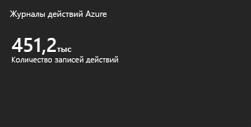
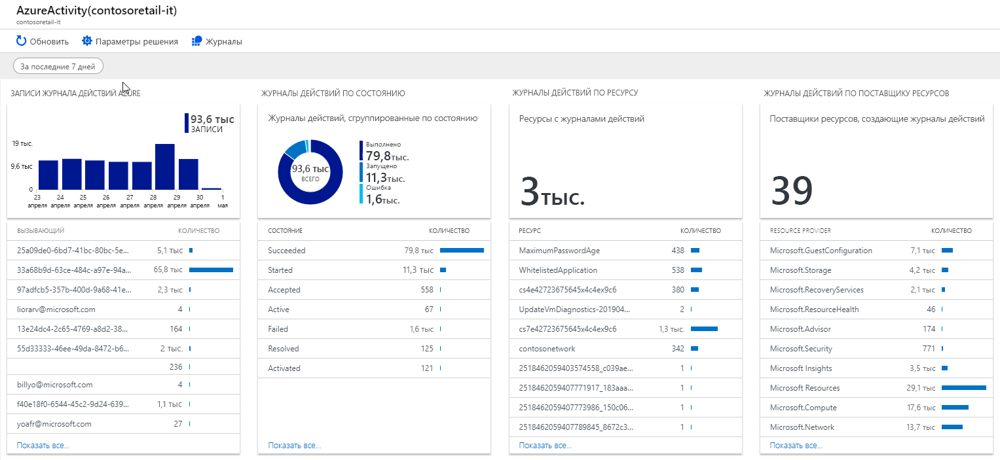

# Сбор и анализ журналов действий Azure в рабочую область Log Analytics в Azure Monitor

Решение "Аналитика журнала действий" помогает анализировать [журналы действий Azure](../../azure-monitor/platform/activity-logs-overview.md) во всех подписках Azure и искать в них необходимые данные. Журнал действий Azure — это журнал с информацией об операциях, которые выполнялись с ресурсами в подписке. Журнал действий раньше назывался *журналом аудита* или *операционным журналом*, так как он содержит связанные с подписками события.

С помощью журнала действий можно ответить на вопросы *что?*, *кто?* и *когда?* о любой операции записи (PUT, POST, DELETE) с ресурсами в вашей подписке. Вы также можете отслеживать состояние операции и другие ее свойства. Журнал действий не содержит операции чтения (GET) или операции с ресурсами, которые используют классическую модель развертывания.

При подключении журналов действий Azure в рабочую область Log Analytics, вы можете:

- анализировать журналы действий с помощью предварительно определенных представлений;
- Анализ и поиск в журналах действий из нескольких подписок Azure
- хранить журналы действий более 90 дней1;
- сопоставлять журналы действий с данными других платформ и приложений Azure;
- просматривать сведения о рабочих операциях в сгруппированном по состоянию виде;
- просматривать тенденции, связанные с операциями, которые выполняются в каждой из служб Azure;
- сообщать об изменениях авторизации для всех ресурсов Azure;
- выявлять сбои или проблемы, связанные с работоспособностью службы и влияющие на ресурсы;
- использовать поиск по журналам для сопоставления действий пользователей, операций автоматического масштабирования, изменений авторизации и данных о работоспособности службы с аналогичными данными из других журналов или среды.

1по умолчанию Azure Monitor отслеживает журналов действий Azure в рабочей области Log Analytics в течение 90 дней, даже если вы используете уровень "бесплатный". или заданный в рабочей области срок хранения данных меньше 90 дней. Если длительность хранения, заданная для рабочей области, превышает 90 дней, журналы действий хранятся в течение этого установленного срока.

Рабочая область Log Analytics собирает журналы действий бесплатно и хранятся в течение 90 дней бесплатно. Если их нужно сохранять более 90 дней, за хранение данных дольше 90 дней взимается плата.

В случае использования бесплатной ценовой категории журналы действий не учитываются при определении ежедневного потребления данных.

## Подключенные источники

В отличие от большинства других решений Azure Monitor данные не собираются журналы действий для агентов. Все данные, используемые решением, поступают непосредственно из Azure.

| Подключенный источник | Поддерживаются | ОПИСАНИЕ |
| --- | --- | --- |
| [Агенты Windows](../../azure-monitor/platform/agent-windows.md) | Нет  | Решение не собирает сведения из агентов Windows. |
| [Агенты Linux](../../azure-monitor/learn/quick-collect-linux-computer.md) | Нет  | Решение не собирает сведения из агентов Linux. |
| [Группы управления SCOM](../../azure-monitor/platform/om-agents.md) | Нет  | Решение не собирает сведения из агентов в подключенной группе управления SCOM. |
| [Учетная запись хранения Azure.](collect-azure-metrics-logs.md) | Нет  | Решение не собирает сведения из службы хранилища Azure. |

## Технические условия

- Для доступа к сведениям журнала действий Azure необходимо наличие подписки Azure.

## Параметр Configuration

Выполните следующие действия, чтобы настроить решение для анализа журналов действий в своих рабочих областях.

1. Включите решение для анализа журналов действий из [Azure Marketplace](https://azuremarketplace.microsoft.com/marketplace/apps/Microsoft.AzureActivityOMS?tab=Overview) или выполните инструкции из статьи [Добавление решений для управления Azure Log Analytics в рабочую область](../../azure-monitor/insights/solutions.md).
2. Настройте журналы действий так, чтобы они поступали в вашу рабочую область Log Analytics.
    1. На портале Azure выберите рабочую область и нажмите **Журнал действий Azure**.
    2. Щелкните имя каждой подписки.  
        
    3. В колонке *SubscriptionName* щелкните **Подключить**.  
        

Войдите на портал Azure, чтобы подключить подписку Azure к рабочей области.  

## Использование решения

При добавлении решения для анализа журналов действий в рабочую область на панель мониторинга "Обзор" добавляется плитка **Журналы действий Azure**. На этой плитке отображается число записей действий Azure для подписки Azure, которая доступна для решения.

### Просмотр журналов действий Azure

Щелкните плитку **Журналы действий Azure**, чтобы открыть панель мониторинга **Журналы действий Azure**. Панель мониторинга содержит колонки, перечисленные в приведенной ниже таблице. В каждой колонке содержится максимум 10 элементов, соответствующих таким указанным критериям, как область действия и диапазон времени. Вы можете выполнить поиск по журналам, в результате которого возвращаются все записи, если щелкнуть заголовок колонки или **Показать все** в ее нижней части.

Данные журнала действий отображаются только *после* настройки направления журналов действий в решение, поэтому, пока это не будет сделано, их просмотреть невозможно.

| Колонка | ОПИСАНИЕ |
| --- | --- |
| Записи журнала действий Azure | Здесь отображается линейчатая диаграмма итогов для записей журнала действий Azure в выбранном диапазоне дат, а также список 10 основных инициаторов действий. Щелкните линейчатую диаграмму, чтобы выполнить поиск <code>AzureActivity</code>. Щелкните инициатор действий, чтобы выполнить поиск по журналам, возвращающий все записи журнала действий для этого инициатора. |
| Журналы действий по состоянию | Здесь отображается кольцевая диаграмма состояний журналов действий Azure в выбранном диапазоне дат. Также отображается список из десяти основных записей о состоянии. Щелкните диаграмму, чтобы выполнить поиск <code>AzureActivity &#124; summarize AggregatedValue = count() by ActivityStatus</code>. Щелкните состояние, чтобы выполнить поиск по журналам, возвращающий все записи журнала действий для этой записи о состоянии. |
| Журналы действий по ресурсу | Здесь отображается общее число ресурсов с журналами действий и список из десяти основных ресурсов с указанием числа записей для каждого из них. Щелкните область итогов, чтобы запустить поиск <code>AzureActivity &#124; summarize AggregatedValue = count() by Resource</code> по журналам, который возвратит все доступные для решения ресурсы Azure. Щелкните ресурс, чтобы выполнить поиск по журналам, возвращающий для этого ресурса все записи действий. |
| Журналы действий по поставщику ресурсов | Здесь отображается общее число поставщиков ресурсов, которые создают журналы действий, и список основных десяти из них. Щелкните область итогов, чтобы запустить поиск <code>AzureActivity &#124; summarize AggregatedValue = count() by ResourceProvider</code> по журналам, который возвратит все поставщики ресурсов Azure. Щелкните поставщик ресурсов, чтобы выполнить поиск по журналам, возвращающий все записи действий для этого поставщика. |

## Дальнейшие действия

- Создание [оповещения](../../azure-monitor/platform/alerts-metric.md) о выполнении определенного действия.
- Использование [поиска по журналам](../../azure-monitor/log-query/log-query-overview.md) для просмотра подробных сведений из журналов действий.
