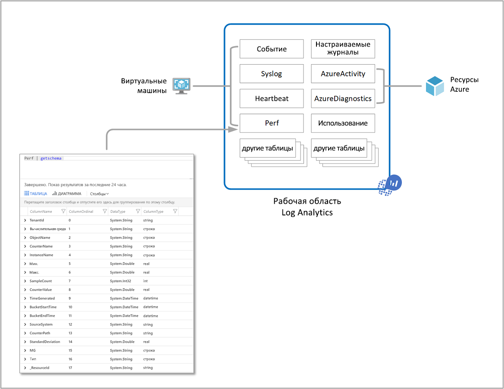
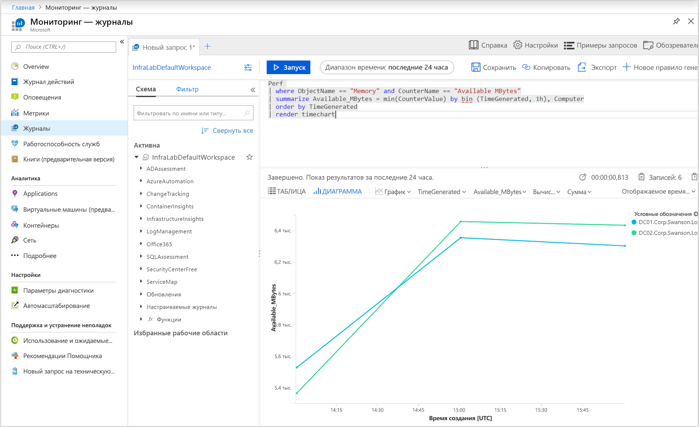
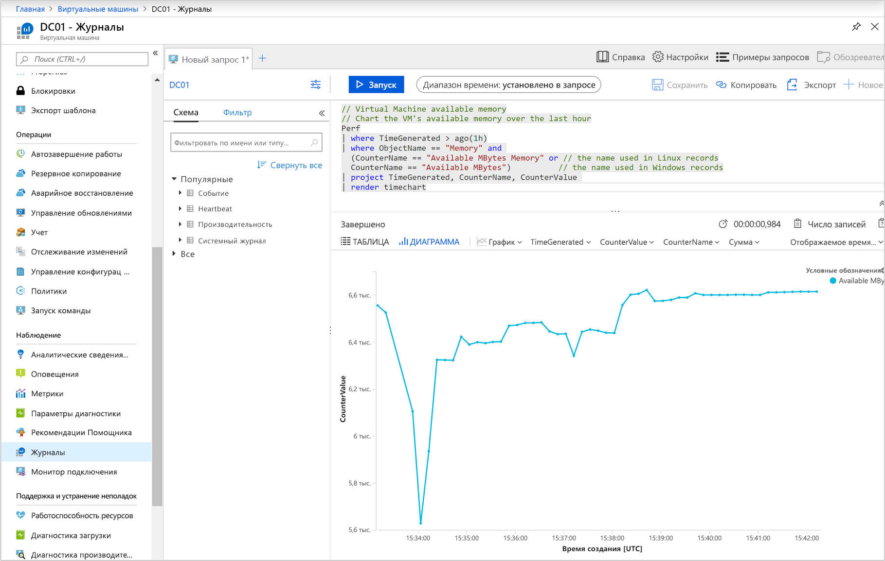
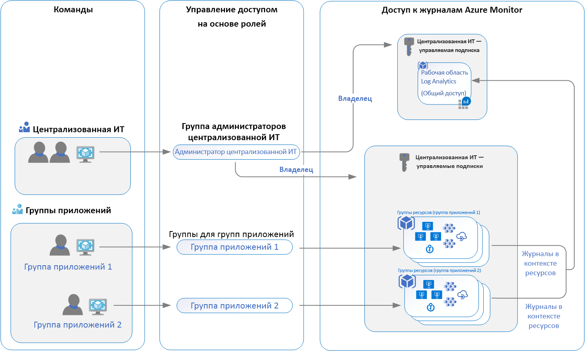

# Разработка развертывания журналов Azure Monitor

Azure Monitor хранит данные [журнала](data-platform-logs.md) в log Analytics рабочей области, которая является ресурсом Azure, и контейнером, в котором данные собираются, объединяются и служат административной границей. Хотя вы можете развернуть одну или несколько рабочих областей в подписке Azure, необходимо понимать несколько аспектов, чтобы обеспечить экономичность, управляемость и масштабируемость первоначального развертывания. развертывание должно удовлетворять потребностям Организации.

Данные в рабочей области организованы в таблицы, каждый из которых хранит различные виды данных и имеет собственный уникальный набор свойств на основе ресурса, создающего данные. Большинство источников данных будут записывать данные в собственные таблицы в Log Analytics рабочей области.

Рабочая область Log Analytics предоставляет следующие преимущества:

* Географическое расположение хранилища данных.
* Изоляция данных за счет предоставления различным пользователям прав доступа, следующих за одной из наших рекомендуемых стратегий проектирования.
* Область для настройки параметров, например [ценовой категории](https://docs.microsoft.com/azure/azure-monitor/platform/manage-cost-storage#changing-pricing-tier), [хранения](https://docs.microsoft.com/azure/azure-monitor/platform/manage-cost-storage#change-the-data-retention-period) и [ограниченного выделения данных](https://docs.microsoft.com/azure/azure-monitor/platform/manage-cost-storage#daily-cap).

В этой статье приводятся подробные сведения о вопросах проектирования и миграции, обзоре управления доступом и понимании реализаций, которые мы рекомендуем использовать для ИТ-организации.

## Важные рекомендации по стратегии управления доступом

Определение необходимого количества рабочих областей зависит от одного или нескольких из следующих требований:

* Вы являетесь глобальной компанией, и по причинам конфиденциальности или в соответствии с нормативными требованиями вам необходимо хранить данные журнала в определенных регионах.
* Вы используете Azure и хотите избежать расходов на передачу исходящих данных, создав рабочую область в том же регионе, где находятся ресурсы Azure, которыми она управляет.
* Вы управляете несколькими подразделениями или бизнес-группами и хотите, чтобы они могли видеть свои данные, но не данные других пользователей. Кроме того, не существует бизнес-требований для объединенного представления между организациями или бизнес-группами.

Сегодня ИТ-организации моделируются как централизованные, децентрализованные, так и встроенные гибридные структуры обеих структур. В результате для соответствия одной из этих организационных структур часто использовались следующие модели развертывания рабочей области:

* **Централизованное**: Все журналы хранятся в Центральной рабочей области и управляются одной командой с Azure Monitor предоставляя дифференцированный доступ для каждой команды. В этом сценарии легко управлять, выполнять поиск по ресурсам и перекрестно сопоставлять журналы. Рабочая область может значительно расти в зависимости от объема данных, собираемых из нескольких ресурсов в подписке, с дополнительными административными издержками для поддержки контроля доступа для разных пользователей.
* Децентрализованное: Каждая группа имеет собственную рабочую область, созданную в группе ресурсов, которой они принадлежат и которыми они управляют, а данные журнала разделяются по ресурсам. В этом сценарии Рабочая область может быть защищена, а Управление доступом согласуется с доступом к ресурсам, но при этом трудно перекрестно сопоставить журналы. Пользователи, которым требуется широкое представление многих ресурсов, не могут анализировать данные осмысленным образом.
* **Гибридная**среда: Требования к проверке безопасности позволяют дополнительно усложнить этот сценарий, так как многие организации реализуют обе модели развертывания параллельно. Это обычно приводит к сложной, дорогостоящей и жесткой поддержке конфигурации с пропуском в журнале.

При использовании агентов Log Analytics для получения данных необходимо понимать следующее, чтобы спланировать развертывание агента.

* Для получения данных от агентов Windows можно [настроить каждый агент для отправки отчетов в одну или несколько рабочих областей](../../azure-monitor/platform/agent-windows.md), даже если он сообщается группе управления System Center Operations Manager. Агент Windows может сообщить до четырех рабочих областей.
* Агент Linux не поддерживает несколько сетевых интерфейсов и может передавать отчеты только в одну рабочую область.

При использовании System Center Operations Manager 2012 R2 или более поздней версии:

* Каждая группа управления Operations Manager может быть [подключена только к одной рабочей области](../platform/om-agents.md). 
* Компьютеры Linux, передающие данные в группу управления, должны быть настроены для отправки отчетов непосредственно в Log Analytics рабочую область. Если компьютеры Linux уже отправляют отчеты непосредственно в рабочую область и вы хотите отслеживать их с помощью Operations Manager, выполните следующие действия, чтобы [Отправить отчет в группу управления Operations Manager](agent-manage.md#configure-agent-to-report-to-an-operations-manager-management-group). 
* Вы можете установить агент Log Analytics Windows на компьютере Windows и сообщить о том, что Operations Manager интегрированы с рабочей областью, и с другой рабочей областью.

## Общие сведения об управлении доступом

С помощью управления доступом на основе ролей (RBAC) можно предоставлять пользователям и группам доступ только к тем ресурсам, которые необходимы им для работы с данными мониторинга в рабочей области. Это позволяет использовать рабочую модель ИТ-организации с использованием одной рабочей области для хранения собранных данных, включенных для всех ресурсов. Например, вы предоставляете доступ к группе, ответственной за службы инфраструктуры, размещенные на виртуальных машинах Azure, и в результате получают доступ только к журналам, созданным виртуальными машинами. Это следует за нашей новой моделью журнала контекста ресурсов. На основе этой модели каждая запись журнала, создаваемая ресурсом Azure, автоматически связывается с этим ресурсом. Журналы перенаправляются в центральную рабочую область, которая учитывает области и RBAC на основе ресурсов.

Данные, к которым пользователь имеет доступ, определяются сочетанием факторов, которые перечислены в следующей таблице. Каждый из них описан в следующих разделах.

| Коэффициент | Описание |
|:---|:---|
| [Режим доступа](#access-mode) | Метод, используемый пользователем для доступа к рабочей области.  Определяет область действия доступных данных и применяемый режим управления доступом. |
| [Режим управления доступом](#access-control-mode) | Параметр в рабочей области, который определяет, применяются ли разрешения на уровне рабочей области или ресурса. |
| [Разрешения](manage-access.md#manage-accounts-and-users) | Разрешения, применяемые к отдельным пользователям или группам пользователей для рабочей области или ресурса. Определяет, к каким данным пользователь будет иметь доступ. |
| [RBAC уровня таблицы](manage-access.md#table-level-rbac) | Необязательные детализированные разрешения, которые применяются ко всем пользователям независимо от режима доступа или режима управления доступом. Определяет, к каким типам данных имеет доступ пользователь. |

## Режим доступа

*Режим доступа* означает, как пользователь обращается к рабочей области log Analytics и определяет область данных, к которым они имеют доступ. 

У пользователей есть два варианта доступа к данным:

* **Рабочая область — контекст**: Вы можете просмотреть все журналы в рабочей области, к которой у вас есть разрешение. Запросы в этом режиме ограничены всеми данными во всех таблицах рабочей области. Это режим доступа, используемый при обращении к журналам с рабочей областью в качестве области, например при выборе **журналов** в меню **Azure Monitor** в портал Azure.

    

* **Контекст ресурса**: При доступе к рабочей области для определенного ресурса, группы ресурсов или подписки, например при выборе пункта **журналы** из меню ресурсов в портал Azure, можно просматривать журналы только для этого ресурса во всех таблицах, к которым у вас есть доступ. Запросы в этом режиме ограничены данными, связанными с этим ресурсом. Этот режим также позволяет детально RBAC.

    

    > [!NOTE]
    > Журналы доступны для запросов контекста ресурсов, только если они должным образом связаны с соответствующим ресурсом. В настоящее время следующие ресурсы имеют ограничения.
    > - Компьютеры за пределами Azure
    > - Платформа Service Fabric
    > - Application Insights
    >
    > Вы можете проверить, правильно ли связаны журналы с их ресурсами, выполнив запрос и проверив интересующие вас записи. Если правильный идентификатор ресурса находится в свойстве [_ResourceId](log-standard-properties.md#_resourceid) , то данные доступны для запросов, ориентированных на ресурсы.

Azure Monitor автоматически определяет правильный режим в зависимости от контекста, из которого выполняется поиск по журналам. Область всегда представлена в левом верхнем углу Log Analytics.

### Сравнение режимов доступа

В следующей таблице перечислены режимы доступа.

| | Рабочая область — контекст | Ресурс — контекст |
|:---|:---|:---|
| Для кого предназначена каждая модель? | Центр администрирования. Администраторы, которым необходимо настроить сбор данных и пользователей, которым необходим доступ к широкому спектру ресурсов. Кроме того, в настоящее время требуется для пользователей, которым требуется доступ к журналам для ресурсов за пределами Azure. | Группы приложений. Администраторы ресурсов Azure, которые отслеживаются. |
| Что требуется пользователю для просмотра журналов? | Разрешения для рабочей области. См. раздел **разрешения рабочей области** в разделе [Управление учетными записями и пользователями](manage-access.md#manage-accounts-and-users). | Доступ для чтения к ресурсу. См. раздел **разрешения ресурсов** в разделе [Управление учетными записями и пользователями](manage-access.md#manage-accounts-and-users). Разрешения могут наследоваться (например, из содержащей их группы ресурсов) или напрямую назначаться ресурсу. Разрешение на доступ к журналам для ресурса будет автоматически назначено. |
| Каковы области разрешений? | Рабочей области. Пользователи с доступом к рабочей области могут запрашивать все журналы в этой рабочей области из таблиц, к которым у них есть разрешения. См. раздел [Управление доступом к таблицам](manage-access.md#table-level-rbac) . | Ресурс Azure. Пользователь может запрашивать журналы для конкретных ресурсов, групп ресурсов или подписки, к которым у них есть доступ из любой рабочей области, но не может запрашивать журналы для других ресурсов. |
| Как можно использовать журналы доступа пользователей? | <ul><li>Запустите **журналы** из меню **Azure Monitor** .</li></ul> <ul><li>Запуск **журналов** из **рабочих областей log Analytics**.</li></ul> <ul><li>Из Azure Monitor [книг](../visualizations.md#workbooks).</li></ul> | <ul><li>Запуск **журналов** из меню для ресурса Azure</li></ul> <ul><li>Запустите **журналы** из меню **Azure Monitor** .</li></ul> <ul><li>Запуск **журналов** из **рабочих областей log Analytics**.</li></ul> <ul><li>Из Azure Monitor [книг](../visualizations.md#workbooks).</li></ul> |

## Режим управления доступом

*Режим управления доступом* — это параметр в каждой рабочей области, который определяет, как разрешения определяются для этой рабочей области.

* **Требовать разрешения рабочей области**: Этот режим управления не разрешает детализированный RBAC. Чтобы пользователь получил доступ к рабочей области, ему должны быть предоставлены разрешения для рабочей области или для конкретных таблиц.

    Если пользователь обращается к рабочей области в режиме контекста рабочей области, он имеет доступ ко всем данным в любой таблице, к которой им предоставлен доступ. Если пользователь обращается к рабочей области после режима контекста ресурсов, он получает доступ только к данным этого ресурса в любой таблице, к которой ему предоставлен доступ.

    Это значение по умолчанию для всех рабочих областей, созданных до марта 2019.

* **Использовать разрешения ресурса или рабочей области**: Этот режим управления позволяет детально RBAC. Пользователям можно предоставить доступ только к данным, связанным с ресурсами, которые они могут просматривать `read` , назначая разрешение Azure. 

    Когда пользователь обращается к рабочей области в режиме контекста рабочей области, применяются разрешения рабочей области. Когда пользователь обращается к рабочей области в режиме контекста ресурсов, проверяются только разрешения на ресурсы, а разрешения рабочей области игнорируются. Включите RBAC для пользователя, удалив их из разрешений рабочей области и разрешив распознавание разрешений на доступ к ресурсам.

    Это значение по умолчанию для всех рабочих областей, созданных после марта 2019.

    > [!NOTE]
    > Если у пользователя есть только разрешения на доступ к рабочему пространству, он сможет только обращаться к рабочей области, используя режим контекста ресурсов, предполагая, что режим доступа к рабочей области настроен на **Использование разрешений ресурсов или рабочих областей**.

## Рекомендации

В этом сценарии рассматривается одна рабочая область в подписке ИТ-организаций, не ограниченная независимостиом данных или соответствием нормативным требованиям, или необходимо соответствие регионам, в котором развернуты ресурсы. Она позволяет организациям в организации безопасности и ИТ – администраторам использовать улучшенную интеграцию с управлением Azure Access Management и более защищенным контролем доступа.

Все ресурсы, решения для мониторинга и аналитические сведения, такие как Application Insights и Azure Monitor для виртуальных машин, поддержка инфраструктуры и приложений, обслуживаемых различными командами, настроена на пересылку собранных данных журналов ИТ-организациям. Централизованная Общая рабочая область. Пользователям каждой команды предоставляется доступ к журналам для ресурсов, к которым им предоставлен доступ.

После развертывания архитектуры рабочей области вы можете применить ее к ресурсам Azure с помощью [политики Azure](../../governance/policy/overview.md). Он предоставляет способ определения политик и обеспечения соответствия ресурсов Azure, чтобы они отправляли все журналы диагностики в определенную рабочую область. Например, с помощью виртуальных машин Azure или масштабируемых наборов виртуальных машин можно использовать существующие политики, оценивающие соответствие рабочей области и результаты отчетов, или настроить для исправления несоответствия.  

## Стратегия миграции для консолидации рабочей области

Для клиентов, которые уже развернули несколько рабочих областей и заинтересованы в консолидации с моделью доступа к контексту ресурсов, мы рекомендуем использовать добавочный подход к переходу на рекомендуемую модель доступа и не пытаться добиться этого быстро или активно. Следуя поэтапному подходу к планированию, миграции, проверке и прекращению работы после разумной временной шкалы, вы сможете избежать незапланированных инцидентов или непредвиденных последствий в работе облачных операций. Если у вас нет политики хранения данных для соответствия или бизнес-причин, необходимо оценить соответствующий период времени, чтобы хранить данные в рабочей области, из которой выполняется миграция. При перенастройке ресурсов для передачи отчетов в общую рабочую область вы по-прежнему можете анализировать данные в исходной рабочей области по мере необходимости. Когда миграция будет завершена, если вы собираетесь хранить данные в исходной рабочей области до окончания срока хранения, не удаляйте их.

При планировании перехода на эту модель учитывайте следующее.

* Узнайте, какие отраслевые нормы и внутренние политики в отношении хранения данных необходимо соблюдать.
* Убедитесь, что группы приложений могут работать в существующих функциях контекста ресурсов.
* Выявление доступа к ресурсам для групп приложений и их тестирование в среде разработки перед внедрением в рабочую среду.
* Настройте рабочую область, чтобы включить **разрешения на использование ресурсов или рабочих областей**.
* Удаление разрешений группы приложений для чтения и запроса рабочей области.
* Включите и настройте любые решения мониторинга, такие как Azure Monitor для контейнеров и (или) Azure Monitor для виртуальных машин, учетные записи службы автоматизации и решения по управлению, такие как Управление обновлениями, запуск и завершение виртуальных машин и т. д., которые были развернуты в исходной рабочей области.

## Следующие шаги

Чтобы реализовать разрешения и элементы управления безопасности, Рекомендуемые в этом пошаговом окне, ознакомьтесь с разработкой [Управление доступом к журналам](manage-access.md).